# 编译原理笔记

# 0. 题外话

程序中的变量存放在内存中，在计算的时候需要加载到寄存器中，就像[[cs#2.1 Overview|计组笔记中的这里]]提到的一样。所以对于计算机来说，比如`x = a + b;`这样的代码就必须经过翻译才能够被计算机认识，才知道去哪里寻找这个变量，怎么去计算。

**程序设计语言在张立勇老师看来只有两种：**

* 命令式(Imperative)，比如c，java这些都算是。**每一条语句都是一个命令**，告诉计算机去做事。
* 函数式(Functional)，比如一些早期人工智能，不是用现在的深度网络实现的，当时是用的一种函数式的语言，**每一条语句都是对一个函数的调用**，去做一些数学的推导。

## 0.1 语言之间的翻译

不同的语言会有不同的编译模式。下图给出了比较完整的过程：

![[Pasted image 20221018105859.png]]

比如从L1 -> A1 -> M1，就是一个很常见的编译模式。首先从高级语言通过编译器变成一个接近机器语言的语言(比如汇编)。然后将这个汇编再进行一次[[Study Log/linux#^ac781a|汇编操作]]，就能够形成机器语言(01串)。而不同的处理器对相同的操作(比如加法)有着不同的01串，所以重担就落在了编译器身上。

而高级程序语言不经过汇编也能直接变成机器语言，比如L1 -> M1；高级语言之间也有可能互相转换，~~比如java和kotlin互转~~(图中的L1<->L2并不是在说这个(吗？)，而是高级语言之间也有可能有层次的差距。比如SQL和c语言)；相对的，反编译和反汇编也是有可能发生的。另外不同的语言混合编译也会有交叉编译。

## 0.2 编译器与解释器

通常语言的翻译有这两种形态：

1. 先翻译后执行	
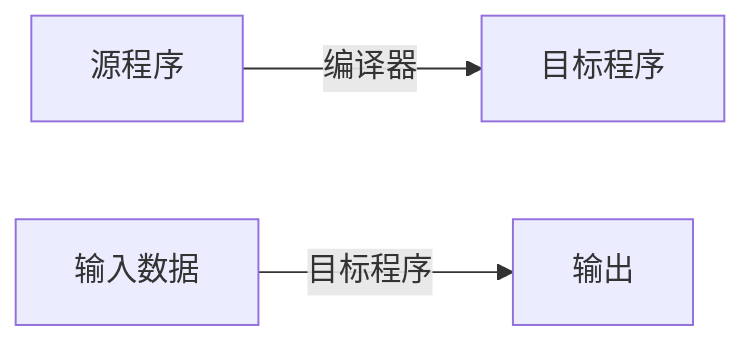
2. 边翻译边执行
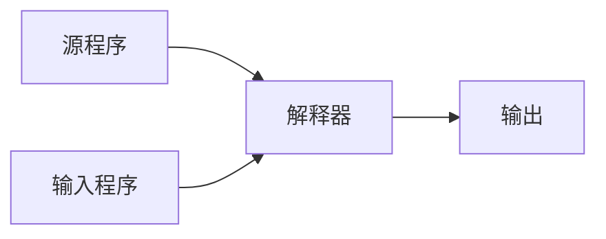

所以如果有如下代码：

```pascal
read(x);              { scanf }
write("x = ", x);     { printf }
```

那么按照上面的两种形态，就会分别是如下的结果：

![[Pasted image 20221018112112.png]]

另外，**java其实是编译和解释同时存在**。因为java的抽象层次很高，所以需要先编译一段，然后再将工作交给解释器。由此就能够减少解释器的负担。那么我们为什么要用解释器呢？那这就涉及它们的优缺点了：

* 编译器的工作效率高，省时省空间；交互性与动态特性差，可移植性差。
* 解释器的工作效率低，费时费空间；交互性和可移植性好。

## 0.3 编译器的工作原理与基本组成

### 0.3.1 通用程序设计语言的主要成分

比如`int x;`这段代码，最主要的功能是告诉计算机**你去找个地方把x给放起来**。这就是一种**声明**性的语句；另外我在对x进行计算的时候，这部分代码就叫做**操作**性的语句。

那么在这两个过程中编译器又做了什么呢？在声明性语句中，编译器就能生成相应的**环境**，也就是变量函数的存储空间，而对于操作性语句，编译器就会生成此环境中的**可执行代码序列**。

### 0.3.2 编译器的工作

直接上图：

![[Drawing 2022-10-18 12.08.38.excalidraw]]

为什么需要经历这么多步呢？一次搞定不香吗？主要的原因是，**我们在每一步其实都会对生成的中间产品去做优化**。很多垃圾代码和冗余代码都需要精简和优化。接下来简要说一下这些步骤都是在干什么

* **词法分析**

主要看你写的变量对不对啊，逗号分号用没用对啊之类的。详细的解释在[[#3. 词法分析|第三章]]。

![[Pasted image 20221018125424.png]]

* **语法分析**

其实语法分析和文法分析是一回事，主要的工作是生成分析树[[#2.10 CFG Tree|CFG]]。

![[Pasted image 20221018125433.png]]

* **语义分析**

就是上面所说的某个变量应该存放在哪个位置。也就是**检查语法正确的句子语义是否有问题**。比如把整形赋值给浮点型，那么**通知**隐式转换(通知的意思是不做，告诉CPU你去做)就是这部分做的事。

![[Pasted image 20221018125314.png]]

* **中间代码生成**

语法和语义都正确的话，就可以真正开始逐个翻译了。这部分做的事情就是将分析树这种不能执行的结构翻译成计算机能够差不多认出来的可执行序列。之所以是差不多是因为这个语言还不能完全执行(比如汇编)。而代码优化也需要翻译成中间代码后才能优化。

![[Pasted image 20221018125221.png]]

这就差不多是一种中间代码。

* **代码优化**

上面的中间代码里，第一行的60我为什么还要通知CPU去隐式转换呢？直接改成60.0不就行了？另外最后两行为啥还要加完存到T3里然后把T3赋值给id1呢？直接加完把结果给id1不就完了？所以这部分主要做的是进一步进行优化，尽可能去掉不必要的操作。

![[Pasted image 20221018125827.png]]

* **目标代码生成**

![[Pasted image 20221018130028.png]]

* **符号表管理**

在前面其实已经见过这个表了：

![[Pasted image 20221018141548.png]]

合理组织符号，便于各阶段查找，填写。也就是能够很方便地找到我写的变量存在内存的哪里。注意这里的地址通常是偏移量。

* **出错处理**

```c
/* 静态语义错误 */
int y = 2;
const int x = 3;
x = 8 / y;
```

```c
/* 动态语义错误 */
int x = 2;
int y = 0;
x = 8 / y;
```

### 0.3.3 编译器的结构

![[Pasted image 20221018142751.png]]

词法、语法、语义分析通常称为**前端**，因此前端的产物就是中间代码。而后序的工作就交给**后端**来完成。

在开发场景中，通常会进行前端和后端的复用。比如arm平台和x86平台，它们都识别c语言，语法是相同的，那么它们就可以用同一套前端来生成相同的中间代码，只不过需要不同的后端来转移到不同的架构上；又比如只在x86上做不同的语言，那么就需要不同的前端来生成中间代码。但是最终只会翻译成x86架构的机器指令，所以可以使用同一个后端来做翻译和优化。

![[Pasted image 20221018143127.png]]

## 0.3 练习题

#homework preview

![[Pasted image 20221018154150.png]]

![[Pasted image 20221018154208.png]]

![[Pasted image 20221018154225.png]]

![[Pasted image 20221018154249.png]]

![[Pasted image 20221018154320.png]]

![[Pasted image 20221018154348.png]]

![[Pasted image 20221018154411.png]]

![[Pasted image 20221018154425.png]]

# 1. 基本概念

## 1.1 字母表

**字母表**$\Sigma$是一个有穷符号集合。比如：

* 二进制字母表：{0, 1}
* ASCII字符集
* Unicode字符集

字母表的运算

* 乘积：$\Sigma_1\Sigma_2$ = {ab | a $\in$ $\Sigma_1$, b $\in$ $\Sigma_2$}

  比如：{0, 1} {a, b} = {0a, 0b, 1a, 1b}

* n次幂：

  * $\Sigma^0$ = { $\epsilon$ }
  * $\Sigma^n=\Sigma^{n-1}\Sigma$, n $\geq$ 1

  比如：

  $\{0, 1\}^3$ = {0, 1} {0, 1} {0, 1} = {000, 001, 010, 011, 100, 101, 110, 111}

  我们也能发现，几个字母表相乘，结果的每一项就是几个元素，比如这里三个相乘，结果中每一个元素比如000，001都是三个数

  **我们还能发现，字母表的n次幂，就是长度为n的符号串构成的集合。比如这里n = 3，那结果集合中每一个元素长度都是3。而0次幂就是长度为0的符号串，那就是空串，用$\epsilon$表示**

* 正闭包：$\Sigma^+$ = $\Sigma$ $\cup$ $\Sigma^2$ $\cup$ $\Sigma^3$ $\cup$ ...

  比如$\{a, b, c, d\}^+$ = {a, b, c, d, aa, ab, ac, ad, ba, bb, bc, bd, ... , aaa, aab, aac, aad, ...} 

* 克林闭包：$\Sigma^*$ = $\Sigma^+$ $\cup$ $\Sigma^0$ = $\Sigma^0$ $\cup$ $\Sigma$ $\cup$ $\Sigma^2$ $\cup$ $\Sigma^3$ $\cup$ ...

  比如$\{a, b, c, d\}^*$ = {$\epsilon$, a, b, c, d, aa, ab, ac, ad, ba, bb, bc, bd, ... , aaa, aab, aac, aad, ...} 

  由此可见，克林闭包是任意符号串构成的集合，并且这个串的长度可以是0
  
  *由克林闭包，我们能推出**串**的概念：克林闭包中的任何一个元素都是字母表$\Sigma$上的一个**串***
  
  > 比如字母表$\Sigma$ = {a, b, c, d}，那么$\epsilon$, a, b, c, d, aa, ab, ac, ad, ba, bb, bc, bd等都是$\Sigma$的串，比如让串s = ab, 那么s的长度|s| = 2，**也就是串中符号的个数**。而**|$\epsilon$| = 0**
  
![[Pasted image 20221106114609.png]]

## 1.2 串的运算

**连接**

> x和y的连接运算记作**xy**
>
> x = dog, y = house, 那么xy = doghouse
>
> 空串是连接运算的**单位元**，相当于不动，对于任意串s有
>
> $\epsilon$s = s$\epsilon$ = s
>
> 设x, y, z是三个串，x = yz，则称y是x的**前缀**，z是x的**后缀**，注意这里y和z都可以是空串，结合下面前缀后缀子串的例子会更好理解。

^dfca5c

**幂**

> 若s = ba，那么：
>
> $s^2$ = baba, $s^3$ = bababa, ...
>
> 特别地：$s^0$ = $\epsilon$

**前缀，后缀，子串**

![[Pasted image 20221106114410.png]]

# 2. 文法分析

## 2.1 Terminal Symbol

终结符：是文法所定义的语言的基本符号。有时也称为**Token**

比如：$V_T$ = {apple, boy, cat, little}是一个终结符集，其中的元素是终结符，在这里是**单词**

理解终结的含义：单词在这里再继续推导没有意义，也就是字母它本身也不在里面，所以不用继续推导，达到终点

#keypoint ***重点：$\epsilon$不是Nonterminal，也不是Terminal！！！***

## 2.2 Nonterminal Symbol

非终结符：用来表示**语法成分**的符号，有时也称为**语法变量**

比如：$V_N$ = {<句子>, <名词短语>, <动词短语>, <名词>, ...}是一个非终结符集

> *注意：对于同一个文法形式(文法形式是什么稍后再说)，终结符集和非终结符集是没有交集的，即：$V_T$ $\cap$ $V_N$ = $\Phi$*
>
> 另外，$V_T$ $\cup$ $V_N$ = <**文法符号集**>

非终结的意思就是能继续推导，也就是这个东西能够继续细分成更细的东西

## 2.3 Production

产生式：描述了将**Terminal**和**Nonterminal**组合成**串**的**方法**，也就是用来**产生串的式子**。一般形式：$\alpha$ -> $\beta$ ($\alpha$定义为$\beta$)

比如在上面的例子中，可以有以下产生式：

P = {<句子> $\rightarrow$ <名词短语><动词短语>, <名词短语> $\rightarrow$ <形容词><名词短语>, ...}

## 2.4 Start Symbol

开始符号：文法中最大的语法成分：比如上面的例子，最大的语法成分就是**S = <句子>**

## 2.5 Grammar

就是上面四项组成的集合：

G = ($V_T,V_N$, P, S)

#example 例：G = ( { **id**, **+**, **\***, **(**, **)** }, {**E**}, **P**, **E** )

那么:

* $V_T$ = {id, +, *, (, )}
* $V_N$ = {E}
* P = P
* S = E

*注：其中E就是Expression表达式，非终结符只有表达式一种*

接下来讨论P到底是什么：因为$V_N$只有E一个，所以，只需要定义E即可

P = {E -> E + E, E -> E *  E, E -> (E), E -> id}

也就是：表达式和表达式加起来还是表达式；表达式和表达式乘起来还是表达式；把表达式用括号括起来还是表达式；每一个表达式都可以赋给它一个id

那既然有这么多种表达E的方法，太多了，简化以下：也就是说，**把表达式加起来，乘起来，括起来，给个id，得到的都是表达式**，那么可以用**或(|)**的方式来简写：

E -> E + E | E * E | (E) | id

那么对于任意一个产生式P = {$\alpha$ -> $\beta_1$, $\alpha$ -> $\beta_2$, ... , $\alpha$ -> $\beta_n$}，都可以简化为：

P = $\alpha$ -> $\beta_1|\beta_2|...|\beta_n$

补充：

* $\alpha$ $\in$ $(V_T \cup V_N)^+$，并且$\alpha$中至少得有一个$V_N$的元素，称为产生式的**头部**或者**左部**
* $\beta$ $\in$ $(V_T \cup V_N)^+$，称为产生式的**体**或者**右部**

## 2.6 Symbolic Convention

上面说了那么多Terminal和Nonterminal，怎么区分他们呢？

**以下是Terminal(终结符)：**

* 字母表中**排在前面的小写字母**，如a, b, c
* **运算符**，如+, *
* **标点符号**，如逗号，括号等
* **数字**，0, 1, ... 9
* 粗体字符串，如id, if等

**以下是Nonterminal(非终结符)：**

* 字母表中**排在前面的大写字母**，如A, B, C
* 字母S，因为它通常表示开始符号
* **小写，斜体的名字**，比如expr, stmt(statement)等
* **代表程序构造的大写字母**。比如E(表达式)、T(term，项)和F(factor，因子)

**其他的一些东西：**

* 字母表中排在**后面**的**大**写字母，比如X, Y, Z表示**文法符号**，既可以是Terminal也可以是Nonterminal
* 字母表中排在**后面**的**小**写字母，比如u, v, ... , z表示**终结符号串**(包括空串)
* 小写希腊字母，比如$\alpha$, $\beta$, $\gamma$，表示**文法符号串**(包括空串)
* **除非有特别说明，第一个产生式的左部就是开始符号**

## 2.7 Language

*给你一个句子：`little boy eats apple`，咋判断它符不符合语法？*

### 2.7.1 Derivation & Reduction

比如一个**文法**中的**Production**是这样的(这里就不写成集合了)：

* <句子> $\rightarrow$ <名词短语><动词短语>
* <名词短语> $\rightarrow$ <形容词><名词短语>
* <名词短语> $\rightarrow$ <名词>
* <动词短语> $\rightarrow$ <动词><名词短语>
* <形容词> $\rightarrow$ little
* <名词> $\rightarrow$ boy | apple
* <动词> $\rightarrow$ eat

#question 这里对于$\alpha$的概念：是不是$\alpha$表示的是左边所有东西构成的集合？还是任何一个比如`<动词短语>`都可以叫做$\alpha$变量？如果是前者的话，那为什么要用$\in$而不是$\subseteq$?

> 那既然<句子>可以定义为<名词短语>和<动词短语>拼一起，那么就可以这么写：
>
> <句子> $\Rightarrow$ <名词短语><动词短语>
>
> 而<名词短语>又可以是<形容词>和名词短语拼一起，那么又可以这么写：
>
> <句子> $\Rightarrow$ <名词短语><动词短语>
>
> ​			$\Rightarrow$ <形容词><名词短语><动词短语>
>
> 对应上面"little boy eats apple"，一步步展开，就能得到：
>
> **<句子> $\Rightarrow$ <名词短语><动词短语>**
>
> ​			**$\Rightarrow$ <形容词><名词短语><动词短语>**
>
> ​			**$\Rightarrow$ <形容词><名词><动词><名词>**
>
> ​			**$\Rightarrow$ little boy eats apple**
>
> 以上过程，就是Derive(推导)的过程；而反着来，就是Reduce(规约)的过程

那么开头的问题就好办了，只要满足Derive或者Reduce的过程，那么就是一个符合语法的句子

补充：

* 如果$\alpha_0 \Rightarrow \alpha_1 \Rightarrow \alpha_2 \Rightarrow ... \Rightarrow \alpha_n$，则称串$\alpha_0$经过n步推导出$\alpha_n$，可以简记为：$\alpha_0 \Rightarrow^n \alpha_n$
* $\Rightarrow^0$表示0步推导，也就是不推导
* $\Rightarrow^+$表示经过正数步推导(>0)
* $\Rightarrow^*$表示经过若干步推导( $\geq$ 0)

### 2.7.2 Sentential form & Sentence

在上面的例子中：

**<句子> $\Rightarrow$ <名词短语><动词短语>**

​			**$\Rightarrow$ <形容词><名词短语><动词短语>**

​			**$\Rightarrow$ <形容词><名词><动词><名词>**

​			**$\Rightarrow$ little boy eats apple**

或者这么写：

**<句子> $\Rightarrow$ <名词短语><动词短语>**

​			**$\Rightarrow$ <形容词><名词短语><动词短语>**

​			**$\Rightarrow$ little <名词短语><动词短语>**

​			**$\Rightarrow$ little <名词><动词短语>**

​			**$\Rightarrow$ little boy <动词短语>**

​			**$\Rightarrow$ little boy <动词><名词短语>**

​			**$\Rightarrow$ little boy eats <名词短语>**

​			**$\Rightarrow$ little boy eats <名词>**

​			**$\Rightarrow$ little boy eats apple**

整个所有的过程都叫做**Sentential form(句型)**，而只有最后一句`little boy eats apple`是**Sentence(句子)**

我们能从中发现一个特点：**句子中没有Nonterminal，全都是Terminal**

那么给出句型和句子的定义

* 如果S经过若干步推导得到了$\alpha$**(S $\Rightarrow^*$ $\alpha$)**，并且$\alpha \in (V_T \cup V_N)^*$，则称$\alpha$是G的一个**句型**。句型中包含Terminal Symbol和Nonterminal Symbol，还可能是空串$\epsilon$
* 如果S $\Rightarrow^*$ $\omega$，并且$\omega$ $\in$ $V_T^*$，则称$\omega$是G的一个句子。**句子**是不包含Nonterminal Symbol的句型

### 2.7.3 Language

由文法G的Start Symbol**推导出的所有<u>句子</u>**构成的集合称为文法**G生成的语言**，记为L(G)

L(G) = {$\omega$ | S $\Rightarrow^*$ $\omega$, $\omega$ $\in$ ${V_T}^*$} ( #question 这里$V_T$是否加上星号存疑 )

> 例：文法G的Production如下：
>
> 1. S -> L | LT
> 2. T -> L | D | TL | TD
> 3. L -> a | b | c | ... | z
> 4. D -> 0 | 1 | ... | 9
>
> 该文法生成的语言是？
>
> 首先，通过观察可以得到：D表示的是数字Digit，L表示的是字母Letter。然后看S，因为**语言必须由S来推出**。S推出的东西必须由L也就是字母打头，然后后面是个T。而T可以是L, D, TL, TD中任何一种，那么就可以不断套娃进行代换：T $\Rightarrow$ TL $\Rightarrow$ TDL $\Rightarrow$ TDDL $\Rightarrow$ TLDDL $\Rightarrow$ ... $\Rightarrow$ DDDDD...LDDL(显然有超多代换方式，这里只是一种)。然后再和前面那个L拼一起。
>
> 那么可以得到结论：推出来的东西是**字母开头**，**后面有字母有数字**。很显然和变量名很像啊！
>
> 答案就是：标识符(identifier)

**语言上的运算**

![[Pasted image 20221017111600.png]] ^bingde

> 例：令L = {A, B, ..., Z, a, b, ..., z}，D = {0, 1, ..., 9}则$L(L \cup D)^*$表示的语言是？
>
> 语言也和串一样可以连接，**语言也是句子的集合**，因此**本题中默认A, B等都是句子**，D也是语言，0, ..., 9也都是句子。而$L(L \cup D)^*$表示一个字母开头，后面连接上L并上D的克林闭包，那么就是说是由字母和数字组成的一堆东西，然后还是字母开头，那表示的也是**标识符**

## 2.8 Grammatical Classification

### 2.8.1 Type-0 Grammar: Unrestricted Grammar

比如前面说的那些Production，只要左边(左部)**至少有一个**Nonterminal，那就是0型文法

### 2.8.2 Type-1 Grammar: Context-Sensitive Grammar(CSG)

Production的一般形式：$\alpha_1A\alpha_2\rightarrow\alpha_1\beta\alpha_2(\beta\neq\epsilon)$

从这里能看出定义的过程和上下文$\alpha_1, \alpha_2$有关

既然$\beta\neq\epsilon$，那么CSG中**不能**包含空产生式，也就是右部是空串。而之前说过，**左部至少要有一个Nonterminal**，那么左部的长度至少是1，那一个**长度是1或者以上的东西怎么可能由空串来定义呢**？显然右部的长度要 $\geq$ 左部 $\geq$ 1

### 2.8.3 Type-2 Grammar: Context-Free Grammar(CFG)

现在定义：**A表示非终结符**

二型文法中规定：左部必须是一个Nonterminal。那很容易得到一般形式：$A\rightarrow\beta$。2型和0型的区别就是2型左部全是Nonterminal，0型有一个就行

比如之前的那个例子：

> 1. S -> L | LT
> 2. T -> L | D | TL | TD
> 3. L -> a | b | c | ... | z
> 4. D -> 0 | 1 | ... | 9

左边全是Nonterminal，那就是一个2型文法。**由上下文无关语法生成的语言叫做上下文无关语言**

### 2.8.4 Type-3 Grammar: Regular Grammar(RG)

还是定义A为Nonterminal，现在B也是个Nonterminal，w是Terminal，RG分为两种：

#### 2.8.4.1 Right Linear

* $A \rightarrow wB$
* $A \rightarrow w$

也就是说，可以定义一步到位；也可以在右边挂个B，不停套娃

#### 2.8.4.2 Left Linear

* $A \rightarrow Bw$
* $A \rightarrow w$

显然差不多，就是在左边套娃

> 例：
>
> 1. S -> a | b | c | d
> 2. S -> aT | bT | cT | dT
> 3. T -> a | b | c | d | 0 | 1 | 2 | 3 | 4 | 5
> 4. T -> aT | bT | cT | dT | 0T | 1T | 2T | 3T | 4T | 5T
>
> 首先，**左部都是Nonterminal**，所以先是一个2型文法；然后右部中，要么是字母、数字这些Terminal，要么在Terminal的右边放个T，也就是Nonterminal，所以就是**Right Linear**
>
> 然后它生成的是什么语言呢？首先看T是啥：T要么是单纯的a ~ d, 0 ~ 5，要么是这些后面再套娃上T，所以T就是一个任意长度的字母和数字组成的串；然后再看S：S要么是单纯的abcd，要么是abcd打头，后面跟上个T，所以这个生成的还是**标识符**，只不过它只能由0 ~ 5和a ~ d构成

## 2.9 Grammatical Relationships

**0型**包含**1型**包含**2型**包含**3型**：

![[Excalidraw/Drawing 2022-11-22 15.19.24.excalidraw]]

## 2.10 CFG Tree

首先CFG：就是一堆$A \rightarrow \beta$

那这个树就是用来分析CFG的。比如：

> G:												    
>1. E -> E + E
> 2. E -> E * E
> 3. E -> -E
> 4. E -> (E)
> 5. E -> id

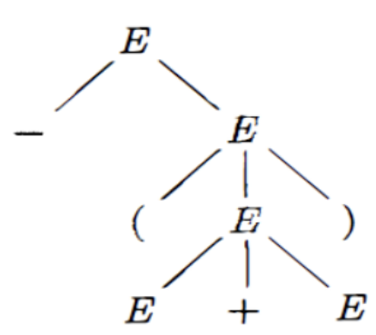

* 这棵树的根节点就是Start Symbol
* 从根节点出发，是E。然后它的子节点是-和E，正好构成一个Production，父节点是左部，所有子节点从左到右构成右部
* 而这里叶节点中有E也有-+()，证明**叶节点既可以是Terminal也可以是Nonterminal**。从左到右排列叶节点得到的符号称为这棵树的产出(yield)或者边缘(frontier)

这树有啥用呢？我们来推导一下：

$E \Rightarrow -E \Rightarrow -(E) \Rightarrow -(E + E) \Rightarrow -(id + E) \Rightarrow -(id + id)$

那么根据分析的过程，我们能看到：

* 一开始只有一个E，然后推导第一步出来-E，那么树就是E连出一个-和一个E。到此为止，树的边缘是-E，**正好就是我们当前推出来的<u>句型</u>**
* 然后连出来的这个E又被代换称(E)，所以这个E又连出来三个：(, E, )，这时树的边缘是-(E)，**还是我们当前推出来的句型**
* ...

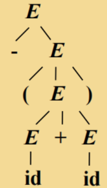

这样就能发现，推导的过程中，**每次得到的句型，都是在构造分析树的同时树的边缘**

### 2.10.1 Phrase

在以下的分析树中，有这么几个短语：


* -(E + E) -> 这是整棵树的边缘
* (E + E) -> 这是拿掉根节点后的**子树**的边缘
* E + E -> 这是再拿掉子树的根节点后的子树的边缘

能发现：短语就是分析树中**每一棵子树的边缘**

而这里E + E比较特殊：它的树只有父子两代结点，因为除了E + E和他们仨的父节点E，剩下的都被拿掉了。所以这样的短语叫做**直接短语(immediate phrase)**

> 例：
>
> 
>
> 这个文法的分析树：
>
> 
>
> 直接短语：提高，人民，生活，水平
>
> 而短语可以是：水平，生活水平，生活，人民，人民生活水平..................
>
> 但是文法中还有这些：高人，民生，活水。它们是产生式的右部，但却不是当前分析树的直接短语。因此我们能发现：**直接短语一定是产生式的右部，但是产生式的右部不一定是分析树的直接短语**。因为这个文法用不同的推导方式还能生成其他分析树，这些右部可能是其他分析树的直接短语

### 2.10.2 Ambiguous Grammar

在写面向对象编程的时候，隐式转换通常会导致**二义性**(<u>可以这么整，也可以那么整，那咋整更好呢？我编译器也不知道，给你报个错吧！</u>)问题。这里来解释一下：

现在有一个文法：

> **S** -> if **E** then **S**
>
> ​	  | if **E** then **S** else **S**
>
> ​	  | **other**

那么给下面一个句型来构造分析树：`if E1 then if E2 then S1 else S2`

* 首先识别一下这个句子符合S的定义中的那种：
* `if E1 then ...`正好符合if **E** then **S**的格式，那就这么来！
* 那这个套娃下来的S就是`if E2 then S1 else S2`
* 而`if E2 then S1 else S2`正好符合if **E** then **S** else **S**的格式，那就构造完了！

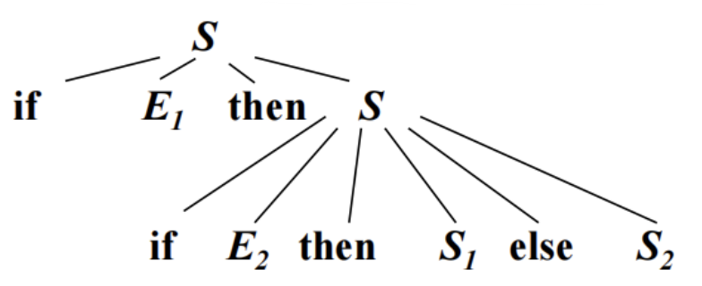

但是，还有另一种构造的方式：

* `if E1 then ... else ...`正好符合if **E** then **S** else **S**
* 那E就是E1，第一个S是`if E2 then S1`，第二个S是`S2`
* `if E2 then S1`正好符合if **E** then **S**，这样也能正确构造！


注：这里的**other**就是E1, E2, S1, S2等其他语句，没有if else这些的非条件东西

分析一下产生二义性的原因：`if E1 then if E2 then S1 else S2`

因为后面的else既可以和第一个if匹配，也可以和第二个if匹配，所以会产生二义性。而如果**规定else只能和最近的前一个if匹配**，就能够让第二种构造方法无效了。

# 3. 词法分析

词法分析分为**立法**环节和**执法**环节。立法指的是我要定义一个规则，执法指的是我要按照这个规则去扫描Token。本章中，**正则表达式就是在说立法；而自动机就是在说执法**。

* Pattern：产生和识别元素的**规则**。
* Token：识别出来的**一组**元素。
* Lexeme：元素自身的值。

下面是一个Token的例子：

![[Pasted image 20221106112614.png]]

> 类别后面的数字表示这个类别的id，也就是计算机存01就代表这是const类。

下面给一些例子。比如`mycount`，这是一个自己定义的变量，也就是identifier，那么它的id是82(上图)。那么计算机就会将这个`mycount`的**类别**标记为82：

Expression | Category
-- | --
mycount | 82

那么当识别到`>`的时候，编译器就会认为这是一个关系运算符。类别也就是81：

Expression | Category
-- | --
mycount | 82
\> | 81

但是还有一个问题：81这个类别里可不只有大于号，还有好多呢！那么如何确定这个Expression是该类别中的哪一个呢？显然我们需要给这个表再加一列，这列称为属性：

Expression | Category | Attribute
-- | -- | --
mycount | 82 | "mycount"
\> | 81 | 5

由于identifier这个类里全是我们自己定义的标识符，所以每个变量都独一无二，也就是"mycount"；那么这个5又是什么意思？我们可以暂时理解为，这是relation类别中的第五个元素，那么我们从左往右数，第五个正好是大于号：

![[Pasted image 20221106113558.png]]

另外，如果我们识别到了一个数字`25`，结果又会是什么样呢？首先，这是num类别，也就是83。接下来要确定它的属性是什么。很显然，和标识符一样，每个数字在数字类中也都是独一无二的。因此它的属性其实就是它的值——25：

Expression | Category | Attribute
-- | -- | --
mycount | 82 | "mycount"
\> | 81 | 5
25 | 83 | 25

## 3.1 Regular Expression

有如下一个句子：

$L=\{a\}\{a,b\}^*(\{\epsilon\}\cup(\{.,\_\}\{a,b\}\{a,b\}^*))$

注：这里要结合一下2.7.3中[[#^bingde|语言的并的运算]]

这个L可以解释为：a开头，然后连上任意长度的由a、b组成的串(可以是空串，因为是克林闭包)；然后再连上一个并集：要么是$\epsilon$空串，要么是连接上这个：点或者下划线、a或者b、a和b组成的任意长度串

那么这么写起来比较复杂，怎么简化呢？用的就是**正则表达式**(Regular Expression)：

$r=a(a|b)^*(\epsilon|(.|\_)(a|b)(a|b)^*)$

**每个正则表达式r可以表示一个语言，记为L(r)**

那么正则表达式怎么写呢？**由小到大！**，也就是由一个很小很小很简单的正则表达式，不断扩大变成大的正则表达式，最后变大到我们需要的为止

* 最小的当然是空串，如果$\epsilon$是一个RE，那么$L(\epsilon)=\{\epsilon\}$
* 然后是一个字母的，如果$a\in\Sigma$，则a是一个RE，$L(a)=\{a\}$
* 如果是俩呢？假设r和s都是RE，表示的语言分别是L(r)和L(s)，那么
  * r|s是一个RE，$L(r|s)=L(r)\cup L(s)$
  * rs是一个RE，$L(rs)=L(r)L(s)$ **(注意：这里不是交集！是连接！！！)**
  * $r^*$是一个RE，L($r^*$) = $(L(r))^*$
  * (r)是一个RE，L((r)) = L(r)

正则表达式还可以进行简化：

* 如果克林闭包不好用，可以这样：

  ![[Pasted image 20221106121350.png]]
* 如果某个部分可以没有，那么我们通常的做法是$r | \epsilon$，而如今可以这么写：r?

  ![[Pasted image 20221106121458.png]]
* a|b|c等价于\[abc\]，而\[0-9a-z\]等价于那一大串
* \[^r\]等价于$\Sigma - L(r)$

  ![[Pasted image 20221106121644.png]]

> 运算的优先级：克林闭包($^*$) > 连接 > 或(|)，括号还是最牛b

#example Regular Expression

1. 令$\Sigma = \{a,b\}$，求L(a|b)，L((a|b)(a|b))，$L(a^*)$，$L((a|b)^*)$，$L(a|a^*b)$

    因为a和b都是字母，那a和b自然都是一个正则表达式，表示的语言分别是L(a) = {a}，L(b) = {b}

    接下来由小变大，就可以由这些规则开始了

    * $L(a|b) = L(a) \cup L(b) = \{a\} \cup \{b\} = \{a,b\}$

    * $L((a|b)(a|b)) = L(a|b)L(a|b) = \{a,b\}\{a,b\} = \{aa,ab,ba,bb\}$

     *注意：这里是用的上面第三条中的第二条连接的规则*

    * $L(a^*) = (L(a))^* = \{a\}^* = \{\epsilon,a,aa,aaa,...\}$

    * $L((a|b)^*) = (L(a|b))^* = \{a,b\}^* = \{\epsilon,a,b,aa,ab,ba,bb,aaa,...\}$

    * $L(a|a^*b) = L(a) \cup L(a^*b) = L(a) \cup L(a^*)L(b) = \{a\} \cup \{\epsilon,a,aa,aaa,...\}\{b\} = \{a,b,ab,aab,...\}$

2. 十进制整数的RE

    (1|...|9)(0|...|9)$^*$|0

    *这里最后的0是表示整个就是个0*

3. 八进制整数的RE(C语言)

    0(1|2|3|...|7)(0|1|2|...|7)$^*$

4. 十六进制整数的RE(C语言)

    0x(1|2|...|f)(0|1|...|f)$^*$

    *大写字母这里不写了先*

写出下列Token的RE：

1. relation: < | <= | != | > | >= | ==
2. identifier: (a | b | ... | z | A | B | ... | Z)(a | b | ... | z | A | B | ... | Z | 0 | 1 | ... | 9)*

**正则表达式的运算定律**

![[Pasted image 20221017112429.png]]

## 3.2 Regular Definition

给一些常用的正则表达式起个名字，比如：

* digit -> 0|1|2|...|9
* letter_ -> A|B|...|Z|a|b|...|z|_

那么这样起个名字，就很容易表示标识符了：

identifier -> letter\_(letter\_|digit)$^*$

#example Regular Definition

* digit -> 0|1|2|...|9
* digits -> digit digit$^*$
* optionalFraction(可选小数部分) -> .digits|$\epsilon$
* optionalExponent(可选指数部分) -> (E(+|-|$\epsilon$)digits)|$\epsilon$
* number -> digits optionalFraction optionalExponent

> 比如2.15E+3，2就是digits；.15是optionalF；E+3是optionalE

*之所以是可选的，是因为最后的那个|$\epsilon$，最后这个number表达的就是所有整形或者浮点型的无符号整数*

## 3.3 Finite Automata

有了之前介绍的规则，现在该来执法了。那么我们如何才能按照这个规则去识别每一个单词呢？比如我们写一个函数去判断某个字符串是不是id：

```c
bool isId(char [] s, int l){
	if(s[0]是字母或者下划线){
		while(中间的字符都是数字字母或者下划线);
	}
}
```

我们能看到，这样好像确实能够判断某个单词是否是id。但是有一个问题：类别不只有标识符，数字，常量等等都需要我们去判断。因此我们为了良好的复用性，需要另想出路。而历史给我们的答案就是下面要介绍的——**自动只因**。

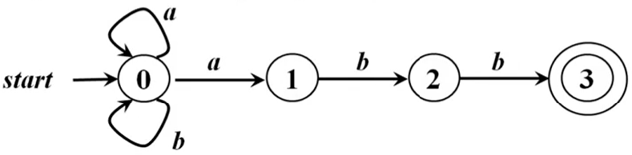

* start表示开始，它指向的东西代表**初始状态**，也就是0
* 0，1，2，3每一个**结点**都表示FA的一个**状态**
* 最后3上有两个圈，表示3是**终止状态**，也叫**接收状态**
* **初始状态只有一个，但是终止状态可以有多个**
* 比如状态0，有**输入**a，可以变成状态0和状态1；输入b，可以变成状态0

那对于这个有穷自动机，如果给定串`abbaabb`的话：

它的状态可以是：

![[Pasted image 20221017112732.png]]

菱形之前的过程一直在自旋，之后遇到`abb`才向下走。用这种走法正好能**从初始状态达到终止状态**。那么能满足这样条件的一个串就叫做**能被该FA接收**的串

那么这个FA肯定不会只能接收这一个串，还有好多串。看一下就能明白：**只要是以`abb`结尾，并且只由a和b构成的串**，就能被这个FA接收。那么这些串构成的集合也是一个语言。记作L(M)，M表示该FA

接下来看另一个FA：


如果我输入的串是：`<=`，那么会发生什么？

* 首先，从0开始，检测到`<`，到达状态1
* 然后，**发现状态1是一个终止状态，那么还继续匹配吗？这个串是不是就直接被接收了？**
* 不会的，还会继续进行检测，= 也匹配，到达状态2，这时候才是终止状态

也就是说，`<`和`<=`都是串`<=`的[[#^dfca5c|前缀]]，而这两个前缀都能匹配上这个FA的模式，那么我们**总是选择最长的这个前缀进行匹配**，这也叫做**Longest String Matching Principle**。在到达某个终止状态之后，只要输入带上还有符号，FA就会继续前进，以便寻找**尽可能长**的匹配

## 3.4 DFA & NFA

### 3.4.1 Deterministic Finite Automata

看一个确定的有穷自动机：

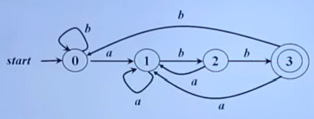

* 这里面一共有四个状态：0, 1, 2, 3，它们构成了**状态集合S**
* 能输入的符号有a, b，它们构成了**字母表集合$\Sigma$**
* 然后我们画一张表格：

  ![[Pasted image 20221017112952.png]]

  这个表格表示：状态0经过输入a会变成状态1，经过输入b会变成状态0；状态1经过输入a会变成状态1，经过输入b会变成状态2.........

  我们能发现：**即使不给图，只根据这个表，我们也能把转换图画出来。**也就是说，这个表格和转换图是等价的，这个表(**转换表**)也描述了一个**函数**，参数是当前状态和输入，返回值是下一个状态，这个函数记为$\delta$(又可以叫`move`函数)。

* 这个DFA的开始状态是0，记为$s_0$，$s_0$$\in$S
* 这个DFA只有一个终止状态(接收状态)，记为F，F$\subseteq$S(能相等是因为有可能所有状态都是终止状态)

由以上我们可以总结：**一个DFA记为M，可以表示成：$M=(S,\Sigma,\delta,s_0,F)$**

### 3.4.2 Nondeterministic Finite Automata

看一个NFA，其实和DFA就一点区别

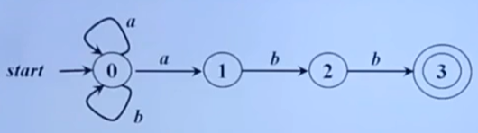

比如状态0，此时检测到输入a后，**既能到状态0，也能到状态1**，因此是**不确定**的。

那么和上面的区别就是转换表的画法有不同：

| 状态\输入 | a      | b    |
| --------- | ------ | ---- |
| 0         | {0, 1} | {0}  |
| 1         | $\Phi$   | {2}  |
| 2         | $\Phi$   | {3}  |
| **3**     | $\Phi$   | $\Phi$ |

注意里面的大括号：因为这是NFA，不像DFA一样到达的状态就确定是一个。因此哪怕NFA到达的状态真就一个，也得加上大括号表示一个集合，只不过集合里就一种状态罢了

### 3.4.3 Their Relation

对于这俩DFA和NFA：


NFA在3.3中分析过一模一样的，我们来分析一下DFA，对于任意一个由a，b构成的串，**只要不是以`abb`结尾，那就不能被这个DFA接收。**由此我们能发现，这两个东西是**等价的**。其实，对于任何一个NFA，都存在能和它识别同一个语言的DFA；对于任何一个DFA，也存在和它识别同一个语言的NFA。

补充：对于这个DFA，

* 状态1：串以a结尾
* 状态2：串以ab结尾
* 状态3：串以abb结尾

配合转换表来看会更加清晰

那么，以`abb`结尾的串的正则表达式是什么？来构建一下：

$\{a,b\}^*$是任意长度的ab串，也包括空串，那也就是说是(a|b)$^*$，然后再拼上结尾abb，就是$(a|b)^*abb$

其实，**正则表达式和正则文法还有FA都是等价的，可以互相构建**：正则文法$\Leftrightarrow$正则表达式$\Leftrightarrow$FA

### 3.4.4 Other Things

**带有$\epsilon$边的NFA**

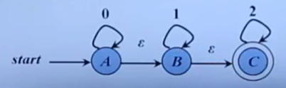

也就是说，状态A不需要任何输入就能到达状态B，但是由接收0改为接收1

那么它接收的串的正则表达式？是由若干个0连接上若干个1连接上若干个2，即：$r=0^*1^*2^*$

那么，用不带空边的NFA是否也能表示这个RE呢？能！

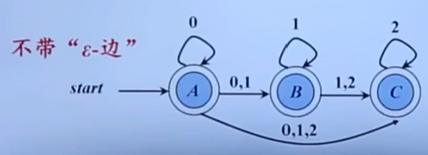

这里要注意：**三个状态都是终态**，如果在状态A结束表示若干个0；在状态B结束表示若干个0加上若干个1，因为一但跳到状态B，就不再接收0了；在状态C结束表示若干个0连上若干个1连上若干个2

#question 线上写的是0,1；1,2；0,1,2，为啥要写3个数呢？只写上1；2；2不是也可以吗？可能是因为这里要构造NFA，所以硬加上去的？

来看一下实现DFA的算法，DFA比NFA的实现要简单

```c
s = s0;					    // 将初始状态付给s
c = nextChar();				// c表示当前的输入符号，nextChar返回输入串x的下一个符号
while(c != EOF){			// 当当前输入不是EOF时循环
    s = move(s, c);			// 从s出发，沿着输入是c的边到达的状态，返回给s
    c = nextChar();			// c继续变成下一个符号
}
if(s in F) return TURE;		// 如果最后s是终态(F)的话，就返回"接收"
else return FALSE;			// 不是则不接收
```


比如，s一开始是s0(也就是状态0)，然后输入串`abbaabb`，则c是a，然后a不是EOF，则执行move，从状态0出发，沿着a走，到达状态1，将状态1返回给s，然后c变成了b；b不是EOF，执行move，从状态1开始沿着b走，到达状态2，将状态2返回给s，c变成了b；b不是EOF，执行move，从状态2开始沿着b走，到达状态3........

最后循环结束后，s会变成状态3。因为状态3是终态，返回TRUE

## 3.5 RE -> FA

由正则表达式直接构造DFA是比较难的，因此通常是：

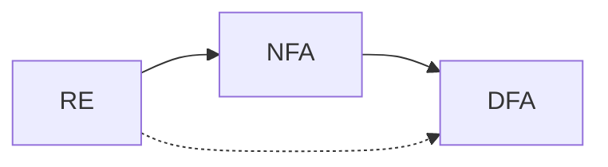

### 3.5.1 RE -> NFA

1. 还是从小到大来，单独对一个空串$\epsilon$，它的NFA是

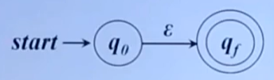

2. 然后是字母表，字母表中的每一个字母，都是一个正则表达式，它对应的NFA是

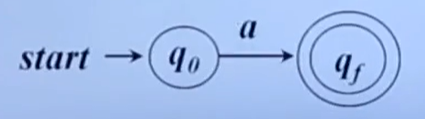

3. 然后是俩表达式连到一起，对于r = $r_1r_2$，它对应的NFA是

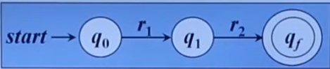

4. 然后是两个表达式或运算，对于r = $r_1|r_2$，它对应的NFA是

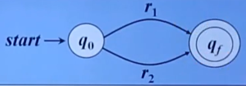

5. 最后是克林闭包，对于r =$r_1^*$，它的NFA是

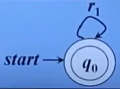

由这些基本规则，我们就可以由正则表达式来构建NFA了。比如：r = $(a|b)^*abb$

一开始，给一个初始状态和终止状态，然后把表达式写上去：

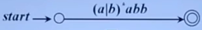

很显然，这个表达式可以拆成连接的形式，根据第3个规则，就可以：

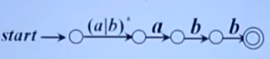

然后，第一个是个克林闭包，也就是把**两个点合成一个点，然后自旋**

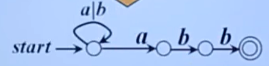

最后把这个或也拆开，就变成了俩自旋

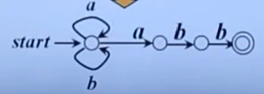

### 3.5.2 NFA -> DFA

用程序去描述NFA(将NFA写成程序，让这个程序去识别字符串)通常是很困难的，而且效率会很低下(通常会用DFS，BFS，递归等技术)。所以我们需要将NFA转换成DFA再去用程序描述。

![[Pasted image 20221108181104.png]]

老师给的这个思想非常好：在NFA中，一开始人们的想法是，我先走一条路，当失败之后，就**回溯**；但是如果我一开始就可以并行去走，那么我就可以同时去试好多可能。那么这种做法就把**状态和状态之间的转移$\longrightarrow$状态集合和状态集合之间的转移**。

#example 比如给一个NFA：

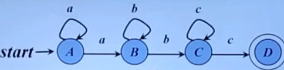

画出它的转换表：

| 状态\输入 | a      | b      | c      |
| --------- | ------ | ------ | ------ |
| A         | {A, B} | $\Phi$   | $\Phi$   |
| B         | $\Phi$   | {B, C} | $\Phi$   |
| C         | $\Phi$   | $\Phi$   | {C, D} |
| **D**     | $\Phi$   | $\Phi$   | $\Phi$   |

构造DFA。首先是初始状态

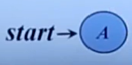

这个初始状态在遇到a的时候，会进入A或者B，**那既然是俩状态，合到一起就可以了！**

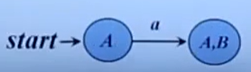

那接下来咋办呢？看A和B：A和B收到a时，会进入{A, B}或者$\Phi$，因为空集不算，那还是自己

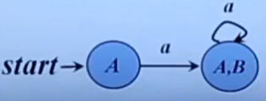

AB收到b时会进入$\Phi$和{B, C}，因此

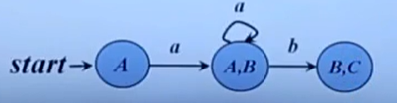

然后，BC收到b会进入自己；收到c会进入CD

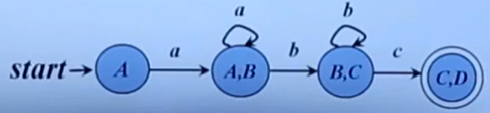

别忘了，CD还会接收c变成自己！

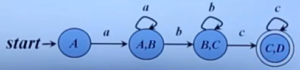

检验，NFA和DFA能接收的串都是：$aa^*bb^*cc^*$(这里是因为至少要有一个a或b或c，也可以写成$a^+b^+c^+$)

接下来，再看一个例子，这个例子带空边

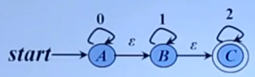

还是画转换表，但是这个表比较难画：

| 状态\输入 | 0         | 1      | 2    |
| --------- | --------- | ------ | ---- |
| A         | {A, B, C} | {B, C} | {C}  |
| B         | $\Phi$      | {B, C} | {C}  |
| **C**     | $\Phi$      | $\Phi$   | {C}  |

比如A接收到0，可以接收完0不动，即状态A，也可以动一下变成B，或者动两下变成C；而A为啥能接收1呢？因为A可以先动一下变成B，这样就能接收1了。因为A变成B啥都不需要

然后来构造DFA，首先初始状态的时候就要注意：**因为A到B到C啥都不需要，所以这仨都能是初始状态，那么三合一就可以了**

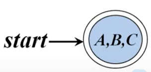

然后看ABC接收0之后只能变成自己，那么

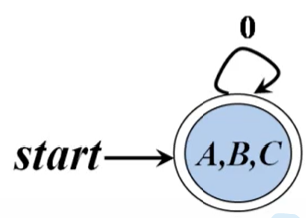

ABC接收1之后会进入BC，并且BC中也含终态，所以

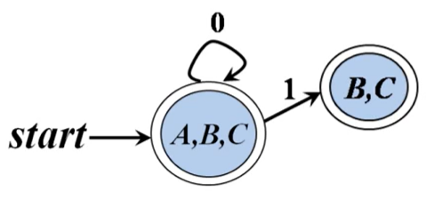

ABC接收2之后会进入C，C是终态

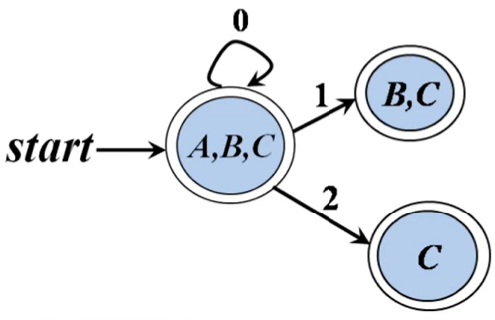

最终都分析完之后，DFA构建好了

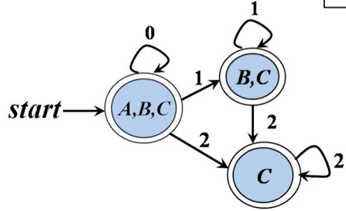

检验可以得到，他俩接收的串都是$r = 0^*1^*2^*$

## 3.6 Word DFA

### 3.6.1 Identifier DFA

之前给过标识符的定义：

* digit -> 0|1|2|...|9
* letter_ -> A|B|...|Z|a|b|...|z|_
* **identifier -> letter_(letter\_|digit)$^*$**

那么构造NFA的话，首先就是要一个初始状态。这个状态要开始接收字符串，首先肯定是一个letter\_，然后即可以接收letter\_也可以接收digit，而且**不是必须的**，那么这个初始状态也是终止状态。然后这两种接收都会导致自旋，则

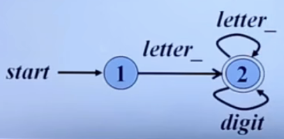

因为这个NFA就是个DFA，所以也不用转成DFA了

### 3.6.2 Unsigned DFA

然后是无符号数的定义：

* digit -> 0|1|2|...|9
* digits -> digit digit$^*$
* optionalFraction(可选小数部分) -> .digits|$\epsilon$
* optionalExponent(可选指数部分) -> (E(+|-|$\epsilon$)digits)|$\epsilon$
* **number -> digits optionalFraction optionalExponent**

构造DFA：也是要有一个初始状态，然后这个状态接收的首先是digits部分，也就是digit digit$^*$。此时其实已经可以结束了，因为后面两个都是可选的部分，那么此时的状态图是

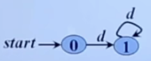

至于为什么不画成终态，之后再说

然后，添加可选的小数部分。首先是一个点，既然跟了点，就一定要再跟上后面的小数部分，其实还是个digits。不过除了`.digits`，也可以是个空串$\epsilon$(其实就是要把"我不选"给强调出来)。那么此时的状态图

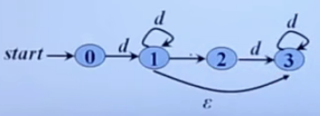

之后添加可选指数部分。首先一定要有个E，然后是连上3个(+, -, $\epsilon$)中任意一个，然后再加上digits；这整个过程也可以只变成一个空串。要注意的是，E后面之所以也可以加$\epsilon$是因为E+12和E12是一样的，为了体现出正号能省略

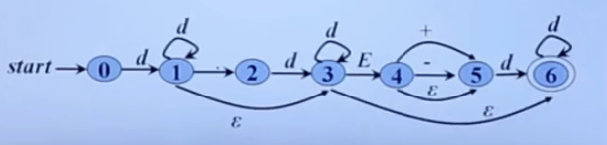

这下能解释为啥状态1，状态3不化成终态了，因为没必要。最后通过空串都能到达状态6

然后来看一下：**状态0接收到d之后，可以直接不动变成状态1；也可以动一下变成状态3或者动两下变成状态6**，因此这是个NFA

转换的过程也不画状态表了，直接来：

首先有个初始状态，也就是状态0，状态0能接收的就是d，接收d之后会变成1, 3, 6也就是

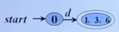

*因为{1, 3, 6}里有终态6，所以这个就是终态(其实也印证了之前说的1，3没必要画上终态)*

然后136能接收的有`d, E, .`。1接收d之后变成136；3接收d之后变成36；6接收d之后变成6。也就是说，136接收了d之后还会变成自己

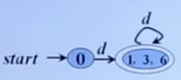

然后是`.`。1能接收点，进入状态2。所以整个136接收到点也会进入状态2

> 这里要说明一下。可能会有这样的疑问：为啥只要状态1能进入状态2，这仨就都能呢？是因为：之前进入状态136是接收了digit的结果。而**只要一直处于状态136中，就不可能还接收了除了digit以外其他的符号**。因此136状态中到底是1，3还是6是**可选的！**比如后面要是有个点，我就一直在1这儿待着不往3和6去，自然就能成功接收点并进入到状态2了

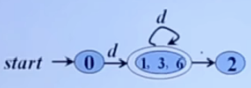

然后是E。3能接收E，并进入状态4，因此整个136接收到E也会进入到状态4(这里的原因和上面一样哦！)

**另外，状态4不需要任何输入就能进入状态5，所以45也是捆起来的！**

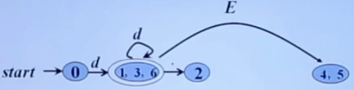

然后接着看：状态2能接收d，进入状态3，自然也能进入到状态6，这里可没有1了哦，所以要新开一个(终态)

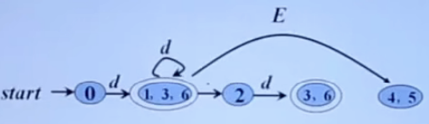

然后状态36接收到d还会变成自己；36遇到E会变成45；45遇到+-会变成5；45遇到d会变成6；5遇到d会变成6；6遇到d会变成6

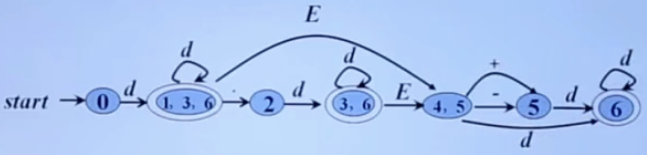

## 3.7 Minimum DFA

有了DFA，我们还要看一看它到底是不是最简的。下面是一个最小化DFA的例子：

![[Compile/resources/Pasted image 20221122143046.png]]

首先写出所有的状态集合，因为终态和非终态肯定是不一样的，所以它们可以先分开：

$$
\{ABCD,\ E\}
$$

接下来就看，**所有在一块的到底能不能拆开**。那么也就是尽可能去把ABCD拆开。此时，ABCD其实是一个整体，所以我们要把它们同等看待。因为ABC经过b之后都会到达这个整体，而D经过b之后会到达E，所以显然D和ABC是有区别的，应该拆开：

$$
\{ABC,\ D,\ E\}
$$

接下来就拆ABC这个整体。因为AC经过b都会到这个整体；而B经过b之后会到D，所以B也应该拆开：

$$
\{AC,\ B,\ D,\ E\}
$$

A和C经过a都会到B，经过b都会到自己这个整体，所以没法再拆了。那么最终自动机重画出来是这样的：

![[Excalidraw/Drawing 2022-11-22 14.37.10.excalidraw]]

## 3.8 习题

### 3.8.1 正则表达式

#homework regular expression

![[Pasted image 20221105221228.png]]

![[Pasted image 20221105221252.png]]

![[Pasted image 20221105221316.png]]

![[Pasted image 20221105221328.png]]

### 3.8.2 自动机

#homework automata

![[Pasted image 20221106132715.png]]

![[Pasted image 20221106132734.png]]

![[Pasted image 20221106132752.png]]

![[Pasted image 20221106132809.png]]

![[Pasted image 20221106132842.png]]

![[Pasted image 20221106132858.png]]

### 3.8.3 RE -> FA

#homework RE->FA

![[Compile/resources/Pasted image 20221122141129.png]]

![[Compile/resources/Pasted image 20221122141148.png]]

![[Compile/resources/Pasted image 20221122141200.png]]

# 4. 语法分析

> **语法分析的内容其实需要语义分析的知识点，尽管语法分析是在语义分析之前发生的。所以最好先看完[[#2. 文法分析|文法分析]]的内容再回到这里。**

语法分析器扫描的实际上就是词法分析结束后的结果：

![[Compile/resources/Pasted image 20221122152451.png]]

那么词法分析器分析出来的每一个Token，它是什么以及它的种类是什么就会被传送到语法分析器中做进一步分析。比如，传过来一个`int`，它的类别是关键字；一个`a`，类别是标识符；一个分号，类别是停止符号。那么语法分析器就对这三个东西进行分析，分析出一个句子：`int a;`，并赋予它含义。

## 4.1 Top-Down Parsing

来看一个例子，也是之前表达式的例子

1. E -> E + E
2. E -> E * E
3. E -> (E)
4. E -> id

根据这个文法，我们能**自顶向下**构造出语法的分析树：

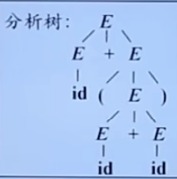

显然，这个分析树不是唯一的，只是我们**随便**根据选的规则画出来的，下面来写一下这棵树对应的derive过程：

> $E \Rightarrow E + E$				将根节点E由规则1替换成E+E
>
> ​	$\Rightarrow E + (E)$			 将加号右边的E根据规则3替换成(E)
>
> ​	$\Rightarrow E + (E + E)$	 将括号里面的E根据规则1替换成E+E
>
> ​	$\Rightarrow E + (id + E)$	 将括号里面左边的E根据规则4替换成id
>
> ​	$\Rightarrow id + (id + E)$	 将最左边的E根据规则4替换成id
>
> ​	$\Rightarrow id + (id + id)$	 将最后一个E替换成id

我们能发现，**最后一个是句子，所有的符号都是Terminal。而且在这个句子中，所有的符号正好都是分析树的叶节点**

那么回顾我们推导的过程，在每步推导中，都要考虑两个事情：

* 我们要替换的**Nonterminal是谁**？这里其实替换的全是E，只不过是哪一个E不确定
* 我们要根据**什么规则**来进行替换？也就是这4个中的哪一个？

### 4.1.1 Left-most Derivation

首先来回答上面的第一个问题。我们可以每次都选择**最左边**的来进行替换，只不过要是**Nonterminal**才行，否则也替换不了

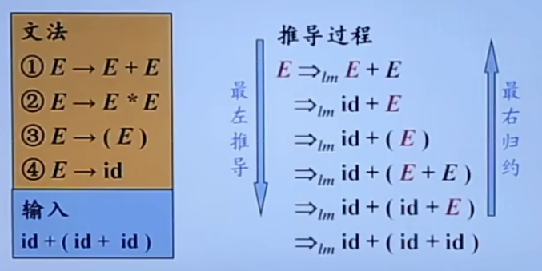

就向上图一样，每次都替换最左边的E，因为只有E才是Nonterminal。然后这整个推导的过程叫做**最左推导**，而如果反着来，显然就是**从右边开始**去合成大西瓜，就是**最右规约**

同时，推导出来的这个句型就叫做该文法的**最左句型**(left-sentential form)。要注意是句型不是句子，也就是这个过程中每一步都是最左句型；并且一定是要由**Start Symbol**开始推导

### 4.1.2 Right-most Derivation

同理可得

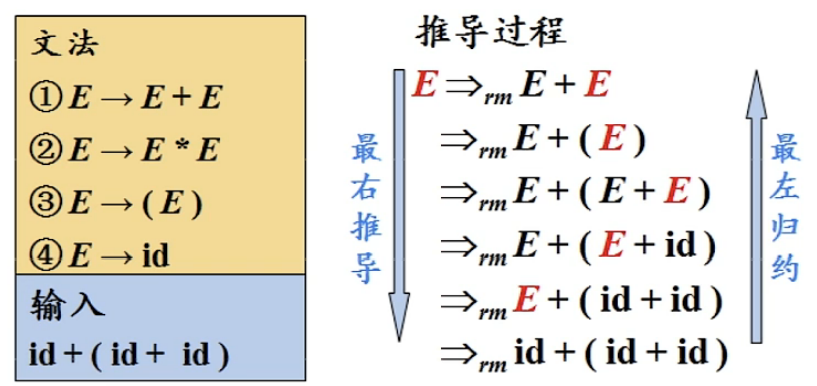

而在**自底向上**(**不是Top-Down!!!**)的分析过程中，我们总是采用最左规约的方式，因此把最左规约称为**规范规约**；相应的最右推导称为**规范推导** ^289006

**唯一性**

对于一个文法，它的最左推导和最右推导都是**唯一的**，因为推导的过程中要替换的那个一定是唯一的

**Top-Down一般采用Left-most Derivation**

下面来看一个例子，比如文法G：

1. E -> TE'
2. E' -> +TE' | $\epsilon$
3. T -> FT'
4. T' -> *FT' | $\epsilon$
5. F -> (E) | id

如果输入的串是`id + id * id`，那么会有：

首先，**输入指针**指向输入串的第一个字符，也就是id

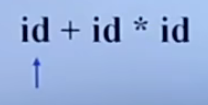

然后从Start Symbol开始，也就是E，E只能按规则1替换

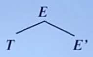

然后这时还没有id，所以要接着替换。从**最左边**开始，把T按着规则3替换

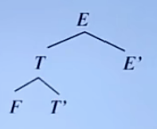

继续， 把F按着规则5替换。这时问题来了：F既可以替换成(E)也可以替换成id。那么替换哪个呢？我们**输入指针**指向的是id，那自然要就近来。所以要把F替换成id，自然也就匹配了

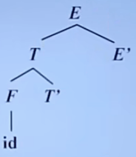

然后，**输入指针**自然也要往后移一位了


此时最左边的Nonterminal是T'，自然要替换它了。它能替换成\*FT'或者$\epsilon$，而现在是个加号。很显然，T'不可能以\*开头，那么我们只能将T'替换成$\epsilon$了


此时最左边的是E'，它能替换成+TE'或者$\epsilon$，显然以加号开头的这个正是我们想要的，那么就这么替换


然后输入指针后移一位


然后开始替换T，只能替换成FT'


然后自然是把F替换成id了，并且后移一位输入指针

![[Compile/img/ld10.png|200]] ![[Compile/img/ld11.png]]

替换T'，因为这里是星号，所以替换成*FT'并后移输入指针

![[Compile/img/ld12.png|200]] ![[Compile/img/ld13.png]]

然后F替换成id往下走，因为已经完了，输入指针指向的是空串，所以只要能换成$\epsilon$就换了。最终

![[Compile/img/ld14.png|200]] ![[Compile/img/ld15.png]]

### 4.1.3 Backtracking & Predictive Parsing

比如Production是这样的：A -> abb | abc，那么如果此时的输入指针指向的恰好就是个a的话，到底是替换成abb还是abc？这俩都是a开头的。因此我们要逐个尝试一下。如果不能匹配了，那就说明我们这条路走的不对，要回去重来。这个过程就叫做**回溯**。

显然，回溯会降低计算机的效率。因此我们要尽可能减少回溯(这里和KMP算法好像啊)，使用**预测分析**(Predictive Parsing)的方法。具体的做法就是，当前输入指针不是指向一个输入的符号吗，我们**再往前看看**，这样就能预测一下到底是哪一个Production更加合适，这样就能预测了。而往前看通常是看1个就够了

## 4.2 Grammar Transformation

刚才刚说过回溯的问题，而自顶向下的分析方法正好就会产生这种问题。我们先来看一个例子

> G:
>
> S -> aAd | aBe
>
> A -> c
>
> B -> b
>
> 输入：`abc`

这样当指向a的时候，S的两个候选式都是a开头，就不知道到底用哪个了

除了回溯的问题，还有其他的问题

> G:
>
> E -> E + T | E - T | T
>
> T -> T * F | T / F | F
>
> F -> (E) | id
>
> 输入：`id + id * id`

这里的问题是，首先指向id，而Start Symbol右边那几个没有一个是id开头的，所以只能一个一个试。首先来试试E + T，替换完了，如果采用Left-most的方式，那就是替换最左边那个E，而这个E再一替换还是E + T，这样就会无限循环下去

> $E \Rightarrow E + T$
>
> ​	$\Rightarrow E + T + T$
>
> ​	$\Rightarrow E + T + T + T$
>
> ​	$\Rightarrow \ ......$

那么怎么来消除这种情况呢？首先，这种情况可以统称为**左递归**，而只有一步推导就会产生的叫做**直接左递归**；两步即以上产生的叫做**间接左递归**。首先来看一下如何消除直接左递归

直接左递归包含这样的Production: $A \rightarrow A\alpha$

那么对于一个这样的Production: $A \rightarrow A\alpha | \beta\ (\alpha \neq \epsilon,\ \beta不以A开头)$，我们先来推导一下它能生成什么样的句子

> $A \Rightarrow A\alpha$
>
> ​	$\Rightarrow A\alpha\alpha$
>
> ​	$\Rightarrow A\alpha\alpha\alpha$
>
> ​	$\Rightarrow \ ...$
>
> ​	$\Rightarrow \beta\alpha\alpha...\alpha$

其实就是一个$\beta$开头，后面连上若干个$\alpha$(**可以是0个**)，即$r=\beta \alpha^*$

那么我们只需要再引入一个A'，让它形成这样的形式

> $A \rightarrow \beta A'$
>
> $A' \rightarrow \alpha A'|\epsilon$

这样在**Left-most Derivation**的过程中，首先替换A的时候就会直接采用带$\beta$的方式，也就不会有无限左递归的问题了。

有了一般的方法，我们怎么运用呢？看一开始的例子，这就是一个典型的直接左递归：

> G:
>
> E -> E + T | T
>
> T -> T * F | F
>
> F -> (E) | id
>
> *这里为了简便，删掉了一些*

那么我们要在里面找$A \rightarrow A\alpha$的形式，根据第一条就能看出，E就是A，后面的+T就是$\alpha$，T就是$\beta$。那么我们把这些带到上面化好的式子中：

> $E \rightarrow TE'$
>
> $E' \rightarrow +TE'|\epsilon$
>
> **别忘了，以上只是改造了第一条，还要以相同的方式改造第二条，因为它也是左递归！**
>
> $T \rightarrow FT'$
>
> $T' \rightarrow *FT'|\epsilon$
>
> **最后一条因为不含$A \rightarrow A\alpha$，所以不用改造**
>
> $F \rightarrow (E)|id$

那么如果是多个，应该怎么办呢？这里给出消除直接左递归的一般形式：

如果Production是：$A \rightarrow A\alpha_1|A\alpha_2|...|A\alpha_n|\beta_1|\beta_2|...|\beta_m\ (\alpha_i \neq \epsilon,\ \beta_j不以A开头)$

就可以换成这样的形式：

> $A \rightarrow \beta_1A'|\beta_2A'|...|\beta_mA'$
>
> $A' \rightarrow \alpha_1A'|\alpha_2A'|...|\alpha_nA'|\epsilon$

**其实就是，本来是一堆能套娃的串，但是你总得有个头，所以给了个$\beta$来结束。也就是说肯定是要以$\beta$开头的。很显然要是不想在左边套娃，就先把这个$\beta$放上去，然后在右边连接一堆能套娃的式子，也就是将递归从左边转移到了右边**

***另外需要注意的是，这里之所以n和m可以不相等，是因为如果n多的话，那么不够的$\beta$可以用$\epsilon$来凑；而m多的话就更简单，挪出去单独写就可以了***

然后再看一下如何消除间接左递归。其实，间接左递归中一般都会包含直接左递归，以下是一个例子：

> S -> Aa | b
>
> A -> Ac | Sd | $\epsilon$

这里第二条很显然是个直接左递归，因为有A -> Ac。那么何来间接左递归呢？我们看以下第一个式子的推导过程

> $S \Rightarrow Aa$
>
> ​	$\Rightarrow Sda$

经过了两步推导，我们又发现了S开头的句型。也就是说，这个东西每两次会套一下娃，因此是间接左递归

消除的方法，就是将**S带入A的Production中**：

> $A \rightarrow Ac|Aad|bd|\epsilon$

然后再**消除这个式子的直接左递归**即可。这里按照那个一般形式来转换就可以了

> 这里m和n都是2，那么$\alpha_1 = c,\ \alpha_2 = ad,\ \beta_1 = bd,\ \beta_2 = \epsilon$
>
> 带入上面的式子就能得到：
>
> $A \rightarrow bdA'|A'$
>
> $A' \rightarrow cA'|adA'|\epsilon$

## 4.3 LL(1) Grammar

### 4.3.1 S_Grammar

**S文法**就是简单的(Simple)、确定的(Specific)文法。它要求：

* 每一个Production的右边都要以**Terminal**开始
* 对于同一个**Nonterminal**，它的所有候选式打头的**Terminal**都要不一样

根据定义可以看出，既然要求要以Terminal开始，那么肯定是不能含空产生式$\epsilon$的。为什么呢？来看个例子

> G:
>
> 1. S -> aBC
> 2. B -> bC
> 3. B -> dB
> 4. B -> $\epsilon$
> 5. C -> c
> 6. C -> a
> 7. D -> e
>
> 输入：
>
> * `ada`
> * `ade`

先来写一下`ada`的Derive过程，很顺利的

> $S \Rightarrow aBC$
>
> ​	$\Rightarrow adBC$		把B按照3换成dB
>
> ​	$\Rightarrow ad\epsilon C$		 没有a开头的，所以换成空串
>
> ​	$\Rightarrow ada$			最后把C换成a

**但是写`ade`的时候，会出现问题**

> $S \Rightarrow aBC$
>
> ​	$\Rightarrow adBC$		把B按照3换成dB
>
> ​	$\Rightarrow ad\epsilon C$		 没有e开头的，换成空串
>
> ​	$\Rightarrow ad?$

此时发现，最后的C没有以e开头的候选式，所以报错了

因为是和B相关的空产生式，所以来讨论它：空产生式的使用取决于在它的后面到底有什么。这里B的后面是C。由于C只能替换成c和a，所以**能紧跟着B后面出现的Terminal只能是c和a**

另外，在匹配第二个字符时，也就是上面两个输入中的`d`。当前的Nonterminal是B，那么如果这个d不是d而是f的话，也就是说**和当前的Nonterminal的候选式都不匹配的时候**，这时本应该报错的，但是还有个空产生式，那么到底用不用呢？这取决于它后面的东西。**如果这个f能紧跟着B后面出现**，那么把B替换成$\epsilon$是没有问题的，否则就应该报错了

### 4.3.2 Follow Set

就像刚才说的，这个B后面只能紧跟着出现c和a。那么如果对于一个在**Sentential From**中出现的**Nonterminal**，它后面能紧跟着出现的这些**Terminal**可以形成一个集合，这个集合就叫做**Follow集**。
$$
FOLLOW(A) = \{a|S\Rightarrow^*\alpha Aa\beta,\ a\in V_T,\ \alpha,\beta\in(V_T\cup V_N)^*\}
$$
这个公式其实很好理解。首先S经过若干步推导，那得到的一定是个句型。然后右边就是左边一个$\alpha$，右边一个$\beta$，中间夹着的就是定义里的东西，其中$\alpha$和$\beta$都是文法中符合规定的任意一个串。

那还有个问题，如果A后面没东西了咋整？难道Follow集里还有空串？前面强调过，**$\epsilon$既不是Terminal也不是Nonterminal**，所以很显然是不能加到这个集合里的。所以我们引入一个结束符**\$**，也就是说，**如果句型中如果最右边那个东西是个Nonterminal，那它的Follow集就是{\$}**

由以上所说可以推出这个集合的用处了。就比如之前那个例子中的B，如果它后面出现的Terminal正好就在Follow(B)中，那很显然就应该选择这个候选式了。

> G:
>
> 1. S -> aBC
> 2. **B -> bC**
> 3. **B -> dB**
> 4. **B -> $\epsilon$**
> 5. C -> c
> 6. C -> a
> 7. D -> e

Follow集就是用在4号这种式子上面的。如果当前的Nonterminal是B，那么我们就计算Follow(B) = {a, c}。计算方法就是往后看，B后面是C，C能替换成c和a，所以这俩的集合就是B的Follow集。然后看当前的输入符号是啥：如果是b，就选2；如果是d，就选3；如果是a或者c(**Follow集中的元素**)，就选4。

另外我们能发现，2号对应的是b开头；3好对应的是d开头；4号对应的是a或者c开头，**它们是不相交的**。

### 4.3.3 Selection Set

以上说的都是看当前的输入符号，去选择哪个Production。那么我们也可以反着来，就是说看**当前的某一个Production，它能适用于哪些输入符号呢**？这就是**可选集**的由来。

比如上面例子中的第二条：B -> bC。我们知道，只有当前输入符号是b的时候才能选这个。那么也就是说对于这个产生式，它的可选集就是{b}。而如果是第四条的话，就和前一节说的一样，**它的可选集就是Follow集**
$$
\begin{align}
&SELECT(A\rightarrow a\beta)=\{a\}\\
&SELECT(A\rightarrow\epsilon)=FOLLOW(A)
\end{align}
$$

### 4.3.4 q_Grammar

相对于S文法，q文法更加强大。上面的例子中就是一个q文法

* 每个Production的右边要么是$\epsilon$，要么以Terminal打头
* 如果Production的左部相同，那么这些Production的可选集不能有交集

这个第二条正好就把S文法的第二条也覆盖了。因为如果是这种：

> A -> abc
>
> A -> acc

那么这两条Production的可选集一定有交集，也就是元素a。自然打头的Terminal一定要不一样

#question 这里仅仅是个人猜想，有待证明

我们根据q文法的规则也能推测出，q文法中产生式的右部一定不能以Nonterminal打头。

那么我就要以Nonterminal打头该咋办？这样计算可选集的难度会大很多。因为打头的这个还要继续套娃替换，甚至会套娃很多次，所以我们要再了解一些其他的东西。

### 4.3.5  First Set

现在给定一个串$\alpha$，那很显然，它既可以以Terminal开头，也可以以Nonterminal开头，还可以是空串。

那么我对于这个串，如果它是以Terminal开头的话，很显然它的**首个符号是唯一确定的**。那么此时它的**串首终结符集**就是这个字符了：
$$
\begin{align}
&若S\rightarrow aABe\\
&则FIRST(S)=\{a\}
\end{align}
$$
然而如果这个串是以Nonterminal开头的话，它的首个符号还要看这个Nonterminal能替换成什么，直到是Terminal为止。并且这个替换方式还可能会有多种，因此这个串的**首个符号不是唯一确定的**。也就是说开头有多种可能，那么所有这些可能组成的集合就是它的First集：
$$
\begin{align}
&若：\\
&1.\ T \rightarrow FT'\\
&2.\ F \rightarrow (E)|id\\
&...\\
&那么FIRST(T)=\{\ (,\ id\ \}
\end{align}
$$
然后是空串的情况。这里其实有一个小问题。看下面的例子：

> 1. A -> BC
> 2. B -> $\epsilon$
> 3. C -> $\epsilon$

这里1号是以Nonterminal开头的，但是这个Nonterminal却只能被替换成空串。因此空串的情况应该并到上面当中。**实际上，如果$\alpha \Rightarrow^*\epsilon$，那么$\epsilon$也在$FIRST(\alpha)$中**。

有了这些，我们结合一下4.3.3中说的可选集的概念。

*这里补充一下。可选集表示的是**被选择**的关系。也就是这个产生式能在输入什么的时候被选择呢？就是可选集中的元素。*
$$
\begin{align}
&SELECT(A\rightarrow a\beta)=\{a\}\\
&SELECT(A\rightarrow\epsilon)=FOLLOW(A)
\end{align}
$$
看第一条，是不是和FIRST集有很大的相似？没错！如果我们把右边的$a\beta$看成一个大串$\alpha$，那么很显然$\epsilon\notin FIRST(\alpha)$。因为这个大串根本推导不出来空串(其实$FIRST(\alpha)=\{a\}$根据上面说的就能算出来)。那么这整个Production的可选集就是这个右部大串的FIRST集：
$$
SELECT(A\rightarrow\alpha)=FIRST(\alpha)\ (\epsilon\notin FIRST(\alpha))
$$
然后再看第二条。之前说过，当右边是空串的时候，要往后再看看，后面会出现什么，也就是FOLLOW集中的东西。那么如果对于任意一个大串$\alpha$，它如果能推导出空串的话，显然$\epsilon\in FIRST(\alpha)$。那么此时的可选集不但要包含大串的FIRST集，也要包含左部的FOLLOW集：
$$
SELECT(A\rightarrow\alpha)=[FIRST(\alpha)-\{\epsilon\}]\cup FOLLOW(A)\ (\epsilon\in FIRST(\alpha))
$$
这里要减掉{$\epsilon$}的原因是，可选集的右边表示的是输入的符号，总不可能是空串吧！

### 4.3.6 Left-Right Left-most (1) Grammar(LL1)

先来回顾下，整个4.3都是为了干什么。4.1.3中我们提到了Backtracking和Predictive Parsing。预测分析就是用来避免掉回溯的。那么我们怎么做到预测分析呢？就是**让每个输入符号只能对应一个候选式**。那么怎么做到呢？正好可选集就表示了被选择的关系。那么我们只需要**让所有的可选集都不相交**，自然就不会有**"两个候选式被同一个输入符号选择"**的情况了。而像S文法和q文法中的第二条，也正是为了达到这样的效果。而我们的LL(1)文法也是为了这个。那么它和前两个有啥区别呢？前两个文法很鸡肋啊！比如S文法，它只能以Terminal开头，限制就已经很大了。根本不允许在开始就套娃；而q文法也只是在S的基础上加了一个空串。而LL(1)文法就不会有这样的限制，并且也能做到每个输入符号只对应一个候选式。

首先，既然是文法，肯定要有产生式(这不废话吗...)。那么如果有这样的：$A\rightarrow\alpha|\beta$，右部这两个就是俩串。

* 当这俩串都不能推导出空串时，我们想要保证：

  * $A\rightarrow\alpha$
  * $A\rightarrow\beta$

  这俩产生式的可选集不能相交，因为在不能推导出空串时前面也说了，可选集就是FIRST集。自然只需要保证
  $$
  FIRST(\alpha)\cap FIRST(\beta)=\Phi
  $$
  FIRST集不相交，自然可选集也不相交

* 当$\alpha$能推出空串，但是$\beta$不能时，我们先分别写一下他们的可选集
  $$
  \begin{align}
  &SELECT(A\rightarrow\alpha)=[FIRST(\alpha)-\{\epsilon\}]\cup FOLLOW(A)\\
  &SELECT(A\rightarrow\beta)=FIRST(\beta)
  \end{align}
  $$
  我们既然要让等号左边不相交，让等号右边不相交就行了！那么我们就需要保证
  $$
  \begin{align}
  &FIRST(\beta)\cap FOLLOW(A)=\Phi\\
  &FIRST(\beta)\cap FIRST(\alpha)=\Phi
  \end{align}
  $$
#question PPT中只给了第一条，这第二条不需要吗难道？

* 如果反过来，也就是$\beta$能推出空串但是$\alpha$不能，只需要把这俩换一下就行了
  $$
  \begin{align}
  &FIRST(\alpha)\cap FOLLOW(A)=\Phi\\
  &FIRST(\alpha)\cap FIRST(\beta)=\Phi
  \end{align}
  $$

* 如果它俩都能推出空串，这种情况不存在。因为如果都能，它们的可选集里都有FOLLOW(A)，那本身就已经相交了

### 4.3.7 Calculation

#example 文法中有如下产生式：

* E -> TE'
* E' -> +TE' | $\epsilon$
* T -> FT'
* T' -> \*FT' | $\epsilon$
* F -> (E) | id

计算E, E', T, T', F的FIRST集和FOLLOW集，并计算每个产生式的SELECT集

> ==**1. 计算FIRST集**==
>
> 首先我们从Terminal打头的入手
>
> * E -> TE'-------------------FIRST(E) = {}
> * E' -> +TE' | $\epsilon$ -------------FIRST(E') = {}
> * T -> FT'-------------------FIRST(T) = {}
> * T' -> \*FT' | $\epsilon$	--------------FIRST(T') = {}
> * F -> (E) | id---------------FIRST(F) = {}
>
> 也就是E'，T'和F。它们分别以+，\*和(打头，同时F还有一个id，那么直接写进去
>
> * E -> TE'-------------------FIRST(E) = {}
> * E' -> +TE' | $\epsilon$ -------------FIRST(E') = {+}
> * T -> FT'-------------------FIRST(T) = {}
> * T' -> \*FT' | $\epsilon$--------------FIRST(T') = {\*}
> * F -> (E) | id---------------FIRST(F) = {(, id}
>
> 然后再来逐个给Nonterminal打头的套娃。首先是E，它以T开头，而T此时还没确定，所以先来T
>
> T以F开头，而F以(或者id开头，所以T肯定也是以(或者id开头
>
> * E -> TE'-------------------FIRST(E) = {}
> * E' -> +TE' | $\epsilon$ -------------FIRST(E') = {+}
> * T -> FT'-------------------FIRST(T) = {(, id}
> * T' -> \*FT' | $\epsilon$	--------------FIRST(T') = {\*}
> * F -> (E) | id---------------FIRST(F) = {(, id}
>
> 那么既然E以T开头，E就也会以(或者id开头
>
> * E -> TE'-------------------FIRST(E) = {(, id}
> * E' -> +TE' | $\epsilon$ -------------FIRST(E') = {+}
> * T -> FT'-------------------FIRST(T) = {(, id}
> * T' -> \*FT' | $\epsilon$--------------FIRST(T') = {\*}
> * F -> (E) | id---------------FIRST(F) = {(, id}
>
> **千万别忘了空串。空串是可以在FIRST集中的！**
>
> * E -> TE'-------------------FIRST(E) = {(, id}
> * E' -> +TE' | $\epsilon$-------------FIRST(E') = {+, $\epsilon$}
> * T -> FT'-------------------FIRST(T) = {(, id}
> * T' -> \*FT' | $\epsilon$--------------FIRST(T') = {\*, $\epsilon$}
> * F -> (E) | id---------------FIRST(F) = {(, id}

---

> **==2. 计算FOLLOW集==**
>
> 既然FOLLOW集是紧跟着某一个Nonterminal后面出现的，那么肯定是根据后面那个东西的FIRST集来的。所以我们要先计算它们的FIRST集
> 
> ![[Pasted image 20221017121121.png]]
>
> 首先从E开始，也就是FOLLOW(T)。T的后面是E'，那么T后面紧跟着出现的就是E'的FIRST集中的内容。**然而E'可以推导出空串，也就是T之后可以是$\epsilon$，则T的FOLLOW集中也应该有'\$'符号**。
>
> **另外，这个E作为开始符号，本身也是个句型，它的后面本身就啥也没有，所以也要加上\$**
>
> 对于这个最后的E'，它后面没东西。所以**能加在E后面的也能加在E'后面**，也就是把E的FOLLOW集里的全家在E'的FOLLOW集中。虽然就是一个\$
>
> ![[Pasted image 20221017121229.png]]
>
> 然后是第二个产生式。因为这里T和E'和第一个位置一样，所以分析结果也一样。
>
> 然后是第三个。这里计算的显然就是FOLLOW(F)和FOLLOW(T')。F后面出现的就是T'的FIRST集，所以F的FOLLOW集里要加上\*；另外同理，因为T'能推出空串，所以也要加上\$
>
> **漏了！因为T'能推出空串，所以这个产生式可以变成T -> F。代表能加在T后面的也能加在F后面。所以F的FOLLOW集应该有T的FOLLOW集里所有的东西，即+和$**
>
> 对于T'，它后面首先啥也没有，所以肯定有$；**另外能加在T后面的也能加在T'后面，所以T'也应该有T的FOLLOW集**
>
> ![[Pasted image 20221017121300.png]]
>
> 之后是第四条。因为第四条里F和T'和第三条一样，所以也不用来了。
>
> 最后是第五条。这里只有E需要看。因为E后面只能有)是唯一确定的，所以加进去就行了。
>
> **算完了吗？没有！我们再回头看，会发现少了许多东西**
>
> 第一句时，给出T的FOLLOW集中应该有E的FOLLOW集(**因为E'能推出空串**)。而这时E的FOLLOW集已经被更新了，所以要再改一下；另外，E'的FOLLOW集也要有E的FOLLOW集，所以也要跟着改。
>
> ![[Pasted image 20221017121320.png]]
>
> 第三句中，T'后面出现的应该包括T后面出现的所有；另外T'能变空串，所以F后面出现的也应该包括T后面出现的所有
>
> ![[Pasted image 20221017121513.png]]
>
> 然后第四句和第五句都分析不出啥，所以第二轮结束
>
> **算完了吗？可能还没有！因为FOLLOW集还是有更新，要算到"在某一轮中，一个FOLLOW集都没更新"这种情况出现时，才能算圆满完成！**
>
> 再来一轮，发现所有FOLLOW集都没更新，这才真算完了！

---

> **==3. 计算SELECT集==**
>
> 首先要把产生式给全都分开
>
> 1. E -> TE'
> 2. E' -> +TE'
> 3. E' -> $\epsilon$
> 4. T -> FT'
> 5. T' -> \*FT'
> 6. T' -> $\epsilon$
> 7. F -> (E)
> 8. F -> id
>
> 然后列出所有Nonterminal的FIRST集和FOLLOW集
>
> ![[Pasted image 20221017121603.png]]
>
> 然后从第一条Production开始，运用这样的想法：**我在输入什么的时候，才会选到1号产生式呢？**很显然，在我当前输入的符号是以T的FIRST集中的元素开头的时候，我才会选择这个产生式来进行替换。所以**1号的可选集就是T的FIRST集**。
> $$
> SELECT(1)=\{(,\ id\}
> $$
> 然后是第二条。因为这是以Terminal开头的，所以别无选择，只有输入符号是+的时候才会选它。
> $$
> SELECT(2)=\{+\}
> $$
> 第三条中，因为E'可以变空串，所以E'后面紧跟着出现的东西正好是我当前输入的符号的话，我也能选它。这正对应了E'的FOLLOW集。
> $$
> SELECT(3)=\{$,\ )\}
> $$
> 第四条中，类比第一条，这条产生式的可选集自然要有F的FIRST集中的内容。
> $$
> SELECT(4)=\{(,\ id\}
> $$
> 第五条中和第二条一样，只有一个星号。
> $$
> SELECT(5)=\{*\}
> $$
> 第六条和第三条差不多，对应T'的FOLLOW集。
> $$
> SELECT(6)=\{+,\ $,\ )\}
> $$
> 然后是第七条，不用多说
> $$
> SELECT(7)=\{(\}
> $$
> 第八条也是一样
> $$
> SELECT(8)=\{id\}
> $$
> **这道题有一种特殊情况没涉及到。比如说第四条：有F的FIRST集自当天经地义；但是如果F能推出空串的话，也就是F压根不存在，那么开头就变成了F之后的东西，也就是F的FOLLOW集中的东西也应该有。**

总结：通过这道题，和之前的概念，我们也能发现，FOLLOW集是用在单个的Nonterminal上的，而FIRST集是用在串上的。因为Nonterminal本身也是一个串，所以自然都可以。而SELECT集是用在产生式上的，因此才会由小到大的计算。另外，FIRST集中要么是Terminal，要么是$\epsilon$；而FOLLOW集本身就是Terminal的集合，自然不能有$\epsilon$，而是用\$代替；而SELECT集中因为表示的是输入符号，肯定要有意义，所以元素种类和FOLLOW集中的是一样的。

## 4.4 Down-Top Parsing

上一节整体是在介绍如何将文法一步步展开成我们要识别的句子；现在就来讲如何反向操作。在真实的编译场景中，我们拿到的实际上就是真实的输入，比如：

```c
int a, b, c;
a = 8;
b = 5;
c = 2;
a = b + c;
```

那么我们如何将这些Token按照文法给它匹配上呢？**从下往上的分析**也是一种不错的选择。在[[#^289006|4.1.2]]中我们介绍过，这里通常会使用最左规约。那么实际上，就是**串的左边变得越来越抽象**的过程，直到整个串被抽象成了开始符号为止。我们通过一个例子看一看如何进行最左规约：

### 4.4.1 Left-most Reduce

#example left-most reduce

有如下文法：

* E -> E+T|T
* T -> T\*F|F
* F -> id

给出输入：`id1+id2*id3`，写出最左规约的过程。

既然是左边越来越抽象，我们就从最左边去看，谁能抽象一下子。那么我们一眼就能看出，这个id1就能替换成F，所以这个串变成了这样：

$$
\begin{array}
\\
&id1+id2*id3\\
\Rightarrow &F+id2*id3\\
\end{array}
$$

显然，这个F也可以替换成T，最后替换成E：

$$
\begin{array}
\\
&id1+id2*id3\\
\Rightarrow &F+id2*id3\\
\Rightarrow &T+id2*id3\\
\Rightarrow &E+id2*id3
\end{array}
$$

然后把id2替换成F，T；将id3替换成F，然后把这个T\*F替换成T：

$$
\begin{array}
\\
&id1+id2*id3\\
\Rightarrow &F+id2*id3\\
\Rightarrow &T+id2*id3\\
\Rightarrow &E+id2*id3\\
\Rightarrow &E+F*id3\\
\Rightarrow &E+T*id3\\
\Rightarrow &E+T*F\\
\Rightarrow &E+T
\end{array}
$$

最后，E+T可以替换成开始符号E，这样最左规约的过程就完成了。但是显然，你在做这些的时候会发现非常明显的问题，比如这一步：

$$
\Rightarrow E+T*id3
$$

这里一眼其实就能看出：E+T就是E啊！那我干嘛不替换成$E*id3$呢？答案很简单：你这么干是错的！那我咋知道它是错的？其实我们想想：**规约其实就是推导的逆过程**，我们写出这个推导过程的分析树看看：

![[Excalidraw/Drawing 2022-12-09 21.06.00.excalidraw|300]]

我们现在做的，不过是**从圈上的部分开始，一步步走到起点**罢了。因此我们从树上就能一眼看出，谁才是应该被抽象的那个。**我们只需要看，首先最下面(深度最大)，然后最左边的那个叶子结点即可**(这其实就是最左直接短语)。比如现在，该被抽象的人就应该是id1，那么之后的树就是这样的：

![[Excalidraw/Drawing 2022-12-09 21.14.52.excalidraw|300]]

很显然，最下面，最左面的叶子是id2，所以应该替换id2。但是我们之前好像也不是这么干的呀！我们是把最左边的F一路替换成E，好像也没啥问题。看到没，id1这个分支和id2这个分支在开始符号之后就没有相交过！所以这样替换是可以的，但是按照最左规约的规范，我们还是替换id2比较合适：

![[Excalidraw/Drawing 2022-12-09 21.17.48.excalidraw|300]]

现在回头看看，我们出问题的E+T在哪里：

![[Excalidraw/Drawing 2022-12-09 21.19.33.excalidraw|300]]

这仨东西连深度都不一样，怎么可能被替换呢？所以按照这个规则，我们就能够很好地进行最左规约了。接下来我们继续看一个例子：

#example left-most reduce

有如下文法：

* S -> aABe
* A -> b
* A -> Abc
* B -> d

有输入`abbcde`，进行最左规约。

如果我们不构建树，只是用眼睛干瞪的话，会发现很麻烦：这串以a开头，但是文法里只有开始符号是a开头的，我们总不能上来就搞一个S？继续看后面的bbc，这个bbc可以变成Abc，而Abc可以变成A，哦！原来是这样……

但是我们如果画出这个串的分析树，情况就会好很多：

![[Excalidraw/Drawing 2022-12-09 21.27.35.excalidraw|300]]

显然第一个该被替换的就是b嘛！因为它在最下面，最左边。因此顺着这个思路，我们真的能很简单地进行规约操作。虽然如此，但是这一切的一切都有个前提条件：有树！但我们有树吗？我们没有！**如果这个句子的分析树都已经给你了，你还做规约干嘛**？因此，我们先来鉴赏一下，计算机是如何做这件事的。

先给结论，计算机去做最左规约用到了两个关键的东西：

* **一张表**
* **一个栈**

下面我们还是通过一个例子看一看计算机是如何去做最左规约的。

#example left-most reduce: how computer do this

有如下文法：

```
(1) E -> E-T
(2) E -> T
(3) T -> T*F
(4) T -> F
(5) F -> -F
(6) F -> id
```

> 这里你能看到不同：首先没用或的方式，也就是E -> E-T|T这种；其次是每个产生式都标了编号。这些变化都是在为计算机去做规约做准备。

给出输入`id--id*id`，通过计算机去模拟最左规约。

现在，我们直接给出这张表：

![[Compile/resources/Pasted image 20221209221009.png|300]]

我们能看到，这个表最左边的一列是很多数字，它表示**整个规约分析程序的不同状态**。当规约开始时，程序处于初态，也就是状态0；之后是表头，我们能看到这些就是文法中的所有符号，先是终结符，之后是非终结符，中间夹着的井号表示输入结束符号；而表中记录的有这些东西：

* s表示shift，也就是移入操作，将缓冲区里的字符移到栈中；
* r表示reduce，也就是进行规约，将**从栈顶开始向下的某些元素**合并成更抽象的东西；
* 纯数字只有非终结符有。规约的过程，其实就是把不抽象的东西弹出去，抽象的东西放进来。而放进来之后，我们也要记录一些状态，这些数字就是要记录的状态。

下面我们就开始一步步进行规约操作，首先从初态开始，分别记录这些东西：栈里有啥？输入缓冲区里有啥？我该(**对当前这个状态**)干点儿啥？

stack | input_buffer | what shall I do?
-- | -- | --
`#0` | `id--id*id#` | ---

首先，一开始栈里啥也没有，但是要有个初始状态0，并且**前面跟上一个结束符表示栈底**；然后缓冲区里自然是所有待输入的字符串；至于我们该干啥，现在开始介绍。我们看，状态0遇到id之后会变成啥？查表一看就看到了：s4！因此，我们要做的事情就是shift，把缓冲区的一个字符压入栈中。不过别急，还有个4是啥意思？这代表我要把当前状态转到4，也就是，接下来就不再是0遇到谁谁谁了，而是4遇到谁谁谁。如何表示转向？入栈！**栈顶的状态就是当前状态**，所以入栈就完了。

stack | input_buffer | what shall I do?
-- | -- | --
`#0` | `id--id*id#` | s4
`#0id4` | `--id*id#` | ---

显然，4遇到的下一个符号是减号。那应该干啥？r6！也就是，**按照第6条产生式进行规约**。我们看一下，第6条产生式是F -> id，而现在栈顶正好就是个id，那么我们将它替换成F就好了。替换的过程就是将id4出栈，将F进栈……吗？显然不！每一个入栈的东西后面都要跟上状态，而这个状态是谁？当id4出栈了，栈顶的状态不就是0了吗？所以就看0遇到F会变成啥状态？3！因此我们将F3入栈。

stack | input_buffer | what shall I do?
-- | -- | --
`#0` | `id--id*id#` | s4
`#0id4` | `--id*id#` | r6
`#0F3` | `--id*id#` | ---

下面自然是看状态3遇到减号会变成什么了，显然是r4。所以我们按着第四条产生式进行规约。要规约的是F，而栈顶正好有个F，所以我们把它替换成T。也就是F3出栈，T某某入栈。某某是谁？自然是看0遇到T会变成啥，一看是2，所以T2入栈。

stack | input_buffer | what shall I do?
-- | -- | --
`#0` | `id--id*id#` | s4
`#0id4` | `--id*id#` | r6
`#0F3` | `--id*id#` | r4
`#0T2` | `--id*id#` | ---

接下来，就是看2遇到减号会怎么样，一看是r2，所以按照第二条进行规约，也就是T2出栈，E1入栈。

stack | input_buffer | what shall I do?
-- | -- | --
`#0` | `id--id*id#` | s4
`#0id4` | `--id*id#` | r6
`#0F3` | `--id*id#` | r4
`#0T2` | `--id*id#` | r2
`#0E1` | `--id*id#` | ---

然后是1遇到减号，变成s6。终于开始shift了！将减号入栈，并且转向状态6，也就是把6入栈。

stack | input_buffer | what shall I do?
-- | -- | --
`#0` | `id--id*id#` | s4
`#0id4` | `--id*id#` | r6
`#0F3` | `--id*id#` | r4
`#0T2` | `--id*id#` | r2
`#0E1` | `--id*id#` | s6
`#0E1-6` | `-id*id#` | ---

然后是6遇到减号，变成s5，所以继续入栈-5。

stack | input_buffer | what shall I do?
-- | -- | --
`#0` | `id--id*id#` | s4
`#0id4` | `--id*id#` | r6
`#0F3` | `--id*id#` | r4
`#0T2` | `--id*id#` | r2
`#0E1` | `--id*id#` | s6
`#0E1-6` | `-id*id#` | s5
`#0E1-6-5` | `id*id#` | ---

5遇到id变成s4，所以继续入栈id4。

stack | input_buffer | what shall I do?
-- | -- | --
`#0` | `id--id*id#` | s4
`#0id4` | `--id*id#` | r6
`#0F3` | `--id*id#` | r4
`#0T2` | `--id*id#` | r2
`#0E1` | `--id*id#` | s6
`#0E1-6` | `-id*id#` | s5
`#0E1-6-5` | `id*id#` | s4
`0E1-6-5id4` | `*id#` | ---

4遇到乘号变成r6，所以按照第六条产生式，将栈顶的id替换成F。也就是**id4出栈**，F某某进栈。而F对应的状态是谁？就看现在栈顶的状态5遇到F会变成啥，一看是8，所以**F8进栈**。

stack | input_buffer | what shall I do?
-- | -- | --
`#0` | `id--id*id#` | s4
`#0id4` | `--id*id#` | r6
`#0F3` | `--id*id#` | r4
`#0T2` | `--id*id#` | r2
`#0E1` | `--id*id#` | s6
`#0E1-6` | `-id*id#` | s5
`#0E1-6-5` | `id*id#` | s4
`#0E1-6-5id4` | `*id#` | r6
`#0E1-6-5F8` | `*id#` | ---

8遇到乘号变成r5，所以将栈顶的-F替换成F(好牛逼！栈顶为啥真就是个-F？)。这次要一下替换2个，所以要出栈四个进栈四个。出栈的是-5F8，进栈的是F3(6遇到F入的是3)。

stack | input_buffer | what shall I do?
-- | -- | --
`#0` | `id--id*id#` | s4
`#0id4` | `--id*id#` | r6
`#0F3` | `--id*id#` | r4
`#0T2` | `--id*id#` | r2
`#0E1` | `--id*id#` | s6
`#0E1-6` | `-id*id#` | s5
`#0E1-6-5` | `id*id#` | s4
`#0E1-6-5id4` | `*id#` | r6
`#0E1-6-5F8` | `*id#` | r5
`#0E1-6F3` | `*id#` | ---

3遇到乘号变成r4，所以将F3替换成T9。

stack | input_buffer | what shall I do?
-- | -- | --
`#0` | `id--id*id#` | s4
`#0id4` | `--id*id#` | r6
`#0F3` | `--id*id#` | r4
`#0T2` | `--id*id#` | r2
`#0E1` | `--id*id#` | s6
`#0E1-6` | `-id*id#` | s5
`#0E1-6-5` | `id*id#` | s4
`#0E1-6-5id4` | `*id#` | r6
`#0E1-6-5F8` | `*id#` | r5
`#0E1-6F3` | `*id#` | r4
`#0E1-6T9` | `*id#` | ---

接下来9遇到乘号变成s7，所以入栈星号7；7遇到id变成s4，所以入栈id4。

stack | input_buffer | what shall I do?
-- | -- | --
`#0` | `id--id*id#` | s4
`#0id4` | `--id*id#` | r6
`#0F3` | `--id*id#` | r4
`#0T2` | `--id*id#` | r2
`#0E1` | `--id*id#` | s6
`#0E1-6` | `-id*id#` | s5
`#0E1-6-5` | `id*id#` | s4
`#0E1-6-5id4` | `*id#` | r6
`#0E1-6-5F8` | `*id#` | r5
`#0E1-6F3` | `*id#` | r4
`#0E1-6T9` | `*id#` | s7
`#0E1-6T9*7` | `id#` | s4
`#0E1-6T9*7id4` | `#` | ---

现在只剩井号了。4遇到井号变成r6，所以将id4替换成F10。

stack | input_buffer | what shall I do?
-- | -- | --
`#0` | `id--id*id#` | s4
`#0id4` | `--id*id#` | r6
`#0F3` | `--id*id#` | r4
`#0T2` | `--id*id#` | r2
`#0E1` | `--id*id#` | s6
`#0E1-6` | `-id*id#` | s5
`#0E1-6-5` | `id*id#` | s4
`#0E1-6-5id4` | `*id#` | r6
`#0E1-6-5F8` | `*id#` | r5
`#0E1-6F3` | `*id#` | r4
`#0E1-6T9` | `*id#` | s7
`#0E1-6T9*7` | `id#` | s4
`#0E1-6T9*7id4` | `#` | r6
`#0E1-6T9*7F10` | `#` | ---

接下来是个大的：10遇到井号变成r3，所以按照第三条产生式，我们很惊讶地发现，栈顶的元素正是T\*F！所以我们直接将这一大坨出栈，也就是T9\*7F10，替换成T某某。而某某就是栈顶状态6遇到T之后的状态，查表得到是9，所以入栈的就是T9。

stack | input_buffer | what shall I do?
-- | -- | --
`#0` | `id--id*id#` | s4
`#0id4` | `--id*id#` | r6
`#0F3` | `--id*id#` | r4
`#0T2` | `--id*id#` | r2
`#0E1` | `--id*id#` | s6
`#0E1-6` | `-id*id#` | s5
`#0E1-6-5` | `id*id#` | s4
`#0E1-6-5id4` | `*id#` | r6
`#0E1-6-5F8` | `*id#` | r5
`#0E1-6F3` | `*id#` | r4
`#0E1-6T9` | `*id#` | s7
`#0E1-6T9*7` | `id#` | s4
`#0E1-6T9*7id4` | `#` | r6
`#0E1-6T9*7F10` | `#` | r3
`#0E1-6T9` | `#` | ---

9遇到井号变成r1，所以将最后的E-T替换成E即可，过程和上一步相似。

stack | input_buffer | what shall I do?
-- | -- | --
`#0` | `id--id*id#` | s4
`#0id4` | `--id*id#` | r6
`#0F3` | `--id*id#` | r4
`#0T2` | `--id*id#` | r2
`#0E1` | `--id*id#` | s6
`#0E1-6` | `-id*id#` | s5
`#0E1-6-5` | `id*id#` | s4
`#0E1-6-5id4` | `*id#` | r6
`#0E1-6-5F8` | `*id#` | r5
`#0E1-6F3` | `*id#` | r4
`#0E1-6T9` | `*id#` | s7
`#0E1-6T9*7` | `id#` | s4
`#0E1-6T9*7id4` | `#` | r6
`#0E1-6T9*7F10` | `#` | r3
`#0E1-6T9` | `#` | r1
`#0E1` | `#` | ---

我们发现，1遇到井号是acc，表示accept，所以接收了！！！

从这个例子中，**我们其实能看到状态机的影子**。那些代表状态的数字，其实就对应状态机的某一个状态。只不过这个状态机和之前介绍的不一样：它能反悔。这里的反悔可不是走回从前的状态这么简单，而是直接把我走过的路给砍掉！怎么砍？用栈来砍。因此这些状态和操作正对应着我该怎么走，走错了该怎么反悔。**因此这张表用来记录状态的转移；而这个栈用来帮助我进行后悔的操作**。

### 4.4.2 LR Automata

接下来我们介绍一下上面这张牛逼的表是怎么算出来的。其实，就是自动机。只不过我们在构建它的时候就会发现，它和我们前面介绍的自动机还是有很大区别的。为了介绍这个自动机，我们首先要介绍一些基础的概念。比如有下面的产生式：

E -> E-T|T

我们想要识别一个E，其实就是经过这些状态罢了：

![[Excalidraw/Drawing 2022-12-10 12.56.19.excalidraw|700]]

从初态0开始，识别一个E；识别一个减号；识别一个T，走到终态就等于识别完了一个E。另外也可以从初态开始直接识别一个T走到终态，也算是识别了一个E。但是，我们现在这个自动机的状态好像有点简陋：它只有一个编号，并不能真正表示我们的识别过程走到了哪一步。因此，我们用一种比较简单的方式去标识一下当前的状态。比如，我们走到了状态2，这表示识别完了E和减号，该识别T了。那么我们用**一个点**来表示当前的状态：

![[Excalidraw/Drawing 2022-12-10 13.02.56.excalidraw|700]]

这样我们就可以很清晰地看出自己走到了哪一步了。到这里，自动机还是不太对计算机友好，我们之前不是**把所有的或都拆开**了吗？因此我们要更加优化一下：

![[Excalidraw/Drawing 2022-12-10 13.05.40.excalidraw|700]]

这样看起来是不是顺眼多了！！另外，我们也发现，状态5和状态3其实根本不是一个状态！一个表示识别完了E-T；但另一个表示识别完了T。虽然都是识别完了E，但是仔细看，或者说对于计算机来说，还是有一定区别的。那么接下来，我们就按照这个模式来把一开始的文法给改造一下吧！

```
(1) E -> E-T
(2) E -> T
(3) T -> T*F
(4) T -> F
(5) F -> -F
(6) F -> id
```

![[Compile/resources/Pasted image 20221210131233.png]]

注意看最上面的E'，这是啥？为啥要多加一个这个呢？它的学名叫做**增广文法**。其实就是，如果没有它的话，我们发现开始符号本身对应的就是2个候选项，那么我们怎么界定整个Down-top分析结束了呢？显然不好办。因此我们增加一项让E'是E，这样程序的开始和结束就很好判定了。**只要E'这个自动机走向了终态，并且此时没有输入了，那我就可以终止了**。

接下来思考一件事：我们现在好像画了7个自动机啊！但是实际上分析的时候只有一个自动机。那么我们现在的任务就是——7合1！如何做到呢？引入空边呗！注意这些点后面的Nonterminal，比如状态4，此时要识别一个T，那我是不是可以直接跳到识别T的初态呢？也就是**状态4可以不经过任何条件直接跳到状态8和状态12**。因此，我们可以画出所有的空边，来讲这些自动机串在一起：

![[Compile/resources/Pasted image 20221210131847.png]]

> 这里要注意一个小点。比如状态8，它可以跳到T的初态，其实就是状态8和状态12。这里自己跳自己就没有画了；另外举一个例子。比如此时状态15就可以跳到状态14和状态17。

从这点我们也能看出，如果状态只给编个号的话，那我咋连空边？连不了！

很显然，这个自动机是个NFA。那么计算机要用，就要用DFA。因此我们需要将这个自动机确定化。确定化的方法和[[#3.5.2 NFA -> DFA|3.5.2]]中介绍的一毛一样。

首先看初始状态。因为0，2，6，8，12，14，17这些状态都不需要任何输入就能达到，所以这些状态可以合体变成初始状态。其实，这就是原始初态——状态0的**$\epsilon$闭包**：

![[Compile/resources/Pasted image 20221210135107.png|150]]

这里直接没写状态，直接把产生式都搬过来了。其实这样写会更加简单，比如这个状态经过减号会变成啥？那就看：**这里的点谁能经过减号**。显然只有F->.-F这个产生式。所以它经过减号能到达一个新的集合。那么这个新的集合里除了F->-.F之外还有谁呢？那就看，这个点现在不是跑到F去了嘛，那就肯定能直接跳到F的终态啊(我们之前做的事情不就是这个嘛)！所以这个新的集合就是这样的：

![[Compile/resources/Pasted image 20221210135350.png|150]]

经过不断运算，我们最终能求出所有的集合，而且最终形成的一定是个DFA：

![[Compile/resources/Pasted image 20221210135437.png]]

下面我们来用一下这个自动机。用它去识别`id--id*id#`。首先从I0开始，识别到id后进入状态I4。之后出问题了！下一个是减号，但是I4根本没有减号的边啊！！那咋办？别急，此时这个点已经点在了某个非终结符识别的终态，也就是说，**此时一个F就识别完了**。那我是不是该进行规约了啊！那么，现在无非就是说，你别按着id去走了，你应该按着F去走。因此现在又退回到状态I0，并且按着F走到了状态I3。这样进行下去，其实就和我们之前介绍的**栈+表**是一个东西了。

上面的这个DFA里，其实还有一个问题。比如我们看状态I1，这里有两个产生式(其实现在叫它产生式不太合适了。它的学名叫做**项目**，含状态，也就是那个点的产生式叫做项目)：

* E' -> E.
* E -> E.-T

第一个项目告诉我：现在该规约啦！把E规约成E'；第二个项目告诉我：它说的不对！现在该移位啦，要接收下一个字符减号了！那么此时我该听谁的呢？到底是该规约还是该移进呢？这就又涉及到4.3中介绍的各种集合的问题了。显然，这俩人谁对我就听谁的。那么我咋知道谁对呢？往前看呗！如果下一个字符在E'的Follow集中，表示后面的字符紧跟着E'出现，那我现在就该规约啊！如果下一个字符就是减号，其实就是First({-})，那我就移进呗！下面给出一个比较规范的概念。

* 比如有下面的项目：

	* $A \rightarrow \beta 1 . \beta 2$
	* $B \rightarrow \beta 1 .$

这俩项目如果在同一个集合中，那么就会产生**移进/规约冲突**。那么如何解决冲突？看谁对。如果下一个字符在Follow(B)中，那么显然我应该听第二个的；如果下一个字符在First($\beta 2$)中，那么我就该听第一个的。但是有个问题，加入这俩集合有交集，那就代表你俩都对，那此时这个冲突就解决不了了。

* 如果有下面的项目：

	* $A \rightarrow \alpha .$
	* $B \rightarrow \alpha .$

此时会出现**规约/规约冲突**。这俩人都想要规约，但是规约成的东西不一样。此时如何解决冲突？那就还是往前看，下一个字符如果在Follow(A)中，就听第一个的；如果在Follow(B)中，就听第二个的。还是，如果这俩集合有交集，冲突解决不了。

---

当我们写出上面的这个自动机时，其实这张表已经可以画出来了。接下来我们就来看看如何按照自动机去填表：

![[Compile/resources/Pasted image 20221214173830.png]]

分为两个部分。一个是移进，另一个是规约。首先从初态开始：

* 初态是0，0可以接收E，T，F，id和减号。遇到E时会转向状态1(这里的遇到是什么？不就是规约的时候，要把E入栈，然后紧接着入栈一个1吗！)；遇到T是会转向状态2；遇到F时会转向状态3；当遇到id时，要转向状态4。但是这里是移进操作，所以是s4；遇到减号时要s5。所以填完表后就是这样的：

![[Compile/resources/Pasted image 20221214174256.png]]

* 按着这个节奏，就可以把整张表的移进部分都填出来：

![[Compile/resources/Pasted image 20221214174333.png]]

> 注意这里的acc。当状态1遇到结束符号时，表示所有输入都完成了。因此汇报accept表示识别成功。

下面就开始进行规约操作了。什么样的状态可以进行规约操作？当然是**某个子自动机的终态啦**！比如I3中的这个候选项，表示识别完了一个T。所以此时可以进行规约操作。下一个问题是：什么时候进行，或者说遇到什么输入的时候才进行规约操作？**当然是T的Follow集啦**！如果下一个字符就在T的Follow集中，很显然我此时把之前的输入规约成产生式的左部是没问题的！所以下面开始看规约。

* 首先是状态2，因为0和1都没有可以规约的项。当状态2遇到E的Follow集中的元素时，可以将T规约成E。所以当遇到`-, #`时可以进行r2操作，按照第二条产生式来规约：

![[Compile/resources/Pasted image 20221214174745.png]]

* 按照这个规则，我们也可以把所有的规约操作也填好：

![[Compile/resources/Pasted image 20221214174818.png]]


## 4.5 习题

### 4.5.1 CFG & Derive & Tree

#homework CFG & Derive & Tree

![[Compile/resources/Pasted image 20221122182733.png]]

![[Compile/resources/Pasted image 20221122182827.png|200]]

![[Compile/resources/Pasted image 20221122182843.png|300]]

![[Compile/resources/Pasted image 20221122182909.png|300]]

![[Compile/resources/Pasted image 20221122182921.png|300]]

![[Compile/resources/Pasted image 20221122182937.png]]

![[Compile/resources/Pasted image 20221122183145.png]]

![[Compile/resources/Pasted image 20221122183202.png]]

![[Compile/resources/Pasted image 20221122183211.png]]

### 4.5.2 Top-down parsing & LL1

#homework Top-down parsing and LL1

![[Compile/resources/Pasted image 20221203193327.png]]

![[Compile/resources/Pasted image 20221203193339.png]]

![[Compile/resources/Pasted image 20221203193358.png]]

![[Compile/resources/Pasted image 20221203193408.png]]

![[Compile/resources/Pasted image 20221203193450.png]]

### 4.5.3 Down-top parsing & SLR1

#homework Down-top parsing & SLR1

#TODO 正确答案老师还没给全

![[Compile/resources/Pasted image 20221212181030.png]]

![[Compile/resources/Pasted image 20221212181042.png]]

![[Compile/resources/Pasted image 20221212181054.png]]

![[Compile/resources/Pasted image 20221212181104.png]]

![[Compile/resources/Pasted image 20221212181112.png]]

![[Compile/resources/Pasted image 20221212181124.png|300]] ![[Compile/resources/Pasted image 20221212181135.png|300]]

![[Compile/resources/Pasted image 20221212181144.png]]

# 5. 语义分析

