# 计组笔记

## 存储系统

### 层次结构

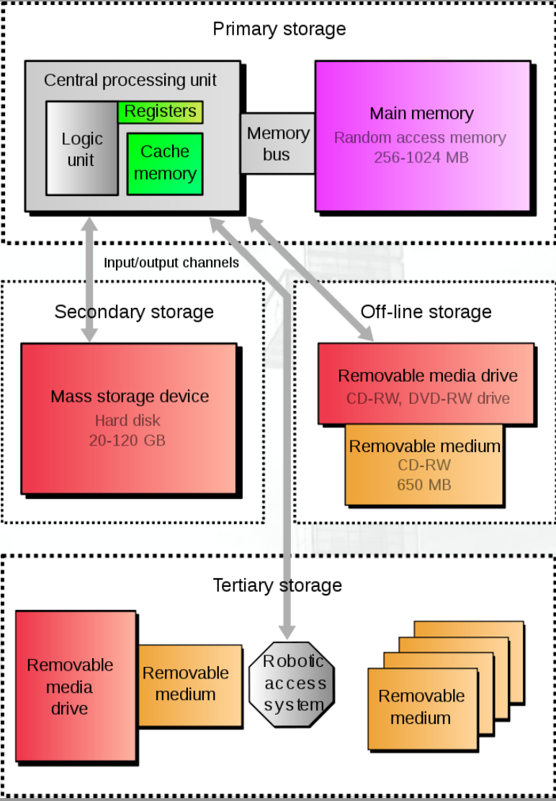

> * CPU内部，Registers最快，Cache慢一点
> * Main memory再慢一点

### 存储类型

* 半导体
  * 寄存器，Cache，内存，闪存，SSD，EEPROM
* 磁性
  * 硬盘，软盘，磁带
* 光学
  * CD-ROM, DVD-ROM, BD-ROM
  * CD+R/RAM/RW, DVD-R/RAM/RW
* 已有的系统的深度整合优化
  * RAID(冗余磁盘阵列)
  * SSD
  * Cache + Harddisk
  * Cache + SSD
  * Cache + SSD + Harddisk <- Fusion Drive
* 纸，屏幕
  * 纸袋，条形码，答题卡，二维码
  * 打印机/显示 + 相机 = 纸存储的I/O

### 常见容量

* CPU Register: < 10KB
* CPU Cache(L1, L2, L3): < 30MB
* 内存: < 1TB
* 外存(SSD + HD): < 1PB

### 性能：啥叫快？

#### 存取时间

> 任何一个存储器，访问一个单元(R/W)的时间

#### 存取周期

> T = 存取时间 + 预热时间(CD) + 结束时间

比如磁盘，要想访问一个地方，磁头要转到那儿，但SSD就不用

#### 存取带宽

> 单位时间存储器能读出的字节数

比如一个纸带，顺序访问，挺快；乱着来，巨慢！

#### 随机访问速度

> 对"任意目标数据块"的存取时间

比如上面那个纸带的随机访问速度

#### 读写速率比

比如SSD，读很快，但是写很慢(要先来个擦除)

#### 存取粒度

> 能R/W的最小单元尺寸

是Byte?还是Bit?

### 可靠性

#### MTBF(Mean Time Between Failures)

> 在两次故障间的平均时间

可以修，还有救！

#### MTTF(Mean Time to Failure)

> 在完蛋之前的平均时间

修不了，用到死！

#### Days in Use for SSD

SSD老擦除，把预留的Cache写挂了，就废了，比如500GB的可能写几十个T就废了

#### TBW(Terabytes Written for SSD)

* QLC, TLC, MLC, SLC

> 在SLC闪存中，每个存储单元仅存储一位信息，这使得读取单元格更快捷，因为磨损的影响小这也增加了单元的耐久性，进而增加了寿命，但其单元成本较高；MLC闪存每个存储器单元存储两位信息，读取速度和寿命都低于SLC，但价格也便宜2到4倍；MLC闪存的低可靠性和耐用性使它们不适合企业应用，创建了一种优化级别的MLC闪存，具有更高的可靠性和耐用性，称为eMLC；TLC Flash每个存储器单元存储3位信息，优势在于成本与SLC或MLC闪存相比要低得多，较适合于消费类应用，而到QLC Flash则是每个存储器单元能够存储4位信息以存储更多的信息，寿命也会相应低于TLC。

寿命：OLC < TLC < MLC < SLC

### 功耗

功耗小，对电源友好，可靠性高

排名(单位容量下): Cache > Memory > SSD > HD

Cache虽然不大，但功耗还是最高的

### 主存储器

Random Access Memory - RAM, Read-Only Memory - ROM

#### SRAM(Static RAM)

* 用于CPU Cache(一般只是1级Cache)
* 主流：基于MOSFET

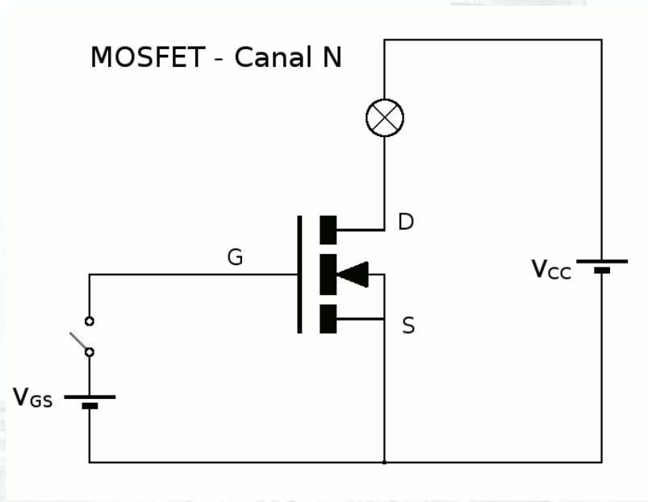

> * VGS高电平：压G，DS导通
> * 低电平：断开(图里就这样)

**SRAM核心**

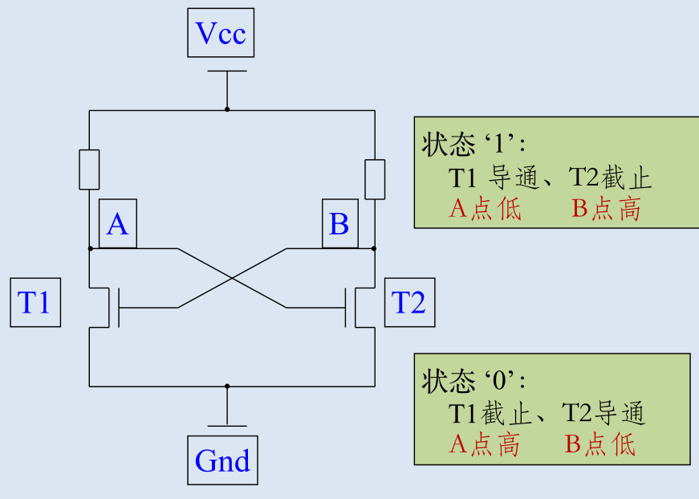

* 没外力驱动，就不会变 -> Static
* 这一个Cell，给个规定：A高是1，A低是0 -> 存一个bit

**SRAM结构**


* 字线决定位线工不工作(选不选中这个cell)
* 位线决定A，B谁高

#### DRAM(Dynamic RAM)

核心：一个电容，有电1，没电0

为什么Dynamic：会漏电啊！时变

**SRAM大，贵，费电**……

**DRAM结构**

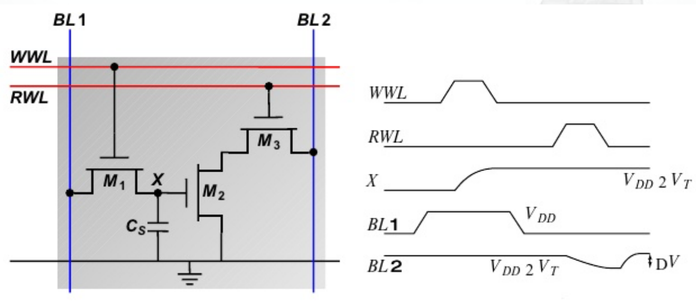

> 3T-DRAM

**额外操作：维持**

* 因为C漏电，所以要维持
* 咋维持？先读再写

**DRAM小，便宜，可以容量大**

ddr2, ddr3……频率提高，充电时间降低

#### 阵列怎么搞？

一个单元


拼一起

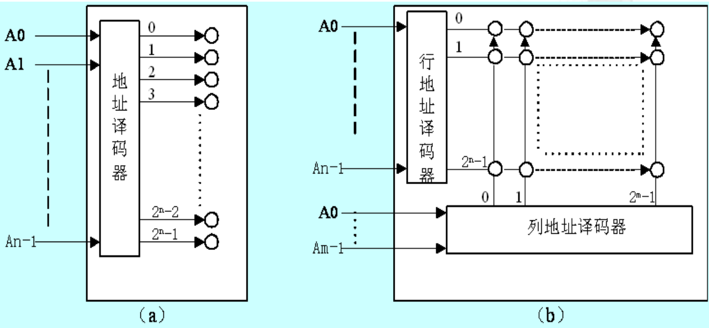

* (a)：线性，一个巨型38译码器，地址一编，看选中哪个字线

  问题：左边地址10bit，右边要2^10 = 1024根线，太多了

* (b)：堆成一个块，一边长为根号下2^10 = 2^5，则行，列确定即可，线一共2^5 + 2^5 = 64根，少多了！

* 三维更牛逼！

#### 存储器组成

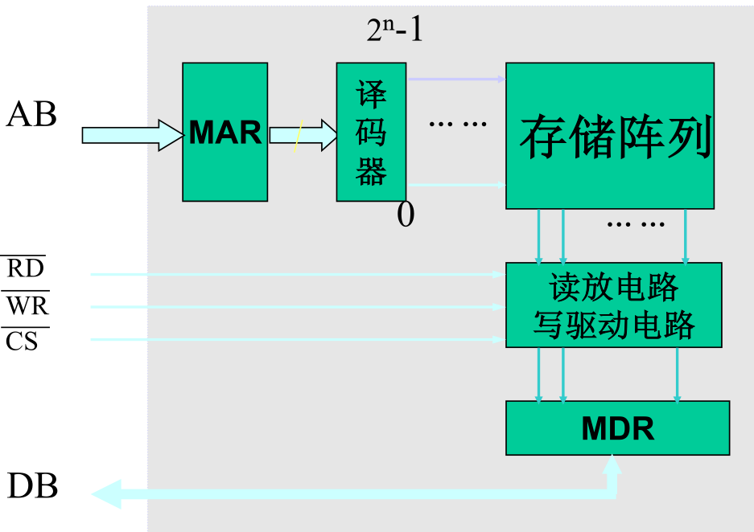

* AB: Address Bus，地址总线
* 存储阵列：前面那个(b)
* DB: Data Bus，数据总线


* Register作用：比如读出来一个值，但还没到TikTok，不能放到总线上，因此先放到Register里

#### 6264SRAM


* D0~D7: 8bit表示每个6264的一个cell里存8bit = 1byte

* A0~A12: 13bit，决定读8KB个地址中的哪一个

  > 8K = 2^13Byte = 1 00...0(13个0)
  >
  > 因此从00...0到11...1共2^13种状态

这玩意儿才8K，得拼一拼，弄大点儿

> 8K * 8bit
>
> * 前面变大：字扩展
> * 后面变大：位扩展
> * 都变大：字位同时扩展

#### 字扩展

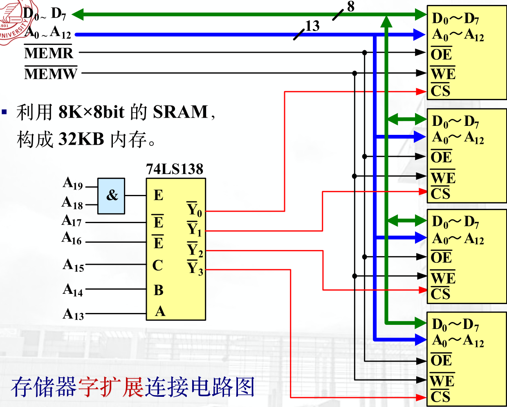

* 138决定选中哪些6264工作

#### 位扩展

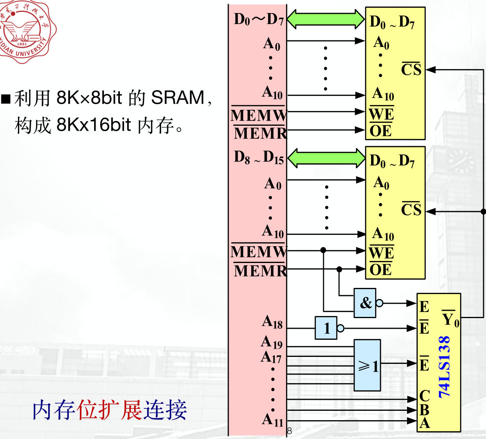

#### 8086CPU

* 16bit，数据D0~D15
* 避免数据连续存在一个寄存器：奇偶分体

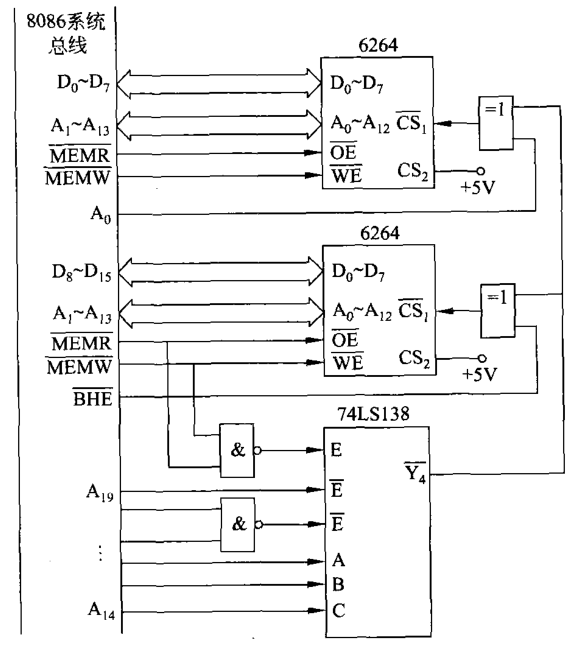

> 有个20bit的数
>
> |      |      |      | ................................................................... |      |      |
> | ---- | ---- | ---- | ------------------------------------------------------------ | ---- | ---- |
> | A19  | A18  | A17  | ................................................................... | A1   | A0   |
>
> 74-138一共6个输入，3个使能，3个控制
>
> 则从上到下对应A19, A18 ... A14
>
> 而A16, A15, A14决定哪个6264工作
>
> 图中把~Y4连出去，代表当A16, A15, A14为100时，~Y4为0，其余时刻~Y4为1，若工作，~Y4始终为0
>
> 0111 00**xx xxxx xxxx xxx**A0
>
> A0从0开始涨
>
> A0 = 0时，~Y4 = 0,0 + 0 = 0，则上面的6264工作，<u>**将16位中的低八位存起来或者读出去**</u>
>
> **但此时~BHE为1，因此下面不工作**
>
> 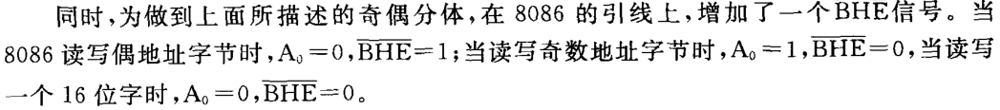
>
> 涨一位，A0 = 1，~Y4 = 0，上面不工作，下面~BHE = 0，工作
>
> 再涨一位，A0 = 0，**但是它前面的x变成了1**，这样，上面工作，同时这个x是地址位的最后一个x，**表示上面那片的00 0000 0000 001号地址**(由此可见，上面讨论的即分别是上下两片的00 0000 0000 000号地址)
>
> 由此，不断进行下去的过程中，**每一个地址都分别会轮到上下两片6264**
>
> **当A0和~BHE都是0的时候，表示这两个6264都工作，而此时两个6264接的地址都是A13~A1，那么会同时取出这两个6264中的D7~D0，那么，如果规定好高8位和低8位，就能够拼成一个16位的数据了，这也就符合了8086的要求**

一个练习题：将4片6264连接到**8086**系统，要求其内存范围70000H~77FFFH

> * 注意：4片，但还是8086，而2个6264就是16位，因此这里是字位同时扩展
>
> 这里还是20bit的数
>
> |      |      |      | ................................................................... |      |      |
> | ---- | ---- | ---- | ------------------------------------------------------------ | ---- | ---- |
> | A19  | A18  | A17  | ................................................................... | A1   | A0   |
>
> 由于第一个数一直是7，则A19~A16是固定的：
>
> 0111
>
> 而6264的A12~A0连接的是地址总线的A13~A1，则A15和A14目前待定
>
> 地址总线的A0和~BHE用于控制这4个6264
>
> **我们一般用A16, A15, A14控制这几个6264的选中**
>
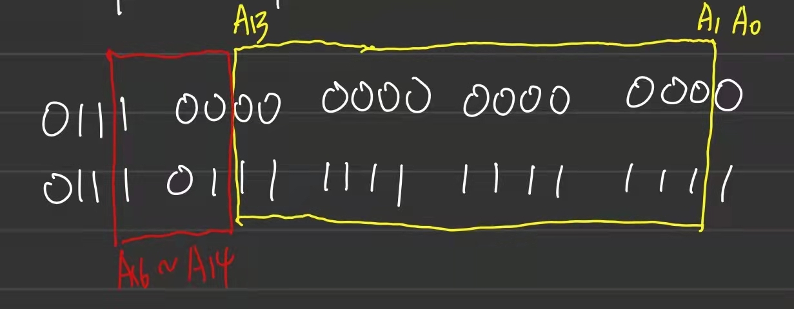
>
> 观察到，A16~A14会从100变化到101，即只有A14会变，**而在变的过程中，必然伴随了：**
>
> * A14为0，剩下的从全0-全1
> * A14为1，剩下的从全0-全1
>
> 也就是说，**会有两个8KB被串起来，而每个8KB又通过奇偶分体实现了16bit**，因此，本题扩展完后是一个16KB * 16bit的内存
>
> 接着看138连出去的部分，由于用A16~A14作为控制端，而他们的状态只有100、101两种，因此用~Y4，~Y5来控制这4个6264，因为**只有他们有变成0的机会！**
>
> 然后，利用之前偶数(**A0 = 0**)存低八位，奇数(**A0 = 1**)存高八位的思想，很容易画出整个的连接图
>
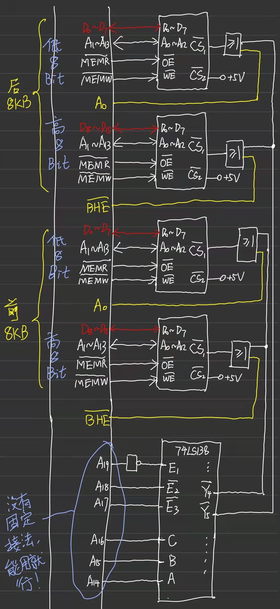

#### 80386/80486处理器


#### Pentium处理器(奔腾)

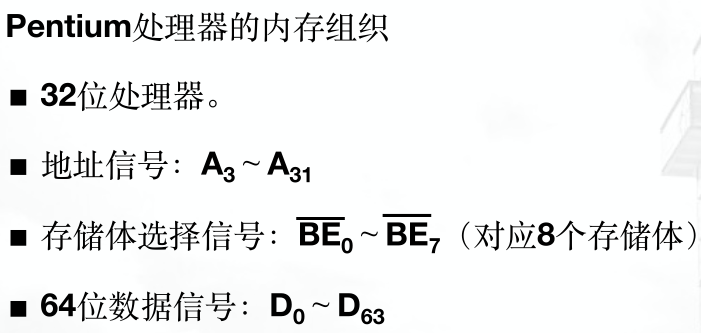

#### 2164DRAM


> * 虽然是一个16位的，但是只有8根地址线，因此分为行地址和列地址
> * 把双向的数据线改成两根单向的

**由于分为了行地址和列地址，不是一次性都能进行交换的，所以要有一个时序的问题**

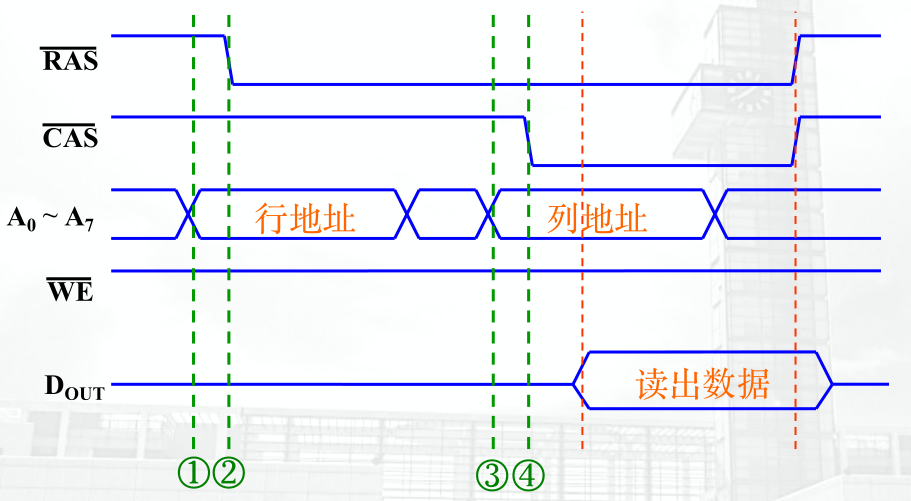
| :--------: | ----------------------------------------------------- |

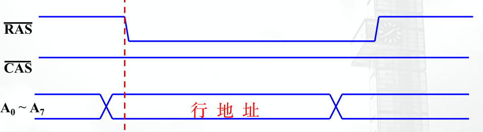

> 由此，可以感受到，DRAM相比于SRAM，最大的问题就是慢

#### SDRAM(Synchronized DRAM)

* 重要指标：**CAS Latency**

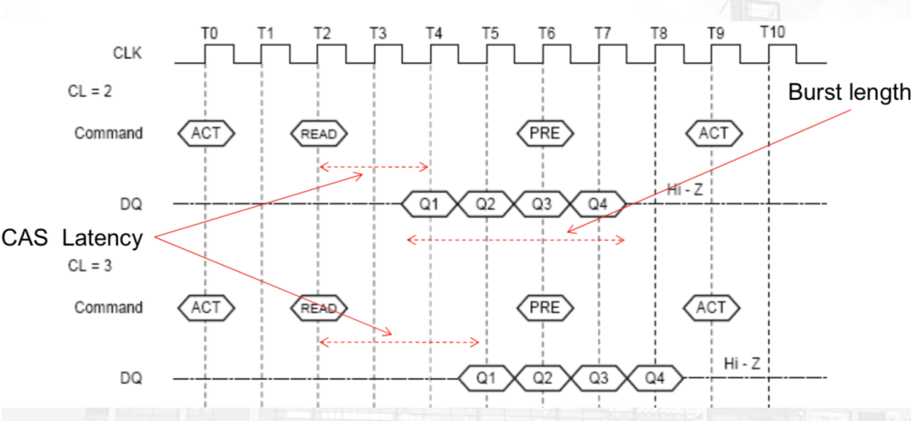

> *前面表格里，读数据的那一栏，从列地址给出的时候就开始发出了READ的命令了，那么，**从发出命令后到真正开始读数据要多久？这就是CAS Latency***

#### 其他RAM


#### SRAM, DRAM总结

* SRAM
  * 用稳态电路存信息，不需要刷新
  * 相对于DRAM，速度快、集成度低、功耗大、成本高
* DRAM
  * 用暂态电路(电容)存信息，需要刷新
  * 地址采用复用技术，分行列两次加载，~RAS、~CAS
  * 相对于SRAM，速度慢、集成度高、功耗小、成本低
  * 刷新(再生)方法：集中式、分散式、异步式
  * 刷新控制电路：刷新计数器、刷新/访存裁决、刷新控制逻辑，是CPU和DRAM的接口

#### ROM

* 特点：存储信息的非易失性
* 分类
  * Mask ROM
  * 可编程ROM
    * OTP-ROM(一次可编程)
    * 可擦可编程ROM
      * EPROM
      * EEPROM：并行、串行
    * 闪存(Flash)
      * NOR(或非型阵列)
      * NAND(与非型阵列)

**Mask ROM**


> 出厂直接刻好，有三极管0，没三极管1

**OPT-ROM**

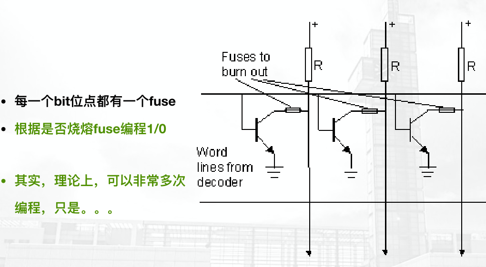

**EPROM**

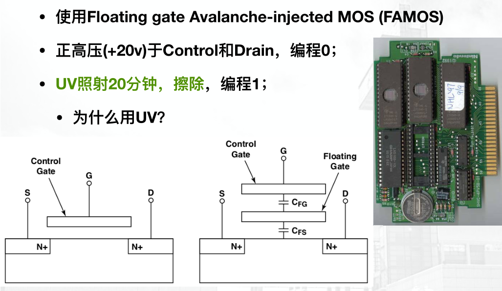

**Flash Memory**

* 是EEPROM(电可擦除)的扩展

  * 相同的floating gate结构
  * 相同的读写持久性

* 主要改进

  * 快速擦除(块擦除)

* 分Negate-OR和Negate-AND两种类型

  * NOR读取快，擦除慢，容量小

  * NAND容量大，读写速度小(SSD大量采用)


* **适合作文件系统**

**持久性VS可写性**

> 日常用的存储设备，存的信息不会维持很久的。硬盘10年8年没啥问题；SSD，U盘如果长时间不用不通电，里面的数据就会废掉，时间长了，温度高了，电会跑，数据的持久性会有问题；还有光盘，如果保护很好，没问题，但自己光刻机刻出来的就有问题：空气氧化啥的

### 其他存储器

#### 多端口存储器

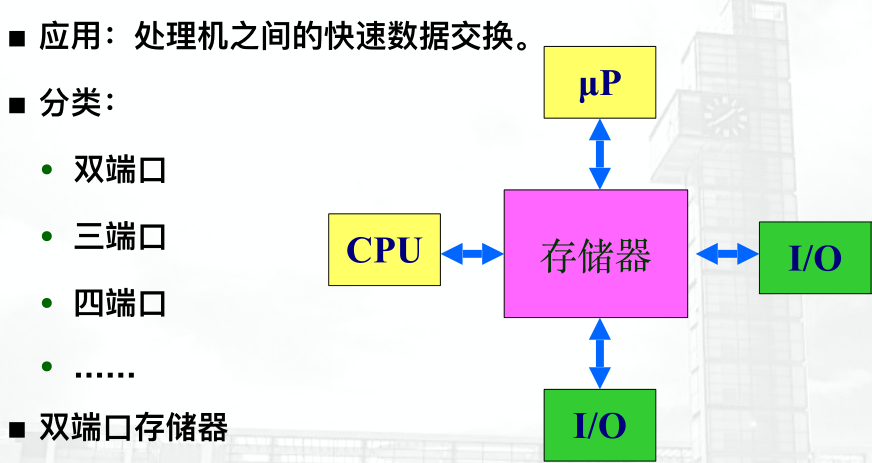

> 存储器是一个各个设备都要抢占的东西，CPU在用的时候IO就不能用，反之亦然，这样使用多端口，就能有好几套输入输出

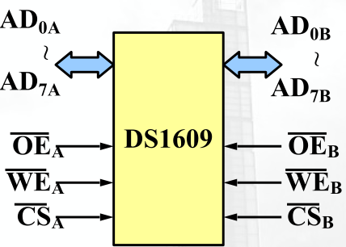

读/写操作的一些规范

* 允许
  * 对于不同存储单元
    * 同时读
    * 同时写
  * 对于同一存储单元
    * 同时读
    * 一个写一个读(有时行有时不行)
* 不允许
  * 多个端口同时访问一个单元(Race Condition)

消除竞争，和哲学家就餐问题很类似

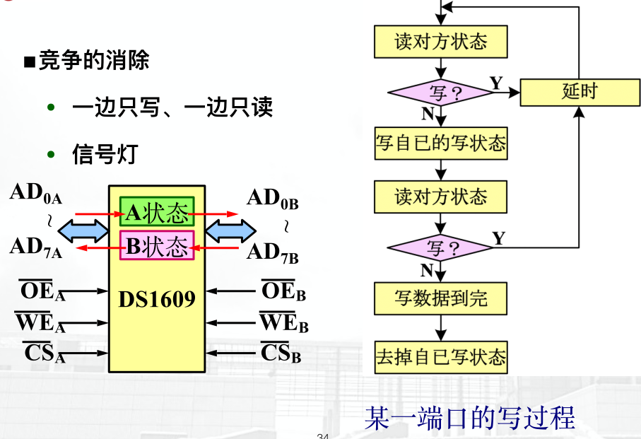

多端口应用场合

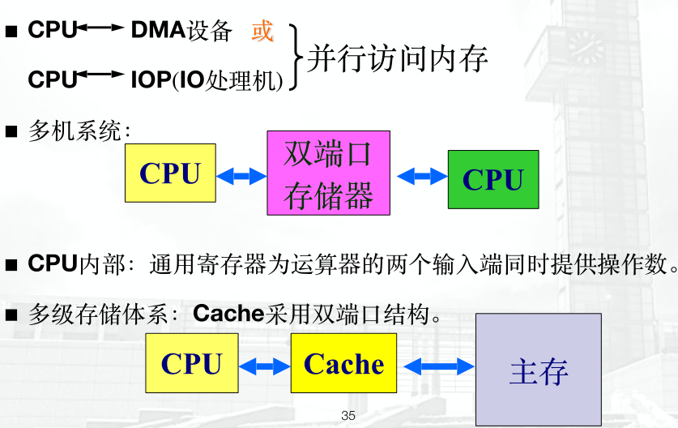

#### 多体交叉存储


> 之前8086的奇偶分体就是一种多体交叉

使用多体交叉后，速度会有不错的提高

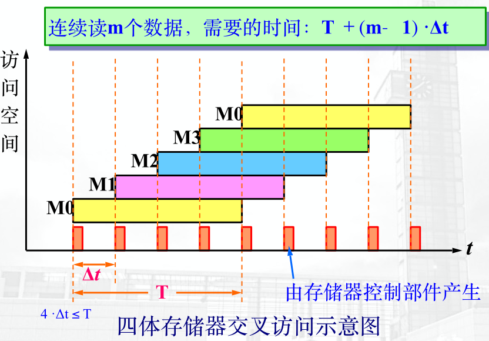

#### 相联存储

* 具备查询能力的存储器

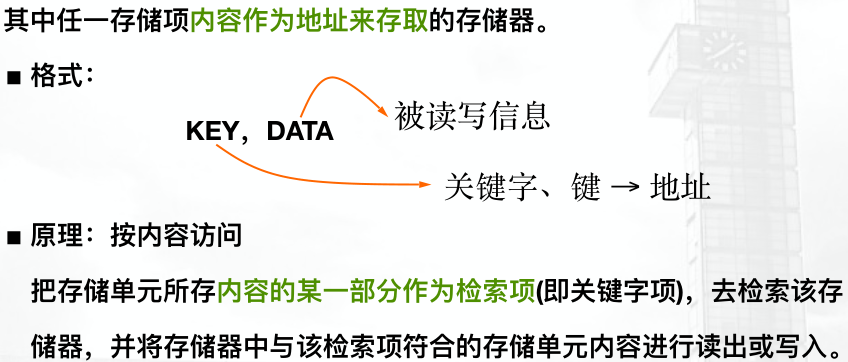

**构成**

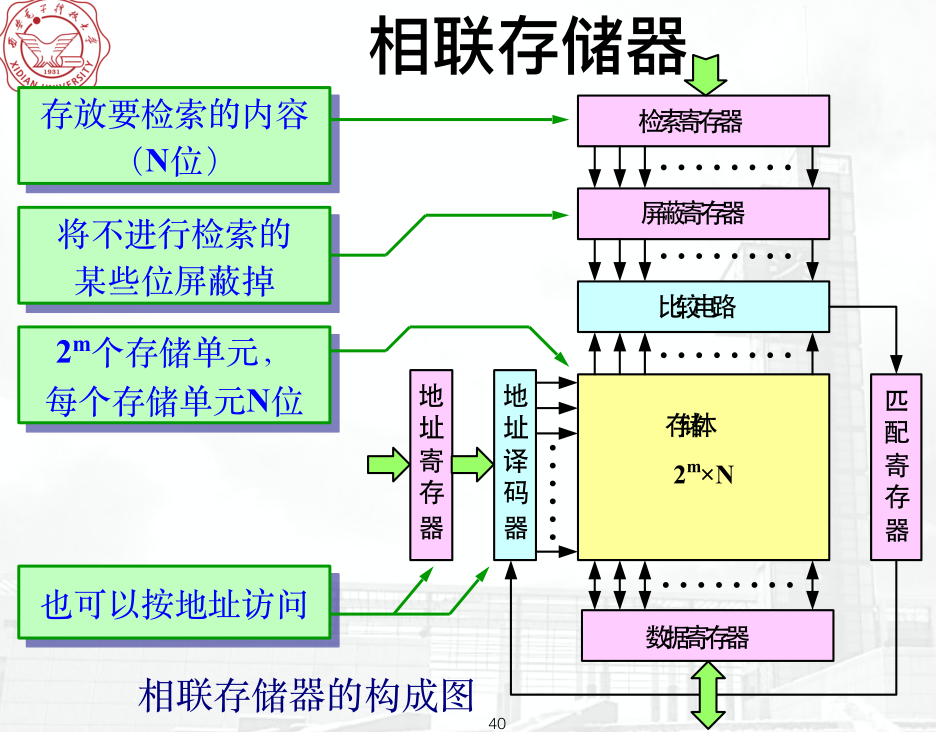

**用处**

* 快速查找，地址变换
* Cache: Cache目录表
* 虚地址翻译，TLB

### Cache

> A cache memory is a **small, temporary, but fast memory** that the processer uses for **information it is likely to need again in the very near future**.

#### Why Cache?

* CPU性能远超内存，因此CPU直接访问内存的话，内存会拖后腿，让Cache来！
* CPU和I/O抢占内存(尽可能不要让CPU直接访问内存，让Cache来！)
* 在同一个程序中
  * **如果一块内存刚被访问过，那不久的将来也很可能被访问**
  * **如果一块内存刚被访问过，则它旁边紧挨着它的也很可能被访问(Working Set)**

#### 存储系统


> * 把快的慢的弄一块搭配起来就是存储系统
> * 要让快的看起来没那么快；慢的看起来没那么慢
>   * Cache给内存加速，内存给硬盘加速

**一般计算机中主要有两种存储系统**

* Cache存储系统 = Cache + Main Memory，**为了提高存储器速度**
  * Cache给内存加速，让这俩合起来看着挺快的
* 虚拟存储系统 = Main Memory + Disk，**为了扩大存储器容量**
  * 硬盘分一点用作虚拟内存，让内存看起来变大了，慢归慢，但还能用

**存储系统层次结构**

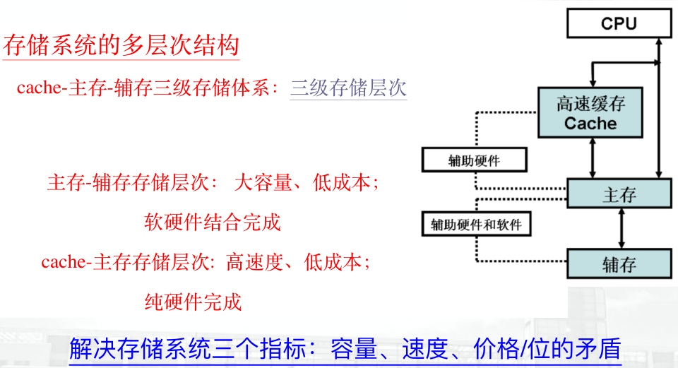

* 程序员**不知道程序其实几乎都是在Cache中运行的**，只知道在内存中
* 程序员**不知道在加载一个非常大的程序的时候，如果MM不够了，OS会把硬盘腾出一块来用作虚拟内存**，只知道内存还够

#### How Cache Works?

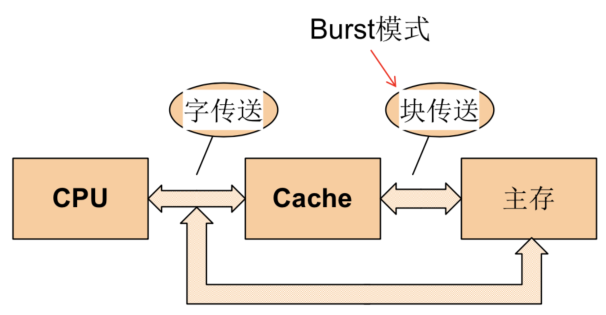

* CPU几乎都是通过Cache访问内存，很少会直接访问内存
* CPU和Cache之间字传送，即传的单位是按byte，因为如果是块的话，CPU的Register没那么多地方来放这些块，再者CPU和Cache之间可以很精确的访问
* Cache和MM之间用块传送，因为他们要传是要走总线的，很慢，所以一次多传点儿，从这里也可以看出，Cache中存的东西是按块存的，只不过和CPU沟通的时候是按字节


1. 从CPU来了一个12345678号地址
2. 将地址切成两部分：块号和块内地址
3. 把块号放到TLB中，查看是否存在呢？如果存在，命中
4. 把TLB翻译后的块地址和块内地址拼起来，是真正Cache中的地址，用这个地址访问Cache
5. 从Cache中访问到数据，取出来，送回给CPU
6. 如果第3部没有命中，则看一下Cache有没有满，如果已经满了，就要使用Cache替换策略(比如LRU)，从MM中把这个块加载进来，并替换掉那个改滚蛋的；如果没满，直接加载进来就行了(和Page Replacement Algorithm其实是一回事)

**那类比OS中的虚拟内存和物理内存的映射关系，这里Cache和MM之间也要存在某种映射关系，才能将MM中的块加载到Cache中**

##### 全相联映射

* MM中随便一块，都能映射到Cache中的随便一块

**首先看看TLB**


* 1010表示MM中的第10个块
* 10表示Cache中的第2个块(都是从0开始的哦)
* 1表示存在这个映射关系(MM的10号存在Cache的2号)，好使！

**Cache和MM的情况是这样的**

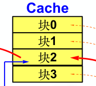

那么，现在CPU给一个地址，如果切完之后块地址就是1010，那经过TLB一查，发现是2号Cache，并且好使！那么再拼上块内地址，就能直接访问Cache了

**全相联的特点**

* 块冲突的概率低(**类比Page Fault数少**)，Cache利用率高
* TLB太大，成本高，查找慢(元素多慢，同时查的时候要一个一个比看是不是1010)

##### 直接映射

* MM中每一块都只能映射到Cache中**特定**一块

**MM给分了个区**

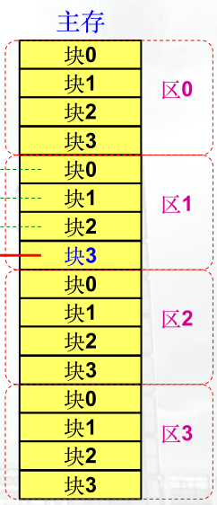

**那咋分区呢？看看Cache就知道了**

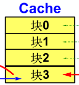

* Cache有4块，则MM中每4块一个区

那有啥用呢？MM中，**每个区的第3块只能映射到Cache中第3块**，其他同理

这样，我要访问，首先要说访问那个区，比如说1区，那区号就是01

**然后，TLB也变了**

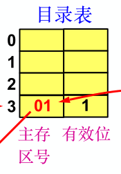

* 目录表的数组下标，正好和Cache对应，**也就和MM中每个区中的块的编号对应**，那TLB中的每一个元素，**相当于MM中所有区的对应块的位置**，比如3号表示我要访问MM中某一个区的第三号块，也正好是Cache中的第3号块。那究竟是哪个区呢？前面的区号啊！

如果地址是`01 + 11 + 块内地址`，那直接按着11去访问TLB，取出其中的主存区号，看相不相等，如果相等，代表存在这里的正好是1区的，那就直接`11 + 块内地址`访问了；如果不相等，那存在这里的就不是1区的第三号，可能是0区，2区啥的，那就替换！

**直接映射特点**

* TLB变小了，变成原来的Entry数 / Cache的Entry数
* 查表变快了，直接用下标访问，比较一次01和区号相不相等就行了，不用像之前似的每次都得比较
* MM的地址是`区号 + 块号 + offset`，Cache的地址是`块号 + offset`，发现除了区号，他俩的地位地址完全一样(在一次访问中有关的地址)，而全相联Cache和MM的块号是不一样的
* 硬件简单，不需要相联存储器，只要
  * 容量较小的按地址访问的区号标志表存储器
  * 少量外比较电路
* Cache块冲突概率高(不同区的同一个块会抢Cache中的同一个块)
* Cache空间利用率低(这图里的是整除了，如果没整除，Cache有些块用不到)

##### 组相联映射

* 组 = 全 + 直

**MM分区在直接映射上加了个组**

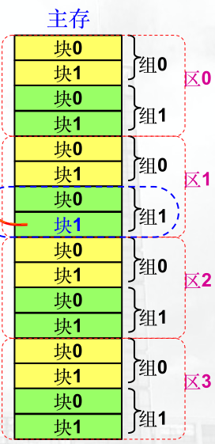

**MM分组了，Cache也分个组吧**


* MM中任何一个区的1组只能映射到Cache中的1组 - **组间直接映射**
* MM中任何一个区的1组的任何一个块可以映射到Cache中1组的任何一个块 - **组内全相联映射**

**这个TLB稍微麻烦一点**

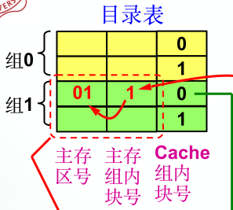

* 数组下标是组号，那1代表我要访问的是某个区的第1组的某一块，那是那个区呢？我给区号，哪个块呢？我给块号
* 我给区号是01，那1组里的区号是01吗？是；我给块号是1，那1组里的块号是1吗？是，**但是，这个块号是全相联映射，需要TLB查一下，查出来1号块在Cache中映射的是0号块**，这样，通过`组号 + Cache中块号 + 块内地址`来访问Cache

**组相联特点**

* 冲突少
* 利用率高
* 块的失效率低
* 实现难度大

**一个组里有几个块，那就是几路组相联**、

##### 映射例题

1. Cache容量为2KB，以128B分块，MM1MB，求

   * 1）Cache分多少块？

   * 2）地址分配

   * 3）MM中129块映射到Cache的哪一块？

   * 4）在上一步的基础上，访问`328CBH`是否命中？

     > 1）Cache共2KB，128B一块，一共
     >
     > `2KB / 128B = 16`块
     >
     > 2）128B一块，则每一块的块内偏移量共128 = 2^7种状态，因此块内地址7bit
     >
     > Cache一共16 = 2^4块，则一共2^4种状态，块号(MM和Cache都是)地址为4bit
     >
     > MM一共1MB，`1MB / 128B = 2^13`块，**而这些块一共又有`2^13 / 16 = 2^9`个区**，因此MM的区号地址为9bit
     >
     > | 区号    | 块号   | 块内偏移量 |
     > | ------- | ------ | ---------- |
     > | A19~A11 | A10~A7 | A6~A0      |
     >
     > 3）`129 / 16 = 8...1`因此访问的是第8区的第1个块，对应Cache中的第1个块
     >
     > 4）328CBH为
     >
     > <u>0011 0010 1</u>000 1<u>100 1011</u>
     >
     > 按照2）的方法，拆分一下就有
     >
     > * 区号001100101 != 8
     > * 块号0001 == 1
     > * 块内偏移量1001011
     >
     > 发现块号是1没错，但区号不是8，在8老往后头呢，所以不命中

2. 某计算机的内存4GB，Cache容量256KB，均采用字节编址。Cache与内存采用8路组相联映射，Cache每块为4KB

   * 1）内存和Cache地址的各字段分别有多少位？

   * 2）每次地址变换时，参与组相联比较的位数是多少？

   * 3）若当前地址变换表的部分有效内容如下(有效为为1，表示Cache块有效)。当CPU访问内存地址分别为01234567H和FEDCBA98H时，请问是否能够命中，若命中则给出相应的Cache地址

     | 地址    | 内存区号 | 组内块号 | 有效位 |
     | ------- | -------- | -------- | ------ |
     | 000 000 | 0009 H   | 000 B    | 1      |
     | 001 011 | 3FD7 H   | 010 B    | 1      |
     | 001 110 | 2440 H   | 101 B    | 1      |
     | 011 001 | 3FD7 H   | 011 B    | 1      |
     | 011 110 | 076E H   | 111 B    | 1      |
     | 110 000 | 0048 H   | 100 B    | 1      |
     | 110 100 | 0009 H   | 000 B    | 1      |
     | 111 111 | 0048 H   | 100 B    | 1      |

     > 1）
     >
     > * 每块4KB共2^12种状态，因此块内偏移共12bit
     > * Cache256KB，每块4KB，则Cache一共`256KB / 4KB = 64`块，~~即块号从0~63共2^6种状态，块号共6bit~~
     >
     > * MM4GB，每块4KB，则一共`4GB / 4KB = 2^20`块，而每个区有64块，则一共`2^20 / 64 = 2^14`个区，即区号14bit
     > * **8路组相联，则每个区要分8 = 2^3个组，组号3bit**
     > * **每个区有64个块，要分成8组，则每个组里有`64 / 8 = 8`个块，块号也是3bit**
     >
     > 也就是，内存：
     >
     > | 区号14bit | 组号3bit | 块号3bit | 块内偏移12bit |
     > | --------- | -------- | -------- | ------------- |
     > | A31~A18   | A17~A15  | A14~A12  | A11~A0        |
     >
     > Cache
     >
     > | 组号3bit | 块号3bit | 块内偏移12bit |
     > | -------- | -------- | ------------- |
     > | A17~A15  | A14~A12  | A11~A0        |
     >
     > 2）
     >
     > 将组号取出来到TLB中查表，之后找到这个组了，在每个组内看**每个块中是否存的是当前我要找的内存中的块**，这个过程叫做相联比较。因此，参与相联比较的是组内的**块号**3bit，则答案是3
     >
     > 3)
     >
     > *首先有个问题：那个表中为啥地址不是连续的？因为这个表只是整个表的一部分，你没看最后一列有效位全是1吗，那那么多0的哪儿去了？没画呗！而且这表里的也不是一个组里的，明显是不同组的东西，**更重要的是，组号明明只有3bit，为啥这里的地址是6bit呢？原因是，这里的地址其实就是数组下标，那你要是分组的话，为了能够让一个组的不同块访问同一个组，还能让这些下标都一样？肯定不是，因此，这里6bit前3bit是组号，后3bit是组内偏移，啥叫组内偏移呢？一个组里不是有8个块吗，那8正好是3bit表示，这样合起来才是6bit***
     >
     > * 01234567H为：
     >
     > 	0000 0001 0010 0011 0100 0101 0110 0111
     >
     > 	由于不用管块内偏移，把后12bit去掉就行，只留下
     >
     > 	0000 0001 0010 00**11 0**100
     >
     > 	按着1）的结果拆分，有
     >
     > 	* 区号00 0000 0100 1000 -> 第0048H区
     > 	* 组号110 -> 第110B组
     > 	* 块号100 -> 第100B块
     >
     > 	因此，去表格里地址的前3位是110的查，发现了0048区里映射的正好是100B，代表我访问的这个地址就在Cache里，不用替换喽！命中
     >
     > * FEDCBA98H为：
     >
     >   1111 1110 1101 1100 1011 1010 1001 1000
     >
     >   也是去掉后12bit
     >
     >   1111 1110 1101 1100 1011
     >
     >   拆分
     >
     >   * 区号11 1111 1011 0111 -> 第3FB7H区
     >   * 组号001 -> 第001B组
     >   * 块号011 -> 第011B块
     >
     >   去表格里地址前3位是001的查，发现没有3FB7，不命中

#### 替换策略

* RAND - 随机
* FIFO
* NFU
* LRU
* OPT

**FIFO**

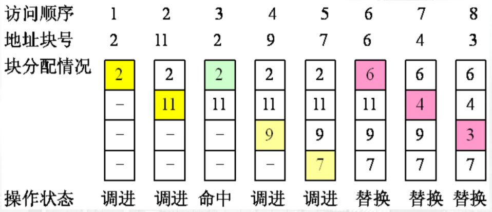

* 替换栈底元素

**FIFO的颠簸**

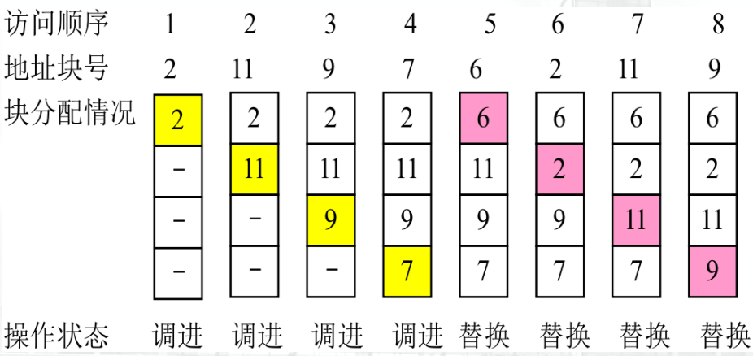

**LRU和FIFO的区别：FIFO命中后不会把栈底元素移到栈顶，LRU会**

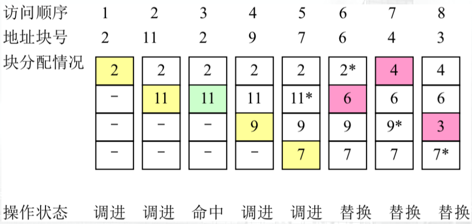

命中情况，参见OS中Page Fault即可

#### Cache/内存一致性

> 现在，知道了CPU通过Cache访问内存，那么读写过程中是不是会存在问题？读应该没啥问题，因为读Cache和读内存，东西几乎必定是一样的；但是写的过程中，CPU要通过Cache来修改内存，还是直接修改内存呢？这样就会有几种可能，CPU要么改了内存没改Cache、改了Cache没改内存、内存Cache都改了

**读：只读Cache，不读内存！**

**Write Back(写回法)：能写Cache，坚决不写内存**

* 如果我要修改的内存的地址，正好在Cache中有映射，那我就直接修改Cache，不动内存，等这个Cache在替换算法中要被踢出去时，才把Cache中的东西打到内存里
* 如果我要修改的内存的地址，在Cache中没有映射时，我要先将内存中对应的块替换到Cache中，然后像上面那个一样写，在这个新Cache变成要滚蛋的Cache时打回去
* CPU改完Cache后，要在这个块上打一个Dirty Bit，表示不干净哩，变成新形状了捏

**Write Through(全写法)：优先写内存**

* 如果我要修改的内存的地址，正好在Cache中有映射，那我就内存Cache同时写

* 如果我要修改的内存的地址，在Cache中没有映射时，那我就不写Cache，直接写内存

  > 如果是Cache内存一起写，那速度不一样，Cache蹭一下写完了，内存还没开始捏，咋办？
  >
  > 速度不够，Buffer来凑！
  >

  >
  > * 写内存的时候专门用一个Buffer来提高速度
  >
  > *但还有问题，谁把Buffer里的东西搬到内存中呢？*
  >
  > * 在内存上整一个控制器，把Buffer里的东西吸出来
  >
  > *但是，还有问题，我要是一下写太多，Buffer就爆了！*
  >
  > * 2级Cache就这么来的！
  >

  >
  >   但是2级Cache也要有个写策略：还是写回法！

#### Cache性能分析与优化

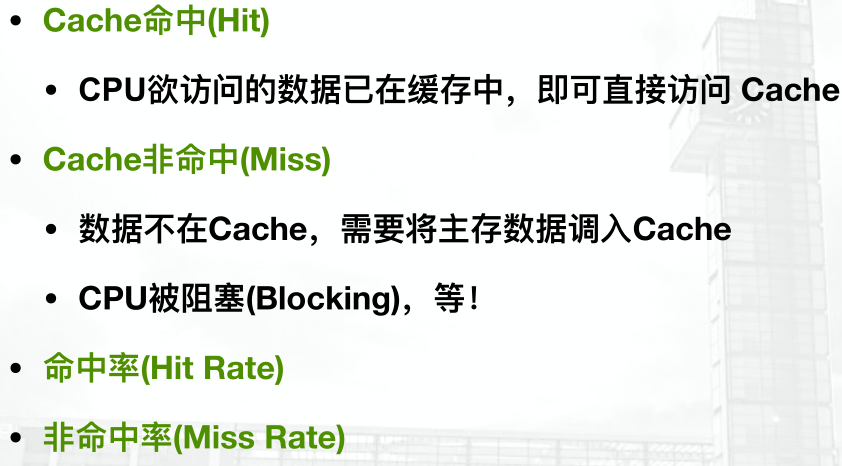

**为啥Cache会没命中呢？4C**

* Compulsory - 老天
  * 冷启动、过程转移、首次引用……不可避免的
* Capacity - 硬件
  * 容量不够
* Conflict - 算法
  * Cache块间冲突，解决：加容量、提升相联度
* Coherence(相关)
  * 其它操作带来的(比如I/O)


* 多路组相联能够明显降低Miss rate，1路的话需要把Cache size扩大2倍才能达到2路的水平

**加速比**

* CPU访问Cache一次的时间：Tc
* Cache访问MM一次的时间：Tm
* 产生缺块中断时，从MM中把数据替换到Cache中的时间：Tb
* Cache命中率：H

则，若命中了，需要的时间就是Tc；若没命中，需要替换回来再访问Cache，就是Tb + Tc

**由概率论公式，Cache的平均访问周期：**

> T = H * Tc + (1 - H) * (Tb + Tc) = **Tc + (1 - H) * Tb**

加速比(参考Amd定律)

> Sp = Told / Tnew(这里的T都是访问Cache的时间，Tnew也就是Tc)

例：设Cache的速度是主存的5倍，命中率为 95%，则采⽤Cache后性能提升多少?

> 设Cache的访问时间是t，则MM的访问时间5t
>
> 也就是
>
> * Tc = t
> * Tb = 5t = Told
> * Tm = 5t
>
> H = 0.95
>
> 则若Cache命中，访问时间为t
>
> 若Cache没命中，访问时间为t + 5t = 6t
>
> 则平均访问时间
>
> T = 0.95 * t + (1 - 0.95) * 6t = **t + 0.05 * 5t** = 1.25t
>
> Sp = Told / T = 5t / 1.25t = 4

**优化方案**

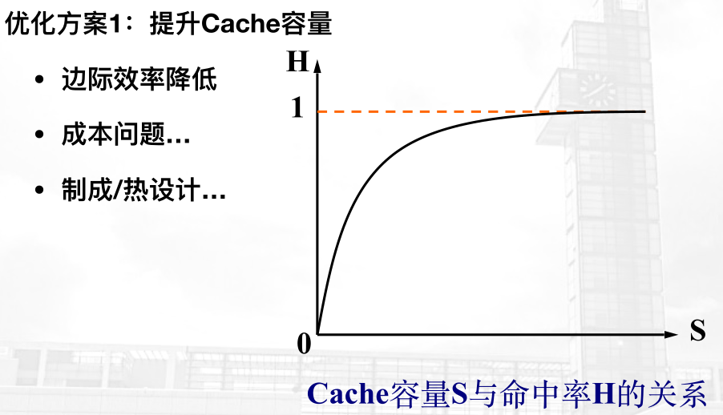

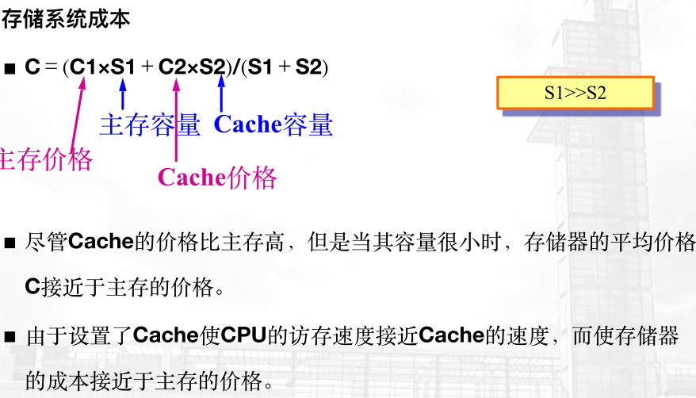

---


* 块大了，块数就少了，缺块中断更多了


---


---

**优化方案4：多级Cache**

总失效率 = 第一级失效率 * 第二级失效率 * ……

例：访问内存需50ns, L1 1ns 10%失效率，L2 5ns 1%失效率，L3 10ns 0.2%失效率，求L1， L1+L2, L1+L2+L3构架下的平均访问时间

> 利用上面的公式算：
>
> * L1
>
>   T = 1 + 10% * 50 = 6(ns)
>
>   ***问题：`90% * 1 + 10% * (1 + 50)`为啥不是`90% * 1 + 10% * (1 + 50 + 1)`呢？应该是1级Cache没命中，但也访问了，用了1，然后从MM中搬数据，用了50，最后访问1级Cache，用了1***
>
> * L1 + L2
>
>   T = 90% * 1 + (10% * 99%) * (1 + 5) + (10% * 1%) * (**50 + 5 + 1**) = 1.55(ns)
>
>   ~~***这里，CPU不能直接访问二级Cache，所以这个50+5+1代表：如果一二级Cache都没命中，要先从MM里搬到2级Cache是50，然后从二级Cache搬到一级Cache是5，CPU再访问一级Cache是1***~~
>
> * L1 + L2 + L3
>
>   T = 90% * 1 + (10% * 99%) * (1 + 5) + (10% * 1% * 99.8%) * (1 + 5 + 10) + (10% * 1% * 0.2%) * (50 + 10 + 5 + 1) = 1.5101
>   
> * 也可以使用递归的思想(1.5001是ppt里算错了)：
>
>   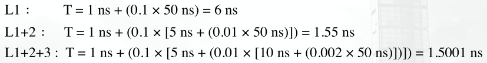

---

**优化方案5：多个Cache分工**

程序加载的时候，分为Code Segment, Stack Segment, Data Segment等，那么如果只有一个Cache，在执行的时候会在几个段中来回跳，这样性能就会下降，因此，**将Code，Data这些段分别用不同的Cache去存，这样性能就会提高**

例：有个32KB的Cache，miss rate = 1.99%，如果拆成16KB + 16KB的指令和数据Cache，它们的miss rate分别为0.64%，6.47%。现在假设一个程序75%是指令，25%是数据，Cache访问时间1，MM访问时间50，计算不拆和拆的平均访问时间

> 不拆：
>
> 75% * (1 + 1.99% * 50) + 25% * (1 + 1.99% * 50) = 1.995
>
> 拆：
>
> 75% * (1 + 0.64% * 50) + 25% * (1 + 6.47% * 50%) = 2.04875

---

**优化方案6：Victim Cache**

那些被踢出去的Cache块，叫做Victim Cache Block，那把这些块保存到Victim Cache中，因为毕竟这些块也是被用过的，总比那些一次没用过的重要一些。

> 早期的英特尔带核显的处理器，如果装了独显的情况下，会启用Victim Cache。这东西可以很大，达到一两百兆，而核显的显存也是一两百兆，如果插了独显，那这个核显的显存就没啥用了，因此用作Victim Cache，把那些被踢出去的Cache块收留起来

---

**优化方案7：代码**

**Row Major**

现在假设有一个二维数组

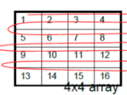

那根据**Why Cache**中说的，我在访问1的时候，就可能把234提前搬到Cache中了。那如果，我要是按着列去遍历数组，我访问完1，紧接着访问5，那这是Cache万万没想到的情况，之前提前做的那些都白干了，还得跳到5，然后由于他不长记性，又把678搬进来了，结果下次又用不到……

**循环合并**

现在有4个二维数组a, b, c, d，并且有如下代码

```c
for(int i = 0; i < N; i++){
    for(int j = 0; j < N; j++)
        a[i][j] = 1 / b[i][j] * c[i][j];
}
for(int i = 0; i < N; i++){
    for(int j = 0; j < N; j++)
        d[i][j] = a[i][j] + c[i][j];
}
```

那么，在第一次循环中，访问了a, b, c，然后第二次循环中，又访问了a, c, d，这样，a和c在两次都被访问了，那么，**很有可能在第一次循环后，a和c有很多部分都不在Cache里了，这样性能会很低。因此，把两个循环合并，在abc访问完之后紧接着访问acd，这样a和c在Cache里的概率就提高了**

```c
for(int i = 0; i < N; i++){
    for(int j = 0; j < N; j++){
        a[i][j] = 1 / b[i][j] * c[i][j];
        d[i][j] = a[i][j] + c[i][j];
        /*
        * 因为每次a生产出来后，就可以参与赋值d的操作了，
        * 这样写是没问题的
        */
    }
}
```

**分块运算**

两个大矩阵相乘(线性代数)，那这样算的时候有一个按列访问的，很有可能不在Cache里，因此分成一小块一小块来做，命中率更高

**其他**

Union

结构体和共用体的区别在于：结构体的各个成员会占用不同的内存，互相之间没有影响；而共用体的所有成员占用同一段内存，修改一个成员会影响其余所有成员。

结构体占用的内存大于等于所有成员占用的内存的总和（成员之间可能会存在缝隙），共用体占用的内存等于最长的成员占用的内存。共用体使用了内存覆盖技术，同一时刻只能保存一个成员的值，如果对新的成员赋值，就会把原来成员的值覆盖掉

如果有一个Struct，里面一个int一个long，而int4字节，long8字节，但是，Struct的size一定不是12，因为为了优化，不能严格的卡出4b8b这样紧密的排列，所以可能会在int之后补一个4b让他变成8b

**Spectre攻击技术**

如今的CPU，早就已经是乱序执行(OoO-E, Out of Order Execution)，而且会对接下来的指令进行预测

* 会执行if/switch/for的多个分支，同时！
* 但是这些执行完的结果，会临时存到CPU中，不会写回内存
* 当后面大部队确定哪条分支真的该被执行时，才把对的那个结果写会内存，**丢弃其他分支结果**

这样的操作，看起来很牛b，性能提升，但是……
如果有下面这种代码：

```c
int data = 0;
if(false){
    data = syscall(342, haha);
}
```

按理来说，if里面的句子是必定不会执行的。但是，就像之前说的那样，CPU会预测，那其实syscall这个函数真的被调用，而且已经算出返回值了，只不过不赋给data罢了。那，有没有啥办法能拿到这个数据呢？

有！

CPU访问内存是一定要经过Cache的，那么，既然syscall进行了调用 ，**那它操作的那块内存也一定进到了Cache中，既然进到了Cache中，那访问这个地方的速度一定要比其他地方快！**因此，我扫描一个巨大的数组，如果突然有个地方特别快，那这个东西就是我想要的

另外，VMware中也提到了Side channel攻击技术：

> **Symptoms**
>
> Virtual Machines that have side channel mitigations enabled while running on Fusion on Mac OS 11.0 or later or on Workstation on Windows hosts with virtualization based security enabled may run slowly.
>
> **Cause**
>
> <u>The root cause of the performance degradation is most likely due to mitigations for side channel attacks such as **`Spectre`** and **`Meltdown`**.</u> Side channel attacks allow unauthorized read access by malicious processes or virtual machines to the contents of protected kernel or host memory. CPU vendors have introduced a number of features to protect data against this class of attacks such as indirect branch prediction barriers, single thread indirect branch predictor mode, indirect branch restricted speculation mode and L1 data cache flushing. While these features are effective at preventing side channel attacks they can cause noticeable performance degradation in some cases.
>
> 


### 虚拟内存

见：操作系统

补充

**段式**


**怎么找到某一个进程的段表或者页表？**

根据用户号

**VM加速**

目前虚拟内存的问题

1. 地址的转换，计算非常频繁
2. 页表访问频繁，而页表还不在Cache里，因为页表一般都远超Cache的容量，因此需要频繁从内存中读出页表加载到Cache里，这样一来，Cache本来指令和数据的位置就被抢了
3. 如果一个超级超级大的程序，页表也超级超级大，内存都放不下了，可能直接要用硬盘来救场


---

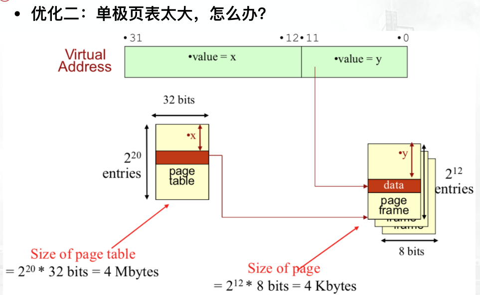

---

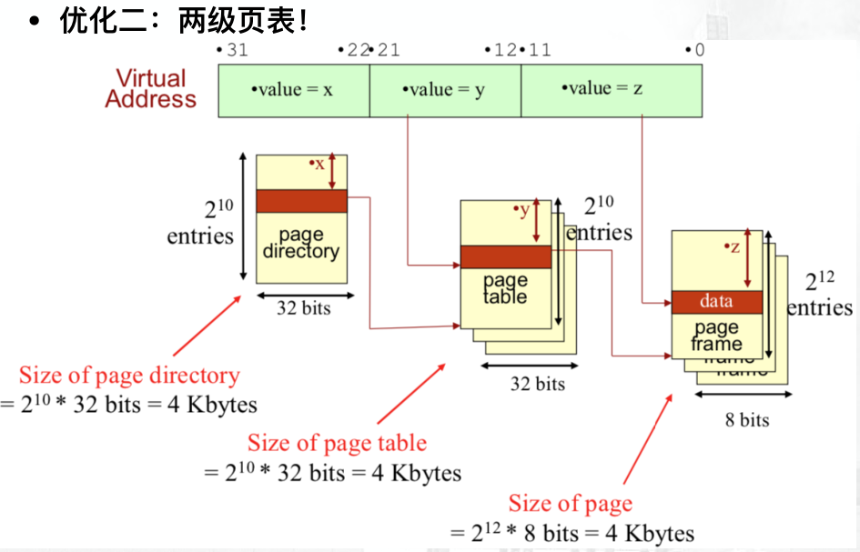

---


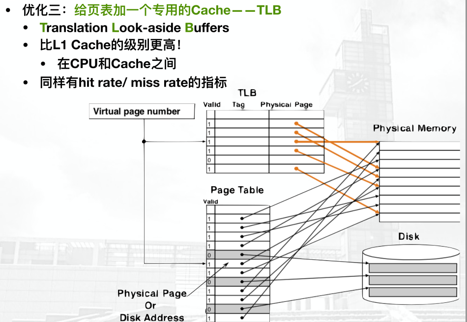


---

CPU在VM下最终访问的模式

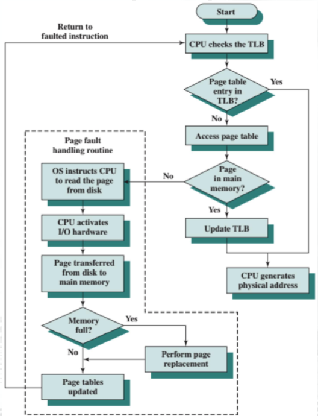

## 指令系统

### Overview

**计算一个乘法，需要多少步？**

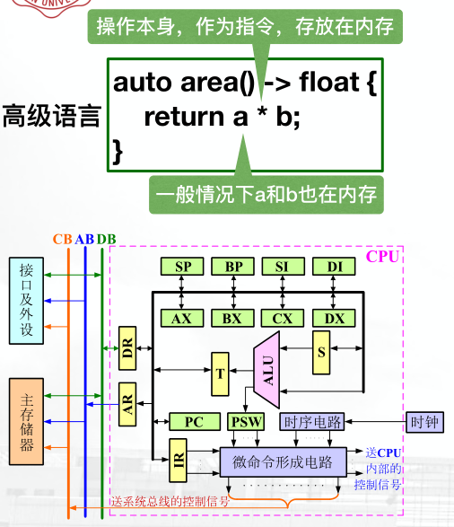

1. 从PC所指的内存中取出当前指令
2. **识别这个指令，发现是个乘法，要两个操作数** -> **指令格式和编码**
3. 从&a处把a取出来，放到ALU输入寄存器S
4. **从&b处把b取出来，放在一个离着ALU挺近的寄存器，比如AX** -> **操作数的取值取址**
5. 把AX里的b送到ALU里
6. **ALU计算乘法，把结果放到临时寄存器T** -> **8086指令系统**
7. 把T里的结果塞到其他寄存器里
8. **结束函数，返回** -> **汇编程序设计**

从上面看出，一条指令执行的**4个步骤**

* 取指令
* 译码(识别出这条指令是要干什么)
* 执行
* 存储，写回

### 指令格式

> 指令 = 操作码(opcode) + 操作数(oprand)(0个，1个...)

* 操作数也叫做地址码
* 地址码可以是地址，寄存器的编号，数值

例：计算x = (a * b + c - d) / (e + f)，写出三地址汇编指令

```assembly
MUL X, A, B			;X = A * B
ADD X, X, C			;X = X + C
SUB X, X, D			;X = X - D
ADD Y, E, F			;Y = E + F
DIV X, X, Y			;X = X / Y
```

如果用两地址程序

```assembly
MOVE X, A 			;复制临时变量到X中
MUL X, B
ADD X, C
SUB X, D 			;X中存放分⼦运算结果
MOVE Y, E 			;复制临时变量到Y中
ADD Y, F 			;Y中存放分⺟运算结果
DIV X, Y 			;最后结果在X单元中
```

如果用一地址

```assembly
LOAD E 				;先计算分⺟，
				    ;取⼀个操作数到累加器中
ADD F 				;分⺟运算结果在累加器中
STORE X 			;保存分⺟运算结果到X中
LOAD A 				;开始计算分⼦
MUL B
ADD C
SUB D 				;累加器中是分⼦运算结果
DIV X 				;最后运算结果在累加器中
STORE X 			;保存最后运算结果到X中
```

如果用零地址

```assembly
PUSH A 				;操作数a压⼊堆栈
PUSH B 				;操作数b压⼊堆栈
MUL 				;栈顶两数相乘,结果压回堆顶
PUSH C
ADD
PUSH D
SUB 				;栈顶是分⼦运算的结果
PUSH E
PUSH F
ADD
DIV 				;栈顶是最后运算的结果
POP X 				;保存最后运算结果
```

### 指令编码

对于上面说的这些指令格式，咋让它编的整齐，好搜索呢？

指令的长度，在不同的CPU，内存下都会有差别，而且和寻址方式，指令的数量也有关系

#### 定长指令

* 所有的指令，**不管有几个操作数，opcode都一样长**，注意只是opcode
* 显然，会有指令bit浪费，或者指令容量受限

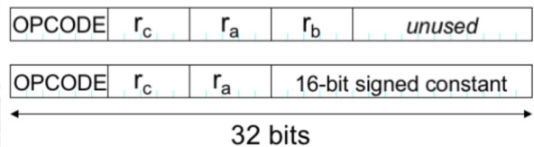

#### Huffman

* 让用的更多的指令的opcode更短

**缺点**

* 长度不规整，译码困难
* 和地址码组成固定长的指令比较困难
* 指令一定是固定的长度，才比较好搜索。有些指令(比如return)不需要操作数，那弄那么断干嘛？
* 有些指令可能用的特别少，Huffman就会给它编很长，但是如果这个指令又需要很多个操作数，那总的指令就会更长

#### 扩展指令编码

* 让操作数多的指令opcode更短
* 让操作数少的指令opcode更长

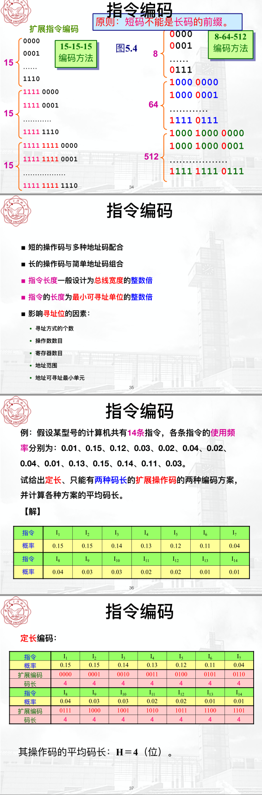

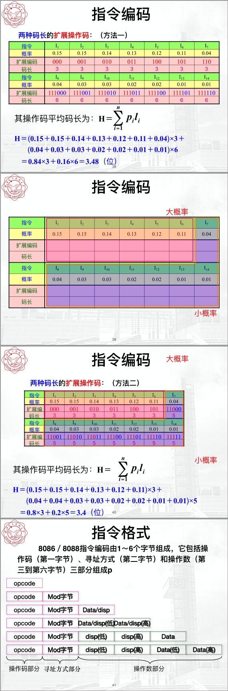

### 可执行程序

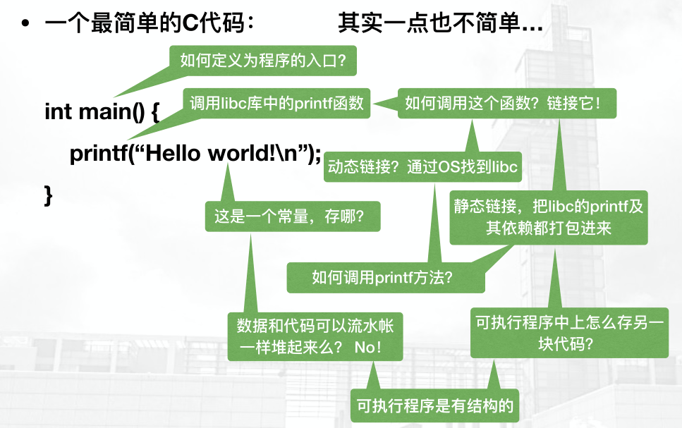

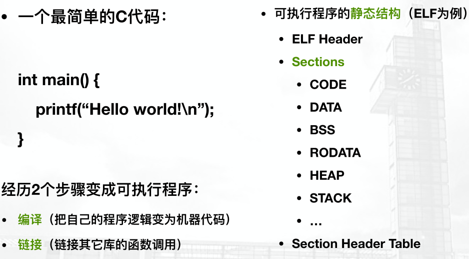

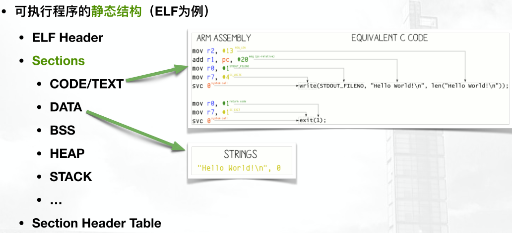

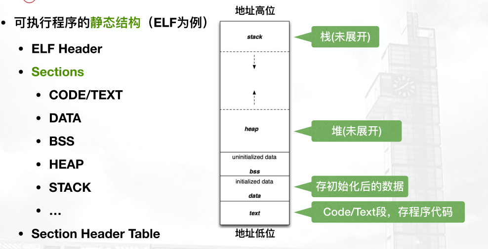

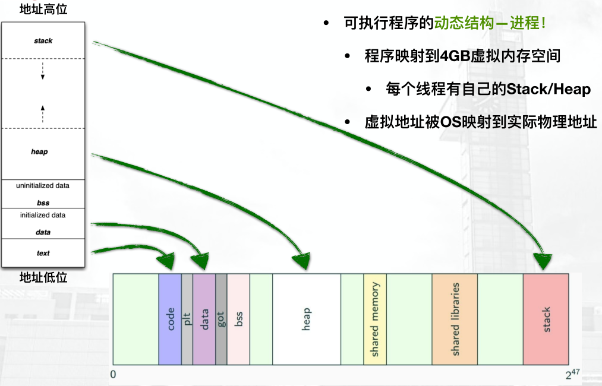

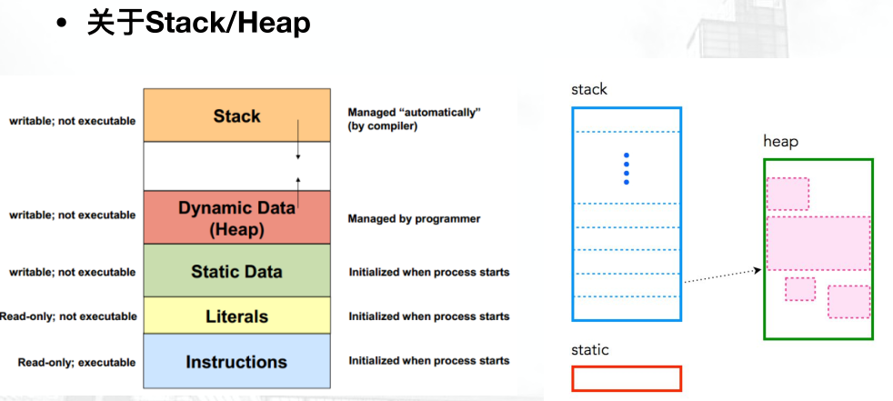

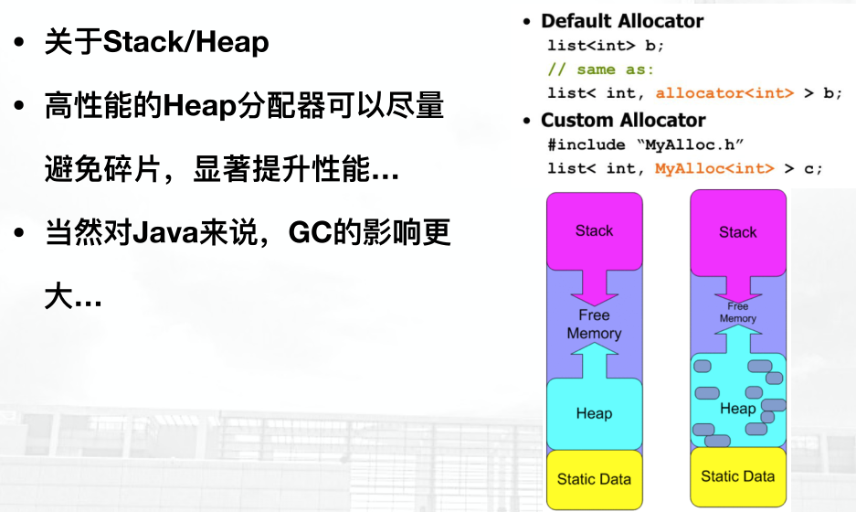

* Stack：一般放一些长度已知的静态变量(int)，在程序结束之后就回收了
* Heap：分配的内存(malloc, new)
* 比如我`String a = new String();` 那么这个a是在Stack中，而a这个引用指向的空间在Heap中

### CPU内部寄存器

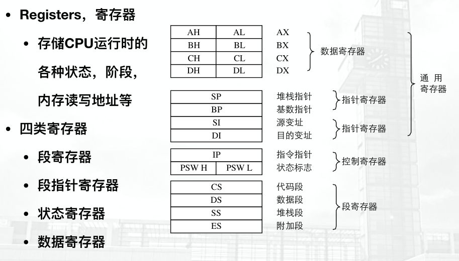

**数据寄存器-算数**

* AX(能用AX搞定尽量用AX，少用下面的)
* BX
* CX
* DX

**指针寄存器-告诉各种段在哪儿**

* SP - 堆栈指针
* BP - 基数指针，存放整个程序的起始地址，为了整个程序的平移
* SI - 源变址，src
* DI - 目的变址，dst

**控制寄存器-程序执行**

* IP - Program Counter，指向下一条执行的指令

* PSW - 状态标志，有没有错误，有没有溢出，有没有进位等

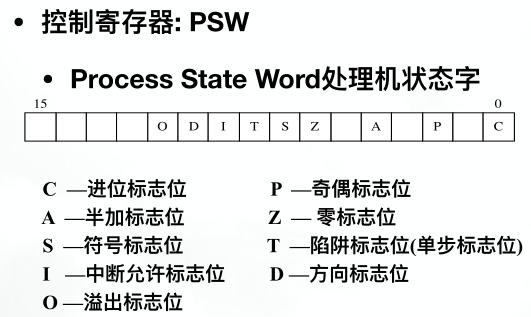

**段寄存器**

* CS - 代码段
* DS - 数据段
* SS - 堆栈段
* ES - 附加段

**8086物理地址计算**

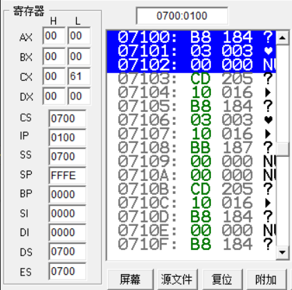

> 这个07100是咋算出来的呢？首先这些数都是16进制，然后，CS的地址是0700，IP的地址是0100，在8086CPU中，只有16根地址线，理论上只能访问2^16 = 64KB内存，但是实际上能访问2^20 = 1MB内存，这是为什么？就是因为它实际的物理地址是由`段地址<<4 + 偏移量`算出来的，而二进制的段地址左移四位就是16进制的*16也就是加上个0，然后再加上偏移量。

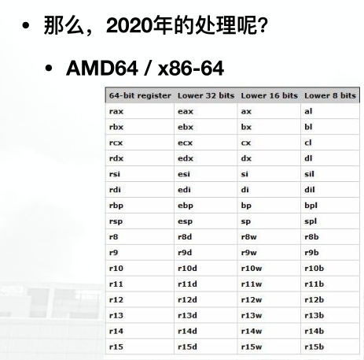

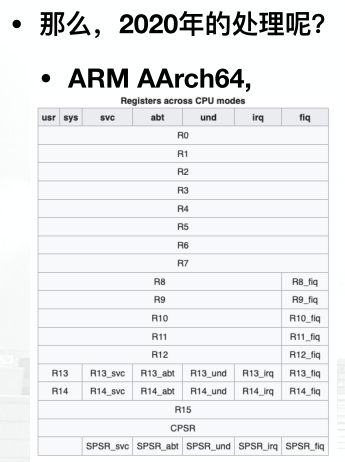

#### 操作数寻址-怎么找数

**MOV**

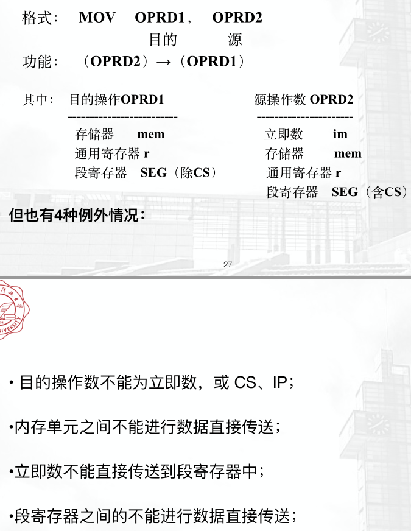

立即数不能直接传到段寄存器

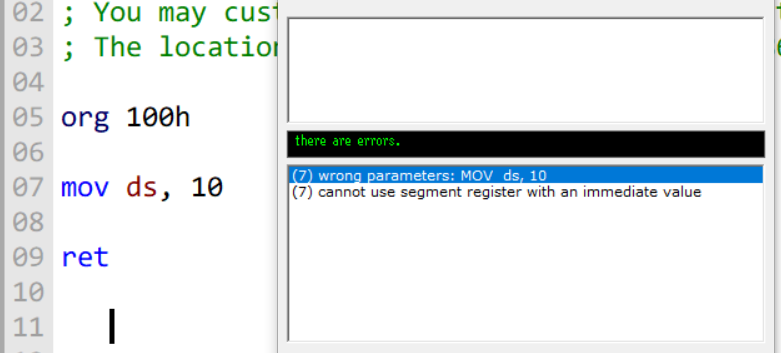

* 立即数就是常量
* oprand直接包含在指令中，叫做立即数，比如上图的10，那CPU拿到这条指令，立马就能得到10，不用再去地址里找10了

以下的代码

`mov ax, [2000H]`

说的是，**从数据段开始偏移2000h的位置拿到的数**

一个例子

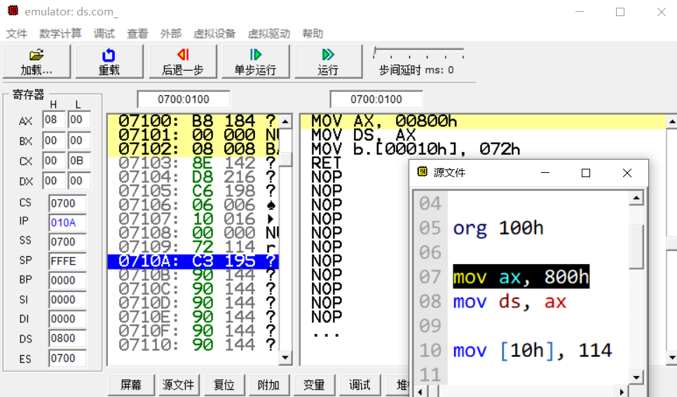

* 这是把800h送到ax中，然后再把ax里的值赋值给ds(数据段)
* 那么，`mov [10h], 114`就是把114写到从ds段起始位置偏移10h的量
* 具体怎么算呢？ds不是800h吗，那段地址*16 + 偏移就是最终物理地址，也就是8010h

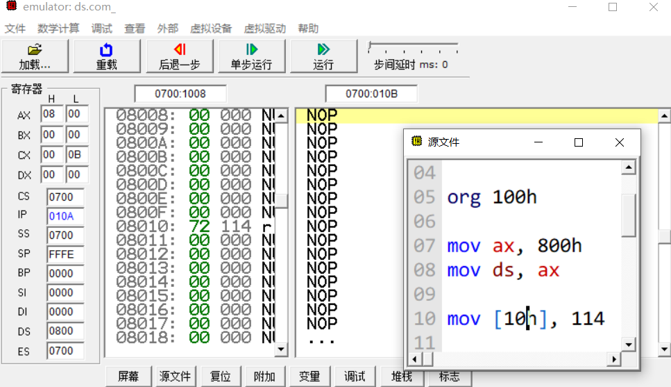

* 最终在08010位置找到写入的114

然后，再加一句`mov bx, [10h]`，就把那个位置的114又写到了bx中

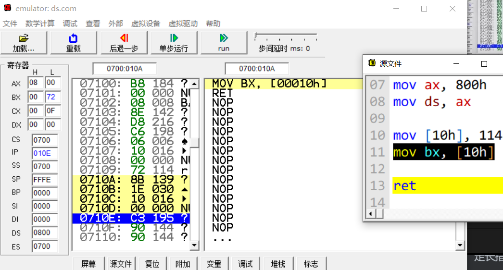

> 以上，说的寻址方式。就是说，如果CPU想要找一个数，到底该去哪个地址找？如果是立即数，那就是不用找，指令里就有；如果是带括号[]的，那就是从ds的括号里面偏移量的地址空间去找数。由此发现，这些都是直接给地址(给立即数也相当于直接给了个地址，就在当前指令里嘛~)，所以这种方法叫做直接寻址。指令有`mov ax, 1`和`mov bx, [10h]`这种。然后，就是寄存器寻址，不是通过直接给的数去找数，而是通过寄存器里的数找数，说白了就是比直接寻址多了个从寄存器里取数的操作。具体指令就比如`mov ax 800h; mov ds, ax`

接下来，是寄存器的间接寻址，**就是比寄存器寻址多了一步从其他地方取出地址的操作**

上面那个例子

```assembly
mov [10h], 114
mov bx, [10h]
```

我把114写到的位置还是一个实际的数，那这个数可不可以用一个寄存器存起来呢？可以！这就是寄存器的间接寻址，使用SI/DI/BP/BX寄存器，可以存这些**偏移量**

```assembly
mov si, 10h
mov [si], 114
mov bx, [si]
```

这样能达到和上面一样的效果

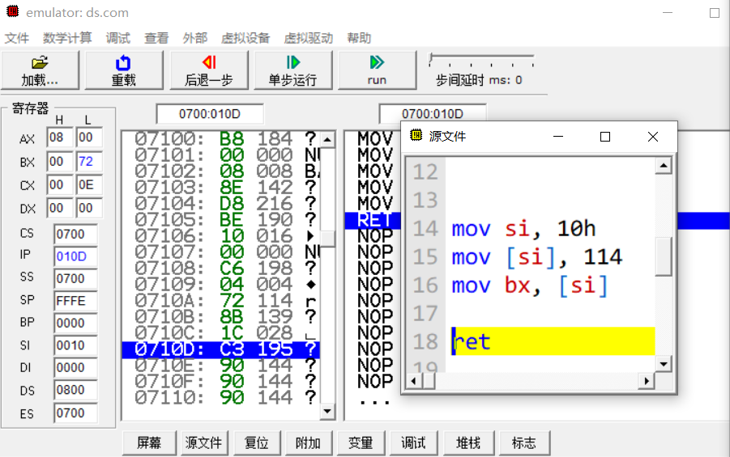

> 其中
>
> * SI/DI/BX - 是搭配ds使用的(存数据段偏移量)
> * BP - 搭配ss在堆栈段找操作数(存堆栈段偏移量)

例：假设有指令：MOV BX,[DI]，在执⾏时，(DS)=1000H，(DI)=2345H，存储单元12345H的内容是4354H。问执行指令后，BX的值是什么？

> ds = 1000h，那*16加上偏移量就是物理地址，也就是
>
> 10000 + 2345 = 12345h位置，取出这里的内容，题里给了是4354h，那bx的值就是4354h

这个寄存器间接寻址还可以有骚操作

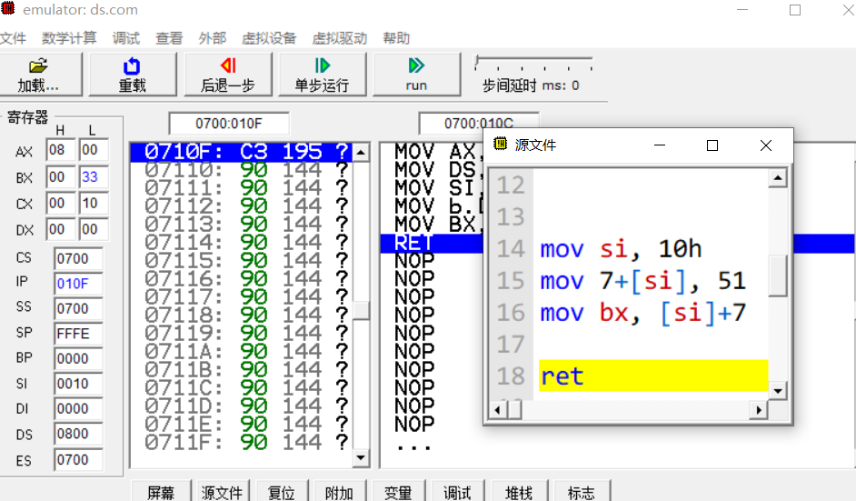

* 这个si上还可以接着偏

在偏移的位置可以找到写进去的51

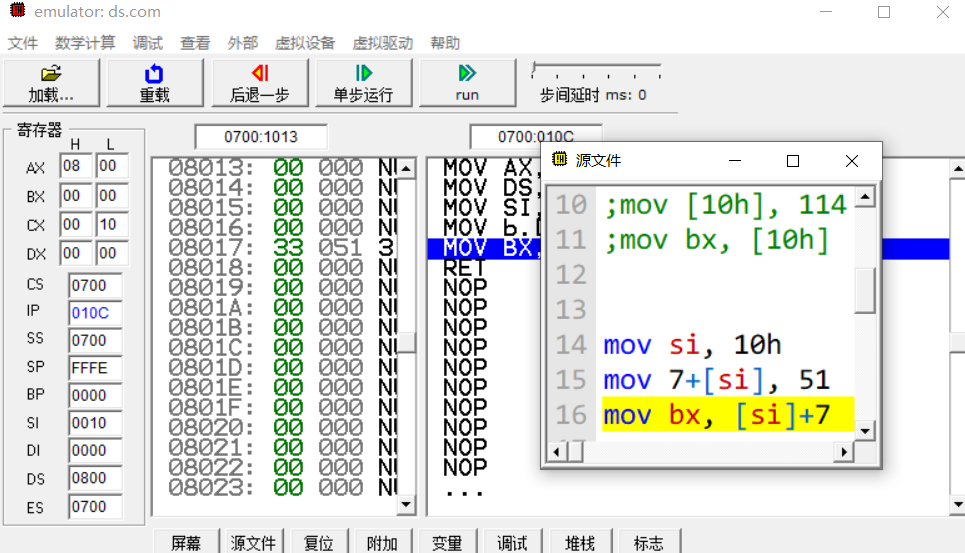

例：假设指令：MOV BX, [SI+100H]，在执行它时，(DS)=1000H，(SI)=2345H，内存单元12445H的内容为2715H，问该指令执⾏后，BX的值是什么？

> SI + 100h = 2445h
>
> 然后这个偏移量是由1000h开始偏，所以
>
> 10000h + 2445h = 12445h
>
> 所以把2715h传给bx

#### 指令寻址-指令咋找

**默认寻址**

IP指针始终指向下一行指令

* 不是按字节递增，是看当前这条指令有多长

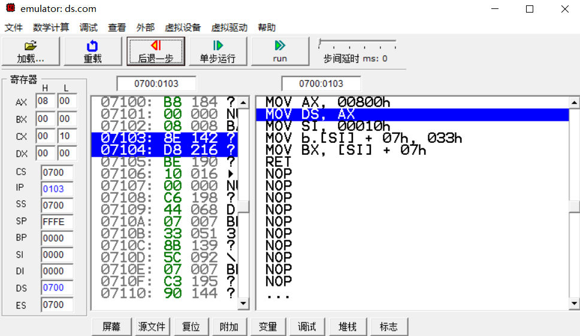

  > 下一条IP会指向0105

**段内直接寻址**

就像c语言里的goto语句一样

```assembly
mov ax, 10
mov bx, 1

haha: add ax, bx

loop haha
```

那么执行到loop的时候，会调回到haha标签处，实现了循环，每次都把ax里的值加上bx里的值

~~*问题：这个程序在emu8086上不能一直循环，因为执行的时候还有一个cx，在不断递减，当递减到0的时候，会跳出循环，就像下图这样。为什么会有这个cx?*~~

> 答案：因为上面说错了，主要是loop和jmp的区别：
>
> jmp是无条件跳转，loop会有一个循环控制变量，这里就是cx，那如果把上面程序中loop换成jmp，就能无限循环下去了。
>
> 另外，介绍一下汇编翻译这个haha标签的原理
>
> 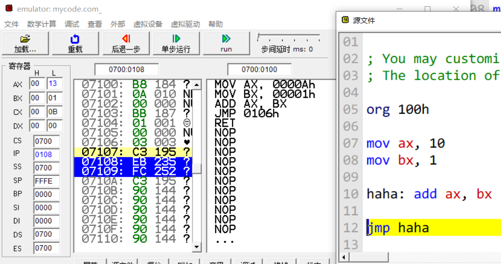
>
> * jmp haha，在汇编中会翻译成实际的地址，也就是106h

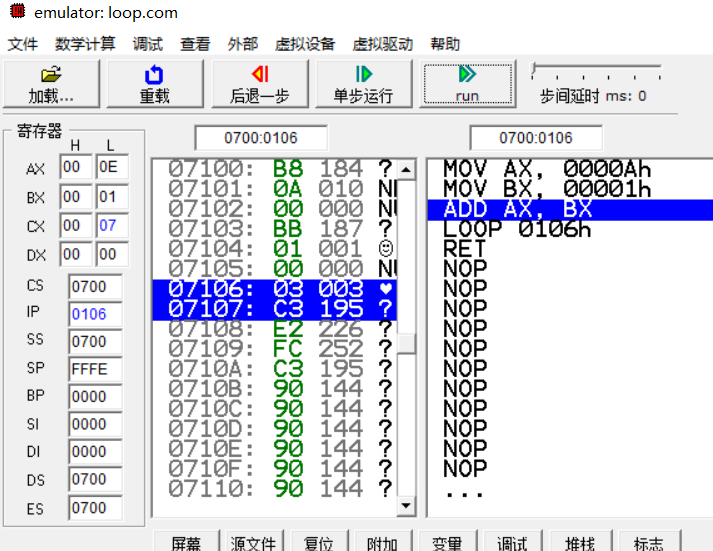

**介绍段内间接寻址前，先看看exe模板**

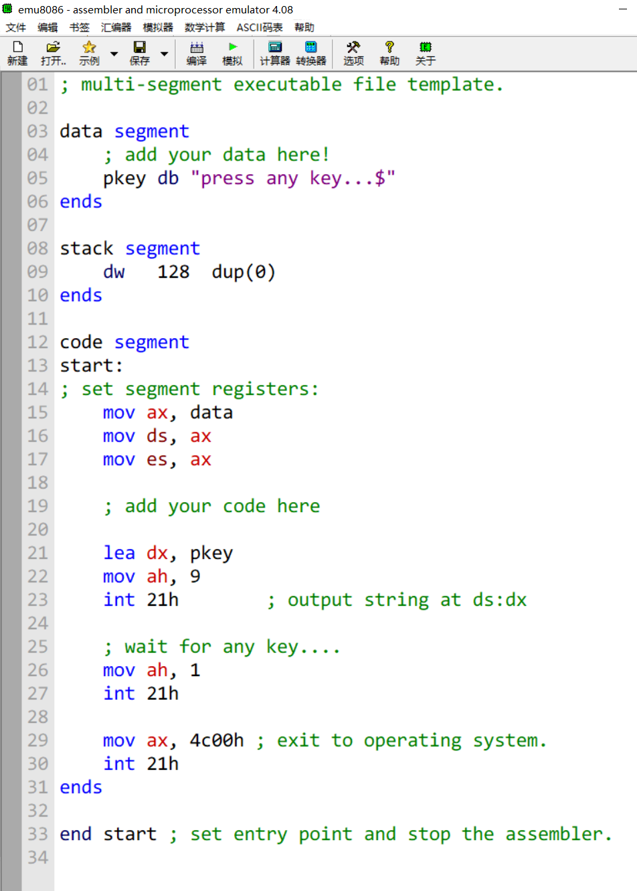

> 首先，开始分段了，那么从哪里开始呢？汇编这一点设计的很奇葩，是用`end`来表示从哪儿开始。那个end start表示从start开始，而前面就有start:的标记。这个就是和c语言的main函数比较像
>
> 另外，这个程序是怎么知道是在code段开始运行呢？可以做一个实验：把code改一个名字，比如code1，这样的话，这个程序一运行就会从第一行开始，也就是把data段里的东西当成一个指令去运行，那这样肯定就崩了。
>
> 再看code段之中的一些东西：在`; add your code here`之前，有几句话，他们就是为程序执行做一些准备工作的。首先，将data段的地址存在ax中，然后再将这个地址分别存在ds，es中。这样的话，ds就保存了data段的起始地址

**com和exe的区别**

以前，是有一种可执行文件叫`xxx.com`的，这种文件的特点就是甭管什么东西，全都堆在一个段里，只有一个段。那这种特性就导致了它的大小是有上限的。那上限是多少呢？取决于8086的最大偏移量。之前介绍的，8086的物理地址是由段地址 << 4 + 偏移量得到的，那有没有想过，那个段地址，偏移量都是在哪儿得到的？答案是：都是从地址线。那地址线有16根，**也就决定了段的起始地址和偏移量都是16位的**。就像`emu8086`截图中，那个上面的框里，比如`0700:0100`就分别是段地址和偏移量的16位表示。8086这样的分配其实是有缺陷的。比如会超出20位的表达(段地址和偏移量都是`ffffh`)，也有可能会在一个段中跳到另一个段。至于是怎么解决 的这里不提，只要记住.com文件的最大就是`64k`(一个段的大小)即可

> *问题：那么这种设计方式，是不是要走地址线两次才能得到一个物理地址呢？*

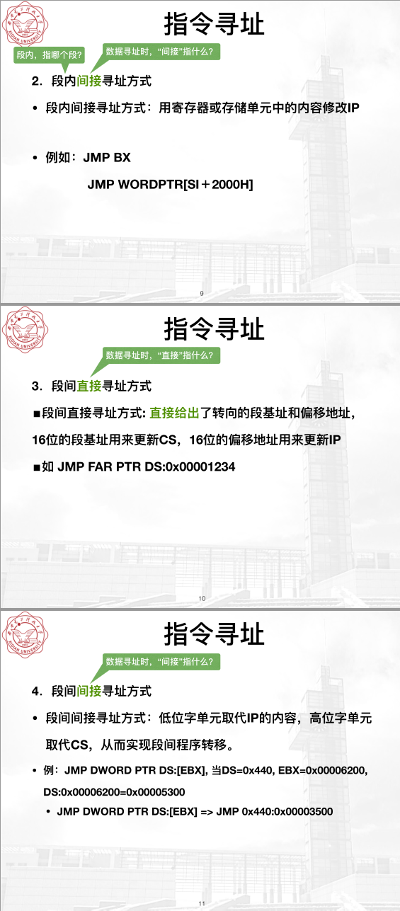

#### 8086指令系统

其实就是讲汇编

首先，把默认的exe模板修改一下

```assembly
; multi-segment executable file template.

data segment
    ; add your data here!
    pkey db "press any key...$"
ends

stack segment
    dw   128  dup(0)
ends

code segment
start:
; set segment registers:
    mov ax, data
    mov ds, ax
    mov es, ax

    ; 在这儿先把3放到si里
    mov si, 3        
    lea dx, pkey[si]	; 然后在pkey后面加上偏移量
    mov ah, 9
    int 21h        ; output string at ds:dx
    
    ; wait for any key....    
    mov ah, 1
    int 21h
    
    mov ax, 4c00h ; exit to operating system.
    int 21h    
ends

end start ; set entry point and stop the assembler.

```

执行的结果是这样的

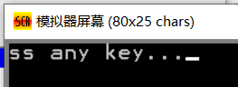

也就是相当于从pkey的第3号开始读取(本来是从0号)

我们看一下它翻译的汇编是什么样的

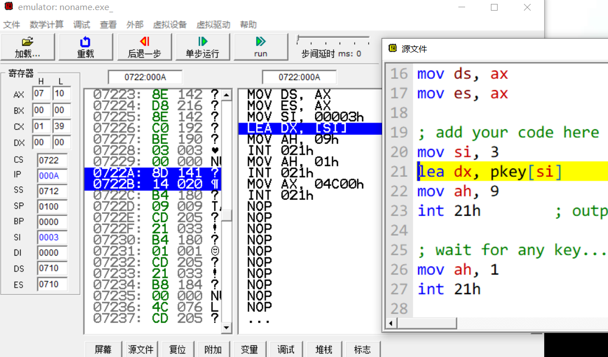

> 可以看到，翻译的结果是`LEA DX, [SI]`，就是从数据段偏移si个单位后的值，这和之前说的一样

现在再来一个实验：在数据段的代码上再加个定义

```assembly
...
data segment
    ; add your data here!
    haha db "hehe$"
    pkey db "press any key...$"
ends
...
```

> 多了一个hehe，会怎么样呢？看看结果

发现，最终的结果运行一样，但是翻译的汇编代码发生了变化

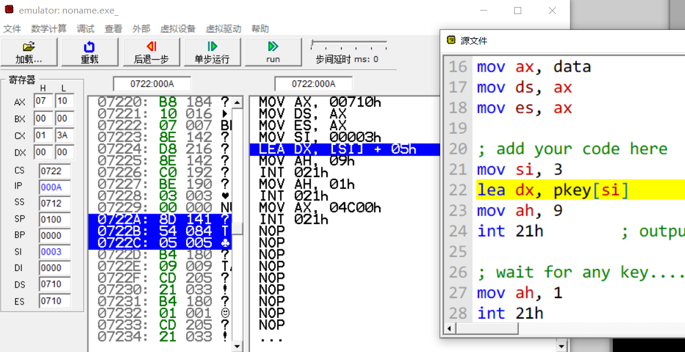

> 联想一下c语言的数组，聪明的你一定能发现规律的！这里只留下一个问题：*为什么有时候后面没有+xxh这种，有时候有呢？*

下面一个例子

```assembly
; multi-segment executable file template.

data segment
    ; add your data here!
    pkey db "press any key...$"
ends

stack segment
    dw   128  dup(0)
ends

code segment
start:
; set segment registers:
    mov ax, data
    mov ds, ax
    mov es, ax
    
    ; add your code here
            
    mov al, pkey
ends

end start ; set entry point and stop the assembler.
```

这里只干一件事：把pkey挪到al中，首先要注意：pkey是8bit，而ax是16bit的，所以不能这样写，只能赋值给ax中的al或者ah。

看一下编译后的汇编代码

`MOV AL, [00000h]`

这是什么意思呢？就像上面的例子一样，pkey是ds中的第一个，所以是起始位置，偏移量就是0，将其中所存的东西赋值给al，那结果是什么呢？

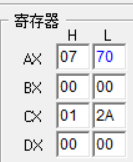

可以看到，ax变成了0770，那是为什么呢？看一下变量窗口

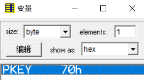|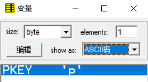

这样就能得到结论：是把第一个字节里的ascii码的16进制存到了al中

然后，在这个例子下面再加一句`lea ax, pkey`并执行，结果是这样的

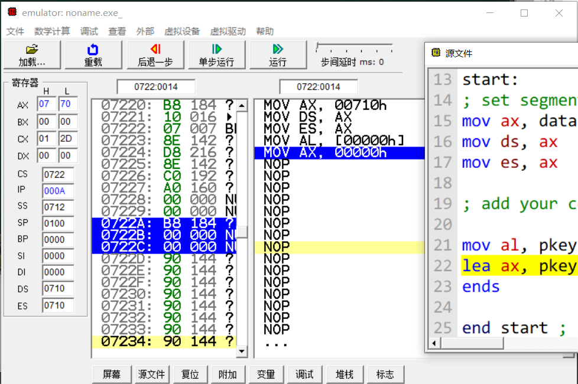

比较这两行代码的区别，可以看出，一个是加载那块地址里的值，另一个是直接把这个地址当成一个数赋值。那很显然我们已经能猜到ax在执行完lea后的结果了，一定是

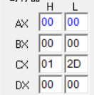

> lea: Load Effective Address，加载的是有效地址

那么再一个实验，像刚才一样在数据段加一个haha，结果是什么样呢？

……

然后是堆栈的操作

```assembly
org 100h

; 设置栈段起始地址
mov ax, 8000h
mov ss, ax

; 设置栈顶指针(这个栈顶端距离8000h的偏移量)
; 这里是8000h : 2000h
mov sp, 2000h

; 设置一个用来往里压的数，另一个就现成的ax
mov dx, 3e4ah

push dx
push ax

ret
```

这段代码的执行结果

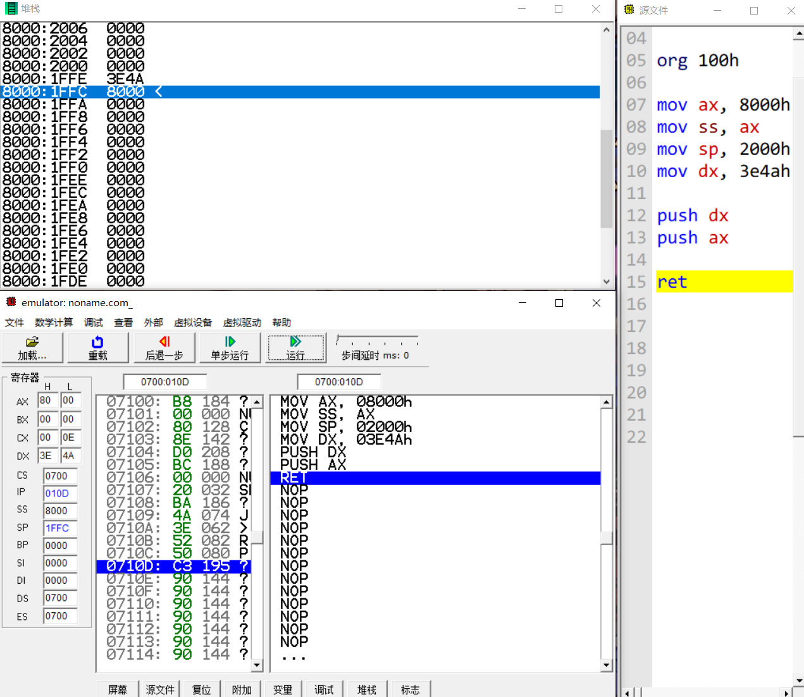

* 栈顶指针是2000，那压进来的东西都在2000的后面
* **高地址是栈底，低地址是栈顶(操作系统也提到过)**
* 每一个地址之间都是差2，即2000 - 2 = 1ffe；1ffe - 2 = 1ffc……

为了补充说明第二点，再加上一个操作

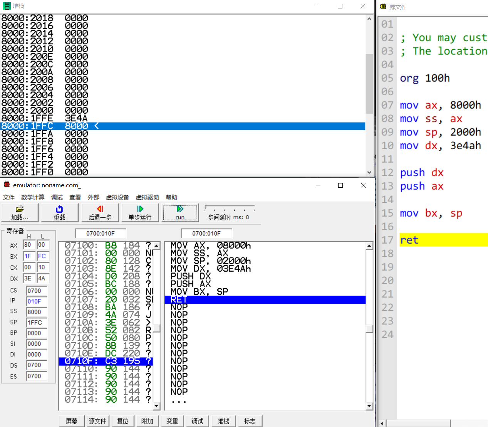

> 可以看到，bx变成了1ffc，也就是栈顶指针，那么也就是说，sp会随着压栈和弹栈而改变，并且如果有元素的话，始终指向最上面那个元素

然后是出栈

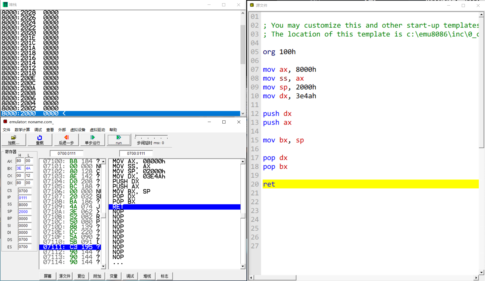

> 执行完之后，发现栈清空，dx和bx分别变成了之前的8000和3e4a

然后是运算，这里只举加法的例子

```assembly
mov ax, 5			; AX = 00 0E
mov bx, 7			; BX = 00 07

add ax, bx			; AX = 00 0C
add ax, 3			; AX = 00 0F

add ax, 0xffff		; AX = 00 0E

adc bx, 1			; BX = 00 09
```

* 在加0xffff时，会发现溢出，而000f + ffff = 1000e，因此只会保留最后的000e

* `adc`表示Add with carry flag，观察标志寄存器会发现，在`add ax, 0xffff`执行完后，会有如下情况

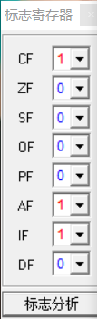

  因此后面的`adc bx, 1`会将bx，1，cf的值加到一起后赋给bx

* 注意，cf的值只是在溢出后的一条**运算**指令内会是1，之后又会清零，所以要趁早使用adc

> **加法指令**
>
> * ADD OPRD1，OPRD2 ;(add)
>   功能： （OPRD1）＋（OPRD2）→ (OPRD1)
> * ADC OPRD1，OPRD2 ;(add with carry)
>   功能： （OPRD1）＋（OPRD2）＋CF → (OPRD1)
> * INC OPRD ;(increment)
>   功能： （OPRD）＋1 → (OPRD)
>
> **运算标志位**
>
> 1. 进位标志CF(Carry Flag)
> 2. 奇偶标志PF(Parity Flag)
> 3. 辅助进位标志AF(Auxiliary Carry Flag)
> 4. 零标志ZF(Zero Flag)
> 5. 符号标志SF(Sign Flag)
> 6. 溢出标志OF(Overflow Flag)
>
> **状态控制标志位**
>
> 1. 追踪标志TF(Trap Flag)
> 2. 中断允许标志IF(Interrupt-enable Flag)
> 3. 方向标志DF(Direction Flag)
>
> **减法指令**
>
> * SUB OPRD1，OPRD2 ;(减！)
>   功能： （OPRD1）-（OPRD2）→（OPRD1）
> * SBB OPRD1，OPRD2 ;(借位减！)
>   功能： （OPRD1）-（OPRD2）- CF →(OPRD1)
> * DEC OPRD ;(⾃减！)
>   功能： （OPRD）-1 → (OPRD)
> * NEG OPRD ;(negate) 取补指令
>   功能： FFFFH -（OPRD）+1 → (OPRD)
> * CMP OPRD1，OPRD2 ;(compare) ⽐较指令
>   功能： （OPRD1）-（OPRD2）
>
> 其他就上图了嗷
>
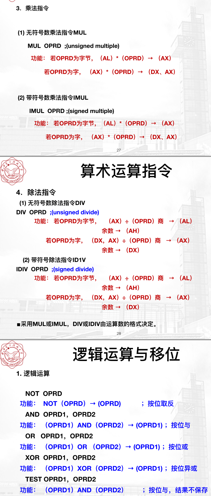
>
> 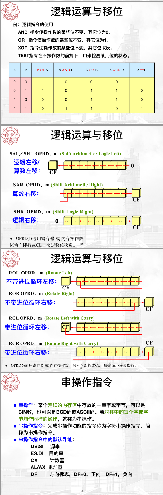
>
> 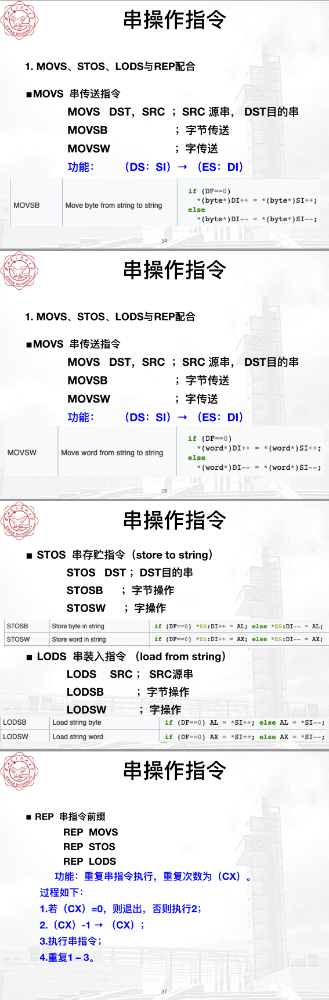
>
> 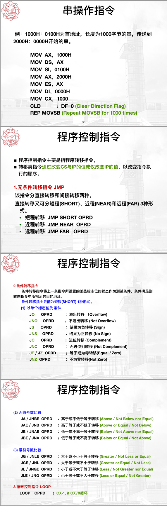

## CPU设计

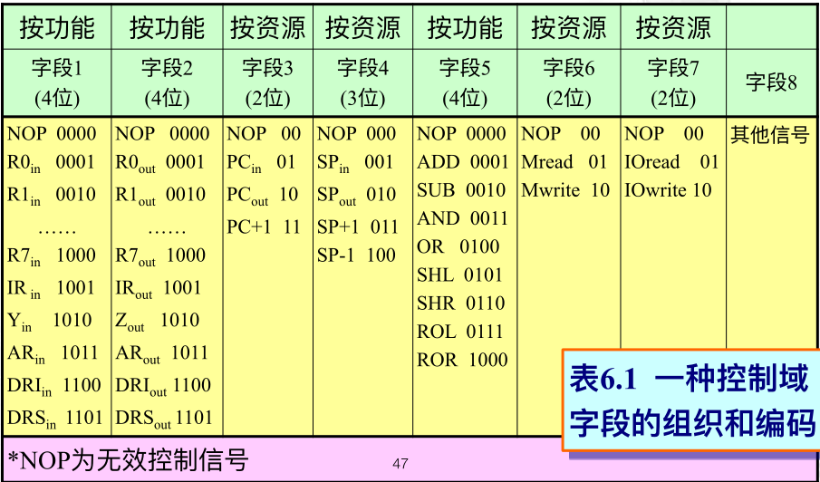

* 所有的组件不能同时in/out，所以编在同一个字段里(字段1, 2)
* 同一个组件的不同功能也是互斥的，编在同一个字段里(字段3, 4)
* ALU的不同功能也是互斥(不能又加又减)，编在同一个字段里(字段5)
* NOP: 啥活都不干

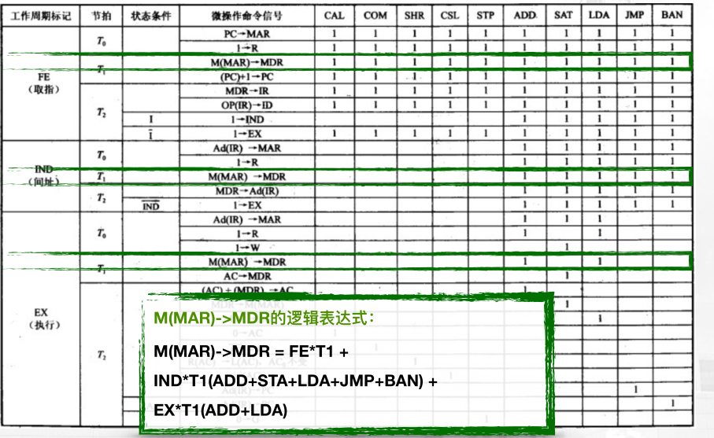

* `M(MAR)->MDR`就是T1时刻执行，只不过是3种不同的T1

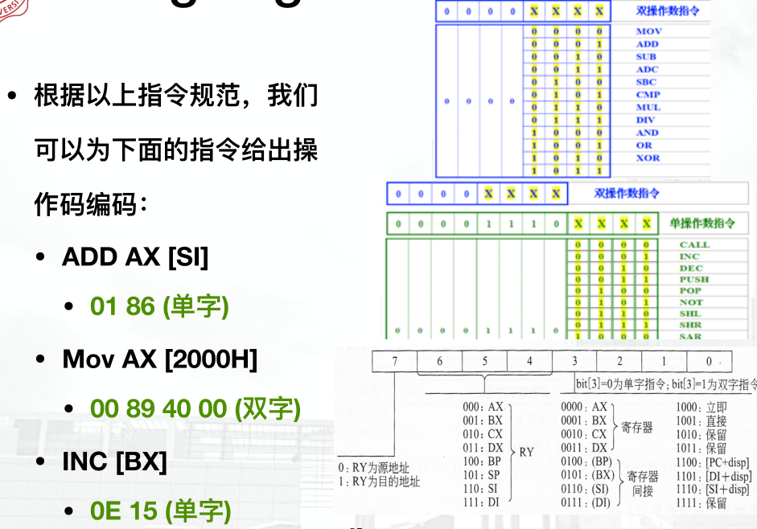

* `ADD`是0000 0001；然后`AX`是目的地址，所以是1000；`[SI]`是0110；拼在一起就是0186H
* `MOV`是0000 0000；AX是目的地址，1000；**`[2000H]`是直接寻址，所以是1001**；拼在一起是0089H，然后再拼上最后的2000H就是结果：00 89 20 00(PPT里错了)
* `INC`是0000 1110 0001；**`[BX]`是寄存器间接寻址，所以是0101**；拼在一起是0E15H

**冯诺依曼体系**

* 运算，存储，控制，输入，输出

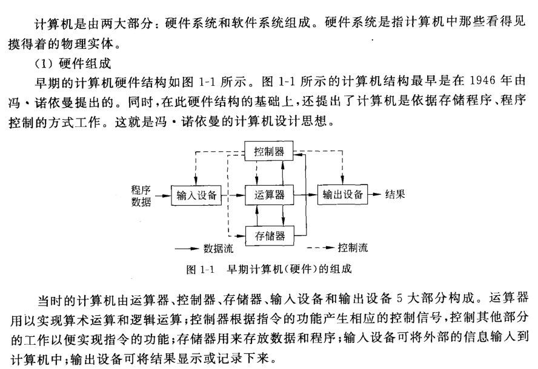

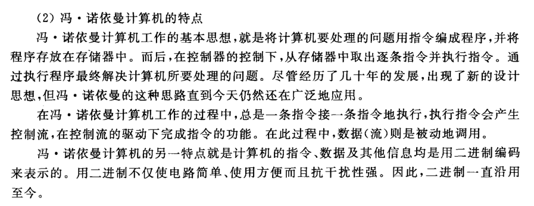

  题

  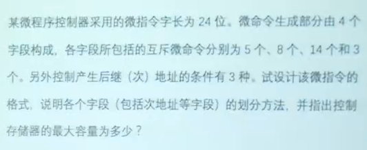

  * **每坨互斥的微指令都要加上`NOP`，所以是6,9,15,4**，然后根据二进制，各需要3,4,4,2个bit
  * 然后需要产生的次地址是3种，`AC(次地址)`段需要2bit
  * 用24全部减掉，剩下9bit留给地址
  * 那么`AC + 地址 + 控制微指令`就一共是24bit了
  * 最大容量是指`地址`段的所有情况，是2^9byte = 0.5kb
