<h1>Database System Concepts</h1>

# 1. Introduction

Database-management system(DBMS): a collection of interrelated data and a set of programs to access the data.

Database: a collection of data, contains information relevant to an enterprise.

数据库管理的数据通常是这样的：

* 非常重要
* 非常多
* 经常被很多用户或者进程同时访问

## 1.1 File-processing System

以前用的老数据库通常都是一个文件，叫file-processing system。这样的方式有很多缺点：

* Data redundancy and inconsistency

  比如一个学生的主修课有数学和音乐，而其他的信息比如学号年龄啥的都是一样的。即使这样这个学生的信息也要被复制成两份文件。这样就会显得很冗余；另外如果想要修改数据，很有可能只改了一份，这样还会产生不一致的问题。

* Difficulty in accessing data

  如果辅导员想要调出所有学计算机学生的名单，这样的结构是办不到的。除非程序员预先写好了一个按着这种方式筛学生的程序，不然只能手工来弄。所以这种不能按既定要求查询的数据库也很麻烦。

* Data isolation(隔离)

  数据都是分散在不同文件里的，也就是都是隔离开的，这样找起来很麻烦。

* Integrity problems

  比如我的银行账户的余额永远不可能降到低于0，所以程序员写的时候就要单独为这个限制增加代码；后来又有了新的限制，如果要再加代码，这些刚才加的代码反而被破坏了，导致余额又会变到0以下了。这样**限制和限制之间起冲突**的问题也很难解决。万恶之源就是这个**consistency constraints**。

* Atomicity problems

  转账的时候，先从A那儿扣钱然后再加到B上面。要是在刚扣完钱的时候程序出错了，那钱呢？**所以要么做完，要么不做**。所以如果是上面的情况，一定要退回到转账还没发生，也就是还没扣钱的状态。在这种文本数据库里实现这个很困难。

* Concurrent-access anomalies

  俩人一起打怪，假设怪1000血。A读一下发现是1000血，打出2点伤害，变成998传回去；B在A还没打的时候也读了一下怪，发现还是1000血，打出3点伤害，变成997传回去。那这怪到底剩多少血？998还是997？显然都不对，所以解决这个问题也很重要。

* Security problems

  如果你是银行用户，你能随便查别人的余额吗？显然不能。但是**我也在这个数据库里**，我也要存钱取钱啊，如果不让我看别人的信息，**只给我看他们想让我看的**，这种文件格式也很难办到。

![[dbms.png|300]]

> 我们看到，在DBMS的帮助下，应用程序能更好地使用数据库，同时还保证了数据库的安全性。这里**不同的应用通过DBMS后，看到的DB就是不一样的**。

## 1.2 Data

### 1.2.1 Data Model

数据库里很重要的一个概念。说的就是这数据到底怎么去表述它，怎么去处理它们之间的关系，怎么解决consistency constraints的问题。这里有4种主流的模型：

* Relation Model
* Entity-Relationship Model
* Semi-structured Data Model
* Object-Based Data Model

这些模型之后都会详细讨论。

### 1.2.2 Relational Data Model

![[rdm.png|400]]

### 1.2.3 Data Abstraction

为了普通用户使用，需要多次封装来让数据库看起来变得简单一些。

* Physical level

  存储的具体细节。是存在磁盘上还是存在云上；是用树形图存还是用其他的数据结构存等等

* Logical level

  我存的到底是个什么玩意儿。比如如果我要存一个instructor(大学导师)，可以用下面的方式：

  ```sql
  type instructor = record
  					ID: char(5);
  					name: char(20);
  					dept_name: char(20);
  					salary: numeric(8, 2);
                    end
  ```

* View level

  比如一个学校里的食堂大妈也在这个数据库里。它为什么要看到这个老师的工资呢？视图层的作用就是隐藏不需要的数据和不想让它看到的数据。这样也简化了数据库的使用。同样的数据库经过不同的视图层，就会在不同的人面前呈现出不同的样子。

这三层的关系就是这样的。

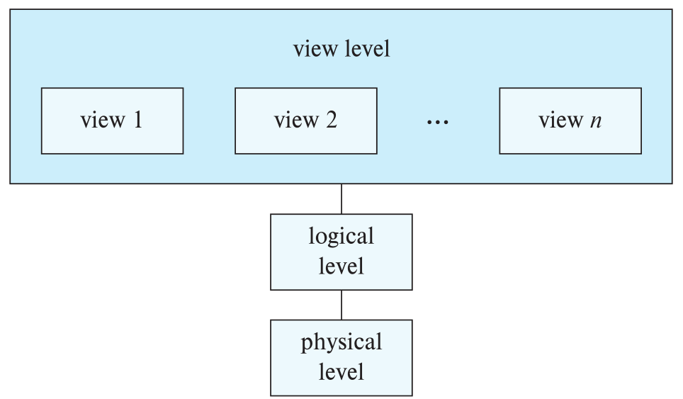

### 1.2.4 DBMS Architecture

#keypoint Database Engine

* Stroage manager -> How to store?
* Query processing -> How to query?
* Transaction manager -> What if on failure?

DBMS在内部做的事情其实是很复杂的，尽管我们看起来很简单。比如下面有三张表：

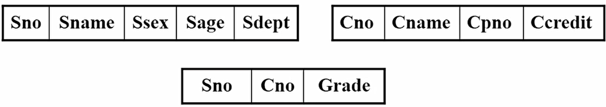

第一张是学生的学号，姓名，性别，年龄和专业；第二张是课程号，课程名等等；第三张是学生的学号，课程号和课程的成绩。那么如果我们在**物理层**把课程信息和成绩单信息存到一起，学生的信息单独存起来。


我们会发现，如果我们要打印一个这样的成绩单：

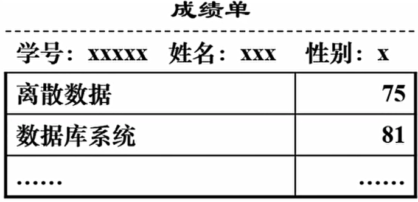

我们需要他同时具有这三个表的信息才可以。因为成绩单那张表只有课程号和成绩，并没有课程名，需要调用课程信息的表才可以。从外面看，我们只能看到这个成绩单；但是**在DBMS内部需要转化成对三张表的查询和对两个物理存储介质的增删改查**，因此DBMS的内部逻辑是很复杂的。

因此，我们将逻辑层的模式叫做Logical Schema，将外部暴露给用户的模式叫做External Schema，将物理层最裸露的处理模式叫做Physical Schema。**Logical Schema其实就对应着上面的Logical level，是用来表示我存的到底是个什么，整个数据拆开揉碎了都是怎么样的**。

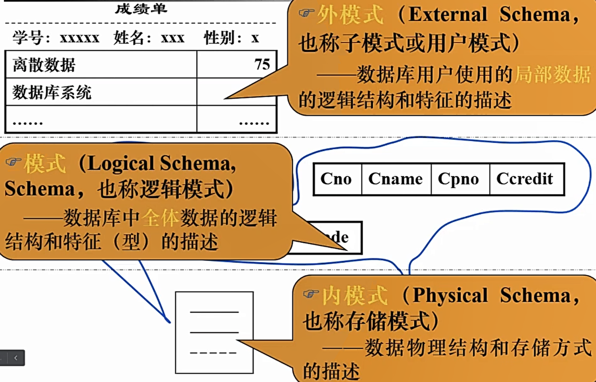

### 1.2.5 Instances and Schemas

这俩的关系有点像实例和类型之间的关系。比如在C++里定义了一个Animal类，实例化出一个dog对象，那么dog就是Instance，而Animal就是Schema。

* Instance: the collection of information stored in the database **at a particular moment**.
* Database schema: the **overall** design of the database.

## 1.3 Database Language

### 1.3.1 DDL

Data-definition language(DDL): 定义数据库的schema。比如：

```sql
create table department
(
    dept_name	char(20),
    building	char(15),
    budget		numeric(12,2)
);
```

这里面还有很多其他的功能，比如把`dept_name`定义成**主键**等等。

### 1.3.2 DML

Data-manipulation language(DML): 数据操作语言，就是对数据库进行**增删改查**的语言。

这部分更多是上机练习。

## 1.4 Database Design

先来看一个例子。


这个数据库有什么问题吗？我们来想想：如果我们想把物理学改成应用物理，那么我们就要搜索整个表，把所有能找到的物理学都改成应用物理，否则就会出现不一致的问题。这种问题叫做**更新异常**；另外，这个表里现在只有一个音乐学院的老师。如果这个老师被调离了，我们当然要从数据库中删除它。而造成的问题就是：这个表里所有关于音乐学院的信息都丢失了。这种问题叫做**删除异常**；如果我们在删除了这个音乐老师之后，又来了一个新音乐老师，这时候插入也会产生**插入异常**。这些情况，都是由与我们的**数据冗余**导致的，也就是**一样的信息我们在表中存储了多份**，或者说**我们把本应该存在多张表里的东西都堆在了一起**。解决这个问题的办法也很显而易见，就是将这个表拆成多张表。具体怎么拆之后再说。

# 2. Relational Model

## 2.1 Concepts

Relation表示关系，关系的模型其实就是一个表格。比如下面的这个

![[Database/img/rm.png|300]]

每一列都代表着一个**属性(attribute)**，每一行都是一个**元组(tuple)**，其实就是一个对象。这里列其实描述的就是之前说的Schema，而每一行其实就在描述这个数据库的Instance。

对于每一个属性，都会有它的约束。比如ID必须是一个定长为5的字符串；name是一个最大长度为20的变长字符串等等，这些约束叫做属性的**值域(domain)**。

属性的值域需要满足一个要求，叫做**原子性(atomic)**。比如某个数据库里存了人的电话号。那么如果说这个电话号可以存很多个号，比如一个人有几张卡这种情况。这样存的话，这个数据库就不满足原子性。因为这个电话号属性是可以拆开的。如果一定要这么存的话，我们只能把所有电话号拆开，比如拆成个人手机、固定电话、亲属电话等等。**总之一个属性里必须只能存一个数据**。

如果要是来了一个新老师，还没确定他是什么学院的，也不确定工资是多少，只知道ID和姓名，那么这个时候我们怎么赋值呢？我们允许属性有一个特殊的值叫做**null**。

## 2.2 Relational Algebra

### 2.1.1 Relation Schema and Instance

现在有一个学院的关系，叫做department relation。

![[Database/img/dr.png|300]]

那么我们观察可得，这表里有三个属性：dept_name, building, budget。我们记作$A_1,\ A_2,\ A_3$，那么我们就可以写出这个relation的schema了：
$$
department(dept\_name,\ building,\ budget)
$$
这个schema就叫做**Relation Schema，记作R**。我们能发现，**R其实就是所有的属性构成的集合而已**。那么，我们就让属性中的一部分叫做**键(Key)，记作K**。也就是说$K \subseteq R$。 ^3ee2b2

上面例子中的`dept_name`，我们能发现，在这个relation中，只要`dept_name`确定了，我们就能确定唯一的一行。像这样的Key，我们叫它**superkey**。又或者上面老师的例子中，`ID`就可以是一个superkey，而{`ID`, `name`}也可以是一个superkey。但是`name`自己就不是一个superkey了，因为老师可能有重名。这里要注意的是，**Key是一个集合而不是单独的属性**，只不过我们日常生活中Key总是单元素的集合罢了。

那么在这些superkey中，我们总要选合适的。所以我们选择**元素个数最少的集合**(基本上都是只有1个元素的)，将它叫做**candidate key**。比如各种网络游戏，会有千千万万玩家。在刚进入游戏的时候，会要求每个玩家起名字，并且不能重名。那么很显然这个`name`就可以成为candidate key；另外，我们还给每个玩家定义了一个`user_id`(因为玩家起的名字通常千奇百怪，尽管没有重名但是管理起来依然很复杂)，也要求所有的`user_id`不能重复。很显然`user_id`也可以成为candidate key。 ^017685

在上面游戏的例子中，`user_id`比起`name`显然更加适合搜索，因为`user_id`是程序有秩序的赋予而`name`是玩家起的各种千奇百怪的名字。所以我们将`user_id`作为**primary key**。需要注意的是，**primary key中的元素可以不止有一个，可以同时有很多**。

现在那之前说的两张表来：

![[rm.png|300]]  ![[dr.png|300]]

在右边的relation中，`dept_name`显然是primary key；而在左边的表中也出现了`dept_name`。如果这俩表是在同一个数据库系统中的，那么我们就说左边的这个`dept_name`是一个**foreign key**，它来自右边的表。这玩意儿有什么用呢？我们来想想：假设我们要插入一个老师，但是惊讶的发现它是电竞学院的，那对不起，肯定是插入失败，因为我们学校根本没有电竞学院。那么我们是怎么有底气说出这话的呢？靠的就是foreign key。我们`dept_name`的**取值**都是来自于其它relation中的primary key，是一定真实存在的。所以我们`dept_name`的值域已经被限制的死死的了，因此**我们只能插入学院是右边那张表里存在的东西**。这种方式也是给我们的值域增加了一种约束。因此我们有时候也把外键称为**foreign key constraint**。 ^bcaac7

***注意：foreign key并不一定是其他表中的primary key，上面的例子中只是一种情况。***

**对于一个学校的教务系统，我们就可以画出这样一张表。**

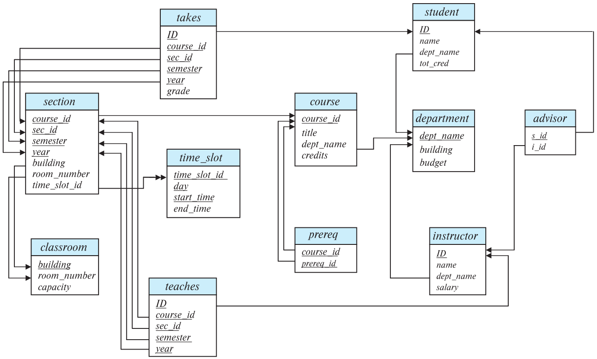

> 这里的箭头表示被引用的关系。比如takes中的ID指向了student里的ID，表示了takes中的ID是一个foreign key，它来自student。
>
> 下划线表示primary key。比如takes(选课) relation中，学生的ID，课程的id，上课节数的id，学期和年份共同作为选课的主键。

### 2.1.2 Relational-algebra Operations

#### 2.1.2.1 Select

表达式看着很玄乎，其实简单的不得了。我们还是拿instructor relation来举例子。

![[rm.png|300]]

我们如果想选出所有物理学院的老师，我们很容易写出结果：

![[Database/img/select.png|400]]

那么想想我们整个操作的过程：**我们对一个relation进行了操作，这个操作叫做select，同时得到了一个结果，这个结果也是个relation，而这个结果是原来的relation的一部分**。这样的过程就是进行了选择的过程。我们可以将这个**得到的结果relation**记作：
$$
\sigma_{dept\_name="Physics"}(instructor)
$$
那么很显然可以总结：$\sigma(r)$就是对r这个relation进行选择操作，而“怎么选”就写在下标里。另外，我们还能发现，**select操作只改变了tuple的个数，并没有改变attribute的个数**。

那么如果不是只按照一个标准选怎么办？再看一个例子。

![[Database/img/select2.png|200]]

如果这个是relation r，那么问：$\sigma_{A=B\ \wedge \ D>5}(r)$是多少？

一看就能看明白，是让我们找：A=B并且D>5的tuple。那么也很容易写出结果：

![[Database/img/select3.png|200]]

#### 2.1.2.2 Project

这里Project译为“投影”。和select相反，它不是横着筛选，而是竖着筛选。还是instructor的例子，如果我们不要`dept_name`，只要剩下三个属性，那么就能得到这样一个relation：

![[project.png|300]]

那么我们也能写出这个结果：
$$
\Pi_{ID,\ name,\ salary}(instructor)
$$
**注意另一种情况：**

![[Database/img/project2.png|100]]

如果我们要写出$\Pi_{A,\ C}(r)$，会发现：

![[Database/img/project3.png|100]]

**有两行是重复的，因为这里我们不要的B其实是superkey。**那么我们得到的这个就不是最后的结果，**还要删除所有重复的tuple才行**。

![[Database/img/project4.png|100]]

#### 2.1.2.3 Union

前面两个操作都是对单个的relation，接下来就是对多个relation了。首先是“并”，也就是两个relation并起来形成一个新的relation。

![[Database/img/union.png|200]]

那么我们很容易能写出$r\cup s$：

![[Database/img/union2.png|100]]

需要注意的是，这里只写了4条而不是5条，是因为$\alpha\ 2$这个数据在两个relation中都有，所以还要**去重**。接下来再看一个复杂一点的例子。

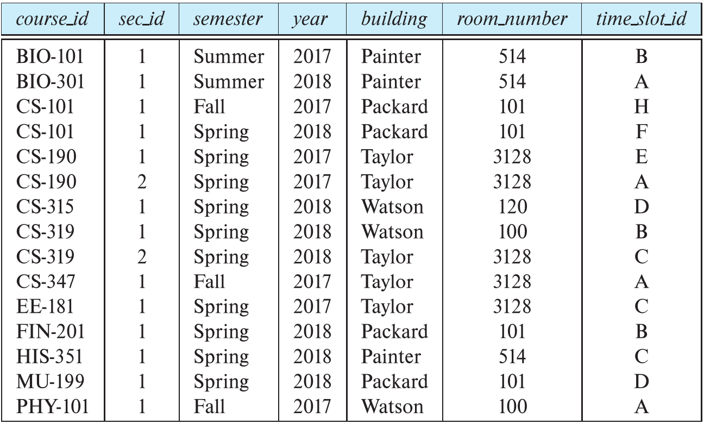

假设这个是section relation。那么我们如果想要找出在Fall 2017**或者**在Spring 2018开设的**课的课程id**，应该怎么计算?一步步来：

* 选出所有Fall 2017的tuple。$\longrightarrow select$

* 选出所有Spring 2018的tuple。$\longrightarrow select$

* 分别将两个结果relation只选出`course_id`属性。$\longrightarrow project \times 2$

  *Fall 2017:*

  * *CS-101*
  * *CS-347*
  * *PHY-101*

  *Spring 2018:*

  * *CS-101*
  * *CS-315*
  * *CS-319*
  * ***CS-319***
  * *FIN-201*
  * *HIS-351*
  * *MU-199*

* 将两个选完的结果并起来。$\longrightarrow union$

其中，后面的两步是可以交换的。也就是说，可以先并起来再按着`course_id`去选也可以。

那么这整个过程的结果表达式可以写成：
$$
\Pi_{course\_id}(\sigma_{semester="Fall"\ \wedge\ year=2017}(section))\cup\Pi_{course\_id}(\sigma_{semester="Spring"\ \wedge\ year=2018}(section))
$$
最后的结果就是：

![[Database/img/union4.png|100]]

**这里依然要注意，CS-101和CS-319出现了2次，所以要去重**。

#### 2.1.2.4 Intersection

和上面几乎是一样的，所以这里不多说了。还是上面的例子，如果要计算：
$$
\Pi_{course\_id}(\sigma_{semester="Fall"\ \wedge\ year=2017}(section))\cap\Pi_{course\_id}(\sigma_{semester="Spring"\ \wedge\ year=2018}(section))
$$
结果就是:

![[Database/img/in.png|100]]

#### 2.1.2.5 Set-difference

还是上面的例子，如果我们要找在Fall2017开设而不在Spring 2018开设的课，应该怎么写？使用的就是Set-difference运算符。
$$
\Pi_{course\_id}(\sigma_{semester="Fall"\ \wedge\ year=2017}(section))-\Pi_{course\_id}(\sigma_{semester="Spring"\ \wedge\ year=2018}(section))
$$
其实结果一定是Fall 2017中的一部分。把在Spring 2018里也有份的那个刨掉就行了。

![[Database/img/sd1.png|100]]

#### 2.1.2.6 Cartesian-product

笛卡尔积还是稍微复杂一点的。我们看一个例子。

![[Database/img/dk1.png|200]]

我们把$r\times s$叫做笛卡尔积的结果。先拿出来$\alpha\ 1$，把它和s中的所有tuple都分别拼到一块；然后再拿出$\beta\ 2$做相同的操作。最终得到的relation就是笛卡尔积的结果。

![[Database/img/dk2.png|200]]

之前的操作符都多多少少有重复的问题。那么这个笛卡尔积这么可劲儿乘，肯定是有很大的隐患的。我们还是看之前老师和课的例子。

![[rm.png|300]]  ![[teaches.png|300]]

左边是instructor relation，右边是teaches relation。那么我们能写出一个超级长的笛卡尔积结果：

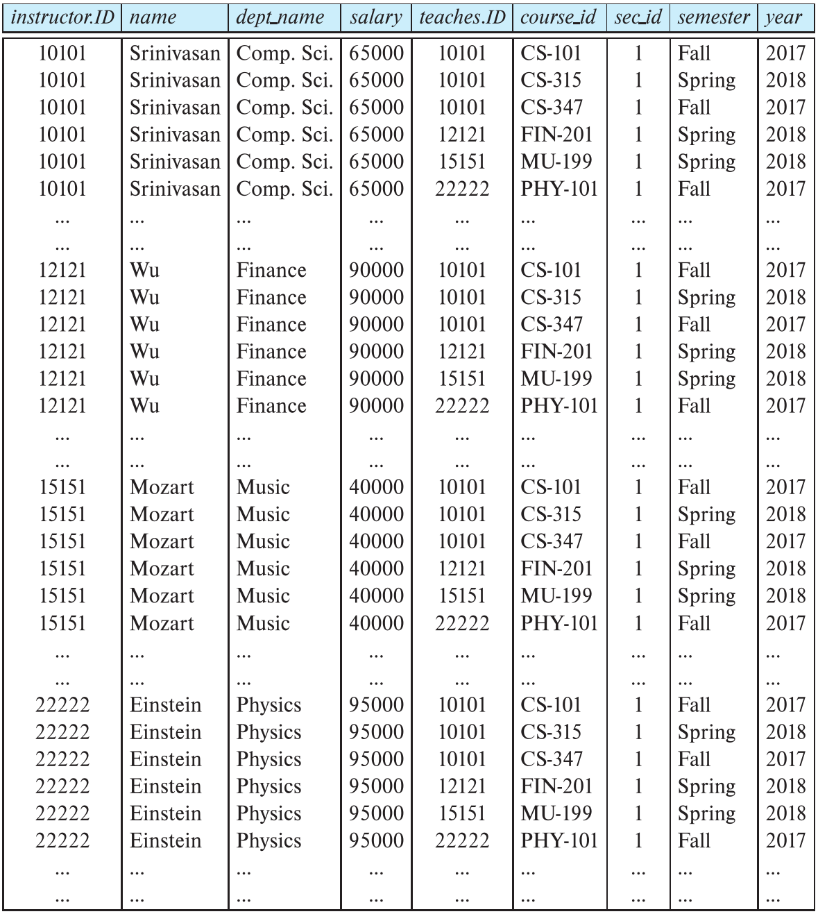

> $instructor \times teaches$

这个结果很显然有一个很大的问题：存在大量的非法数据。它们都是什么？我们来举个例子：比如Srinivasan老师。他的教职ID是10101，而我们看右边的teaches可以了解到，只有前3门课是他交的。而我们在笛卡尔积运算中，**却把所有的课都和他匹配了一遍**。因此除了这三门课以外的所有课都不是他交的，自然也就属于**非法数据**了。所以我们如果想要得到有效的结果，需要对这个笛卡尔积的结果**再进行一次select操作**：选择出`instructor.ID`和`teaches.ID`相等的tuple，也就是**这个课真就是这个老师交的**。
$$
\sigma_{instructor.ID=teaches.ID}(instructor \times teaches)
$$
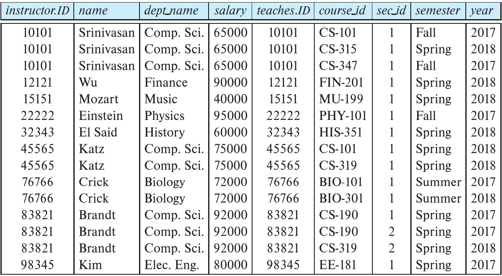

#### 2.1.2.7 Rename

比如关系r：

![[Database/img/rename1.png|100]]

如果我们要算$r\times r$，会有一个问题：结果的属性应该是4个。但是这俩r的属性都是A和B，那么我们怎么区分结果中的A和B是**前面r的**还是**后面r的**呢？这个时候只需要改个名字就好了：
$$
r \times \rho_s(r)
$$
这表示把后面的r改名为s。那么结果也就很好区分了：

![[Database/img/rename2.png]]

#### 2.1.2.8 Join

在之前笛卡尔积的例子中，我们看到了对于两个表之间建立关系，然后再从中进行选择的操作。包括下面的Exercise也有这样的操作。其实这样的操作经常会见到，所以我们不妨直接给他重新命名，叫做**join**。非常形象，就是把两张表合成一张表。比如还是笛卡尔积的老师的例子中，我们得到的结果是：
$$
\sigma_{instructor.ID=teaches.ID}(instructor \times teaches)
$$
那么我们可以将这个写成连接操作：
$$
instructor \bowtie_{instructor.ID=teaches.ID} teaches
$$
总结一下，有两张表r和s，如果我们要按照一定的要求$\theta$将它们连接起来(也就是先笛卡尔积，然后按照这个要求来选择)，所得到的结果就是$r \bowtie_\theta s$，即
$$
r \bowtie_\theta s=\sigma_\theta(r \times s)
$$
~~如果这个条件是**某些属性的等值**(比如上面的`instructor.ID=teaches.ID`)~~，我们可以称这个连接为**自然连接**。但是自然连接有时候也会遇到一些问题。我们看下面一个例子：

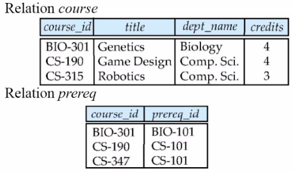

如果我们要给`course`和`prereq`做自然连接的话，会发现一个事情：CS-315和CS-347这两门课的信息被完全抹去了。因为我们一定是用`course.course_id=prereq.course_id`来进行选择，而这两门课是不可能匹配上的，所以它们也自然是要被删除的tuple。这就产生了问题：比如拿CS-315来举例子。这是Robotics课，它有可能根本就没有前置课程，也就是null。这种情况下我们其实是需要这样的信息的，但是自然选择却把它给抹去了。所以我们需要新的方式来保留住这个信息。

**Natural left outer join**

这就是一种方式，叫做**自然左连接**。从上面的叙述能看出来，自然连接就是按照某些条件把两张表拼起来，所以我们可以先试试把两张表拼一拼：

| course_id | title       | dept_name | credits | prereq_id |
| --------- | ----------- | --------- | ------- | --------- |
| BIO-301   | Genetics    | Biology   | 4       | BIO-101   |
| CS-190    | Game Design | Comp.Sci. | 4       | CS-101    |
|           |             |           |         |           |

拼到这里的时候都是和自然连接一样的(因为两个course_id是重复的，所以删掉了)。但是接下来就出现了问题：本来下一行我们是要删掉的，但是我们却要留下来，所以这里我们采用自然左连接的方式。左就代表以左边的relation为基准，即**一定要留下它的所有信息**。比如我们这个表是这么构建的：
$$
(course)\ natural\ left\ outer\ join\ (prereq)
$$
那么我们就一定要留下course的所有信息：

| course_id | title       | dept_name | credits | prereq_id |
| --------- | ----------- | --------- | ------- | --------- |
| BIO-301   | Genetics    | Biology   | 4       | BIO-101   |
| CS-190    | Game Design | Comp.Sci. | 4       | CS-101    |
| CS-315    | Robotics    | Comp.Sci  | 3       | **null**  |

最后如果在另一张表里找不到，就写为null即可。

**Natural right outer join**

举一反三即可，以右边的为基准。还是刚才的例子，如果是这么构建的话：
$$
(course)\ natural\ right\ outer\ join\ (prereq)
$$
就保留prereq的所有信息即可：

| course_id | title       | dept_name | credits  | prereq_id |
| --------- | ----------- | --------- | -------- | --------- |
| BIO-301   | Genetics    | Biology   | 4        | BIO-101   |
| CS-190    | Game Design | Comp.Sci. | 4        | CS-101    |
| CS-347    | **null**    | **null**  | **null** | CS-101    |

**Natural full outer join**

既保留左边的，也保留右边的。还是一样的例子：

| course_id | title       | dept_name | credits  | prereq_id |
| --------- | ----------- | --------- | -------- | --------- |
| BIO-301   | Genetics    | Biology   | 4        | BIO-101   |
| CS-190    | Game Design | Comp.Sci. | 4        | CS-101    |
| CS-315    | Robotics    | Comp.Sci  | 3        | **null**  |
| CS-347    | **null**    | **null**  | **null** | CS-101    |

其实全外连接就是**先左，再右，最后并**。

**Inner join**

提一嘴就行。其实就是自然连接，只不过它**保留了相等的属性，没有删掉**。

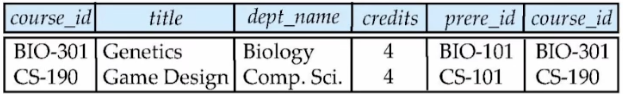

#### 2.1.2.9 Division

我们先来看一个复杂的例子。

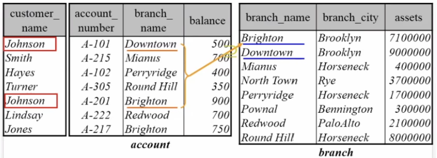

> 图里最左边的表少画了一列，应该是customer_name和account_number，这张表叫depositor。

问：Find all customers who have an account at all branches located in Brooklyn city.

首先我们看Brooklyn，它对应的branch有Brighton和Downtown。所以我们的目标就是找到一个customer，**他同时拥有位于这两个branch的账户**。

按着上面的叙述来，第一步就是找出Brooklyn的所有账户：
$$
\sigma_{branch\_city="Brooklyn"}(branch)
$$
depositor那张表因为只有customer_name是有用的信息，account_number一看就是用来连接的。所以我们直接把depositor和account连接上。
$$
depositor \bowtie account
$$
然后问题来了。我们需要找的是Brooklyn中的branch，所以比较的重点就是这两张表中的branch_name属性。那么我们要怎么比？我们的目的是找到一个customer_name，他对应的branch_name会有很多个，**而这很多个一定要包括$\sigma_{branch\_city="Brooklyn"}(branch)$里全部的branch_name**。明确了这些，我们开始下面的操作。首先要去除无用的信息。在比较的过程中，我们发现只比较了$depositor \bowtie account$中的`customer_name`和`branch_name`，还有$\sigma_{branch\_city="Brooklyn"}(branch)$中的`branch_name`。所以我们要**分别把两张表做投影，把有用的属性筛出来**：
$$
\pi_{customer\_name,\ branch\_name}(depositor \bowtie account)\longrightarrow A1
$$

$$
\pi_{branch\_name}(\sigma_{branch\_city="Brooklyn"}(branch))\longrightarrow A2
$$

最后就是开始寻找：遍历A1中的customer_name，对于每个name，看其对应的**一个或多个**branch_name是否完全包括了A2中所有的branch_name。如果有，那么就将这个name添加到结果的relation中。

上面进行的操作，就叫做**division**。而这道题最终的结果也可以记为：
$$
\begin{array}{c}
A1 \div A2,\ or \\
\pi_{customer\_name,\ branch\_name}(depositor \bowtie account) \div \pi_{branch\_name}(\sigma_{branch\_city="Brooklyn"}(branch))
\end{array}
$$
然后来说一下division的定义。

我们有两个relation: r和s。

![[Database/img/div1.png|200]]

被除的是s，而除它的是r。s中有B，而r中有A和B。我们规定，$r \div s$中的属性是**r中的属性中把s的扣掉**。那么在这个例子中，就是AB扣掉B，自然就剩A了。

然后我们要在r中去**按照A来进行遍历**。对于每一个A中的值，我们要看**它对应的所有B是否全部包括了s中的B**，如果包括，就将它添加到结果relation中。这里$\alpha$很显然在遍历1，2行的时候就已经包括了所有的s中的B，所以$\alpha$就是结果relation中的一个。另外经过完整遍历，我们发现$\beta$也满足，所以结果就是：

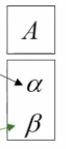

通过这两个例子也能看出，division操作是用来解决relation中的包含关系的。也就是**第一个relation中的哪些tuple具有==包括第二个relation完整信息==的能力**。

**接下来再看一个例子：**

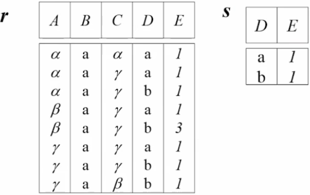

这里要计算$r \div s$，还是按照之前的叙述来。首先结果中应该只有ABC三个属性，也就是ABCDE扣掉DE。

然后按着ABC开始逐行遍历，比如第一行$\alpha\ a\ \alpha$，看它对应的DE能不能包括所有的DE。而我们发现这整个表里只有一行是$\alpha\ a\ \alpha$，所以毫无疑问匹配失败。

然后是第二行$\alpha\ a\ \gamma$。它在2，3行正好就全包括了a l和b l，所以这个是结果relation中的一员。

经过所有遍历，我们也很容易写出结果：

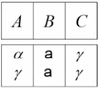

**还有一种特殊情况，就是两个relation的属性并非完全包括关系。**

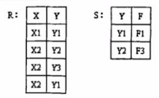

如果要计算$R \div S$的话，我们首先发现：XY扣YF扣不掉。但是没有关系，我们只需要**能扣多少扣多少**。也就是把Y给扣掉就行了，**所以结果中只有一个X**。

然后还是按着X对R进行逐行遍历。这里只有X1和X2。首先是X1，而整个R中只有这一个组合，所以它肯定不是结果。

然后是X2，发现这里有三个，而也完全包括了S中的Y1和Y2(**这里不需要管F了，它和除法操作无关**)，所以它就是结果。

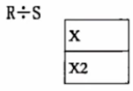

### 2.1.3 Exercise

#### 2.1.3.1 Ex1

现在我们有一个银行的relation：

| account_number | Branch_name | balance |
| -------------- | ----------- | ------- |
| A-101          | Downtown    | 500     |
| A-215          | Mianus      | 700     |
| A-102          | Perryridge  | 400     |
| ...            | ...         | ...     |

现在有一个需求：找出余额最多的银行账户有多少**余额**。很显然，一个号在这里就是一个tuple。所以我们要选tuple，很容易想到select操作。但是我们再仔细想想：之前所有的select操作都是和一个人为的定值比较，比如大于5、小于等于100等等……我们这里的要求是要**余额和余额来比较**，显然单独的选择操作不能满足我们的要求。那么我们又能想到：笛卡尔积正好是构造两个relation的关系，那么我们就可以让这个relation和自己来一个笛卡尔积，就能将所有的balance之间构造好关系了。另外，为了区分，我们将两个relation命名为$A_1和A_2$(这里表格画不下，所以省略了一些东西)：

| A1.number | A1.name    | A1.balance | A2.number | A2.name    | A2.balance |
| --------- | ---------- | ---------- | --------- | ---------- | ---------- |
| A-101     | Downtown   | 500        | A-101     | Downtown   | 500        |
| A-101     | Downtown   | 500        | A-215     | Mianus     | 700        |
| A-101     | Downtown   | **==500==**| A-102     | Perryridge | **==400==**|
| A-215     | Mianus     | **==700==**| A-101     | Downtown   | **==500==**|
| A-215     | Mianus     | 700        | A-215     | Mianus     | 700        |
| A-215     | Mianus     | **==700==**| A-102     | Perryridge | **==400==**|
| A-102     | Perryridge | 400        | A-101     | Downtown   | 500        |
| A-102     | Perryridge | 400        | A-215     | Mianus     | 700        |
| A-102     | Perryridge | 400        | A-102     | Perryridge | 400        |
| ...       | ...        | ...        | ...       | ...        | ...        |

看`A1.balance`和`A2.balance`这两列，我们就能发现：所有的比较都已经含在这两列中，那么接下来我们也自然而然就能想到，按照`A1.balance > A2.balance`来进行select操作，就能选出大的：
$$
\sigma_{A1.balance>A2.balance}(\rho_{A1}(account) \times \rho_{A2}(account))
$$
但是注意看表格中加粗的部分：这三个tuple都满足`A1.balance > A2.balance`，这代表我们一次选择并不能选出最大的balance。我们再想一想我们到底选了个什么：当然，我们最后要筛出A1那一列，因为选择的时候我们是假定A1大的。但是我们在比较的时候，并不是比最大的，而是**只要我比他大，我就入选了**。那么其实我们并不是选了最大的，而是**只是没有选最小的，其他的都选了，因为最小的那个由于不可能比任何人大(顶多相等，和自己比的时候)，必定不会入选**。所以我们不妨反着来：将>改成<，这样我们就是只是没有选最大的，然后再用整个集合减去它，就把最大的留了下来，注意别忘了筛选出balance那列，我们要的只是余额而已：
$$
\Pi_{balance}(account)-\Pi_{A1.balance}(\sigma_{A1.balance<A2.balance}(\rho_{A1}(account) \times \rho_{A2}(account)))
$$

#### 2.1.3.2 Ex2

现在有两个relation:

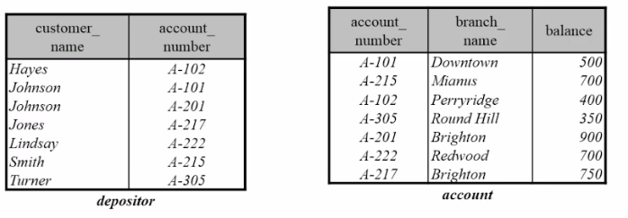

问：Find all customers who have at least two deposits in different branch.

首先来分析一下。要求是同一个人，但是要是不同的账户，而且分支还得不一样。总结起来就是customer_name相同，account_number不同，并且branch_name也不同。和上面的Ex1一样涉及到了自己和自己比的操作(**比customer_name和branch_name**)，我们也能想到自然连接。所以先把这两个表连接起来：
$$
depositor \bowtie account
$$
这里的连接条件很显然，就是account_number相等。连接之后我们就有了一个拥有4个attribute的relation：
$$
depositor \bowtie account(customer\_name,\ account\_number,\ branch\_name,\ balance)
$$
接下来我们要想一想：这里是自己和自己比的操作，而现在只有这一张表。很显然我们要进行一遍笛卡尔积才可以。所以我们要让这个结果和自己来个笛卡尔积，并且使用不同的命名：
$$
\rho_{D1}(depositor \bowtie account)\times\rho_{D2}(depositor \bowtie account)
$$
这样我们又得到了一个新的relation，表示$depositor \bowtie account$这个relation里面所有的tuple之间建立的关系。接下来，我们要从中筛选出符合题意的tuple，也就是那三个条件。
$$
\begin{array}
\\
\sigma_{D1.customer\_name=D2.customer\_name\ \wedge\ D1.account\_number \neq D2.account\_number\ \wedge\ D1.branch\_name\neq D2.branch\_name}\\(\rho_{D1}(depositor \bowtie account)\times\rho_{D2}(depositor \bowtie account))
\\
\end{array}
$$
最后题目要求的是找出customer即可，所以要投影出名字。
$$
\begin{array}
\\
\pi_{D1.customer\_name}(\\
\sigma_{D1.customer\_name=D2.customer\_name\ \wedge\ D1.account\_number \neq D2.account\_number\ \wedge\ D1.branch\_name\neq D2.branch\_name}\\
(\rho_{D1}(depositor \bowtie account)\times\rho_{D2}(depositor \bowtie account))\\
)
\\
\end{array}
$$
本题和Ex1很像，只不过最后的比较条件由一个变成了三个。另外，这道题用了两次"笛卡尔积+选择"，而Ex1只用了一次。**这两次一次是为了将两张表和成一张；另一次是在这张合成的表中进行自我比较**。

***剩下的练习题见录播第二集和第三集***

#  3. SQL

为什么**关系型数据库**那么牛逼？一个是第二章的Relational Algebra，另一个就是SQL。SQL全称**Structured Query Language**，就是结构化查询语言。

## 3.1 DDL

```sql
create table instructor(
    ID				char(5),
    name			varchar(20) not null,	/* name在赋值或者修改的时候不允许变成null */
    dept_name		varchar(20),
    salary			numeric(8,2),			/* 浮点数，整数8位小数2位 */
    primary key(ID),						/* 主键是ID，只能有一个，并且默认not null */
    
    /*
     * 这里表示foreign_key是引用自department表中的外键。
     * 需要注意的是，这里其实省略了一些东西，完整的表述是：
     * foreign key(dept_name) references department(dept_name)
     * 能省略的条件是：要么department中的相应的属性也叫dept_name；
     * 要么引用的是department中的primary key。
    */
    foreign key(dept_name) references department
);
```

```sql
create table takes(
	ID				varchar(5),
    course_id		 varchar(8),
    sec_id			 varchar(8),
    semester		 varchar(6),
    year			 numeric(4,0),
    grade			 varchar(2),
    
    primary key(ID, course_id, sec_id, semester, year),		/* 联合主键 */
    
    foreign key(ID) references student,	
    /* 这里是省的写好几句，所以合成一句话 */
    foreign key(course_id, sec_id, semester, year) references section
);
```

```sql
/*
	给instructor这个表加一列，属性是sex，值都是char(2)
	如果表中已经存在tuple，则新加的属性默认是null
*/
alter table instructor add sex char(2);
```

```sql
/* 删掉salary，不过有些数据库不支持，因为可不能乱删。 */
alter table instructor drop salary
```

## 3.2 DML

```sql
insert...
delete....
select [distinct][all] ...from...where...
select ... as ...
group by ...having...
order by...

# 把ID是55555的老师工资翻倍
update instructor set salary=salary*2 where ID=55555;

# distinct和all的区别
+---------+-------+-----------+---------------------+-------+
| ScoreId | StuId | SubjectId | ExameDate           | Score |
+---------+-------+-----------+---------------------+-------+
|      10 |     1 |         1 | 2022-09-19 17:31:33 |    99 |
|      11 |     2 |         1 | 2022-09-20 19:46:34 |    88 |
+---------+-------+-----------+---------------------+-------+
2 rows in set (0.00 sec)

mysql> select distinct SubjectId from score;
+-----------+
| SubjectId |
+-----------+
|         1 |
+-----------+
1 row in set (0.02 sec)

mysql> select all SubjectId from score;
+-----------+
| SubjectId |
+-----------+
|         1 |
|         1 |
+-----------+

# 在select中嵌套数学运算
mysql> select Score/10 from score;
+----------+
| Score/10 |
+----------+
|      9.9 |
|      8.8 |
+----------+

# select from where
mysql> select Score from score where StuId=1;
+-------+
| Score |
+-------+
|    99 |
+-------+

# 使用笛卡尔积
mysql> select * from grade, score;
+----+-----------+---------+-------+-----------+---------------------+-------+
| id | GradeName | ScoreId | StuId | SubjectId | ExameDate           | Score |
+----+-----------+---------+-------+-----------+---------------------+-------+
|  1 | haha      |      10 |     1 |         1 | 2022-09-19 17:31:33 |    99 |
|  1 | haha      |      11 |     2 |         1 | 2022-09-20 19:46:34 |    88 |
+----+-----------+---------+-------+-----------+---------------------+-------+

-----------------------------------------------------------------------------------------

# 有如下的relation:
+--------+------------+
| person | supervisor |
+--------+------------+
| Bob    | Alice      |
| Mary   | Susan      |
| Alice  | David      |
| David  | Mary       |
+--------+------------+
# 找到Bob的supervisor:
mysql> select supervisor
    -> from emp_super
    -> where person='Bob';
+------------+
| supervisor |
+------------+
| Alice      |
+------------+
# 找到Bob的supervisor的supervisor(as的使用):
mysql> select A2.supervisor
    -> from emp_super as A1, emp_super as A2
    -> where A1.supervisor=A2.person and A1.person='Bob';
+------------+
| supervisor |
+------------+
| David      |
+------------+
# 找到person里所有带a的人(%的使用，%表示任意长度的字符串)
mysql> select person
    -> from emp_super
    -> where person like '%a%';
+--------+
| person |
+--------+
| Mary   |
| Alice  |
| David  |
+--------+

# _的使用(_代表任意单个字符)
mysql> select person
    -> from emp_super
    -> where person like '_a___';
+--------+
| person |
+--------+
| David  |
+--------+

# 将person升序排列
mysql> select person
    -> from emp_super
    -> order by person;		# 加上desc是降序
+--------+
| person |
+--------+
| Alice  |
| Bob    |
| David  |
| Mary   |
+--------+

# 如果order by后面有多个，就是先按第一个排序，然后在第一个相等的情况下按第二个排序

# 数出emp_super有多少行(tuple):
mysql> select count(*)
    -> from emp_super;
+----------+
| count(*) |
+----------+
|        4 |
+----------+

# 数出emp_super中不重名的person有多少行:
mysql> select count(distinct person)
    -> from emp_super;
+------------------------+
| count(distinct person) |
+------------------------+
|                      4 |
+------------------------+

-----------------------------------------------------------------------------------------

# 有如下一张表instructor:
+-------+------------+-----------+--------+
| ID    | name       | dept_name | salary |
+-------+------------+-----------+--------+
| 10101 | Srinivasan | Comp.Sci  |  65000 |
| 12121 | Wu         | Finance   |  90000 |
| 15151 | Mozart     | Music     |  40000 |
| 22222 | Einstein   | Physics   |  95000 |
| 32343 | El Said    | History   |  60000 |
| 33456 | Gold       | Physics   |  87000 |
| 45565 | Katz       | Comp.Sci  |  75000 |
| 58583 | Califieri  | History   |  62000 |
| 76543 | Singh      | Finance   |  80000 |
| 76766 | Crick      | Biology   |  72000 |
| 83821 | Brandt     | Comp.Sci  |  92000 |
| 98345 | Kim        | Elec.Eng. |  80000 |
+-------+------------+-----------+--------+
# 算出所有学院的平均工资，再升序排序(group by使用):
mysql> select dept_name, avg(salary) as avg_salary
    -> from instructor
    -> group by dept_name
    -> order by dept_name;
+-----------+-------------------+
| dept_name | avg_salary        |
+-----------+-------------------+
| Biology   |             72000 |
| Comp.Sci  | 77333.33333333333 |
| Elec.Eng. |             80000 |
| Finance   |             85000 |
| History   |             61000 |
| Music     |             40000 |
| Physics   |             91000 |
+-----------+-------------------+

# 当你group by之后，再写where来选择会报错，所以要用having:
mysql> select dept_name, avg(salary)
    -> from instructor
    -> group by dept_name
    -> having avg(salary)>42000;
+-----------+-------------------+
| dept_name | avg(salary)       |
+-----------+-------------------+
| Comp.Sci  | 77333.33333333333 |
| Finance   |             85000 |
| Physics   |             91000 |
| History   |             61000 |
| Biology   |             72000 |
| Elec.Eng. |             80000 |
+-----------+-------------------+
# 找出所有比"某个"生物学院老师工资高的老师
# 也就是只要你比随便一个生物学院老师的工资高，你就被选中了:
mysql> select distinct T.ID, T.name, T.salary
    -> from instructor as T, instructor as S
    -> where T.salary > S.salary and S.dept_name = 'Biology';
+-------+----------+--------+
| ID    | name     | salary |
+-------+----------+--------+
| 12121 | Wu       |  90000 |
| 22222 | Einstein |  95000 |
| 33456 | Gold     |  87000 |
| 45565 | Katz     |  75000 |
| 76543 | Singh    |  80000 |
| 83821 | Brandt   |  92000 |
| 98345 | Kim      |  80000 |
+-------+----------+--------+
# 以上的操作因为很常见，所以有个some关键字专门用来处理"某个"的问题:
mysql> select distinct ID, name, salary
    -> from instructor
    -> where salary > some(select salary
    -> from instructor
    -> where dept_name = 'Biology');
+-------+----------+--------+
| ID    | name     | salary |
+-------+----------+--------+
| 12121 | Wu       |  90000 |
| 22222 | Einstein |  95000 |
| 33456 | Gold     |  87000 |
| 45565 | Katz     |  75000 |
| 76543 | Singh    |  80000 |
| 83821 | Brandt   |  92000 |
| 98345 | Kim      |  80000 |
+-------+----------+--------+
# 要是找出比所有金融学院老师工资都高的，那就对应的用all:
mysql> select distinct ID, name, salary
    -> from instructor
    -> where salary > all(select salary
    ->  from instructor
    ->  where dept_name = 'Finance');
+-------+----------+--------+
| ID    | name     | salary |
+-------+----------+--------+
| 22222 | Einstein |  95000 |
| 83821 | Brandt   |  92000 |
+-------+----------+--------+

# 找到教师平均工资大于42000的学院(from的子查询)
mysql> select * from instructor
    -> order by dept_name;
+-------+------------+-----------+--------+
| ID    | name       | dept_name | salary |
+-------+------------+-----------+--------+
| 76766 | Crick      | Biology   |  72000 |
| 10101 | Srinivasan | Comp.Sci  |  65000 |
| 45565 | Katz       | Comp.Sci  |  75000 |
| 83821 | Brandt     | Comp.Sci  |  92000 |
| 98345 | Kim        | Elec.Eng. |  80000 |
| 12121 | Wu         | Finance   |  90000 |
| 76543 | Singh      | Finance   |  80000 |
| 32343 | El Said    | History   |  60000 |
| 58583 | Califieri  | History   |  62000 |
| 15151 | Mozart     | Music     |  40000 |
| 22222 | Einstein   | Physics   |  95000 |
| 33456 | Gold       | Physics   |  87000 |
+-------+------------+-----------+--------+
mysql> select dept_name, avg_salary
    -> from (select dept_name, avg(salary) as avg_salary
    -> 		from instructor
    -> 		group by dept_name) as new
    -> where avg_salary > 42000;
    # 这里as new是给派生的表起个名，是mysql的规定
    # 首先先把所有学院的平均工资算出来，就是派生表干的事
    # 然后从派生表里把>42000的选出来就行了
    # 这里用having的写法也是一样的：
    	# select dept_name, avg(salary) as avg_salary
		# from instructor
		# group by dept_name
		# having avg_salary > 42000;
+-----------+-------------------+
| dept_name | avg_salary        |
+-----------+-------------------+
| Comp.Sci  | 77333.33333333333 |
| Finance   |             85000 |
| Physics   |             91000 |
| History   |             61000 |
| Biology   |             72000 |
| Elec.Eng. |             80000 |
+-----------+-------------------+


-----------------------------------------------------------------------------------------

# 在2.1.2.3中说过选出Fall 2017或者Spring 2018开的课的id，
# 现在要选出同时在这两个时间开的课：
+-----------+--------+----------+------+----------+-------------+--------------+
| course_id | sec_id | semester | year | building | room_number | time_slot_id |
+-----------+--------+----------+------+----------+-------------+--------------+
| BIO-301   |      1 | Summer   | 2017 | Painter  |         514 | B            |
| BIO-301   |      1 | Summer   | 2018 | Painter  |         514 | A            |
| CS-101    |      1 | Fall     | 2017 | Packard  |         101 | H            |
| CS-101    |      1 | Spring   | 2018 | Packard  |         101 | F            |
| CS-190    |      1 | Spring   | 2017 | Taylor   |        3128 | E            |
| CS-190    |      2 | Spring   | 2017 | Taylor   |        3128 | A            |
| CS-315    |      1 | Spring   | 2018 | Watson   |         120 | D            |
| CS-319    |      1 | Spring   | 2018 | Watson   |         100 | B            |
| CS-319    |      2 | Spring   | 2018 | Taylor   |        3128 | C            |
| CS-347    |      1 | Fall     | 2017 | Taylor   |        3128 | A            |
| EE-181    |      1 | Spring   | 2017 | Taylor   |        3128 | C            |
| FIN-201   |      1 | Spring   | 2018 | Packard  |         101 | B            |
| HIS-351   |      1 | Spring   | 2018 | Painter  |         514 | C            |
| MU-199    |      1 | Spring   | 2018 | Packard  |         101 | D            |
| PHY-101   |      1 | Fall     | 2017 | Watson   |         100 | A            |
+-----------+--------+----------+------+----------+-------------+--------------+
# 用sql来写的话就要用到嵌套了:
mysql> select distinct course_id
    -> from course
    -> where semester='Fall' and year = 2017 and
    -> course_id in (select course_id
    -> from course
    -> where semester='Spring' and year=2018);
    # 先选出在Spring 2018开的课的id的集合，然后判断在2017 Fall开的课的id是否是
    # Spring 2018中的一员，如果是那就是同时在两个时间开了
+-----------+
| course_id |
+-----------+
| CS-101    |
+-----------+
# 另一种写法，使用了exists关键字:
mysql> select course_id
    -> from course as S
    -> where semester = 'Fall' and year = 2017 and
    -> exists(select *
    ->  from course as T
    ->  where semester = 'Spring' and year = 2018 and S.course_id = T.course_id);
    # 这种写法很像两层嵌套的循环语句
    # 所以是首先找Fall 2017的tuple，如果找到了，先别选，继续看exists是否为真
    # 如果真的这个tuple也同时满足exists里面的条件，那就选中了
    # 其实上面的写法也是这种嵌套，每次执行到in的时候都要弄出来所有Spring 2018的集合
    # 然后判断它在不在里面
+-----------+
| course_id |
+-----------+
| CS-101    |
+-----------+

# 选出在Fall 2017开但是不在Spring 2018开的课
mysql> select distinct course_id
    -> from course
    -> where semester='Fall' and year = 2017 and
    -> course_id not in (select course_id
    -> from course
    -> where semester='Spring' and year=2018);
+-----------+
| course_id |
+-----------+
| CS-347    |
| PHY-101   |
+-----------+


```

## 3.3 MySQL

展示所有数据库

```sql
show databases;
```

创建数据库

```sql
create database xidian;
```

删除数据库

```sql
drop database xidian;
```

进入并使用数据库

```sql
use xidian;
```

创建表的语句和上面几乎一样的

展示数据库中的表(relations)

```sql
show tables;
```

展示表中的属性(schema)

```sql
describe instructor;
```

展示帮助

```sql
\h
```

向表中插入数据

```sql
insert into instructor (ID, name, dept_name, salary, birthday) values(123, 'SpreadZhao', 'Comp.Sci', 100.22, default);
```

展示表中的实例(instance)

```sql
select * from instructor;
/* 星号表示所有列，也可以只选其中几列 */
```

*注意里面的日期格式，如果自己手打的话要按照这个格式，并写成字符串。*

删除表

```sql
drop table [if exists] instructor;
```

> 如果有如下需求：
>
> 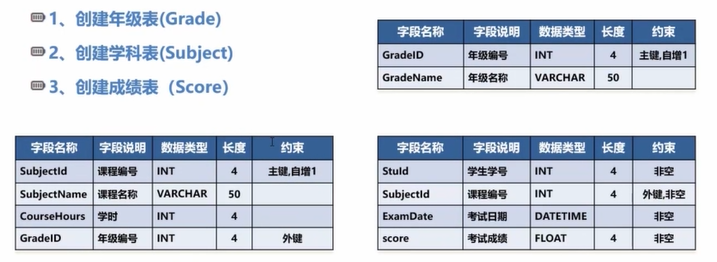
>
> 那么我们可以这样创建：
>
> ```sql
> # 外键还没有写，后面再添加。
> 
> mysql> create table grade(
>  -> id int primary key auto_increment,
>  -> GradeName varchar(50)
>  -> );
> Query OK, 0 rows affected (0.05 sec)
> 
> mysql> show tables;
> +------------------+
> | Tables_in_xidian |
> +------------------+
> | grade            |
> | instructor       |
> +------------------+
> 2 rows in set (0.00 sec)
> 
> mysql> describe grade;
> +-----------+-------------+------+-----+---------+----------------+
> | Field     | Type        | Null | Key | Default | Extra          |
> +-----------+-------------+------+-----+---------+----------------+
> | id        | int         | NO   | PRI | NULL    | auto_increment |
> | GradeName | varchar(50) | YES  |     | NULL    |                |
> +-----------+-------------+------+-----+---------+----------------+
> 2 rows in set (0.00 sec)
> 
> mysql> create table subject(
>  -> SubjectId int primary key auto_increment,
>  -> SubjectName varchar(50),
>  -> CourseHours int,
>  -> GradeId int
>  -> );
> Query OK, 0 rows affected (0.02 sec)
> 
> mysql> create table score(
>  -> ScoreId int primary key auto_increment,
>  -> StuId int not null,
>  -> SubjectId int not null,
>  -> ExamDate datetime not null,
>  -> Score float not null);
> Query OK, 0 rows affected (0.02 sec)
> 
> mysql> show tables
>  -> ;
> +------------------+
> | Tables_in_xidian |
> +------------------+
> | grade            |
> | instructor       |
> | score            |
> | subject          |
> +------------------+
> 4 rows in set (0.01 sec)
> ```
>
> 然后修改表score，让自增变成10，再插入一个元素看看：
>
> ```sql
> mysql> alter table score auto_increment=10;
> Query OK, 0 rows affected (0.02 sec)
> Records: 0  Duplicates: 0  Warnings: 0
> 
> mysql> describe score;
> +-----------+----------+------+-----+---------+----------------+
> | Field     | Type     | Null | Key | Default | Extra          |
> +-----------+----------+------+-----+---------+----------------+
> | ScoreId   | int      | NO   | PRI | NULL    | auto_increment |
> | StuId     | int      | NO   |     | NULL    |                |
> | SubjectId | int      | NO   |     | NULL    |                |
> | ExamDate  | datetime | NO   |     | NULL    |                |
> | Score     | float    | NO   |     | NULL    |                |
> +-----------+----------+------+-----+---------+----------------+
> 5 rows in set (0.00 sec)
> 
> mysql> insert into score values(default, 1, 1, now(), 99);
> Query OK, 1 row affected (0.00 sec)
> 
> mysql> select * from score;
> +---------+-------+-----------+---------------------+-------+
> | ScoreId | StuId | SubjectId | ExamDate            | Score |
> +---------+-------+-----------+---------------------+-------+
> |      10 |     1 |         1 | 2022-09-14 16:01:22 |    99 |
> +---------+-------+-----------+---------------------+-------+
> 1 row in set (0.00 sec)
> ```
>
> 把表score名字修改成scores：
>
> ```sql
> mysql> alter table score rename to scores;
> Query OK, 0 rows affected (0.02 sec)
> 
> mysql> show tables;
> +------------------+
> | Tables_in_xidian |
> +------------------+
> | grade            |
> | instructor       |
> | scores           |
> | subject          |
> +------------------+
> 4 rows in set (0.00 sec)
> ```
>
> 给grade表增加一个年级组长Leader：
>
> ```sql
> mysql> alter table grade add Leader varchar(20) default('SpreadZhao');
> ```
>
> 将Leader修改成LeaderId并改变数据类型和默认值：
>
> ```sql
> mysql> alter table grade change Leader LeaderId int;
> ```
>
> 删除LeaderId：
>
> ```sql
> mysql> alter table grade drop LeaderId;
> ```
>
> 单独给score表增加主键(假设原来没有主键)：
>
> ```sql
> alter table score add constraint 'pk_Score' primary key score(ScoreId);
> # pk_Score是单独起的约束的名字，并不是属性的名字，ScoreId才是。
> ```
>
> 如果要把subject表中的`GradeId`变成外键的话：
>
> ```sql
> mysql> alter table subject add constraint fk_grade foreign key(GradeId) references grade(id);
> Query OK, 0 rows affected (1.51 sec)
> Records: 0  Duplicates: 0  Warnings: 0
> 
> mysql> describe subject;
> +-------------+-------------+------+-----+---------+----------------+
> | Field       | Type        | Null | Key | Default | Extra          |
> +-------------+-------------+------+-----+---------+----------------+
> | SubjectId   | int         | NO   | PRI | NULL    | auto_increment |
> | SubjectName | varchar(50) | YES  |     | NULL    |                |
> | CourseHours | int         | YES  |     | NULL    |                |
> | GradeId     | int         | YES  | MUL | NULL    |                |
> +-------------+-------------+------+-----+---------+----------------+
> ```
>
> 

## 3.4 Exercise

#example Self Join Example

person | supervisor
-- | --
Bob | Alice
Mary | Susan
Alice | David
David | Mary

> Relation `emp_super`.

1. Find the supervisor of "Bob";
2. Find the supervisor of the supervisor of "Bob";
3. Find **All** supoervisors (direct and indirect) of "Bob".

```sql
# 1
select supervisor
from emp_super
where person = "Bob";

# 2
select S.supervisor
from emp_super as T, emp_super as S
where T.supervisor = S.person and T.person = "Bob"

# Another soluton of 2
select supervisor
from emp_super as S # Brackets cannot be removed!!!
where S.person = (select supervisor # note that '=' can be replaced with "in"
				  from emp_super as T
				  where T.person = "Bob");
```

---

#example Nested Subqueries

* Find courses offered in Fall 2009 and in Spring 2010.

  ```sql
  select distinct course_id
  from section
  where semester = "Fall" and year = 2009 and course_id in(
	  select course_id
	  from section
	  where semester = "Spring" and year = 2010
  );

  # equals to:
  select distince course_id
  from section
  where (semester = "Fall" and year = 2009) or (semester = "Spring" and year = 2010);

  # also equals to:
  select course_id
  from section as S
  where semester = "Fall" and year = 2009 and exists (
	  select *
	  from section as T
	  where semester = "Spring" and year = 2010 and S.course_id = T.course_id
  );
  ```

  > First find out the coursed offered in Spring 2010; then find out the courses offered in Fall 2019; finally find the intersection of them.

* Find courses offered in Fall 2009 **but not** in Spring 2010.

  ```sql
  select distinct course_id
  from section
  where semester = "Fall" and year = 2009 and course_id not in (
	  select course_id
	  from section
	  where semester = "Spring" and year = 2010
  );
  ```

* Find the total number of (distinct) students who have taken course sections taught by the instructor with ID 10101.

  ```sql
  select count(distinct ID)
  from takes
  where (course_id, sec_id, semester, year) in (
	  select course_id, sec_id, semester, year
	  from teaches
	  where teaches.ID = 10101
  );
  ```

* Find names of instructors with salary greater than that of some(**at least one**) instructor in the Biology department.

  ```sql
  select distinct T.name
  from instructor as T, instructor as S
  where T.salary > S.salary and S.dept_name = "Biology";

  # equals to
  select name
  from instructor
  where salary > some (
	  select salary
	  from instructor
	  where dept_name = "Biology"
  );
  ```

  > Remember what we've talked about in [[#2.1.3.1 Ex1]].

* Find names of instructors with salary greater than that of **all** instructors in the Biology department.

  ```sql
  select name
  from instructor
  where salary > all (
	  select salary
	  from instructor
	  where dept_name = "Biology"
  );
  ```

# 4. Intermediate SQL

## 4.1 View

封装数据，**view是没有物理存储的，只是告诉你有这么一个东西**。

```sql
create view faculty as
	select ID, name, dept_name
	from instructor;
```

也可以像用一张表一样用一个view

```sql
mysql> select name
    -> from faculty
    -> where dept_name = 'Biology';
+-------+
| name  |
+-------+
| Crick |
+-------+
```

给每个学院的总工资来个视图

```sql
create view departments_total_salary(dept_name, total_salary) as
	select dept_name, sum(salary)
	from instructor
	group by dept_name;

mysql> select * from departments_total_salary;
+-----------+--------------+
| dept_name | total_salary |
+-----------+--------------+
| Comp.Sci  |       232000 |
| Finance   |       170000 |
| Music     |        40000 |
| Physics   |       182000 |
| History   |       122000 |
| Biology   |        72000 |
| Elec.Eng. |        80000 |
+-----------+--------------+
```

---

给view增加项的时候会有问题：因为view就是个逻辑的东西，所以实际上在insert view的时候就是给对应的表增加tuple。但是**有些view可能没有包括它拿出来的那个表的主键**，这个时候增加新的项的时候就不好办了，因为那个主键不能为空。所以绝大多数情况是不允许修改view的。

还有另一种问题，比如有这么一个view：

```sql
create view history_instructors as
	select * 
	from instructor
	where dept_name = 'History';
```

很简单，就是把所有历史学院的老师封装出来。但是如果我往里插这么一个东西：

```sql
insert into history_instructors values(25566, 'Brown', 'Biology', 100000)
```

首先，是能插进去的，因为view的插入要符合这些条件：

* from后面只有一个relation，即只能修改一张表
* 所有没插的东西都允许为空
* 对选出来的属性不能有任何函数运算

但是我们插进去是不对的，因为这个老师是生物学院的，所以这种也会产生问题。

第三种问题，因为视图是抽象的东西，并没有物理存储，所以你**视图的代码效率也会影响视图的性能**。所以我们在使用抽象视图的时候要注意效率问题。

---

因为view的这种性能的问题，有了**物化视图**的概念，也就是给这个视图一个真正的物理存储，这样在查询视图的时候效率就高得多了。

但是这种物化也会带来问题：比如一个物理学院的老师被调走了，那么很显然要从instructor表里删掉他。但是**他还在视图中存在，这就会导致这种数据的不一致性**。而为了保证一致性，**自动更新视图的工作就交给DBMS**了。

## 4.2 Transaction

一个失败全失败；全成功才成功。比如拿转账来举例子：

```sql
update ZhangSan - 100;
update LiSi + 100;
insert Record;
```

一个转账操作通常包含这三条信息：给发方减钱，给收方加钱，记录一条转账记录。那么作为事务来讲，在三条语句都成功之后，就要执行一条`commit`语句来表示我的操作都成功了；而如果其中任何一条失败了，我们要执行一条`rollback`语句来**回到我执行这三条语句之前**的状态。

## 4.3  Integrity Constraints

比如最小值，非空之类的都算完整性约束。

```sql
# 比如课程季只能是春夏秋冬中的一个：
check(semester in ('Spring', 'Summer', 'Fall', 'Winter'));
```

## 4.4 SQL Data Types and Schemas

**索引**

我们如果想要找一条数据`ID = 12345`，自然就是：

* 将该表中所有数据读到内存中 -> IO
* 在内存中逐条做比较，找到ID = 12345的tuple

我们会发现，IO所消耗的时间要远大于在内存中作比较的时间。因此我们为了减小这部分时间，发明了索引。索引其实就相当于书的目录，**先查目录就能够找到我要找的东西的地址是啥了**。

**自定义类型**

```sql
# 自定义美元类型，12位+2位的浮点数，final表示不能基于这个类型再创建子类
create type Dollars as numeric(12, 2) final;

create table department(
	dept_name varchar(20),
    building varchar(15),
    budget Dollars				# 使用
);
```

**面向对象**

在面向对象的概念出来之后，数据库肯定也要相应地改变：在一个格子中不只是存字符串，数字这种了，也要支持把一个object放进去。而互联网的发展，也诞生了更多的需求：

* blob: binary large object，比如视频对象，一个高清无码4k视频肯定要变成二进制文件存到数据库中，这时候就要对数据库的容量有要求。
* clob: character large object，比如一个几百万字的小说对象要整个放到一个数据库格子中，那也是对容量的考验。

## 4.5 Authorization

```sql
grant <privilege list> on <relation name or view name> to <user list>;
# privilege list: 能干嘛
# relation name or view name: 对谁干
# user list: 谁能干

# 同意这仨人对instructor执行select操作
grant select on instructor to U1, U2, U3;

# 不再同意这仨人对branch执行select操作
revoke select on branch from U1, U2, U3;
```

# 5. Advanced SQL

高级语言如何和数据库来交互？我们自然地能想到，如果想要让应用程序和数据库来进行交互，那么肯定要靠DBMS来实现。首先程序将控制信息和数据发送给DBMS，然后把真正的增删改查交给DBMS来实现。**但是如今的数据库通常会有一个数据库客户端，它作为一个小进程就包含在我们的APP里**，而它负责的就是联系DBMS。因此问题就简化成了：我们如何让APP和数据库的客户端进行通信。

通常高级程序语言和数据库进行交流的方式有四种：

* C lib，也就是c语言的库函数。
* 嵌入式sql，缺点是一个牌子的数据库就只能用一种语言，换数据库麻烦。
* ODBC(Open Database Connectivity)，相当于所有数据库的虚函数。java的ODBC就叫做JDBC。缺点是这虚函数只能提供基本操作，对于一些牌子的数据库的特色功能是用不了的，因为要考虑所有的数据库。而且多了一层性能也会下降。 ^469a7c
* ORM(Object Relation Map)，将relation变成对象，这样开发容易很多。

我们只讨论中间的两种

## 5.1 Embedded SQL

比如在c语言中嵌入SQL：

```c
EXEC SQL <select * from ...>;
```

在java中嵌入SQL：

```java
# SQL{select * from ...};
```

我们要了解的一点是，**c语言的编译器是识别不了SQL语句的**。所以为了解决这种问题，厂商提供了一种叫做**预编译器(pre compiler)**的东西。它能将SQL语句变成纯c语句，这样编译器就能够顺利编译执行了。

### 5.1.1 SQLCA

也就是SQL Communication Area，目前可以理解为用来判断数据库语句执行情况的一个库。它的使用首先需要包含进这个库：

```c
EXEC SQL INCLUDE sqlca;
```

sqlca是一个很大的结构体，里面记录的很多都是数据库的状态。其中最常用的就是`sqlca.sqlcode`。它等于0表示执行成功；小于0表示执行失败；大于0表示成功但是有异常(比如没找到)。

```c
if(sqlca.sqlcode >= 0) printf("Creation Successful\n");
else printf("Creation failed\n");
```

### 5.1.2 Host Language Variables

比如我想给一个学生增加余额，但是增加的这个数是在c语言中的一个变量，那么这个时候就用到**宿主变量**了。这种变量可以在c中访问，也可以在sql中访问。其实几乎所有嵌入式语言都会有宿主变量(参考嵌入式汇编)。

```c
EXECL SQL update student
    set balance = balance + :haha
    where ID = 123;
```

其中的`:haha`就是宿主变量。注意**只有在嵌入式SQL中宿主变量之前才需要加冒号，编程语言中不用**。通常使用的时机就是：**在sql中要访问sql外部的变量**。宿主变量的声明也是有要求的，我们要把它们夹在两条语句之间：

```c
EXEC SQL BEGIN DECLARE SECTION;
	int haha;
EXEC SQL END DECLARE SECTION;
```

在使用宿主变量时可能会出现一个问题：我拿到SQL中的一个值作为输出(比如某某人的工资)，将这个值作为宿主变量，这样就能拿到这个值在c中进行操作了。但是万一这个值是个空值咋办？**SQL中的空和编程语言中的空是完全不一样的**，SQL中表示的是不知道、没有值，而编程语言中通常是空指针、0之类的。因此我们需要一个机制来解决这个问题，这个机制就是接下来要讨论的**指示变量**。

### 5.1.3 Indicator Variables

当SQL中的变量出现了上述问题时，我们要在它的后面紧跟一个指示变量。其中的值表示了这个宿主变量的状态：

```c
//声明宿主变量和它附属的指示变量
EXEC SQL BEGIN DECLARE SECTION;
	int age;
	short ageInd;
EXEC SQL END DECLARE SECTION;

//给指示变量赋值，这表示宿主变量此时是空值。
ageInd = -1;

//这样就可以在嵌入式sql中将宿主变量设置为空值并赋值给属性了
EXEC SQL update student
    set age=:age:ageInd;
	where ssn=2345;
```

指示变量通常有以下的值：

* **0：合法的值，正常用**
* **-1：空值**
* \>0：特殊情况，暂且不提

接下来给一个比较具体的例子来解释一下指示变量具体怎么用。首先定义各种宿主变量：

```c
EXEC SQL BEGIN DECLARE SECTION;
	char ssn[6];
	char name[16];
	int age;
	short ageInd;
	char *username = "Manager/Manager";
	char *connect_String = "College";
EXEC SQL END DECLARE SECTION;
```

那么我们首先给`ssn`赋值：

```c
printf("Enter ssn number:");
scanf("%d", ssn);
```

然后按着这个`ssn`去数据库中寻找学号就是这个变量的tuple信息：

```c
EXEC SQL select ssn, name, age
    into :ssn, :name, :age:ageInd
    from student
    where ssn=:ssn;
```

这句话的意思就是从student表中寻找`ssn`是`:ssn`的tuple，并将结果赋值给into句子中的三个变量，**其中age是有可能为空的**。而这里又会出现另一个问题：在本例中，我们select语句的结果只能是一个tuple，因为我们就准备了那么些变量。如果出现多个tuple，肯定就会报错。而有些时候，我们就是要选出多个tuple，那么我们该怎么讲这些tuple赋值到into中的这些变量里呢？这个时候，**游标**就该排上用场了。

### 5.1.4 Cursors

当SQL返回了多个tuple时，我们能想象到，这其实就是一个大的表格，每一行对应一个tuple，每一列对应一个属性。而这整个表格其实就是一段连续的内存空间。**我们的游标就是指向这段空间的首地址**：


而游标的思路就是：我利用当前游标指向的空间，取出来的就是当前的tuple，去赋值给into中的宿主变量去做一些c语言之类的逻辑处理。当处理完之后，游标会自动指向第二个tuple。这样循环下去直到末尾，整个的结构就处理完了。需要注意的是，**游标的名字在一个数据库中要是唯一的**，因为多个程序可能会建立在同一个数据库上，它们会使用相同的游标。

### 5.1.5 Example

接下来通过一个完整的例子来完善一下5.1.x中的内容。

```c
#include <stdio.h>
#include <stdlib.h>
EXEC SQL INCLUDE sqlca;

int main(){
    EXEC SQL BEGIN DECLARE SECTION;
    	char ssn[6];
    	char name[16];
    	int age;
    	short ageInd;
    	char *username = "Manager/Manage";
    	char *connect_String = "College";
    EXEC SQL END DECLARE SECTION;
    
    //连接到数据库，不同数据库语法不同，看个乐呵即可
    EXEC SQL connect :username using :connect_String;
    //使用SQLCA中的状态判断连接是否成功
    if(sqlca.sqlcode < 0) exit(-1);
    
    /*
    	上面这种sqlcode异常判断其实很繁琐，如果很多嵌入式语句的话，
    	出一次错就要判断一次，代码量很大。因此为了简化操作，我们使
    	用声明性的异常处理。
    */
    EXEC SQL whenever sqlerror goto error;	// sqlcode < 0
    EXEC SQL whenever not found goto done;	// sqlcode = 1403
    
    //从student表中选出name是:name的所有tuple，按学号排序后投影出ssn,name,age三列，
    //并将最后的结果(1个或多个tuple)整个拿出来，并声明游标studentCursor备用
    EXEC SQL declare studentCursor cursor for
        select ssn, name, age
        from student
        where name = :name
        order by ssn;
    
    //open函数打开游标，并将从数据库中取出的多个tuple整个放到缓冲区中，准备逐行操作。
    EXEC SQL open studentCursor;
    
    //逐行操作，这里使用for循环，当出现没有找到时，上面声明的异常处理就起作用了。
    for(;;){
        /*
        	fetch语句的语法是这样的：
        		fetch [next|prior|first|last] [from] c
        		into :s1 :s2
        	理解起来很简单，就是将当前tuple中的属性提取出来逐个复制到into中，
        	并移动cursor。移动的规则由第一个参数指定，默认是next。
        */
        EXEC SQL fetch studentCursor
        into :ssn, :name, :age:ageInd;
        
        printf("Student number: %s\n", ssn);
        printf("Name: %s", name);
        
        //对指示变量判断来看age是否为空。
        if(ageInd < 0) printf("age: null\n");
        else printf("age: %d", age);
    }
    
    //异常处理
    error:	
    	printf("SQL error %d\n", sqlca.sqlcode);
    	goto finished;
    done:
    /*
    	由于同一个游标在数据库中会被多个程序使用，因此不同程序在使用的时候需要
    	做到“用完归还”。也就是出现异常的时候需要先恢复到未出异常的时候，再关闭
    	自己的程序。在这里就是sqlerror continue语句。
    */
    	EXEC SQL whenever sqlerror continue;
    	EXEC SQL close studentCursor;	//关闭游标
    	EXEC SQL commit work release;
}
```

## 5.2 ODBC

使用了ODBC之后，数据库和APP的交互就变成了这样：

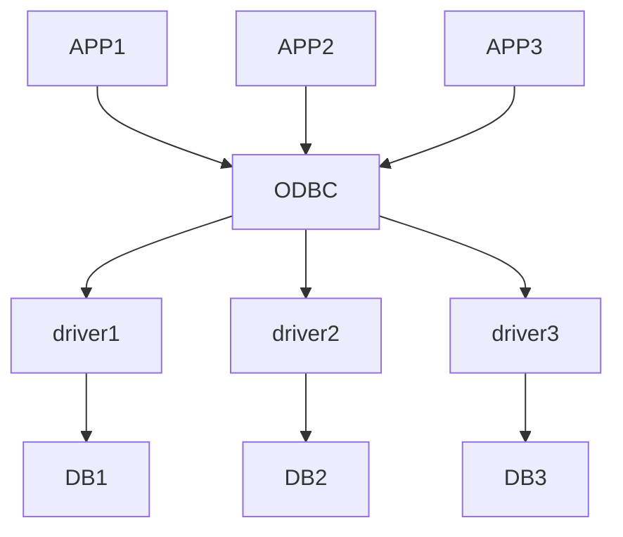

这样做会带来两个后果，在[[#^469a7c|第5章的开头]]已经提到过了。但是这样做确实很大降低了开发的难度，甚至最底层的都可以不是数据库。比如DB3不是MySQL，不是Oracle，是一个xlsx表格，甚至是一个txt文本，一样也可以像访问数据库一样通过ODBC来访问这些文件。

## 5.3 Functions and Procedures

比如我们要做在ATM中取钱的服务，就需要对服务器数据库进行这样的判定：首先看用户密码是否输入正确，再看他要取的钱是否小于等于他的存款。只有都满足，才能进行取钱的操作。而这两次判定我们通常有两种解决方式。一种是将所有的判定放到高级程序语言中，比如在c中判断密码是否正确，正确怎么样，不正确怎么样。但是这样做有一个缺点，就是当整个业务逻辑需要修改的时候，需要改的地方太多了。所以我们需要另一种方式，也就是将所有的过程性语句放到数据库中，而这样做的好处就是只需要修改数据库，那么和它关联的所有程序的逻辑也就都修改了。但是我们之前学的SQL中从来没有if else这样的判断，所以我们在本节所介绍的**函数**和**过程**以及下一节介绍的**触发器**就是这样的东西。

使用了这种方式之后，我们的取钱逻辑就是这样的：用户APP发出一次取钱的请求，而这个请求就是数据库提供的接口。数据库接到这个请求后，通过**在其内部实现的**业务逻辑来判断密码是否正确，余额是否够用等等。而不是像以前一样在APP中去判断这这些。

首先我们先来通过一个例子认识一下Procedure

```sql
# 声明结束符是//，只有遇到这个的时候才结束语句，分号不算
delimiter //

create procedure citycount(IN country char(3), out cities int)
begin
	select count(*)
	into cities
	from world.city
	where CountryCode = country;
# 此时遇到//，结束语句
end//

# 将结束符声明回分号
delimiter ;
```

这个过程的名字是`citycount`，有两个参数：`country`和`cities`。其中前者是输入变量，后者是输出变量。也就可以类比成函数的形参和返回值。在函数中我们执行`select`语句，从`world.city`表中查找`CountryCode`是`country`的tuple，并将tuple的个数作为值写入变量`cities`中，这样，我们就可以调用这个过程了：

```sql
call citycount('JPN', @cities);
```

这样，变量`@cities`中就存好了上述的结果，也就是tuple的个数，然后通过`select`语句就能显示出来：

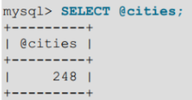

---

接下来我们再通过一个例子看一看函数的使用：

```sql
create function ins_count(dept_name varchar(20))
	returns integer
begin
	declare i_count integer;
	select count(*)
	into i_count
	from instructor
	where instructor.dept_name = dept_name
	return i_count;
end
```

这个函数名字叫`ins_count`，参数是`dept_name`，也就是学院的名字。返回值是一个整数。做的事情就是从`instructor`表中寻找学院名字是参数中值的tuple，并记录tuple的个数(**instructor的个数**)，将这个值写入到临时变量`i_count`中，并将它作为返回值返回给函数外部。因此我们可以在任何地方使用这个函数，**包括sql语句中**：

```sql
select dept_name, budget
from department
where ins_count(dept_name) > 12
```

这条语句是从`department`表中寻找，对于每一个`dept_name`都要逐个判断，只要这个学院里有的`instructor`大于12个，就被选中了，最后显示出这些学院的名字和预算。而如果我们不使用函数的话，那么函数那部分就要整体替换成上面那函数中一坨select语句，很明显这种写法让代码量大大降低，也更好理解和扩展。

---

除了这些控制语句，以及`declare`这种声明变量的语句，还必须要有一些`if else`这样的语句：

```sql
create function verboseCompare(n int, m int)
	returns varchar(50)
	
	begin
		declare s varchar(50);
		
		if n = m then set s = 'equals';
		else
			if n > m then set s = 'greater';
			else set s = 'less';
			end if;
			
			set s = concat('is ', s, ' than');
		end if;
		
		set s = concat(n, ' ', s, ' ', m, '.');
		
		return s;
	end
```

这是一个很简单的比较大小的函数。比如n < m的话，首先定义变量s用作返回，然后走第一个分支，显然$n \neq m$，所以会走else分支，然后n不大于m，所以接着走else分支，这样s就变成了less。之后在s的前后拼一下，就变成了`is less than`。然后再将s拼一下，就变成了`n is less than m.`，最终将这个字符串返回。

另外还有`case`，`loop`，`while`，`repeat`语句，这些举一反三即可。

## 5.4 Trigger

触发器的使用通常并不是为了实现什么功能，而是为了实现完整性约束。比如我对数据库执行一个操作，但是这个操作必须要在特定的时间内才能做。这个时候就需要用触发器来判断时间是否合理。

```sql
create table account(
	acct_num int,
    amount decimal(10, 2)
);

create trigger ins_sum
before insert
on account
for each row set @sum = @sum + new.amount
```

每一个触发器都和一个表相关。比如在这里，`ins_sum`触发器就和`account`表相关。每当我们对这张表执行`insert`语句之前，都要先将账户的总数加上新的数量，然后再插入。其中第二行的`before`也可以换成`after`表示在执行后面的操作之后才执行触发器。

触发器分为语句触发器和行触发器。其中默认就是语句触发器，所以`for each row`要显示声明。这些触发器执行的顺序是这样的：

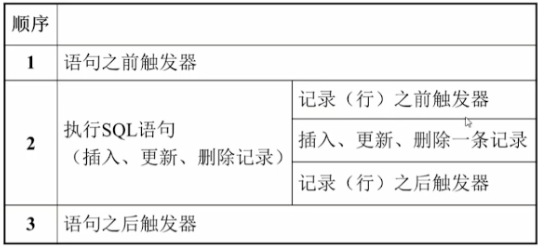

另外，`old`和`new`是两个关键字，只和行触发器有关。分别表明当前修改之前的tuple和修改后的tuple。在使用这些时，需要注意一个问题：

```sql
delimiter //
create trigger upd_check after update on account
for each row
begin
	if new.amount < 0
		then set new.amount = 0;
	elseif new.amount > 100
		then set new.amount = 100;
	end if;
end;//
delimiter ;
```

这里有一个问题：after触发器是在执行完update操作之后进行的。而如果我们在update操作中将amount改成了-1，那么这里触发器是否还会将amount改成0？答案是否定的。因为已经对行记录进行了修改，我们就不再允许对`new`中的属性进行修改。相对的，我们在before触发器中也不能够修改`old`中的属性。

还有一些情况中，我们只想对部分行记录使用触发器，那么就要在`for each row`中加入二次判定：

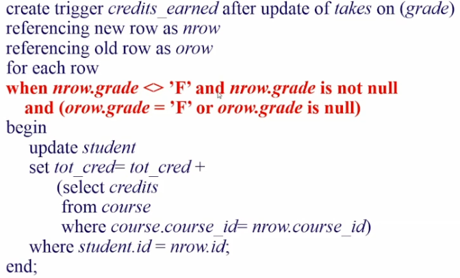

# 6. Entity-Relationship Model

在[[#1.2.1 Data Model|1.2.1]]中我们提到了4种主流的模型，而第一种Relation Model我们在前面的章节中其实一直都在提及。而接下来我们就开始介绍第二种模型：ER。而这种模型最常见的应用就是去**设计数据库**。

**需求分析**

整个数据库的设计其实和软件工程的设计非常相似。首先都是要对需求进行分析。而数据库的需求一定就是数据了，我们要分析分析这个数据到底是什么结构，该怎么去规划它们。

---

**Schema和功能设计**

然后，就来到了设计数据库的Schema阶段。我们在[[#^3ee2b2|这里的描述]]中就能知道Schema到底是个什么东西。接下来我们就要把需求的数据封装成一个个的Schema。比如我们要设计一个电商平台，所以给每一个商品就要有个Goods Schema，其中有商品id，商品名，库存等等；另外，Schema的设计还包括我要对这些数据进行什么操作。比如我经常会找库存最少的商品提醒商家去补货，那么这个时候就需要有一个能找出最小值的Function。

---

**逻辑设计**

当我们把数据都设计好了之后，就会发现其中的关联关系。而这个模型此时已经是一个Relation Model。在它的基础上，我们还要继续进行**逻辑设计**。对于每一个Schema，它在这个阶段就要被完全确定，不能再改了。逻辑设计的应用我们在下一章会介绍。

---

**物理设计**

逻辑设计之后，就是**物理设计**。首先，确定选用哪个产品，是MySQL，还是Oracle还是其他的；另外，还要决定最终物理存储的介质是什么。是磁盘还是ssd还是内存还是云，甚至是分布式的文件系统(比如[[1. hadoop|Hadoop]])等等。

#poe Design Phase

* Conceptual design: ![[Database/resources/Drawing 2023-02-09 18.14.53.excalidraw.png]]
* Logical design: **Deciding on the Database Schema**, to find a good collection of schemas.

## 6.1 Introduction to ER

ER模型主要包括这三个东西：

* **实体集合**
* **实体的属性集合**
* **实体之间关系的集合**

首先来简单抛一个小问题。我们之前已经写过多次的instructor和department的Schema：

$$
\begin{array}
\\
instructor(ID,\ name,\ dept\_name,\ salary)\\
department(dept\_name,\ building,\ budget)
\\
\end{array}
$$

很显然，这两个Schema其实就是一个实体集合，并且属性的集合也包括在其中了。那么下一步，我们就要再寻找一个他们之间关系的集合。每一个老师都有一个所属的学院，那么我们完全可以像这样再给一个集合：

$$
inst\_dept(inst\_ID,\ dept\_name)
$$

这样的话，就满足了上面的三个ER模型的基本要素。但是，这样做还遗留了一个小问题，就是instructor表中的dept_name这个属性，其实是作为外键存在的，并且dept_name还是department表的主键，那么这样的话，这个属性实现的功能和我新加的这个inst_dept的功能是完全一样的。而这时**dept_name在instructor表中就变成了冗余数据，所以我们要把它删掉**。 ^f248ec

另外，有一些Schema的主键是多个，也就是这些主键缺一不可。但是如果这些主键的其中一个被鉴定为冗余数据的时候，该怎么办呢？这时就出现了另一类概念：**Week Entity & Strong Entity**。弱实体就是依赖其他实体而存在的实体，比如section，只有确定是时间，季节，课程id，还有啥啥的一些属性才能唯一确定一个section，那么很显然这个Schema是依赖于这些爹而存在的。因此在构建这种实体关系的时候要小心再小心；而强实体就是上面的instructor和department，它们本身的存在不依赖于任何实体，所以这个时候只要主键在，就是自己的。

## 6.2 ER Diagram

接下来我们看看怎么画图，其实画图非常简单，所以我直接贴ppt了(**这里的ppt一定要看，后面会直接提这里面的内容**)：

![[Pasted image 20221030145411.png]]

![[Pasted image 20221030145429.png]]

![[Pasted image 20221030145444.png]]

![[Pasted image 20221030145456.png]]

![[Pasted image 20221030145523.png]]

![[Pasted image 20221030145544.png]]

![[Pasted image 20221030145558.png]]

![[Pasted image 20221030145614.png]]

![[Pasted image 20221030145712.png]]

## 6.3 Reduction to Rlation Schemas

然后是如何给每个实体的属性集合写表，这里给个例子：

![[Pasted image 20221030150557.png]]

* 普通属性只有一行
* 对于有子属性的属性(组合属性)，要给个缩进
* 大括号括起来的表示可能会有多个值
* 最后加个小括号表示这个属性是能通过其他属性算出来的

那么，我们如何使用Schema去表示这种ER属性集合呢？我们知道，**属性在数据库中是原子不可分的**。对于这种有子属性的东西，我们需要做一次转换；对于会有多个值的属性，我们也需要转换；对于这种被算出来的属性，我们还需要转换。

* 首先，对于有子属性的属性，我们的规则是：**把所有"最子"的属性提到最前面来**，将其他的属性全部删掉。因此，这里我们只留下了first_name，middle_initial，last_name，street_number，street_name，apt_number，city，state，zip；将**name，address，street给删掉了**。
* 然后是像phone_number这样有多个值的属性。这种属性还分为两种情况：是否有上限？如果我明确知道每个老师最多只能存两个手机号，那么就可以直接phone_number1，phone_number2这样去存；**而如果不确定的话，我们还需要建一张单独的老师和电话的表去存这些数据**：`inst_phone(ID, phone_number)`。
* 最后是这些算出来的属性，很简单，删掉！因为本来就能算出来，还存它干嘛？

---

对于弱实体的表示是这样的：

![[Pasted image 20221030150745.png]]

这样一个大学的整个ER模型就可以是这样的：

![[Pasted image 20221030151059.png]]

---

接下来，我们看一下上图的这一块：

![[Pasted image 20221103123919.png]]

我们看到，老师和学院是一个多对一的关系，也就是多个老师可以属于同一个学院。它们之间的联系是`inst_dept`，这也和我们[[#^f248ec|开头的描述]]是一样的。但是，在数据库的设计中，**我们要尽量让Schema的个数达到最小**，这也是为了性能考虑。因此，在这里我们还是要将这个`inst_dept`给删掉，恢复成原来外键的形式。你可能会好奇：这不是脱裤子放屁吗？为啥加上又删掉？其实，这两个步骤所做的工作虽然是一个来回，**但是它们的目的是完全不一样的**：一开始是为了尽量减小冗余的属性；而这里的目的是为了控制Schema的数量。

而对于下面的advisor，因为它含有自己的属性：指导时间，这个时间既不可能放在instructor中，也不可能放在student中，因此这个Schema我们是不能删掉的。

### 6.3.1 Specialization(Top-down)

这玩意儿其实就是面向对象里的继承，只不过不是Class，而是Entity：

![[Pasted image 20221103125153.png]]

但是要注意，这里的箭头还不是和继承完全一样的。一个employee也有可能是student；而一个student也有可能成为employee；但是一个instructor绝对不可能成为secretary，反之亦然。因此我们在这里使用了两种不同的箭头。

对于这种关系，我们怎么把它塞到数据库里呢？具体的方式有两种。先来看第一种：

![[Pasted image 20221103130821.png]]

我们看到，**子类只包含父类的主键**。这种做法就导致如果我想看student的家庭住址，就必须让student和person做一个join操作才能做到。

第二种方法，很显然就是子类包括父类的所有属性。但是这种做法就会出现数据的冗余，当我们要修改子类的属性时，就要同步修改person中的属性。

![[Pasted image 20221103130939.png]]

### 6.3.2 Aggregation

比如我们要对一个项目做总体的评估：

![[Pasted image 20221103163817.png|500]]

那么在我做评估的时候，其实是对instructor，student，project这三张表作为一个整体做评估。因此我们不妨直接将这三个表抽象成一个对象：

![[Pasted image 20221103163952.png|500]]

这样做的好处就是，我们不需要再经过三张表去查，只需要看最后的eval_for，就能知道**某一个学生在一个特定的老师的指导下参加了一个特定的项目**。而这个eval_for中既能反应proj_guide这个关系Schema的所有信息，也能看到它联系的三个Entity Schema的信息，所以这条个proj_guide在此时就变成了冗余数据，我们完全可以删掉它。

$$
eval\_for(s\_ID,\ project\_id,\ i\_ID,\ evaluation\_id)
$$

*剩下的一些知识，在《Database System Concepts》中的280页开始。*

# 7. Relational Database Design

这章所有的事情都是在优化我们的数据库——要么让它更规范，要么让它性能更强。

## 7.1 Decomposition

数据库中的表，有时候为了避免具有冗余信息，需要进行分解。但是，我们真的可以随便乱分吗？看个例子：

![[Pasted image 20221113161017.png]]

这张表经过分解后，再连接起来时产生了两条错误的信息。这种分解叫**Lossy Decomposition**。因此我们需要一种无损的方式对表进行分解。

## 7.2 Normal Form

**一范式：所有属性原子不可分**。比如之前提到的多值属性，一个属性里可以有多个值；又或者是组合属性，是由多个属性组合而成的。这些情况都不满足第一范式。

但是，我们想一想一些想当然的情况：比如之前提到的课程号`CS-101`，这表示计科院开的第101门课；又或者我们的身份证号，本身不同的段有不同的含义。那么这种情况该怎么办呢？数据库一般不管这种东西，该咋样咋样。

---

在说二范式前，先看一个例子。有$r(A,\ B)$，下面是它的instance：

A | B
-- | --
1 | 4
1 | 5
3 | 7

那么A确定B成立吗？不成立。因为A=1的时候，B可以是4或者5。因此B确定A是成立的。像这种某一行中的某个值可以确定这个行中其他所有的值的情况，叫做**依赖关系**。接下来介绍几种依赖关系：

* ID可以确定ID；ID和name一起也可以确定ID。这听起来好像挺傻逼：**我确定自己**这不是弱智都觉得没问题的吗？但是这种依赖还是有定义的，叫做**平凡依赖(trival dependency)**。
* A确定了B，而B又确定了C，从而可以推导出来A确定C。这种方式其实很像串的闭包运算，而这里也叫做**依赖关系的闭包**。我们显然不能把一张表所有这种推导出来的依赖关系都写出来，因此我们只写一些基本的，剩下的能推导出来的，就一块包括在$F^+$中($F^+$是F的闭包，包含F中所有的依赖关系和F内部推导出来的依赖关系)。

**二范式条件：对于Relation中的每个属性，都至少满足下面两个条件之一：**

* 是candidate key的一部分
* 如果不是candidate key，那就**不能**==部分==依赖于candidate key

> 这里补充一下对于candidate key的说明。[[#^017685|之前]]说过candidate key是能确定一行的元素最少的集合。那么这里的元素最少到底是为什么？其实，就是能确定一行的**最精简**的集合。任何一个它的真子集都不能再确定这行了。

比如下面一个relation：Takes(S_ID, name, class_id, grade, credit)。candidate key是{ S_ID, class_id }，因为只有这两个在一起才能确定一行。那么这两个属性就满足了二范式的第一条；接下来看其他的属性满不满足第二条。首先是name，它部分依赖于candidate key吗？是的！因为只要S_ID确定了，name就确定了。那很显然name就不满足第二个条件，那么整个的Relation也不满足二范式。

#keypoint 这里注意"部分"的意思。Relation的candidate key是个集合，里面可能有多个属性。而**只有当有两个以上属性时，才可能会发生不满足二范式的情况**。也就是某个属性只依赖于candidate key中的某个或某些而不是全部。像上面的例子中，name必须在S_ID和class_id都确定的情况下才确定，这才满足二范式。但显然实际情况与之不符。

---

接下来是**BC范式，Boyce-Codd Normal Form**。这个范式是数据库设计最牛逼的范式，只要满足它，数据库的逻辑设计就可以结束了。**在一个Relation的$F^+$中**，有许多依赖关系：

$$
\alpha \longrightarrow \beta
$$

对于**所有**的$\alpha$和$\beta$，只要满足下列条件之一，就是BC范式：

* $\alpha \longrightarrow \beta$是平凡的
* $\alpha$是Relation的一个superkey

注意，是$F^+$中，因此需要写出所有的依赖关系，包括推导出来的。比如下面的这个例子：

$$
inst\_dept(ID,\ name,\ salary,\ dept\_name,\ building,\ budget)
$$

^c11cda

* ID -> name，虽然不平凡，但ID是superkey；
* {ID, name} -> name，平凡；
* ...
* dept_name -> {building, budget}，不平凡，dept_name也不是superkey

因此这个inst_dept不满足BC范式。虽然不满足，但我们可以通过分解来让它满足。分解的过程也同样靠的是BC范式。如果$\alpha \longrightarrow \beta$不满足BC范式，那就要把R分成这两个东西：

* $\alpha \cup \beta$
* $R - (\beta - \alpha)$

还是这个例子，$\alpha \cup \beta$就是(dept_name, building, budget)，而$R - (\beta - \alpha)$就是(ID, name, salary, dept_name)。这样就把这个R分成了两个小R。之后还要再计算这两个小R是否满足BC范式。

BC范式是牛逼，但是有极少的情况会有问题：比如我分解了一个Relation，但是与此同时我破坏了原本的依赖关系。也就是原本的依赖在一个Relation中，而分解后跑到了多个不同的Relation里，而这个依赖关系被砍掉了。这种情况是不太好的，归根结底的原因就是，**BC范式的约束太强了**。因此我们才有了三范式，对BC范式进行一个弱化。

**三范式的条件和BC范式完全一样，只是最后加了一个条件。**

* $\beta - \alpha$中的每个属性都**属于**R的candidate key

和BC范式的前两个条件加起来，满足三个中的任意一个，那就是三范式。而三范式解决的就是Relation中的**传递依赖**的问题。还是以[[#^c11cda|inst_dept表]]为例，这张表中ID确定了dept_name，而dept_name又确定了building，这种能叠的依赖就叫传递依赖。而满足三范式，也就不会有这种情况产生(BC范式肯定更没有)。

---

总结一下这几个范式的特点：

* 一范式：所有属性原子不可分
* 二范式：不存在部分依赖
* 三范式：不存在传递依赖
* BC范式：所有被依赖的一定都是superkey

## 7.3 Attribute Closure

前面的F+算起来太麻烦了，所以我们有了属性的闭包。对于关系R中的一个属性$\alpha$，它的闭包就是$\alpha$本身和它能确定的所有属性加起来。下面给个例子：

#example 有下面的关系R和其中存在的依赖F：

$$
\begin{array}
\\
R = (A,\ B,\ C,\ G,\ H,\ I)\\
F = (A \rightarrow B,\ A \rightarrow C,\ CG \rightarrow I,\ B \rightarrow H)
\\
\end{array}
$$

写出属性AG的闭包$(AG)^+$。

非常简单，我们只要把AG能确定的属性加进去，再把这些确定的属性能确定的属性再加进去……直到加不了为止。首先，结果中就两个元素：

$$
result = AG
$$

之后，**遍历F**。因为A能确定B和C，所以它俩也在闭包里：

$$
result = ABCG
$$

再之后，由于B能确定H，CG能确定I，所以这俩也在里面：

$$
result = ABCGHI
$$

#poe 这样就写完了。接下来，问个问题：AG是不是candidate key？别忘了，candidate key表示**最精简**的集合。这意味着**AG能确定R，但是AG的任何一个真子集都做不到**。那么我们就要去算A的闭包，G的闭包能不能去确定R。答案是否，因此我们可以说AG是一个candidate key。

## 7.4 Canonical Cover

然后是一个和属性闭包并肩的概念。这玩意儿其实就是关系的依赖，只不过是最简形式。比如某个Relation有如下的依赖关系：

$$
F = (A \rightarrow B,\ B \rightarrow C,\ A \rightarrow C)
$$

那么我们可以发现：最后一条完全可以由前两条推出来。那还写它干嘛？删掉：

$$
F = (A \rightarrow B,\ B \rightarrow C)
$$

这样，我们发现没法再化简了，也就达到了最精简。

除了这种一眼丁真的依赖关系，我们还可能遇到一眼丁不了真的情况：

$$
F = (A \rightarrow B,\ B \rightarrow C,\ A \rightarrow CD)
$$

乍一看没啥，但是这个最后一条，不就是刚刚说的那种情况？A确定C根本不用你写，只是A确定D我推不出来而已。因此我们要简化成这种形式：

$$
F = (A \rightarrow B,\ B \rightarrow C,\ A \rightarrow D)
$$

再给一个例子，$F = (A \rightarrow B,\ B \rightarrow C,\ AC \rightarrow D)$也可以简化成$F = (A \rightarrow B,\ B \rightarrow C,\ A \rightarrow D)$

---

然后是**无关属性**。当函数依赖的左半部分或者右半部分有多个项时，我们就要判一判有没有可能这玩意儿写了属于画蛇添足。比如下面的依赖：

$$
F = (A \rightarrow C,\ AB \rightarrow C)
$$

这里AB有两个，所以我们要看一看。我们能把A去掉吗？不能！B确定C我们推不出来；但是我们能去掉B，这样关系就变成了两个$A \rightarrow C$了。这两个去掉一个，最终只剩下一个$A \rightarrow C$。

里另外一个例子：

$$
F = (A \rightarrow C,\ AB \rightarrow CD)
$$

把A去掉行吗？不行！把B去掉行吗？不行！到了箭头右边，就不太一样了。我们要看C是不是无关的，就把除了C的都去掉。AB能确定C吗？当然能！因为A自己都能确定C，加个B当然也可以了。**所以C就是无关的属性**；而对D来说，AB确定D并不能根据其它的推出来，所以D不是无关的。

# 8. Indexing and Hashing

> *We only cover **B+ Tree** Index Files for the purpose of exam.*

* Search Key

  Attribute to a set of attributes used to look up records in a file. For example, if I want to use `ID` to search tuples in `instructor` table, the Search Key is `ID`; recurrence happens when I want to use `name` to search in it.

* Index File

  An Index File consists of records(called index entries) of the form like:
  
  search-key | pointer
  -- | --

  Once I got the target `search-key`, I can use the corresponding `pointer` to get the target tuple. Just like what happens in book pages finding: I looked around the content of a book, then I got the page number of the target title I'm looking forward to, finally I use the page number to jump to that specified page quickly.

## 8.1 Some Indices

**Dense Index**

![[Database/resources/Pasted image 20230209190915.png]]

**Sparse Index**

![[Database/resources/Pasted image 20230209190929.png]]

**Dense Index with search key `dept_name`**

![[Database/resources/Pasted image 20230209191046.png]]

**Multilevel Indices** - What if the existing index is too bigggg?

![[Database/resources/Pasted image 20230209191605.png|300]]

All the indices above can be classified as **Primary Indices**, which means the entries of it can mostly determine a tuple of the target relation. Beyond that, we also have another sort of indices called **Secondary Indices**. The Primary Indices are also called the **Clustering Indices**, which means **the physical layout of itself is definitely consistent**. However in Secondary Indices, even if **the logical format of the entries is in a particular order, the real storage of those is mostly not consistent**. Secondary Indices are dedicated in the queries with Non primary-key.

![[Database/resources/Pasted image 20230209192408.png]]

> * Secondary index on instructor file, on noncandidate key dept name.
> * The sequence of entries is sorted alphabetically.
> * Notice that the median blue blocks indicate the physical address on our hard disk.

## 8.2 B+ Tree Index Files

**Overview**

![[Database/resources/Pasted image 20230209195044.png]]

#poe B+ Tree specs:

* All paths from root to leaf are of the same length.
* Each node that is not a root or a leaf has between $\lceil \dfrac{n}{2} \rceil$ and $n$ children.
* A leaf node has between $\lceil \dfrac{n-1}{2} \rceil$ and $n-1$ values.
* Root spec:
	* Mostly has at least 2, at most $n$ children.
	* If root is leaf(1 level tree), it can have between 0 and $n-1$ values.

  > Where $n$ means the pointers number of each node.
  
# 9. Transactions

**Transaction ACID Properties**

* **Atomicity**: Either all operations of the transaction are reflected properly in the database, or none are.
* **Consistency**: Execution of a transaction in isolation (i.e., with no other transaction executing concurrently) preserves the consistency of the database.

  > The sum of two account's **ballance is consistent both before and after the transfer**.

* **Isolation**: Even though multiple transactions may execute concurrently, the system guarantees that, for every pair of transactions $T_i$ and $T_j$, it appears to $T_i$ that either $T_j$ finished execution before $T_i$ started or $T_j$ started execution after $T_i$ finished. Thus, each transaction is unaware of other transactions executing concurrently in the system.
* **Durability**: After a transaction completes successfully, the changes it has made to the database persist, even if there are system failures.

---

**Transaction State**

![[Database/resources/Pasted image 20230210161236.png|300]]

---

#poe Transaction Isolation Levels

* Serializable: Thoroughly isolation, default.
* Repeatable read: Only committed records to be read, repeated reads of same record must return same value. However, a transaction may not be serializable - it may find some records inserted by a transaction but not find others.
* Read committed: Only committed records can be read, but successive reads of record may return **different(but committed)** values.
* Read uncommitted: Even uncommitted records may be read.

  > ![[Database/resources/Pasted image 20230210210406.png|200]]
  > 
  > The `read(A)` in $T_2$ may read the value witten by $T_1$ **during the execution**, which means the process of any transaction is transparent to other's. Such is always not a good choice!