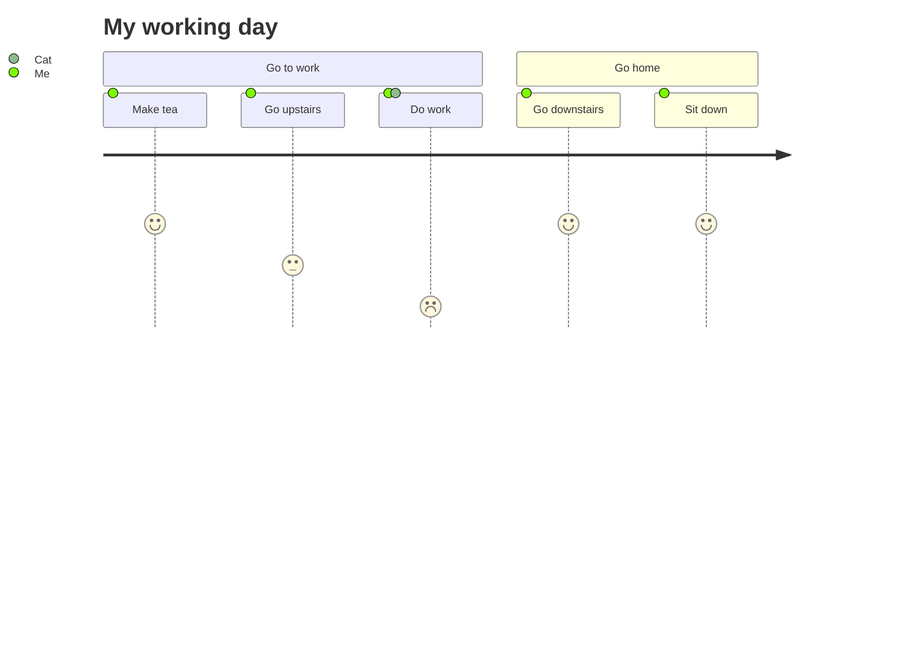
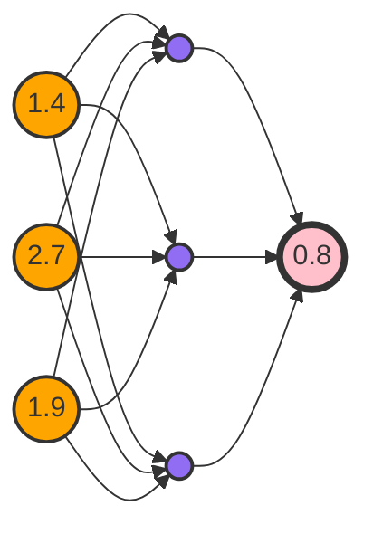

## Headings

<h1>h1</h1>

<h2>h2</h2>

<h3>h3</h3>

<h4>h4</h4>

<h5>h5</h5>

<h6>h6</h6>

## Basic Style

* Normal
* **Bold**
* *Italic*
* ***Bold Italic***
* ~~Strke Through~~
* ==Highlight==
* ==*Italic inside Highlight*==
* *==Highlight inside Itali==*
* ==**Bold indide Highlight**==
* ==***Bold Italic inside Highlight***==
* ***==Highlight inside Bold Italic 1==***
* **==Highlight inside Bold Italic 2==**
* *==Highlight inside Bold Italic 3==*
* ==Highlight with `code`==
* *`code` in Italic*
* **`code` in Bold**
* ***`code` in Italic Bold***
* <u>Underlined</u>
* <font color="yellow">Custom color</font>
* <mark style="background-color:purple">Custom Highlight</mark>
- [ ] Unchecked `- [ ]`
- [x] Checked `- [x]`
- [>] Rescheduled `- [>]`
- [<] Scheduled `- [<]`
- [!] Important `- [!]`
- [-] Cancelled `- [-]`
- [/] In Progress `- [/]`
- ["] Quote`- ["]`
- [?] Question `- [?]`
- [*] Star `- [*]`
- [n] Note `- [n]`
- [l] Location `- [l]`
- [i] Information `- [i]`
- [I] Idea `- [I]`
- [S] Amount `- [S]`
- [p] Pro `- [p]`
- [c] Con `- [c]`
- [b] Bookmark `- [b]`
- [f] Fire `- [ f ]`
- [w] Win `- [w]`
- [k] Key `- [k]`
- [u] Up `- [u]`
- [d] down `- [d]`
- [F] Feature `- [F]`
- [r] Rule `- [r]`
- [m] Measurement `- [m]`
- [M] Medical `- [M]`
- [L] Language `- [L]`
- [t] Clock `- [t]`
- [T] Telephone `- [T]`
- [P] Person `- [P]`
- [#] Tags `- [#]`
- [W] World `- [W]`
- [U] Universe `- [U]`


#tag1 #tag2 #tag3 #tag4 #tag5 #tag6 #tag7 #tag8 #tag9

Other special tags offered by Blue topaz:

* #dailynote 
* #weeklynote 
* #ideas 
* #questions
* #important
* #complete
* #inprogress

> Quote

```java
// Code Block
public static void main() {
	System.out.println("Hello world!");
}
```

---

---

---

1. first
2. second
	1. second first
	2. second second
3. third

* first
* second
	* second first
		* dfsdf
			* sdf
				* sdgsdgsd
					* qfadgg
				* sdgsdgsdg
		* sdgsdgdsg
			* sgsgdsgsdg
	* sdgsdvsdg
	* second second
* third

- [ ] first
- [ ] second
	- [ ] second first
		- [ ] sdgd
			- [ ] eaefgsfasfasjil
			- [ ] dgasdgjsdkljds
				- [ ] dsklvjklajklfjslkfj
				- [ ] sdklvndsklckllf
					- [ ] sssdubn
				- [ ] sdgsdg
	- [ ] second second
- [ ] third

## Colorful Background

```note-orange-bg
note-orange-bg
```

```note-yellow-bg
note-yellow-bg
```

```note-green-bg
note-green-bg
```

```note-blue-bg
note-blue-bg
```

```note-purple-bg
note-purple-bg
```

```note-pink-bg
note-pink-bg
```

```note-red-bg
note-red-bg
```

```note-gray-bg
note-gray-bg
```

```note-brown-bg
note-brown-bg
```

## Colorful Text

```note-orange
note-orange
```

```note-yellow
note-yellow
```

```note-green
note-green
```

```note-blue
note-blue
```

```note-purple
note-purple
```

```note-pink
note-pink
```

```note-red
note-red
```

```note-gray
note-gray
```

```note-brown
note-brown
```

## Hiding Text

### note-cloze:

```note-cloze
text to hide
```

### hibox:

```hibox
text to hide
```

### ad-hibox:

```ad-hibox
text to hide
```

### toggle on float

#### with background

`==~~Hidden Text~~==`

My name is ==~~Spread Zhao~~==

```ad-hint
If you make the `==` and `~~`reversed, it will be like: ~~==Spread Zhao==~~
```

#### without background

`*~~Hidden Text~~*`

My name is *~~Spread Zhao~~*

### toggle on click

`*==~~Hidden Text~~==*`

My name is *==~~Spread Zhao~~==*

## Important

`note-imp`

```note-imp
Something important.
```

## Admonition Plus

```ad-blank
blank
```

```ad-def
This is a definition.
```

```ad-thm
This is a theme.
```

```ad-lem
This is a Lemma.
```
```ad-cor
This is a Corollary.
```

```ad-col2
This is two columns. This is two columns. This is two columns. This is two columns. This is two columns. This is two columns. This is two columns. This is two columns. This is two columns. This is two columns. This is two columns. This is two columns. This is two columns. This is two columns. 
```

```ad-col3
This is three columns. This is three columns. This is three columns. This is three columns. This is three columns. This is three columns. This is three columns. This is three columns. This is three columns. This is three columns. This is three columns. This is three columns. This is three columns. This is three columns. This is three columns. This is three columns. This is three columns. This is three columns. This is three columns. This is three columns. This is three columns. This is three columns. This is three columns. 
```

```ad-col4
This is four columns. This is four columns. This is four columns. This is four columns. This is four columns. This is four columns. This is four columns. This is four columns. This is four columns. This is four columns. This is four columns. This is four columns. This is four columns. This is four columns. This is four columns. This is four columns. This is four columns. 
```

## Image

### Normal Image

![[Knowledge/resources/obsidian_image.png]]

### Sized Image

![[Knowledge/resources/obsidian_image.png|300]]

### Aligned Image

![[Knowledge/resources/obsidian_image.png|L|100]]

![[Knowledge/resources/obsidian_image.png|R|100]]

### Inlined Image

But I am not sure how to implement them, and I’ve spent too much time working on this than actually learning to code :v. I’ll figure those problems out eventually. ![[Knowledge/resources/obsidian_image.png|inlineL|100]] Regardless, you not only answered my question but did so in an way that was super instructive and pointed me in the direction of solving other problems and asking more questions. Thank you, again, so much!!! Thank you for your feedback [@den](https://forum.obsidian.md/u/den), glad you found it interesting and tried to install it! Did you transpile the typescript source with the respective commands? `yarn` and then `npm run dev`? If yes, please feel free to provide more information regarding runtime errors in the Developer Console. ![[Knowledge/resources/obsidian_image.png|inlineR|100]] Currently, no compiled version is provided since it’s an experimental plugin and I would like to get some feedback – ideally from other plugin developers or people with experience – before it is released. Thanks for your understanding! Each Admonition type has a matching CSS class. You could, therefore, create a custom Admonition type (let’s call it “blank”) and use a CSS snippet targeting that class.  ![[Knowledge/resources/obsidian_image.png|inl|50]]![[Knowledge/resources/obsidian_image.png|inl|50]] Some quick testing shows that this CSS snippet works to remove the icon from the title block, no matter which icon is chosen for the custom class:  .admonition-blank .admonition-title-icon {display: none !important;}

### Image with Description

![[Knowledge/resources/obsidian_image.png#center|This is Obsidian|100]]

![[Knowledge/resources/obsidian_image.png#left|This is Obsidian|100]]It was a cold and rainy night in the city. Anna had just finished her shift at the diner and was heading home. She walked to the subway station, hoping to catch the last train. She checked her watch and saw that it was 11:45 pm. She had 15 minutes to spare.She entered the station and bought a ticket from the machine. She scanned it at the gate and walked down the stairs to the platform. The station was deserted, except for a few homeless people sleeping on the benches. She looked at the electronic board and saw that the next train was due in 10 minutes. She sighed and sat on a bench, waiting for the train.She took out her phone and scrolled through her messages. She had no new ones, except for a few spam emails. HAahhasdfsad ![[Knowledge/resources/obsidian_image.png#inl|This is Obsidian|50]]![[Knowledge/resources/obsidian_image.png#inl|This is Obsidian|50]]![[Knowledge/resources/obsidian_image.png#inl|This is Obsidian|50]]She deleted them and put her phone back in her purse. She felt a pang of loneliness. She had no one to talk to, no one to care for her. She had moved to the city a year ago, hoping to find a better life. ![[Knowledge/resources/obsidian_image.png#right|This is Obsidian|100]]But all she found was a dead-end job, a tiny apartment, and a lot of bills. She had no friends, no family, no lover. She wondered if anyone would miss her if she disappeared.She looked around the station and felt a chill. She shivered and wrapped her coat around her. She wished she had someone to keep her warm, someone to hold her and tell her that everything would be okay. She closed her eyes and imagined a handsome man sitting next to her, smiling and whispering sweet words in her ear. She smiled and felt a warmth in her chest. 

## HTML


<p class="stickies">What a <u>beautiful</u> story!</p>She opened her eyes and gasped. There was a man sitting next to her, smiling and whispering sweet words in her ear. He was handsome, with dark hair, blue eyes, and a charming smile. <p class="to-recall">Will you remember me?</p>He wore a black suit and a red tie. He looked like he had stepped out of a movie. "Hello, beautiful," he said. "I've been looking for you."


She took out her phone and scrolled through her messages. She had no new ones, except for a few spam emails. <aside><h1>Important</h1></aside> She deleted them and put her phone back in her purse. She felt a pang of loneliness. She had no one to talk to, no one to care for her. She had moved to the city a year ago, hoping to find a better life. But all she found was a dead-end job, a tiny apartment, and a lot of bills. <aside><h2>Important</h2></aside>She had no friends, no family, no lover. She wondered if anyone would miss her if she disappeared.

## Mermaid



---



