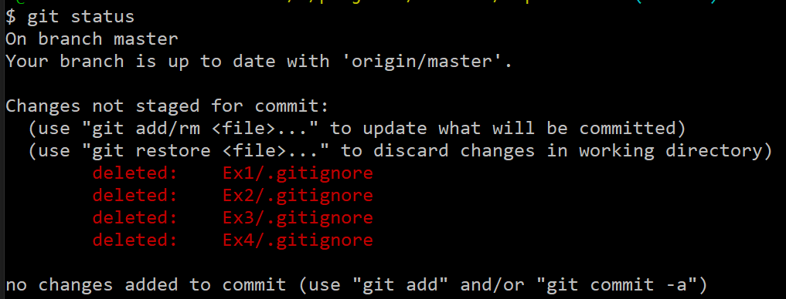
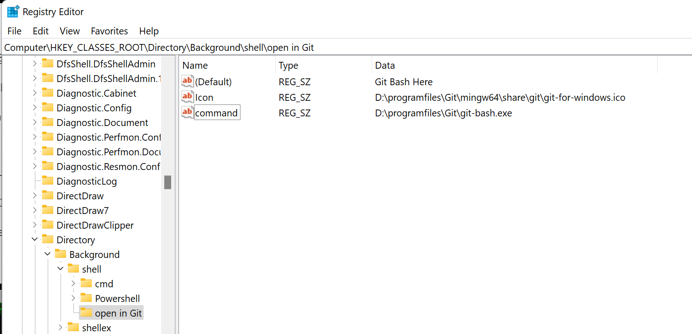
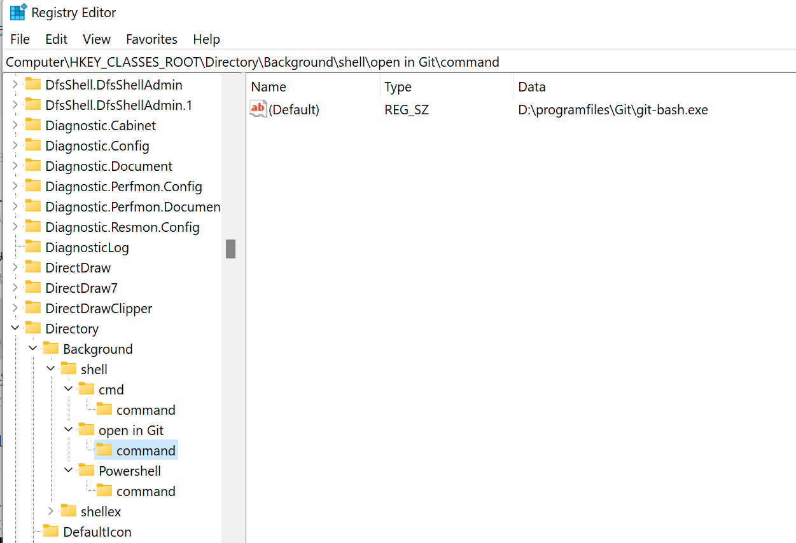
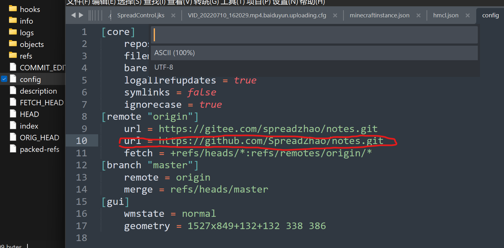
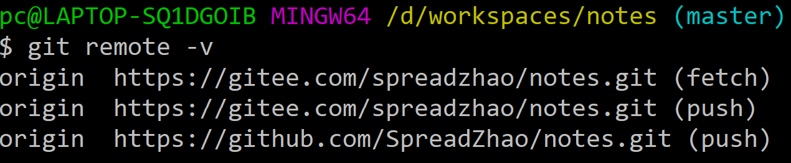
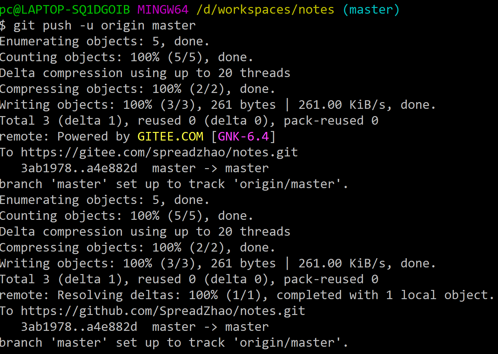

# git使用技巧

## 已经推送过的文件，但是本地发现他不用提交(比如clion的cmake-build-debug)

* 可使用如下代码来操作：

  ```git
  git rm --cached <files>
  ```

* 如果删除的文件不在当前目录下，而在子目录下，需要递归操作：

  ```git
  git rm -r --cached <d1/d2/files>
  ```
  
* 如果不想直接删，只想列出删了什么，就加一个-n

  ```git
  git rm -r -n --cached <d1/d2/files>
  ```

* 然后还需要提交这次修改

  ```git
  git commit -m "deleted files"
  ```

* 最后push

  ```git
  git push
  ```

另外如果不想再继续提交，可以在删除这个文件之后添加到`.gitignore`。比如就是本仓库中的`.obsidian`和`.trash`文件夹在云端删除后可以新建`.gitignore`并这样填写：

```git
.obsidian/
.trash/
```

然后再正常进行提交就不会再提交已经删掉的文件了。

---

## 本地的文件删掉了，我在远程仓库也不要了，怎么把这个删除后的状态同步到远程仓库

* 如果目录中包含中文，使用如下命令配置

  ```git
  git config --global core.quotepath false
  ```

* 删除了本地文件，查看状态

  ```git
  git status
  ```

* 这时候会看到这样的情况



* 然后，提交这次改动

  ```git
  git add -A
  ```

* 然后正常commit+push即可删除，这里-A表示删除mode

---

## 手动添加Git Bash Here到右键菜单

* 打开`regedit`

* 定位到`Computer\HKEY_CLASSES_ROOT\Directory\Background`

* 如图添加键值对


* ~~然后再添加图标和程序目录就好了~~



* 上面这么做是错的！`command`应该建在子项中，参考`cmd`是咋做的



  不过`icon`确实是加在那里

---

## 不clone仓库而添加远程仓库

* `git init`在当前目录下生成`.git`文件夹

* 在那边建好仓库，复制地址

* `git remote add origin <地址>`

  origin就是仓库的名字，可以随便起，只是给本地一个提示罢了，origin是clone下来默认的名字

* 如果改地址，那就`git remote set-url <仓库名> <新地址>`

---

## gitee和github同步仓库，一次提交两次更新

* 首先有一个仓库，然后在另一个上面先import

* 然后在本地的`.git`里加上另一个的url

  

* 这样在`remote -v`的时候就能看到多个地址

  

  > 我们能看到github的只支持push操作不支持pull操作

* 然后在修改提交过后就会有两次提交记录在shell中了




