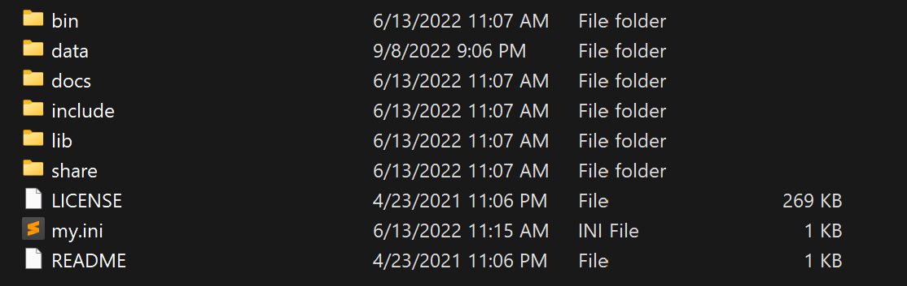

# MySQL的配置

下载MySQL的绿色版。然后解压缩，在里面会发现下面的结构：



* 注：`my.ini`本来是没有的。

然后新建`my.ini`，并写入如下配置：

```yaml
[mysqld]
# 设置3306端口
port=3306

# 设置安装目录
basedir=D:\greenprogram\mysql

# 设置数据存放目录
datadir=D:\greenprogram\mysql\data

# 允许最大连接数
max_connections=200

# 允许链接失败的次数
max_connect_errors=10000

# 字符集
character-set-server=utf8mb4

# 默认存储引擎
default-storage-engine=INNODB

[mysql]
# 客户端默认字符集
default-character-set=utf8mb4

[client]
# 设置mysql客户端连接服务端时默认使用的端口和默认字符集
port=3306
default-character-set=utf8mb4
```

然后开始初始化MySQL。在`bin/`目录下使用`mysqld`执行初始化命令(**管理员**)：

```shell
mysqld --initialize --console
```

这是初始化MySQL，并将结果打印在控制台上。此时会出现一个**初始密码**，需要记住。

然后还要注册MySQL服务并启动它。

```shell
mysqld --install <serviceName>
net start <serviceName>
```

最后就可以用初始化密码登录了。

```shell
mysql -h localhost -u root -p
```

然后还要修改密码：

```shell
mysql> alter user 'root'@'localhost' identified with mysql_native_password by 'New Password';
```

退出：

```shell
quit
```

