<h1>计网笔记</h1>

# Part 1: Basic

## 1. Introduction

### 1.1 Protocol

我们之间说的话，就叫做**协议**。我说的话你能听懂，我说的话牛听不懂。**两者之间的规约要相同，他们之间才能通信**。这个规约就叫做protocol

### 1.2 Telecommunication

远程通信就叫做Telecommunication，传的就是以任何格式表示的信息，也就是Data

### 1.3 Data Communications

两个设备之间的数据交换，需要通过一个媒介(比如电线)。然后这些所有的设备会组成一个Communication System。这个系统就是由一系列硬件(physical equipment)和软件(programs)组成的。这个系统想要有效，需要以下4个东西

* Delivery: 系统必须得把数据**传到对的目的地**。必须由那个期望收到信息的一方收到，并且只能是它
* Accuracy: 你传的Data不能损坏，损坏了就不能用了
* Timeliness: 传数据有时候要**及时(in a timely manner)**。比如视频聊天，你一拍到图像，录到声音就得赶紧传过去了，并且还得按顺序传，不然变成说的道理了。并且传的时候还不能有太大的延迟。这种传输就叫做**real-time transmission**。
* Jitter(抖动): 比如接收视频，每过30ms来一个视频包，那如果一些包有30-40ms的延迟，那这视频质量就会受影响，比如哪一块突然花一下。

### 1.4 Five components of data communication

既然是俩设备之间的通信，那除了他俩，还有啥呢?


* Transmission medium: 就是上面说的发送方和接收方之间的物理媒介。
* Protocol: 发送方要按照规范去发数据，比如Rule1, Rule2等，这些规范双方都是相同的，叫协议，也就是**规则的集合**
* Message: 发送的时候，把数据按照规则打包，打成的包就叫Message

### 1.5 Data flow

#### 1.5.1 Simplex

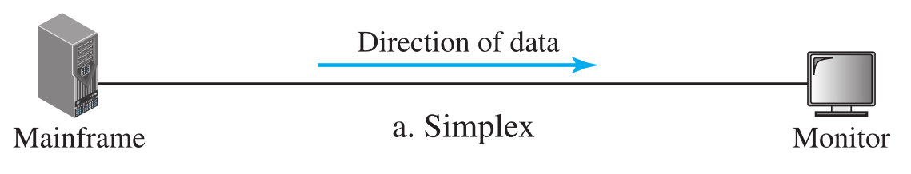

数据只能单向流动。意思就是说，这俩人一个只能发，另一个只能收。比如显示器，键盘就是这样。显示器只能接收图像信息，而键盘只能发送输入的字符。

#### 1.5.2 Duplex

##### 1.5.2.1 Half-Duplex

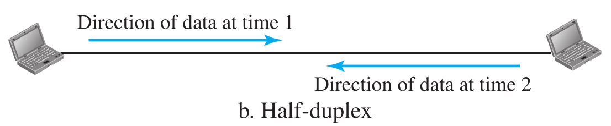

能双向流，但是却不能完全双向流。也就是说在一个时刻只能有一个方向。不能有一个时刻又往左又往右。比如对讲机。你说话的时候就不能听别人说；听别人说的时候你也不能说话。

##### 1.5.2.2 Full-Duplex


可以理解为把两个Half-Duplex的线捆起来(只是理解，真实情况还不一定是这样)。这样就随时想往哪儿就往哪儿。比如电话，就既能说话也能听见别人说话。

### 1.6 Network

什么是网络？数据结构里就学过！带权的有向图就是网。那这里的网络其实就是这个。只不过，其中的边在这里是Link，其中的结点在这里还是Node。它们的集合就是网络。Node可以是计算机，或者host, router；Link就是wired or wireless transmission media，比如cable或者空气。

### 1.7 Types of connections

#### 1.7.1 Point-to-Point

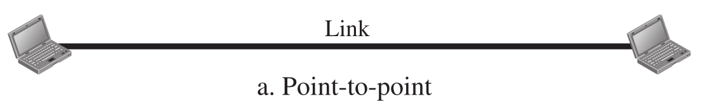

也就是经常见到的p2p。这个Link是被两个Node独享的

#### 1.7.2 Multipoint


很多个Node挂在一个Link上，这样能做到一个发，多个收。有一种广播的性质。这个Link也非常像Bus，由多个结点共享

### 1.8 Physical Topology

由上面两种连接方式，可以分出下面4种网络的拓扑结构

The term **physical topology** refers to <u>the way in which a network is laid out physically</u>. Two or more devices connect to a link; two or more links form a topology. The topology of a network is the geometric representation of the relationship of all the links and linking devices (usually called nodes) to one another. There are four basic topologies possible: mesh, star, bus, and ring.

#### 1.8.1 Mesh Topology


你看这里的每一个结点。除了它自己，它和其他所有的结点都有Link，并且每个Link都只有这俩独享，也就是p2p。简单的数学可以算出，如果有n个结点，那么Link的个数就是$\dfrac{n(n-1)}{2}$。当然，一切的前提是这里的Link是Duplex而不是Simplex。

Mesh的优缺点：

> A mesh offers several advantages over other network topologies.
>
> * First, the use of dedicated links guarantees that each connection can carry its own data load, thus eliminating the traffic problems that can occur when links must be **shared** by multiple devices. 
> * Second, a mesh topology is robust. **If one link becomes unusable, it does not incapacitate the entire system.** 
> * Third, there is the advantage of privacy or security. **When every message travels along a dedicated line, only the intended recipient sees it.** Physical boundaries prevent other users from gaining access to messages.
> *  Finally, point-to-point links make fault identification and fault isolation easy. Traffic can be routed to avoid links with suspected problems. This facility enables the network manager to discover the precise location of the fault and aids in finding its cause and solution.
>
> The main disadvantages of a mesh are related to the amount of cabling and the number of I/O ports required. 
>
> * First, because every device must be connected to every other device, installation and reconnection are difficult. 
> * Second, the sheer bulk of the wiring can be greater than the available space (in walls, ceilings, or floors) can accommodate. 
> * Finally, the hardware required to connect each link (I/O ports and cable) can be prohibitively expensive. For these reasons a mesh topology is usually implemented in a limited fashion, for example, as a backbone connecting the main computers of a hybrid network that can include several other topologies.

#### 1.8.2 Star Topology

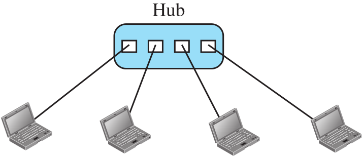

这个Hub就像GitHub里的Hub，就是一个Central Controller。每一个结点都只和Hub有一个p2p连接。那么如果一个设备想和另一个设备通信，就不能像mesh一样直接来了，只能通过Hub来。

Star的优缺点

> Advantage:
>
> * A star topology is less expensive than a mesh topology. In a star, each device needs only one link and one I/O port to connect it to any number of others. This factor also makes it easy to install and reconfigure. Far less cabling needs to be housed, and additions, moves, and deletions involve only one connection: between that device and the hub.
> * Other advantages include robustness. If one link fails, only that link is affected. All other links remain active. This factor also lends itself to easy fault identification and fault isolation. As long as the hub is working, it can be used to monitor link problems and bypass defective links.
>
> Disadvantage:
>
> * One big disadvantage of a star topology is the dependency of the whole topology
>   on one single point, the hub. If the hub goes down, the whole system is dead. 
> * Although a star requires far less cable than a mesh, each node must be linked to a central hub. For this reason, often more cabling is required in a star than in some other topologies (such as ring or bus).

#### 1.8.3 Bus Topology

之前的都是p2p，现在来一个Multipoint，这也正对应了名字里的Bus。这里要注意的就是，因为是一个发，多个收，所以这种方式一定是Half-Duplex，而之前的Mesh和Star既可以是Half，也可以是Full。比如Star种的Hub如果也是个Bus，那就是Half；如果是Switch(交换机)，那就是Full。

#question 那既然Star的Hub可以是Bus，那这不就和Bus Topology一模一样了吗？

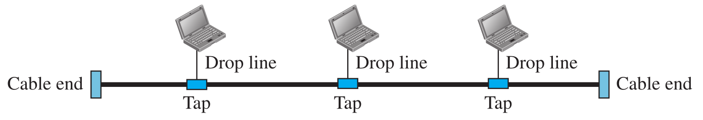

#### 1.8.4 Ring Topology

如果把这根线变成一个圈，就能用Simplex去模拟Duplex了。因为就算不能往另一边走，转一圈回来也能到。

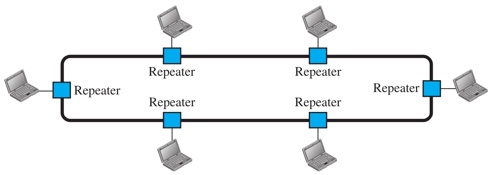

### 1.9 Network Types

#### 1.9.1 Local Area Network

后面的三种: Star, Bus 和 Ring有一个共同的特点：结点和结点之间离得很近。Star的Hub可以放在一个公司里；Bus中的总线也能放在一个固定的地方；而Ring一个环也是一个有限大小的环。所以这三种统称为LAN(Local Area Network)。

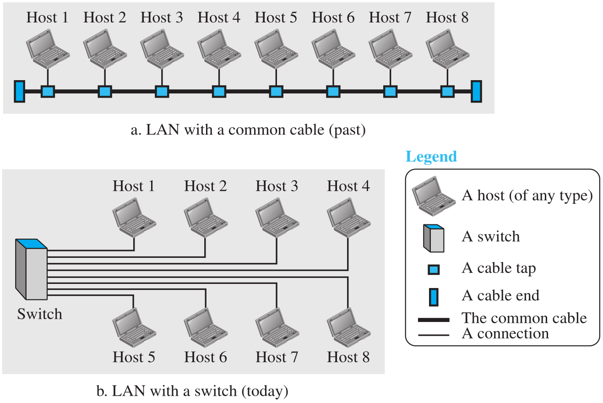

过去的这种LAN，如果一个结点发包，其他所有结点都能收到。那怎么办呢？那个发包的目标就把包留下，其他不想要的就扔掉；**而现在普遍用交换机的这种方式**。先把包发到交换机里，由交换机来把包再传到目的地。这样可以减轻cable的使用率(之前所有人都用一根，那几乎这跟cable时时刻刻都在使用中)，并且可以让**很多个数据传送同时发生**，只要他们之间别犯冲就行。

#### 1.9.2 Wide Area Network

LAN连接的都是host，而WAN连接的都是像switch, router, modem(调制解调器)这样的设备。主要分为p2p类型和Switched类型。

##### 1.9.2.1 Point-to-Point WAN

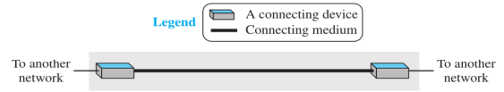

像是之前的Mesh类型，它们每两个结点之间就是这种方式连接的。要注意的是，因为是WAN，所以这里Mesh中的结点就不能是电脑啥的了，要是交换机这种设备才行。

##### 1.9.2.2 Switched WAN

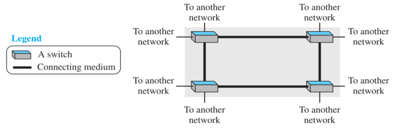

多个p2p类型的WAN结合起来，就变成了Switch类型的WAN，而这里的结点也要是交换机才可以(连名字都是交换机)。这种就是我们现在最常用的网络的类型。

Switched WAN的另一种表示:

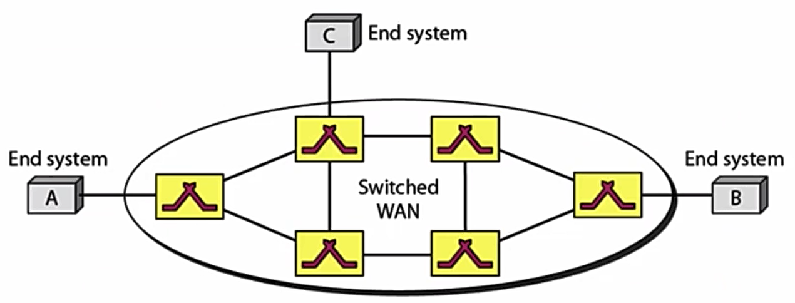

ABC三个End System就可以是我们平常使用的手机，电脑之类的。而它们因为距离很远，如果需要通信的话，就需要一个很大的共享的网络，所以这些黄色的连起来就组成了Switched WAN。

End Node具有数据计算功能，能处理收到的信息，也能存储和发送信息。但是它不能自己去建立很远的连接，比如A就不可能不通过Switched WAN直接把信息发送给B。这些End Node组成的网络能产生和处理数据，我们叫它**资源子网(Resource Subnet)**。

中间的黄色结点叫做Relay Node / Middle Node。它们不能处理数据，但是可以接力，把我收到的数据传给下一个，那么这样一直传，知道目的地，就达到了远距离传送的目的。一般路由器，交换机之类的就是这种结点。那么这些Link和Node组成的专门用来接力和传送数据的网络我们叫它**通信子网(Communication Subnet)**。

而资源子网和通信子网就组成了我们的WAN。

##### 1.9.2.3 Internetwork

LAN和WAN其实现在根本看不到单独的，现在能看到的全是它们一个一个连接起来的形式。如果是两个或以上的LAN或者WAN连接起来，就形成了**互联网(Internetwork, or Internet)**。

接下来是2个Internet的例子。首先是两个办公室，每个办公室内部都有LAN，为了处理本办公室内部的通信，然后这俩办公室由要互相连接，所以用了一个p2p的WAN。

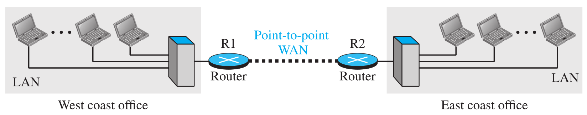

然后是一个很复杂的Internet，由4个WAN和3个LAN组成。


#### 1.9.3 The Internet

注意internet和Internet的区别。小写字母是上面讨论的；而大写字母是全世界最大的，将所有的小internet连接起来组成的唯一的Internet。下面就来分析以下这个全世界最大的网络。

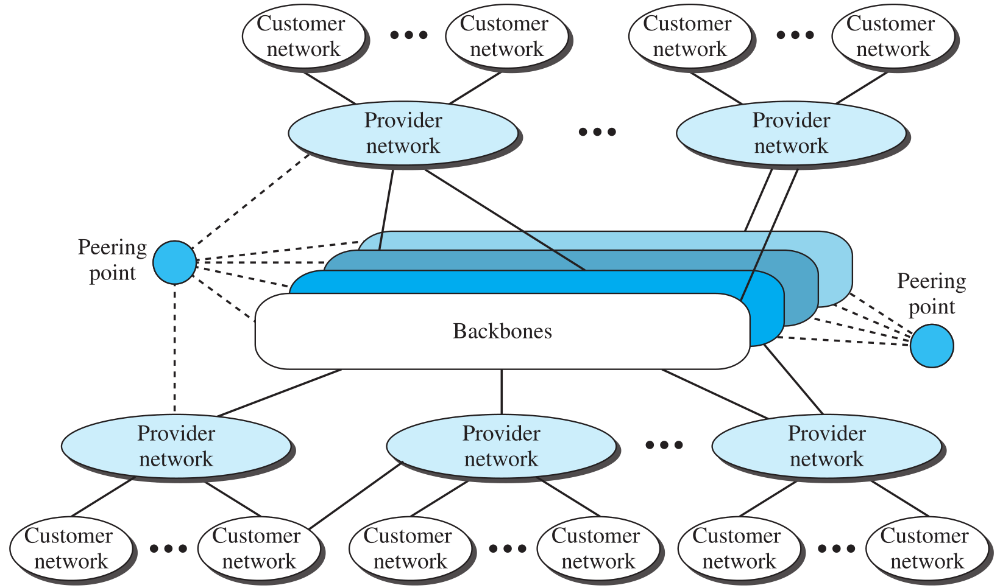

* 首先最大的是**Backbones**，也就是整个互联网的骨架。它们是一些超大公司(比如Sprint, Verizon, AT&T, NTT)的网络，由Peering point(NAP)来连接。
* 然后是**Provider network**。这些也是大公司，只不过它们只是转接来的，比如像移动，联通，微软，谷歌等。它们有的能直接从Backbones那边来货，也可能互相撺掇。
* 最后就是我们这些用户了，其实就是一级一级传下来的，最终这个网络服务的也是这些数量最多的终端用户。
* 另外，Backbones和Provider networks都是提供服务的，真正享受这些服务的并不是它们。所以这些也叫做**Internet Service Providers(ISP)**。而最大的Backbones叫**International ISPs**；小一点的地方的这些Provider networks叫做**National or regional ISPs**。

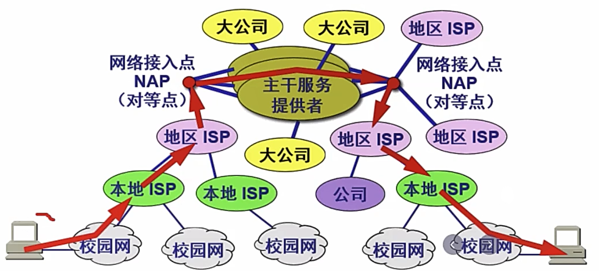

> network access point(NAP): A complex switching station that connects backbone networks.

## 2. Network Models

### 2.1 Protocol Layering

为什么要给协议分层？如果只有俩设备，那当然很简单，俩人遵守一套规则就可以了。但是如今的计算机实在是太多了，手机电脑平板机器人还有各种服务器和嵌入式计算机。如此多的设备想要管理它们之间的通信，就像要管理世界上这么多的人一样，需要分层的结构来进行管理。

首先说一个需要分层管理的例子。有两个人：Maria, Ann。她们离得很远，要用邮件来通信。并且在信传输的时候，万一被拦截了咋办？所以她俩想了个招：给它加密。在传输的过程中传的都是密文，谁也看不懂，然后拿到手之后再解密，就变成了明文。那么对于每个人来说，就很容易地分成了3层结构：收发信、加密和解密、传输信。


下面是书上给的Maria给Ann发信息的例子，很好看懂。

> ​		Let us assume that Maria sends the first letter to Ann. Maria talks to the machine at the third layer as though the machine is Ann and is listening to her. The third layer machine listens to what Maria says and creates the plaintext (a letter in English), which is passed to the second layer machine. The second layer machine takes the plaintext, encrypts it, and creates the ciphertext, which is passed to the first layer machine. The first layer machine, presumably a robot, takes the ciphertext, puts it in an envelope, adds the sender and receiver addresses, and mails it.
> ​		At Ann’s side, the first layer machine picks up the letter from Ann’s mail box, recognizing the letter from Maria by the sender address. The machine takes out the ciphertext from the envelope and delivers it to the second layer machine. The second layer machine decrypts the message, creates the plaintext, and passes the plaintext to the third-layer machine. The third layer machine takes the plaintext and reads it as though Maria is speaking.

由此，我们能总结出分层结构的好处:

* **Separate** the services from the implementation.

  > 各层之间独立，互不相干，我不用关心其他层是咋实现的，做好自己层的事儿就行(写MVVM架构的时候确实深有体会)。

* Another advantage of protocol layering, which cannot be seen in our simple examples but reveals itself when we discuss protocol layering in the Internet, is that communication does not always use only two end systems; there are intermediate systems that need only some layers, but not all layers. If we did not use protocol layering, we would have to make each intermediate system as complex as the end systems, which makes the whole system more expensive.

  > 如果你不分层的话，那么一些系统(比如中间的系统)就会变得非常臃肿，而分层的话就会让这个逻辑尽可能清晰一些。

### 2.2 TCP/IP

全称：Transmission Control Protocol / Internet Protocol。从名字就能看出来，它就是个协议。那么既然是协议，就是一套规则罢了。只不过这套规则是一个"采用上面所说的分层结构"的协议。每一层都能提供服务，也享受服务，享受的就是它下面那一层提供的。


> 左边是老版本，右边是新版本，这里只讨论新版的。

每一个设备都会包括几层这些协议。比如下面的例子中，电脑ABC会包括整个5层；而LAN中的交换机只包括物理层和Data Link层；路由器包括下三层。

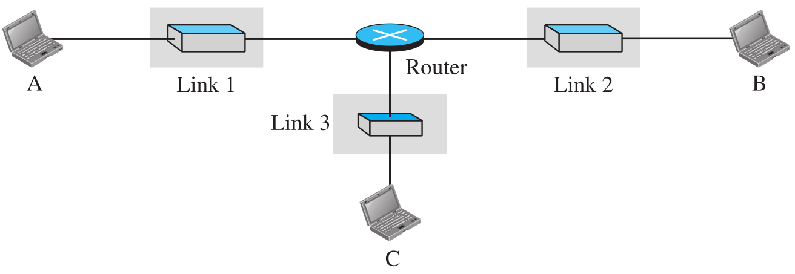

那么A如果想要给B发消息，就是这样的：A要在**应用层**产生一个消息，然后一路向下传到A的物理层，再从物理层传到交换机中，经过一路传递到达B的**物理层**，再从B的物理层一路向上最终到达B的应用层，被使用B的用户所接收。

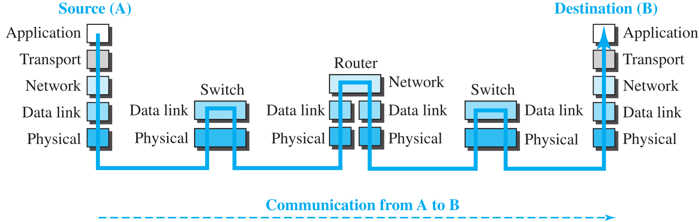

接下来讨论一下为什么它们分别要包括这些层。首先这几个电脑，是要被用户使用的，所以一定需要包括最上层的数据，那么自然需要到达应用层才行。那既然有了应用层，上面的层必定都要有，因为**有了儿子，父亲必定存在(过)**。

然后是比较特殊的路由器。从上面的图能看出来，它只有一层网络层，但是却有两组数据链路层和物理层。这里之所以是两组是因为这里我们画的是A和B通信，所以只是包含这两个交换机的Protocol。实际上，**路由器和几个其他种类的<u>Link</u>连接起来，就应该有几组数据链路层和物理层**。我们就拿上面的例子来说。A那个交换机给路由器发消息需要一组Protocol；而路由器拿到消息之后发送给B的那个交换机有需要另外一组Protocol。很显然**这俩交换机的Protocol是不太可能完全一样的**，所以路由器在这种情况下就需要包含两组Protocol。另外，如果再加上C的通信的话，显然路由器就要包含3组了。

最后是交换机，它们都在LAN中。和路由器不一样，它们虽然也连了两个设备(电脑和路由器)，但是它们之间通信的Protocol都是相同的，也就是说，不需要多组数据链路层和物理层。之所以路由器连接的Link不同，是因为这俩交换机处在不同的LAN中，就像上一段说的，这俩交换机的Protocol是不太可能完全一样的。

**Logical Connection**

这个概念其实不太好理解。我们先拿之前写信的例子来说。


对于Maria和Ann这俩人，我们可以说，她俩虽然距离得很远，但是借助下面这一大坨“工具”，他俩也能够通信。而如果我们往下扒一层，也就是只看Layer3这两个东西，它俩是俩机器，本来也是不能通信的，但是**它俩借助它俩下面的这一小坨“工具”，也能够实现通信**。这个通信，实际上就是传递信息。对于Maria和Ann来说，她俩借助下面的工具，传递的就是信，也就是Plaintext；而对于Layer3这俩机器，它俩也是传递信，那么还是Plaintext；而如果再往下扒一层，到了Layer2，就能发现，Layer2这俩机器也是在借助下面的工具传递数据，只不过这时传递的就不是Plaintext了，而是Chiphertext。由此我们能发现，在**Protocol Layering**的结构下，**每层的发出者和接收者都可以看作是一个假象的“用户”**，它们之间也存在Maria和Ann之间这样的联系——能发送和接受“**对应当前层的、相同的**”数据。这样的联系，就是Logical Connection。 ^0e6bed

接下来，我们来分析一下这个TCP/IP例子中的Logical Connection。

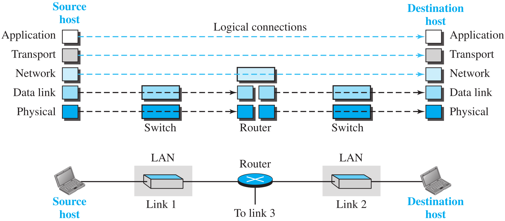

~~对于上面三层，它们之间传递的数据不会有任何改变~~；而下面的两层在传递的过程中，会被路由器改变，而不会被交换机改变。比如Data link层，Source host的数据从这里传出后，经过一系列工具，到达了Destination host的Data link层。但是这过程中在Router的Data link层断了一下。

然后是书上介绍的两个概念：end-to-end / hop-to-hop。上面三层是end-to-end的，而下面两层是hop-to-hop的。我们首先要明确一个概念：中间所有的这些连接，其实都是为了两个电脑能互相通信，所以两个电脑是最边缘的设备，叫做end，而hop可以是中间的设备。所以，上面三层从发出的end到接收的end之间数据都没有变过，所以是end-to-end；而下面两层end-to-end不好使了，因为在路由器那儿数据发生了改变，所以我们引入一个hop-to-hop。只不过这里的hop不能是交换机，因为它不改变数据，所以直接穿过去了。

#question 这里Source host和Destination host拿到的是一样的object吗？不是经过了路由器的改变吗(为了适应不同的LAN，采用了不同的Protocol)？或者换一个问法，数据从Source host传下来，当到达网络层的时候，确实这时候数据是没变过的，但是当到达Data link层的时候，之后的传递过程中在路由器那儿发生了改变，也就是**从Source host的Data link层发出的数据和Destination host的Data link层接收的数据是不一样的**，那么又怎么保证这个接收的数据再向上传递的时候，和Source host那边又变回一致了？

> 数据在两个网络层其实是一样的，没有改变，只不过这里路由器采用了两套不同的协议，真正要传的东西其实是一样的，只是额外附加传的东西会有不同(因为协议不同)。

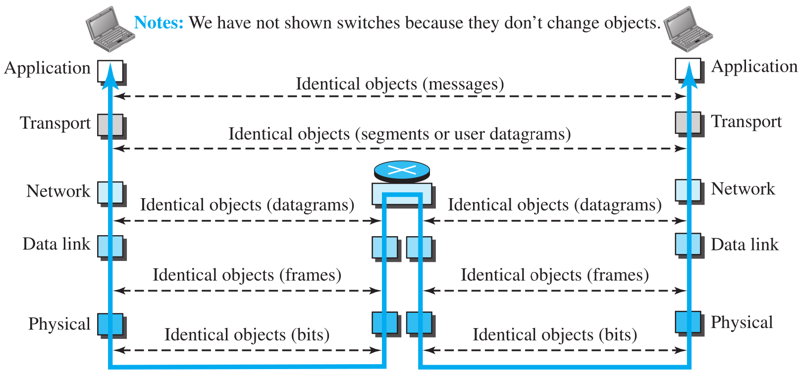

> Identical objects in the TCP/IP protocol suite

虽然我们说两个host的网络层之间存在Logical Connection，但是**它们传递的数据是不一样的(对应上面的删除线)！**从上面的图也能看出来，这个Identical objects在网络层不是一段而是两段，因为路由器接到数据后会把传来的包切成很多片，但是在发送的时候，会发送更多片(为什么之后再说哦)。因此传递的数据确实是不一样的，只不过**真正要传的东西其实还是没有改变**。

接下来是**重点中的重点！**为什么这里是断开的？


是因为：**这俩玩意儿根本就不能通信！！！**协议不一样那咋通信？所以我们才需要断开。

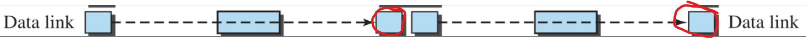

**说完了TCP/IP协议，下面来看一看这个协议中的每一层具体都是干什么的。**

#### 2.2.1 Physical Layer

这是TCP/IP的最底层，但是这层其实还不是最底层的东西，它下面还藏着一层，叫Transmission media。这是为什么呢？我们从上面的图也能看出来，**物理层传递的信息就是bit**，而bit其实还是个人为抽象的东西，它还要在Transmission media继续被拆成电信号，才能真正传递。所以虽然是TCP/IP的最底层，它们之间的通信还是Logical上的通信。**而Transmission media就是连接两个物理层之间的东西**。

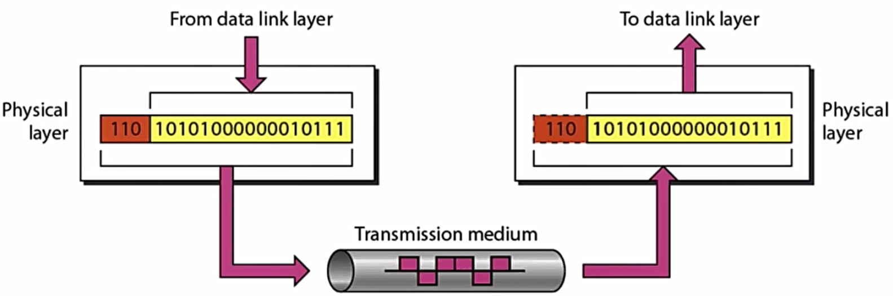

#### 2.2.2 Data-link Layer

简单记，**数据链路层就是通过link传递packet**。如今的网络连接非常复杂，所以信息的传递会有很多条道路。之前说过，这个道路其实就是Link，而**路由器的职责就是在这些道路中选择最好的最快的**。而选好了道路后，接下来的传递工作就是数据链路层做的。也就是之前说的hop-to-hop，这样的传递就是帧(frame)传递，就是**将数据打包成一帧一帧**。另外，数据链路层还会有一些其他的功能，比如数据检错和纠错功能，实现方式就是在数据**末尾**打上纠错码。如果给两个hop直接上物理的连接，就很有可能出现错误，所以**数据链路层让这个不可靠的连接变得可靠了**。同时，如果是像1.8.3中的Bus的那种形态，数据链路层还能处理冲突的问题。**总的来说，数据链路层的传递其实和物理层差不多，就是包装了一下而已**。


#### 2.2.3 Network Layer

首先，之前说过网络层的传递是end-to-end。更加详细点儿来说，是**host-to-host**。也就是从一个计算机传递到另一个计算机。那么在这个传递的过程中，可能会经过路由器，所以这些路由器也要包含网络层。而就像上面说的，**路由器的职责就是给每个包选择最好的路线**。网络层的职责就是**完成这种host-to-host的信息传递和根据可能的路径去运输这些packet**。所以网络层中传递的信息就是包(packet)或者数据报(datagram)，而传递的这个路径就叫做Path。

#question 数据链路层和网络层都提到了路由器的职责，那么这个功能到底是包括在网络层还是包括在数据链路层？或者是这俩其实是不相同的功能，只不过有些类似而已？

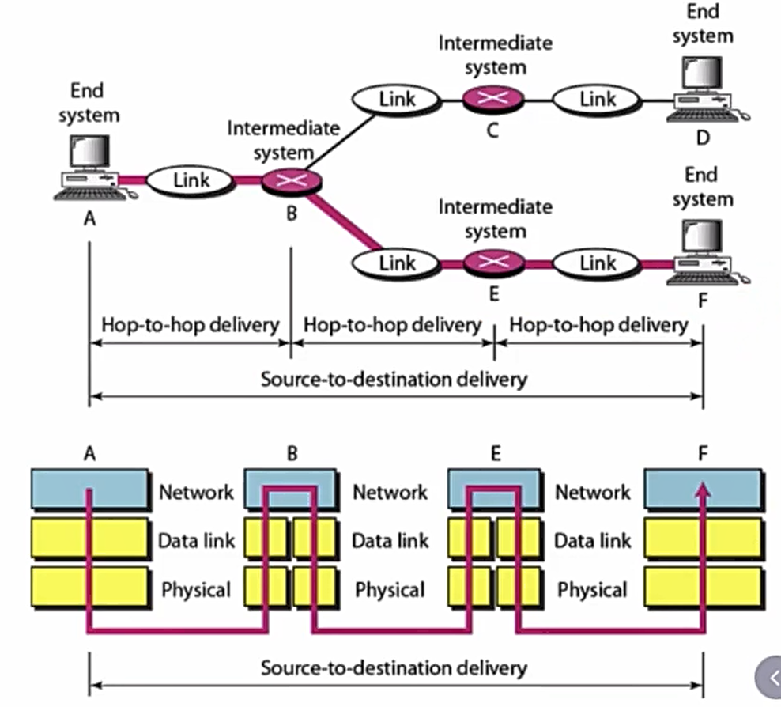

> 这里展示的就是从A到F，中间有三个Link，它们组成的就是一个Path。

网络层非常重要，其中一个原因是它包括了非常有名的协议——IP(Internet Protocol)。在这个协议中，数据被进一步包装成新的格式——**datagram**，也就是packet的进一步包装。IP地址也是在这一层中被创建和使用的，主要目的就是为了将数据从source传递到destination。比如一个路由器A想要把数据传给下一个路由器B，A就要拿到B的IP地址，然后按着地址去传递这个数据。IP其实很多功能都是没有的，比如不能控制流速(flow control)，不能纠错(error control)，不能处理服务冲突。所以如果软件需要这些功能，就只能依靠下层的Data-Link Layer中的协议才行了。

网络层中还有另一种协议，叫做routing protocol。这东西其实还是和之前说的路由器的职责有关。为啥路由器能决定到底那条路线才是最佳的呢？靠的就是这个协议。这个协议能够创建出一个表格叫做**forwarding table**，它能帮助路由器来判断到底那条路线是最好的。routing protocol也分为两种，unicast和multicast，也就是一对一和一对多的两种。另外网络层中还有一些辅助协议，这些协议之后再说。

> **数据链路层和网络层的区别**
>
> * 作用不同：数据链路层实现具体的传输~（仅仅高于物理层而已）而网络层是实现网络功能。
> * 传输单元不同：（明显的不同）网络层是大名鼎鼎的IP包，DL层则是数据FRAME。
> * 协议不同：网络层就是IP协议，数据链路层协议则很多。HDLC和PPP等等。　网络中程序员多数考虑的是网络层。

#### 2.2.4 Transport Layer

首先，这里面有TCP。没错，就是**Transmission Control Protocol**!那既然这东西本身都在这层了，那这层就毫无疑问非常重要了(另外的IP在下面的网络层，所以这俩都挺重要)。到了传输层，思路就显得非常清晰了，其实就是**将数据从source host的应用层拿过来，然后传输层会使用它下面的"工具"来将数据发送到对方的应用层**。这个工具其实就是它下面的层给他提供的service，而由于传送使得双方的传输层也建立了一个Logical Connection。根据下面的定义我们也能看出来，**传输层完成的也是进程和进程之间的通信**。

TCP的作用：在**传输数据之前**，在双方的传输层之间建立一个Logical Connection。TCP中当然包括了之前说的网络层没有的那些东西，比如

* **flow control**: matching the **sending data rate** of the source host with the **receiving data rate** of the destination host to prevent overwhelming the destination.

  别发的那边一个劲儿发，收的那边根本来不及收，到时候直接给对面干崩溃了。

* **error control**: to guarantee that the segments arrive at the destination without error and resending the corrupted ones.

  这里的segment是指：发送方从source host的应用层拿到消息后，会给它包装成一个符合传输层的包，叫做segment或者user datagram(由不同的传输层协议决定，也就是TCP或者后面的UDP)

* **congestion control**: to reduce the loss of segments due to congestion in the network.

除了有TCP，还有另一个协议，叫做**UDP(User Datagram Protocol)**。它和TCP最大的区别，就是它是connectionless的，也就是它**不会**在数据传输之间在双方传输层间建立Logical Connection。它非常简单，传输的时候每一个user datagram都是独立的，比如一个视频，拆成无数小段，每一段都是个独立的user datagram，如果**前一个在传的过程中挂壁了，那我这个也照样传**。如果只有一个两个的这种情况，其实根本不会对视频画质有啥影响，但是多了的话，就会出现卡顿，花屏，音画不同步这些问题。

另外，还有一种新的协议叫**SCTP(Stream Control Transmission Protocol)**，这个之后再说。

#### 2.2.5 Application Layer

我们感知最强的其实就是这一层了。拿B站来举例子，我们手机上的B站其实是个客户端，那么客户端一定是一个**程序**(Program)，也一定是操作系统中的一个**进程**(Process)(Program和Process的区别见操作系统的笔记)。而在B站总部那边也一定有一个相应的程序，叫做服务端。我们从客户端发送请求，然后传递到服务端，服务端收到后把指定的视频拆成一小份一小份再传递回来，这就是我们点击了一个视频后所发生的事情中的一部分。**应用层的职责就是处理进程和进程之间的远距离通信**。

这里面的协议可都是耳熟能详。**HTTP**(Hypertext Transfer Protocol)用来接触互联网(Wide Web, or WWW)、还有收发电子邮件的SMTP(Simple Mail Transfer Protocol)、用来传文件的FTP(File Transfer Protocol)、用来远程连接的TELNET(Terminal Network)和**SSH**(Secure Shell)、用来管理互联网的SNMP(Simple Network Management Protocol)、还有将域名和IP地址映射成数据库以便获取对方网络IP的**DNS系统**(Domain Name System, 注意，DNS不是协议是系统，只不过它经常被其他协议使用)，还有IGMP(Internet Group Management Protocol)等等。

---

以上就是各个层的作用和它们之间的联系。接下来介绍两个在这些层次中穿插的概念，我们不止一次提到了"打包"和"拆包"这样的概念，那么数据究竟是怎么在传输过程中一次次被打包成对应层级的对象，又是怎么被接收方逐步提取出来，最终到达目的地的应用层的呢？靠的就是**Encapsulation**和**Decapsulation**。

先来回顾一下之前的那个例子。


在这个过程中，打包和解包的过程就是这样的。


> 注意：没有展示出交换机，因为交换机不会打包和解包数据。

**先来介绍source一方打包的过程**

1. 在应用层，数据就是原来的数据，这里记作Message，直接往下传就好。
2. 当传输层拿到Message后，因为要处理flow control, error control等东西，所以要在前面加上个东西，叫做**header**，用来管理这些东西。打好的包就像之前说的一样，叫做**segment(TCP)**或者**user datagram(UDP)**。
3. 网络层拿到后，自然是要加上和IP有关的东西了。首先就是source host和destination host的地址，然后还有一些进一步纠错的乱七八糟的东西。总之打完的包就叫做**datagram**，继续往下传。
4. 数据链路层会处理更加细节的东西。既然是hop-to-hop的，那么就自然要往上面添加host或者下一个hop(比如路由器)的数据链路层地址。然后打好的包就叫做**frame**，继续传到物理层。

**然后是路由器的解包和打包过程，因为路由器连了两个设备，所以要先解包再打包。**

1. 从source的物理层传到路由器的物理层，再传到路由器的数据链路层。首先，把这个frame解包，也就是把它添加的东西扒掉就行了，把剩下的发送给网络层。
2. 在网络层中，它会检查在datagram header中的source host和destination host的地址(之前说打包过程中放进去的就是这些)，然后创建forwarding table来选择最佳路线(也就是选择下一个hop，这个表格之前也 说过了)。这层中数据不会有任何增减，除非我发的时候发现太大了，需要裁成小块才行。然后这个datagram通常会原封不动返回给数据链路层。
3. 到了数据链路层，和之前一样，还是打包成frame传递给物理层

**最后是destination的解包过程。**

其实就是打包反过来，一层层扒。只不过**在解包的过程中要进行错误检查**，不然那些纠错码又是干啥用的呢!

**Addressing**

要传数据，就肯定要地址。在每一层之间都有地址，source address和destination address。这里物理层是个例外，因为物理层传的是bit，根本没法往里放地址，而精确的传递由数据链路层来搞定。


在应用层，地址就是名字，比如[www.baidu.com]或者[spreadzhao@163.com]等等。而到了传输层，地址就是**端口号**，不同的程序有不同的端口号，这样就能区分是哪个程序发出的请求。在网络层的地址其实就是**ip地址**，每一个设备都有独一无二的地址，根据这个地址就能精准确定是哪一个设备了。在数据链路层的地址有时候也叫做[[#^b66b20|MAC]]地址，这是为了在LAN或者WAN中精准定位这个设备。这些地址之后都会涉及到。

### 2.3 The OSI Model

OSI: Open Systems Interconnection，是一个模型，由International Organization for Standardization(ISO)建立，一共7层。

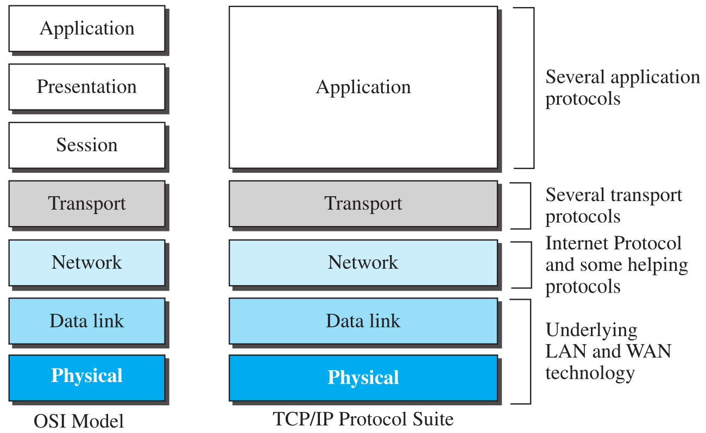

和TCP对比一下就能看出来，它俩唯一的区别就是：把TCP的应用层拆成3个就变成了OSI层。

# Part 2: Physical Layer

## 3. Introduction to Physical Layer

### 3.1 Data and Signals

[[#2.2.1 Physical Layer|2.2.1]]就说过了，物理层传的是bit，而真实的传递要靠**电磁波**才可以。所以我们先来看一下这个传的东西到底是什么。

#### 3.1.1 Analog and Digital Data

* **Analog data**: 比如我们的声波，还有实数，这些都是**连续**的数据。所以我们要用**模拟**的方式去将这些数据变成电磁波，也就是连续的波形。
* Digital data: 比如人为规定的离散的数据，比如电脑里随便存的一个文件、游戏等。这些都是0和1组成的离散数据，所以用离散的波形就能传递。

#### 3.1.2 Analog and Digital Signals

数据还是没法传的，但是信号却可以传。所以**我们可以用这两种信号来传这两种数据**。


### 3.2 Periodic Analog Signals

#### 3.2.1 Sine Wave


* peak amplitude(A): 波峰
* frequency: 频率，$f = \frac{1}{T}$。
* phase: 相位，初始的value。

#### 3.2.2 f and T

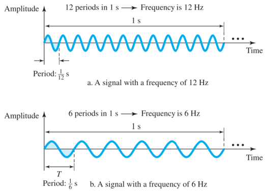

#idea **频率就是1秒钟扑腾的次数。** ^84ab18

**常用的频率和周期单位：**

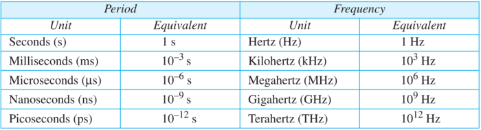

接下来我们玩点儿极限的：如果频率变成0会咋样？也就是周期无穷大，那么这个波就是从头到尾永远是一个值。那我们就称这个为**直流信号**。它在数据传递的时候鸟用没有。如果频率是无穷大的话，周期就是0，也就代表它只要一瞬间就有很大的变化。

#### 3.2.3 Phase


#### 3.2.4 Wavelength

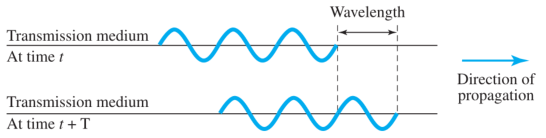

这里波长用$\lambda$来表示。很显然，波速是c，周期是T，那么：
$$
\lambda=cT=\frac{c}{f}
$$

#### 3.2.5 Time and Frequency Domains

之前画的波形都是**时域(time-domain)**的。比如下面一个时域的正弦波形：

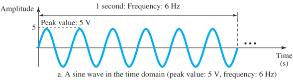

但是这个时候如果再加上一个波形，看着就会很混乱。而一个牛人傅里叶就搞定了这个东西，引入了**频域(frequency-domain)**图。看下面的图就能看出来，它不关心取值随时间的变化，而只关心它的**峰值是多少，频率是多少**。

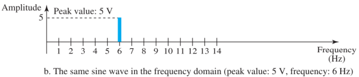

那么这个图要是想加一个波就很简单了：只需要知道它的频率和峰值，画根线就搞定，而且只要频率不相等，就不会有重叠，看着清爽舒服。

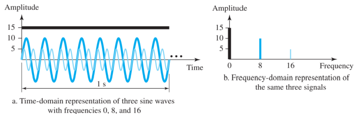

#### 3.2.6 Composite Signals

如果我们只传正弦波的话，收到的就是"哔"一声，所以我们必须要用很复杂的波形才能传递连续的信息。那么怎么传复杂的波？还是靠傅里叶。按他老人家说，有两条结论：

* 任何复杂的波形其实都是简单的正弦波的组合。只不过这些正弦波的频率，峰值和相位不一样罢了。

* 如果复杂的波形是周期性的，那么组成它的正弦波的**频率是离散**的；如果不是周期的，那么分解后的各位的**频率就是连续**的。

  > ***这里的离散和连续指的是==频率==而不是分解完的波本身！<u>波就是正弦波</u>。***

比如，下面是一个复杂的周期波形，它的频率是f：


那么我们可以将它分解，分解的结果如下：

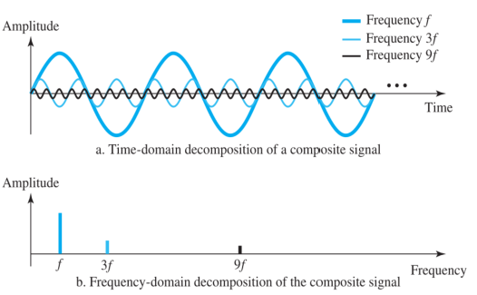

**我们能看到，组成这个复杂波的正弦波的频率就三种，所以是离散的**。

另外，如果是一个非周期的复杂波的话：


**那么组成它的正弦波的频率就是连续的，有无数个频率**。

#### 3.2.7 Bandwidth

**带宽：复合信号的最高频率和最低频率的差值。**


### 3.3 Digital Signals

变化是离散的，就是**数字信号**。


a图中有2个电平，能表示1bit；b图中有4个电平，能表示2个比特。以此类推，如果要表示3个bit的话，就需要有$2^3 = 8$个不同的状态。**表示n个bit的话，就需要$2^n$个level**。

#### 3.3.1 Bit Rate

**bit rate: bits per seconds**(**bps**)。也就是每秒钟发送多少个bit。

#example 假设一个字有1byte，也就是8bit，一行有80个字，一页有24行。如果我们要求速度是一秒钟100页的话，我们的bit rate就要达到：
$$
100 \times 24 \times 80 \times 8 = 1536000\ bps = 1.536\ Mbps
$$

#### 3.3.2 Bit Length

位长对应的其实是analog signal中的波长。
$$
位长 = 波速 \times 位持续时间
$$
位持续时间就是横轴上1跨了多少，0跨了多少的那个时间。

#### 3.3.3 Digital Signal as a Composite Analog Signal

**数字信号其实就是复杂的模拟信号**。那么我们来讨论一下怎么去分解。首先是它的频率。数字信号包括横着不动的线和竖着的线。在[[#3.2.2 f and T|3.2.2]]中也说过，竖着的表示一下就变过去了，那么频率就是无穷大；横着的表示一直不变，频率就是0。那么**数字信号的频率一定是有无穷多个的，带宽也一定是无穷大**。

数字信号也分为周期和非周期，那么按照[[#3.2.6 Composite Signals|3.2.6]]所说也能分为连续的频率和离散的频率。

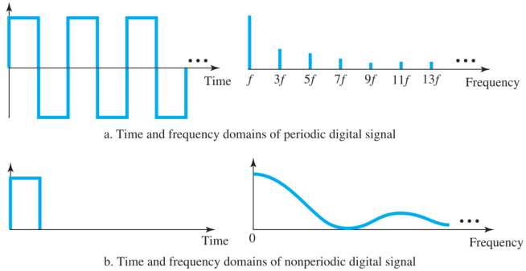

#### 3.3.4 Transmission of Digital Signals

##### 3.3.4.1 Baseband Transmission

对于上面的这个频域图，我们人需要的其实只是前半部分，靠近0的，峰值高的部分。

![[Networking/img/bt.png|300]]

怎么掐掉后面那一咕噜呢？用的就是**low-pass channel**。字面意思，只允许低频的信号通过，并且**一定要是从0开始才行**。这样的传输就叫做**基带传输**。下面是两种带宽的low-pass channel。


那么有没有可能有一种low-pass channel，它最高支持的频率是无穷大？现实生活中没有，但是我们在努力往上整。

low-pass channel的带宽会影响什么呢？就是bit rate。频率其实就是变化的幅度，那么频率越高的话，变化的就越快，那么**相同时间内状态就会越多**。因此也能传更多的bit，bit rate更高。

经过实验可以知道，我们真正在传数字信号的时候，其实一定是有亏损的，那么我们要尽可能去做到**保留好数字信号的波形**。起码你传过去后得能认得出是个数字信号吧！如果整的跟狗啃的似的那就白扯了。又经过实验可以知道，**只有非常宽的带宽，或者无限宽的带宽的low-pass channel才能完整保留数字信号的波形。**

那么我们怎么能尽可能保留呢？首先来看一下bit rate。如果一个**channel的带宽是B**，bit rate是N，那么经过数学计算能得到：
$$
B_{min}=\frac{N}{2}\ or \ N=2B_{min}
$$
**这里说的带宽是channel的带宽而不是信号的带宽，指的是容量而不是实际含量，在3.6.2中有更详细的说明。**

我们大概蒙一下：如果我们传的信号是`010101...`或者`101010...`这种一直在变化的，那么我们先画一下它的波形：


那么我们就能计算出来它在一个周期内能传2个bit，那么bit rate $N=\frac{2}{T}$。因此能计算出频率
$$
f=\frac{1}{T}=\frac{N}{2}
$$
另外更重要的一点是，我们以上讨论的是**周期最短的情况**。可以想象一下：只要序列不是这样的，周期一定会比这个长。因此它的频率一定会比$\frac{N}{2}$要小。所以这个就是最大的频率了。**而最小的频率，因为是基带传输，所以一定是0**。那么带宽自然就是$\frac{N}{2}$了。

因此我们能得出结论：**要想比较好得保存数字信号的波形，带宽最小也得是$\frac{N}{2}$才行。**

那么我们先来看一看，$\frac{N}{2}$到底能保存成个啥样子。还是上面那个波，如果用$\frac{N}{2}$的波来模拟，是这样：

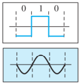

可见，确实形状挺像。但是你要说很像还远远谈不上。所以我们看看带宽变大是个啥样子：

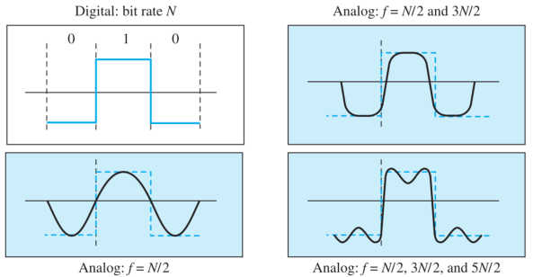

很明显更加像这个方波了。因此我们的带宽越大，保存效果就越好。另外需要注意的是，这里是带宽而不是频率，*带宽其实是隐含有多个频率，但又不是多个频率的和的一个概念*。所以这里的图才是三个频率、两个频率在一起，而不是分开的。

另外我们还能映照之前的结论：**带宽越宽，bit rate越高**。下面是常见的带宽需求：

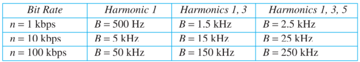

带宽的单位是Hz，而bit rate的单位是bps。因此我们能近似认为：**带宽和bit rate是等价的。带宽越宽，网速越快！！！** ^ca317a

##### 3.3.4.2 Broadband Transmission

和之前相对的，起始频率不是0，就是带通信号了。首先，**因为频率中不含有0，一定不是数字信号**。因为数字信号中一定有不变的，频率为0的段。

那么问题就来了：我这个通道既然都不支持数字信号，那咋传数字信号？别忘了我们3.3.4就是在讲怎么传数字信号！解决方法是：将数字信号先变成模拟信号来传。怎么变？靠的就是大名鼎鼎的[[#^c21122|调制解调器(modem)]]。详细的讲解在后面。

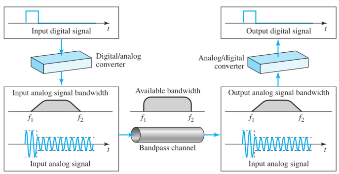

### 3.4 Transmission Impairment

#### 3.4.1 Attenuation

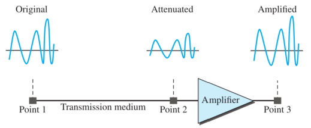

因为电子的布朗运动或者啥啥的原因，波会向外发散，整体会变小。因此我们使用**放大器**可以变回来。

信号衰减了多少，我们可以用**分贝**计算出来。分贝的本质就是信号的相对强度，可以是两个信号比较，也可以是一个信号在两个位置的比较。

如果一个信号的功率下降了一半，那么这个过程中衰减的能量：
$$
10log_{10}\frac{P_2}{P_1}=10log_{10}\frac{0.5P_1}{P_1}=-3\ dB
$$
如果一个信号的功率提升了10倍，那么这个过程中增加的能量：
$$
10log_{10}\frac{P_2}{P_1}=10log_{10}\frac{10P_1}{P_1}=10\ dB
$$
有了分贝的概念，我们用加减法就能描述信号的衰减和放大了：


#### 3.4.2 Distortion

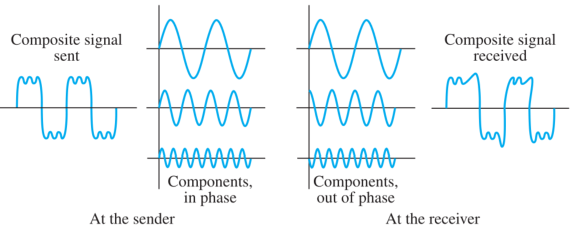

失真就是因为收发**双方相位不一致**导致接收的波形发生扭曲。我们用**均衡器**能修正这种错误。

#### 3.4.3 Noise

噪声分为白噪声和冲激噪声。白噪声对信号不会产生影响，但是冲激噪声会。

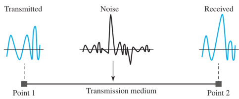

为了研究这种噪声，产生了一种概念：**Signal-to-Noise Ratio(SNR)**。也就是信号强度和噪声强度的比值(**这里的强度可以是功率也可以是电压**)。为了方便计算，这里也引入了分贝。

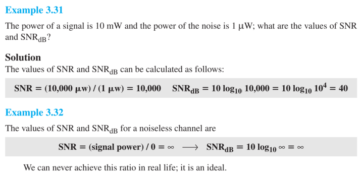

由SNR的定义也能看出来：SNR越大，证明信号越厉害，那么想**解调**出来也越容易；SNR越小，则噪声越厉害，想**解调**出来就难了。

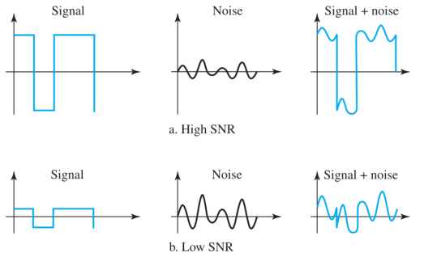

### 3.5 Data Rate Limits

根据上面所讲，我们能知道bit rate受下面的因素影响：

* **Bandwidth**：带宽越大，频率越高，变化越快，相同时间内能传的数就越多。
* **Level of signals**：3.3一开始就提到了，电平数越多，能表示的bit就越多。
* **Quality of channel**：通道质量越好，当然传的也快，还要看降噪能力。

#### 3.5.1 Nyquist Bit Rate

#poe 如果是**无噪声的通道**，那么根据Nyquist定律可以得出**最大的bit rate**：
$$
N_{max}=2 \times B \times log_2L
$$
其中N是bit rate，B是带宽，L是电平个数。你可能会问：*之前在3.3.4.1中不是推出来$B \geq \frac{N}{2}$吗？为什么这里又多乘了一个$log_2L$？*这是因为，**上面那个只是电平个数为2的特殊情况**，把L=2带进去就行了。

另外，我们不禁会想到：既然L越大N就越大，那我一个劲儿加电平个数，网速不就能呼呼涨了吗？当然没你想得那么美。因为**电平个数的增加会影响信号的质量，让SNR变小，从而更加脆弱**。

#### 3.5.2 Shannon Capacity

显然，无噪声的通道根本不存在。所以我们的**香农定理**更加重要。Shannon capacity也是bit rate，一个在有噪声环境下的通道的最大的bit rate。
$$
Capacity_{max} = bandwidth \times log_2(1+SNR)
$$
这里并没有电平个数。表明不管你有多少电平数，都不可能比$Capacity_{max}$更大了。

如果有一个极其垃圾的通道，它的SNR是0，表示信号在这里几乎被噪声完全碾压了，它的容量就是这样的：
$$
C=Blog_2(1+SNR)=Blog_2(1+0)=0
$$
代表这个通道啥也传不了，**不管你带宽有多宽都不好使**。

### 3.6 Performance

网络怎么才叫快？来介绍几个术语。

#### 3.6.1 Bandwidth

之前就已经提过了，带宽就是最大的频率和最小的频率之差，是由赫兹来表示的。另外，也介绍了带宽和比特率的关系。带宽越宽，比特率通常也会更高。**这也就是我们说的谁谁家里是1000M带宽的由来**。

#### 3.6.2 Throughput

带宽越宽，网速越快。但是有时候我们家里明明是千兆甚至万兆带宽，有时候网也会卡的要死。这是为什么呢？其实带宽根本不是衡量**实时**网速的东西。我们的吞吐量才能衡量真实情况下网络的速度。

#example 比如一个10Mbps的带宽，每分钟能传12000帧，每帧平均有10000bit。那么这个网的吞吐量是多少？
$$
Throughput=(12000 \times 10000)/60 = 2\ Mbps
$$

#### 3.6.3 Latency(Delay)

比如直播的时候，从真正的主播那儿开始，到观众收到直播，中间肯定会有延迟。而这个延迟其实是由4部分组成的。

* **Propagation time**

传播时间，就是一个bit从起点到终点经过的时间。
$$
Propagation\ time=\frac{Distance(m)}{Propagation\ Speed(m/s)}
$$
通常速度是小于真空中光速$3 \times 10^8\ m/s$。

> 受到[[#13.2.1 CSMA/CD|13.2.1]]的影响，我发现了一个非常适合解释这个时间的比喻，具体就到那儿去看吧。。。

* **Transmission time**

发送时间。比如第一个bit，它到达目的地后，所用的时间就是上面的Propagation time。但是，这时候信息传完了吗？显然没有！后面还有一串等着呢。所以等最后一个bit到达之后才算结束。那么我们想想，在第一个bit到达目的地时开始计时，在最后一个bit到达目的地后结束计时。这一段时间就是整个消息流过的时间，也就是Transmission time。很显然，计算这个就看**整个消息有多少bit**和我**每秒能传多少bit**，然后再一除。
$$
Transmission\ time = \frac{Message\ size}{Bit\ Rate} = \frac{Message\ size(bit)}{Bandwidth(bit/s)}
$$

* **Queuing time**

比如传到一些交换机或者路由器结点了，同时有好多人一下进来。这个时候肯定要排好队一个一个出，所以有些信息需要排一会儿队。这个时间就叫Queuing time。

* **Processing delay**

还是传到中间结点那儿，就算只有你一个，你也不能马上就走，也要经过一些处理。这部分时间就是Processing delay。

最后，整个的延时就是这几部分的和：
$$
Latency=propagation\ time+transmission\ time+queuing\ time+processing\ delay
$$

#### 3.6.4 Bandwidth-Delay Product

将带宽和时延结合起来才是数据通信中比较重要的概念。带宽是表示一秒能传多少个bit，而时延表示的是我这个管子在传数据的时候的大概的时间。因此**将它俩乘起来就表示我们的这个管子最大能装多少bit**。

*这里我们将中间的交换机、路由器之类的都抽象成了这个管子的一部分。*

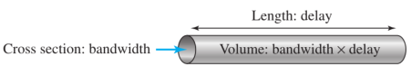

## 4. Digital Transmission

### 4.1 Digital-to-Digital Conversion

之前说了，数据和信号都可以是模拟的或者数字的。现在就来说说怎么用数字信号去发送数字数据。

#### 4.1.1 Line Coding

既然要用信号表示数据肯定要从小入手。首先看它们最小的元素：**signal element**和**data element**。它们分别表示信号和数据最小能表示的东西。而**我们用数据和信号的比值r来表示信号承载数据的能力**。通常，data element指的就是1bit。

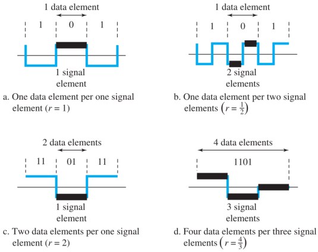

然后要衡量传的有多快，我们之前也介绍过，就是bit rate。显然，**bit rate是用来衡量data传的速度的**；而如何去衡量signal传的速度(**signal rate**)呢？用的就是**pulse rate**(也可以叫**modulation rate**或者**baud rate**)。

如果信息要想传的快，归根结底就是**用更少量的信号去传递更多的数据**，这样我们才能最高效地传输。之前说过$\dfrac{data\ element}{signal\ element}=r$，也就是一个信号能承载r个数据。那么**假设在$t$时间内传输了$x$个信号，我们就能知道，这x个信号承载了$xr$个数据**。我们分别计算一下数据和信号的速度：
$$
data\ rate=\frac{xr}{t},\ signal\ rate=\frac{x}{t}
$$
因此，我们令$data\ rate=N,\ signal\ rate=S$，会发现N和S有如下关系：
$$
\frac{N}{S}=r
$$
我们发现，影响它们的因素似乎只有r，也就是一个信号承载几个数据。但是事实却不是如此，在[[#3.3.4.1 Baseband Transmission|3.3.4.1]]中就说过，带宽会影响bit rate，而这里并没有和带宽、频率等有关的变量。因此我们这个等式只是一个特殊情况。实际上，平均下来，signal rate和data rate的关系是这样的：
$$
S=c \times N \times \frac{1}{r}\ \ \ \ or\ \ \ \ S=\frac{cN}{r}
$$
#poe 其中c是case factor，会根据情况改变。通常取值为$[\frac{1}{2},\ 1]$。**这个公式背下来**！本章中是$\frac{1}{2}$，下一章是1。

带宽实际上就是频率，而频率就是信号的改变。那么信号的改变和signal rate之间有没有什么关系呢？经过实验可以得到，**最小的带宽就是signal rate**。因此我们把这个发现带入上式，可以得到：
$$
B_{min}=c \times N \times \frac{1}{r}
$$
所以实际上，我们使用的网线、家用宽带的带宽可以是大于等于$B_{min}$的任意一个值。而一旦我们选定了一套配置，这个带宽也就定下来了。这个时候，r和c就会影响N，也就是bit rate的大小。

现在回想一下之前说的电平。3.3.1的时候我们说，如果有两个电平，那么我们**每个电平**能表示1个bit；如果有L个电平，每个电平能表示$log_2L$个bit。将这个结论结合上我们上面的式子，我们能发现：好像这玩意儿就是在说我们式子里的r啊！因为r就是一个信号能携带几个bit。那么我们取一般的情况，也就是1个bit就是一个data element。**那么每个电平能表示$log_2L$个bit，就代表一个信号能携带$log_2L$个data element**：
$$
r=log_2L
$$
我们将这个结果带回到上式，能惊讶地发现：
$$
N=\frac{1}{c} \times B \times log_2L
$$
这与我们3.5.1的Nyquist Bit Rate一模一样。因此我们不难发现，其实本式就是Nyquist的一般形式：
$$
N_{max}=\frac{1}{c} \times B \times r
$$
**基线、基线偏移、直流分量和自同步**

> **Baseline Wandering**
> In decoding a digital signal, the receiver calculates a running average of the received signal power. This average is called the **baseline**. The incoming signal power is evaluated against this baseline to determine the value of the data element. **A long string of 0s or 1s can cause a drift in the baseline (baseline wandering) and make it difficult for the receiver to decode correctly**. A good line coding scheme needs to prevent baseline wandering.
> **DC Components**
> When the voltage level in a digital signal is constant for a while, the spectrum creates **very low frequencies** (results of Fourier analysis). These frequencies around zero, called **DC (direct-current) components**, present problems for a system that cannot pass low frequencies or a system that uses electrical coupling (via a transformer). We can say that DC component means 0/1 parity that can cause base-line wondering. For example, a telephone line cannot pass frequencies below 200 Hz. Also a long-distance link may use one or more transformers to isolate different parts of the line electrically. For these systems, we need a scheme with no DC component.
> **Self-synchronization(把时钟绑在信号上)**
> To correctly interpret the signals received from the sender, **the receiver’s bit intervals must correspond exactly to the sender’s bit intervals**. If the receiver clock is faster or slower, the bit intervals are not matched and the receiver might misinterpret the signals. Figure 4.3 shows a situation in which the receiver has a shorter bit duration. The sender sends 10110001, while the receiver receives 110111000011.
> A **self-synchronizing** digital signal includes timing information in the data being transmitted. This can be achieved if there are transitions in the signal that alert the receiver to the beginning, middle, or end of the pulse. If the receiver’s clock is out of synchronization, these points can reset the clock.
>
> 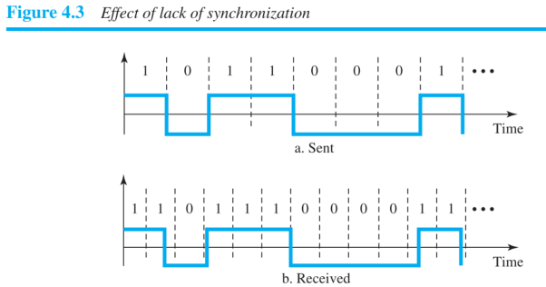

#### 4.1.2 Line Coding Schemes

现在就是要讲到底我怎么给电平赋予意义，让啥是1，啥是0？下图是总体的策略：

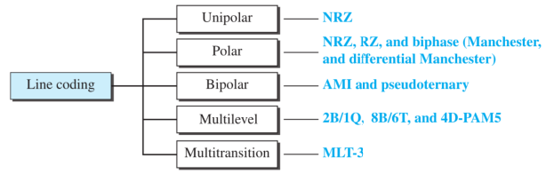

##### 4.1.2.1 Unipolar Scheme

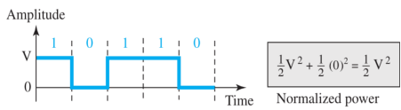

这种方式功率非常高，所以现在几乎不用了。

##### 4.1.2.2 Polar Schemes


在上图中，r=1，带入4.1.1中的式子：$S=c \times N \times \frac{1}{r}$，能计算出$S_{ave}$ = N / 2。

首先来看上面的NRZ-L(Non-Return-to-Zero-**Level**)，这表示这种电平不会回到0电平。低的表示1，高的表示0。这种方式在01交替的时候挺好用，但是如果出现连续的0和1，会产生没有同步信号的情况，如果长时间没有改变的话，会有时钟和信号对不齐的情况。

然后是下面的NRZ-I(Non-Return-to-Zero-**Invert**)，首先不管第一个是啥，都编上0。走到第一个时钟的时候，开始看这个信号是否发生变化：如果变了，下一个bit就是1；如果没变就是0。这种方式，如果是很多个1的话，这个码就会一直变来变去，时钟也很好同步；而如果是长连0的话，其实和NRZ-L的问题一样。

> #keypoint NRZ-I：见1就翻码。

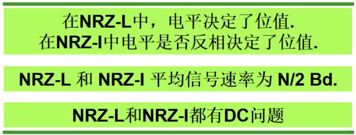

#example 使用NRZ-I传输10 Mbps的数据，问平均信号速率和最小带宽是多少?

还是带到$S=c \times N \times \frac{1}{r}$中，c取$\frac{1}{2}$，r取1，能算出来平均信号速率是$\frac{N}{2}$，也就是$\frac{10^7}{2}\ baud = 5\ Mbaud$，而最小的带宽其实就是平均信号速率(见前文)，所以$B_{min} = S = 5\ MHz$。

#question 书上给的是500 kbaud和500 kHz，我强烈怀疑书上错了？

---

为了解决上面的时钟同步问题，我们发明了一种归零码(**Return-to-Zero, RZ**)：


可以看到：不管是0还是1，在每一个信号最后都要回到0。**如果从负电平回到0就是0；如果从正电平回到0就是1**。使用了这种编码方式后，我们能发现采用了3个电平。相比较于两个电平，它的抗噪声能力就会变弱，也就是**SNR会变小**(在3.5.1中也提到过)。我们好像从来没提到过为什么会这样，现在来解释一下。其实就是因为噪声会影响信号原来的波形。**电平越少，那么原来的波形就更简单**。这样即使你使劲儿霍霍对它造成的扭曲也是比较小的；而如果电平数很多的话，波形肯定会更加精细，这样在受到破坏的时候就很难知道它原来是什么样子了。

使用抗噪能力变弱换来的好处就是**自同步**功能。在每一个信号处，不管是1还是0都会发生跳变，也就能给时钟传达信息，也就能更好地和时钟贴合。

再来看一下RZ之中的参数。首先是r，因为每个data element要用两个信号去表示，所以r = $\frac{1}{2}$。然后带入式子$S_{ave}=B_{min}=c \times N \times \frac{1}{r}$，算出数据率平均信号速率S = N。通过对比我们也能发现，为了增加时钟同步的功能，我们把带宽也提高了一倍。

---

然后是双相码(biphase)，也叫Manchester编码。它分为差分(**Differential Manchester**)和不差分(**Manchester**)的。

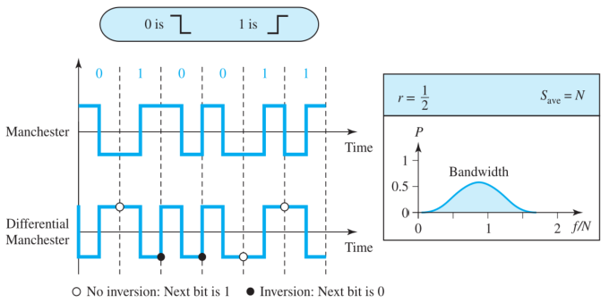

首先看不差分的Manchester编码。很容易就能发现，从高电平跳到低电平是0；反之就是1。这种编码结合了NRZ-L和RZ的思想。而如果我们把NRZ-I和RZ结合一下，就得到了下面的Differential Manchester。走到第一个时钟的末尾的时候开始看：**此时此刻**有没有发生突变。如果变了，下一位就是0；如果没变，下一位就是1。注意这和NRZ-I的规则是正好相反的。在NRZ-I中，如果没变下一位才是0。那么第一个比特是什么怎么看呢？就看最开始有没有跳变。上图中有，所以是0。**不管是差分还是不差分，在每个信号的中间都一定要发生一次跳变。**

这种编码也是1个bit用两个信号来表示，所以$r=\frac{1}{2}$，因此它的平均信号速率和最小带宽都是N。**而它相比较于RZ的好处就是只使用了2个电平，所以SNR会比它更加高**。

#poe NRZ-I: 见1就翻；Differential Manchester: 见0就翻，中间全翻。

##### 4.1.2.3 Bipolar Schemes

相比较于Polar，就是使用了3个电平：正，负，零。

首先来看AMI和Pseudoternary，它们互为相反的关系。

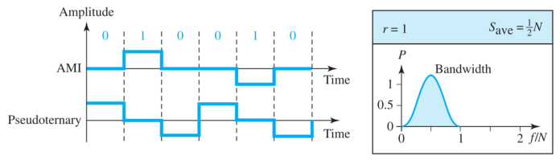

对于AMI，如果是长连1的话，会产生正负正负的交替。这样就也能产生时钟；另外如果是长连0的话，因为它的**峰值**也是0，所以也不会有直流分量。因此AMI没有DC component。而且长连0的问题可以用后面的**扰码**来修复。Pseudoternary的正好相反。

这两个波的$S_{ave}$和$B_{min}$都是$\frac{1}{2}$，这样也减小了带宽，对比RZ能看到很多优点。

---

在介绍多电平编码之前，回想一下之前说的r < 1的情况：r表示一个信号元素能携带几个数据元素(bit)。而如果r < 1的话，就是说多个信号元素只能携带1个bit。也就是下面的情况。

![[Networking/img/r1.png|200]]

而我们似乎很少讨论诸如：3个信号元素携带4个bit的情况。

![[Networking/img/r2.png|200]]

现在就讨论讨论这种多个信号合在一起去表示多个数据bit合在一起的情况。假设我们有m个bit，那么很容易就能算出有$2^m$种组合。

那么如果我们有L个电平的话，在每一个**数据组合的笼罩**下，我们能组出多少种信号的组合呢？那要看我们能**把这个笼罩切成多少段**。那么这个段数是什么？其实就是**信号元素的个数**。

> 如果我们现在有2个电平，每个笼罩切成1段，那么很显然就只有2种组合：
>
  ![[Networking/img/r3.png|200]]
>
> * **这一段要么是0，要么是1。**
>
> 如果有3个电平，每个笼罩切成2段。那么我们给三个电平编号成0, 1, 2，写入到这2段中，能发现这些组合：
>
> ```c
> 0 0
> 0 1
> 0 2
> 1 0
> 1 1
> 1 2
> 2 0
> 2 1
> 2 2	//共9种
> ```
>
> 也就是说，每一段都是个空。**每个空里既可以填0，也可以填1，还可以填2**。那要是我们有n个空，能填的数有L个，那么总共的组合很显然就是n个L相乘：$L^n$。
>
> 将上述结论带到电平中就能发现：有L个电平，每个笼罩切成n段，这总共的组合就有$L^n$种。

现在问题就变成了：**用$L^n$个信号组合去表示$2^m$个bit的组合。**给定了L, n, m，就能写出一个多电平的编码方式。因此我们将这种方式称为**mBnL**。其中B表示二进制，L如果是2，3，4则分别应替换成B，T，Q。

首先来看一个例子，**2B1Q**。很显然，m = 2, n = 1, L = 4。因此它的**数据组合**一共有$2^2 = 4$种。信号的组合一共有$4^1 = 4$种。我们发现它俩正好相等，所以**一个数据组合就只能用一个信号组合来表示了**。

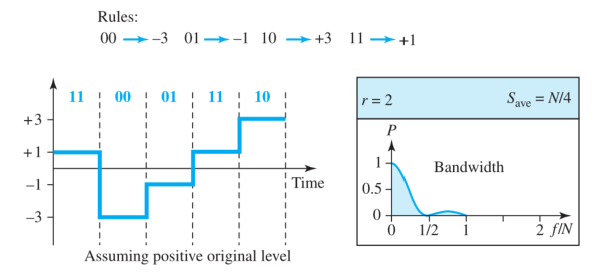

然后是8B6T，举一反三即可。

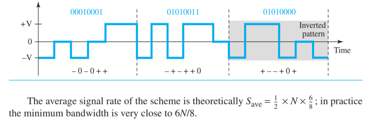

* **书印错了，最小带宽是$\frac{3}{8}N$**

#### 4.1.3 Block Coding

之前说过，有长连0的情况对于很多编码都会有影响。因此我们要一些技术来避免这种情况。其中一种就是**分组编码**。现在如果有m个bit，其中有长连0。那么我们通过一些手段，把它变成n个bit，使得**这n个bit中不出现很长的0序列**，就能更好地同步时钟了。


**这种方式我们也叫做mB/nB的方式(n > m)**。

比如4B/5B这种，就是先把原序列拆成4个一组，然后每一组都用一个5个bit的新组来替代，最后把这些新组拼到一起。使用了这种方式后，使用NRZ-I传输的情况就变成这样了：

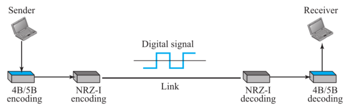

其中最重要的一个步骤：替代，到底是怎么替代的呢？肯定是有一种特定的映射规则。

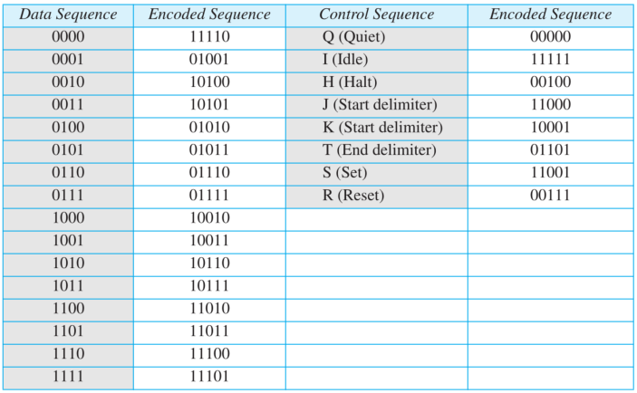

通过表中我们能发现：在替代过之后的新序列中，**最多只会出现3个连着的0**(2个拼一起)。

> 但是这么操作的代价是什么呢？假设我们原来的数据率是$N_1=\frac{x(bit)}{t_1(s)}$，那么如今我们多加的bit数是$\frac{x}{4}$，所以使用的时间会提升为$t_2=\frac{\frac{5}{4}x}{N_1}$。因此我们要是想和原来花费一样的时间，就只能提高数据率，提升为：
> $$
> N_2=\frac{\frac{5}{4}x}{t_1}=\frac{5}{4}N_1
> $$
> 而将N1和N2分别带入到$S_{ave}=\frac{cN}{r}$中能得到：
> $$
> S_2=\frac{5}{4}S_1
> $$
> 所以我们的平均信号速率和最小带宽也因此提升了**原来**的25%。

接下来说一说这个表是咋来的。其实替代的n个bit我们是可以选择的。比如在4B/5B中，原来的码有$2^4 = 16$种组合，而我们替代完之后有$2^5 = 32$种可选。所以我们只需要**在32种组合种选出16种不会有长连0的情况**就可以了。

#example 我们要的速度是1-Mbps，那么如果使用**4B/5B + NRZ-I**或者**Manchester**，最小带宽？

首先明确NRZ-I和Manchester的$S_{ave}$：

* $S_{ave}$(NRZ-I) = N/2
* $S_{ave}$(Manchester) = N

然后就很简单了，你是先提升25%后再算；还是先算完再提升25%都行。

* $B_{min}(NRZ-I + 4B/5B)=\frac{5}{4} \times \frac{N}{2}=\frac{5}{4} \times \frac{1\ Mbps}{2}=625\ kHz$
* $B_{min}(Manchester)=N=1\ MHz$

然后谈一谈选择问题。其实**4B/5B + NRZ-I**是完全碾压**Manchester**的。因为前者的带宽小，而且也没有直流分量问题。前面我们说过，单独的NRZ-I有直流分量问题，是因为它在**长连0的时候容易出现非0电平的水平线**，这种线就会产生直流分量问题。而4B/5B这种技术基本消除了长连0的情况，所以它的直流分量是微乎其微的。

---

然后顺带说一下光纤中常用的8B/10B码：


#### 4.1.4 Scrambling

先来复习一下AMI码：


可以看到，它在长连0的时候一直不动，所以我们要让它动，就是靠**扰码**。

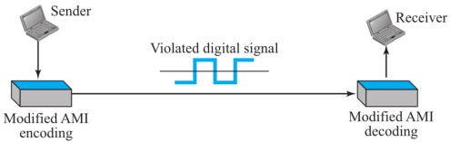

扰码分为**B8ZS**和**HDB3**。

首先来看一下B8ZS。第二个8表示我们要处理的是8个连着的0，既然是这样，那么原来的码一定是这样的：

```
1 | 0 0 0 0 0 0 0 0 | 1
```

那么它的波形一定是这样的：

|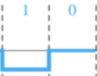

注意AMI的波形规则：如果有波澜(出现1)，必须是“正反正反”的规则。也就是**距离最近的两个1的波形必定相反**。那么我们就能知道在这8个0前面的1要么是向上，要么是向下。

接下来介绍8BZS的替换方式：**将8个0替换成`0 0 0 VB0VB`**。其中，V表示**Violation**，即违反AMI的规则；B表示**Bipolar**，即顺从AMI的规则。所以以上的两种波形会被替换成如下的波形：

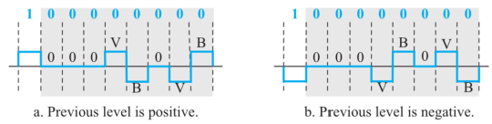

---

8BZS有一个很明显的问题，7连0咋办？7个0也不短了，所以我们还得有别的招儿才行。

HDB3就是另一种方法。直接看结果：

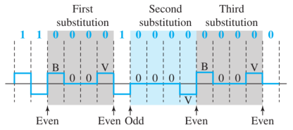

从码头开始数：遇到`0000`就开始替换。首先看从头到第一个`0000`处有多少个1(凸起)：

* **如果是奇数个，就把这个位置替换成`000V`**
* **如果是偶数个，就把这个位置替换成`B00V`**

然后再接着数，到下一个`0000`的时候，**看我上一次替换的`0000`到这里之间的1**(凸起)，还是使用上面的规则，一直到末尾为止。

为什么要这么做呢？我们来讨论一下：B和V的出现其实就是为了让系统能检测出来我的替换。我检测到这里是凸起，按照AMI的规则本来应该识别为1，但是因为我加了这些替换，导致我最终认为这是0而不是1。那么我这么认为的底气是什么？就是靠**总共的凸起的个数**。我们分析一下上面的规则就能发现：这么做之后不管怎么替换，**最后的凸起总数总会是偶数个**。偶数就是问题的关键。因为AMI的编码中规定每2个相邻的凸起必须相反，所以我们只要检测了偶数个码，就能够发现其中的蹊跷。

### 4.2 Analog-to-Digital Conversion

在4.1中，我们看到了将数字数据(也就是0和1)转换成数字信号，以便存储和发送。而我们的数据通常还有很多模拟数据，比如视频和音频。所以我们还要知道**怎么把模拟的信号$\longrightarrow$数字信号**。

#### 4.2.1 Pulse Code Modulation

传感器可以把模拟的数据变成模拟的信号。比如我们对着麦克风说话，我们的声波就会被其中的声音传感器转换成电磁信号，这就是一种模拟信号。而这种信号是连续的，我们很难用0和1去表示它。所以我们要将这个模拟的信号转变成数字信号。

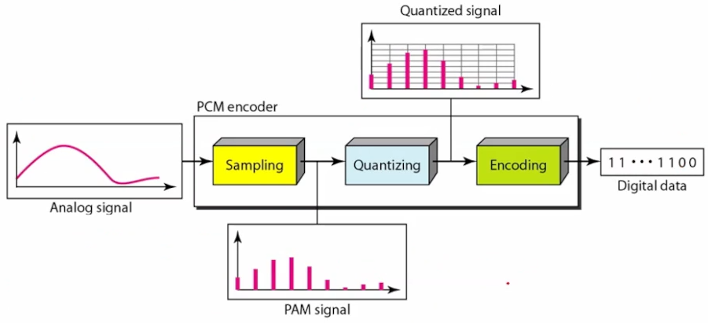

我们看到，模拟信号进入PCM编码器后，出来的就是数字信号了。而PCM编码器中有这三个部分：

* Sampling: 采样，将模拟信号变成PAM信号。其实就是取离散的时间，**将原波形在横轴上变离散，而纵轴还是保持连续的**。所以**PAM信号也是模拟信号**。如果采样的手段符合**Nyquist采样定理**，可以做到无损采样，也就是完全可以相互转换，不会有任何损失。
* Quantizing: 量化，将纵轴也变成离散的。这样操作之后，所有的幅度就会被近似值取到最近的网格对应的值上。因此这种操作会对信号造成无法复原的硬伤，也一定会有损失。
* Encoding: 我们把量化后的表格放倒，用n个bit去表示每一个柱子的高度，最终就能得到整个文件的二进制形式了。其实8bit音乐就是使用了这样的技术。

> 对于采样的速率，我们有这样的要求。比如我们要对一段语音进行采样，已知这段语音的**最高频率**为4000 Hz，那么我们**采样的速率就要是它的2倍**，也就是每秒8000个样本。而如果给的是带宽的话，就要参考下图了：
>
> 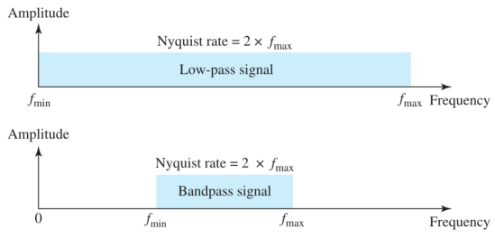

然后是量化和编码的例子：

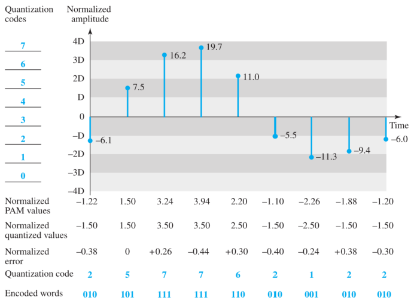

我们能看到在这个例子中，我们画了8个格子。对于每个幅度，看它落在哪个格子里，然后给每个格子编上码就可以了。因为有8个格子，所以我们用3个bit正好能表示$2^3 = 8$种状态。

我们能发现：画的格子越多，我们的误差就越小。而我们之前说过，信号的损失(**由于噪声，不是量化**)是可以用SNR来衡量的。而经过实验可以证明：**画的格子越多，$SNR_{dB}$就越大，抗噪能力就越强**。而**我们画的格子越多，其实就是我们使用的编码的bit越多**。所以如果bit数是$n_b$，我们能用数学证明：
$$
SNR_{dB}=6.02n_b+1.76\ dB
$$

#example 比如我们想要让一个电话线路的抗噪能力高于40，那么我们采用的位数是多少？

$$
SNR_{dB}=6.02n_b+1.76\ dB=40\ \longrightarrow n=6.35
$$

所以一般采用7或者8个bit。

还有一种情况：比如我们说话的时候，可以很小声。而这么小的声音，在量化的时候很可能被取成0，导致啥也听不到。所以我们又提出了**均匀量化**和**非均匀量化**的概念：

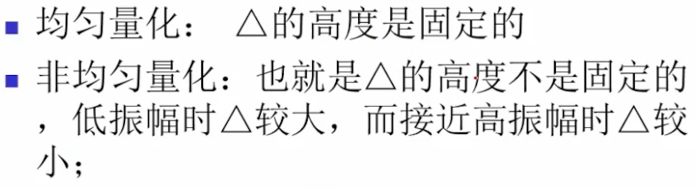

比如对数函数：在数值小的时候斜率高，在数值大的时候斜率低。这样就能做到**放大小信号，压缩大信号**，提升收音的整体质量。

最后，我们来说一下采样后的结果的bit rate。我们将模拟信号转换成了数字信号，而数字信号就是在传输bit，那么这个信号的bit rate是多少呢？很显然，这和我们量化的手段有关。我们采用了多少个bit去编码呢？bit越多，声音就越精细，那么相同时间内传输的信息就越多，bit rate就越高。

**如果我们采用了$n_b$个bit去编码，那么编出来的波形的bit rate就是这样的：**
$$
Bit\ rate=Nyquist\ rate \times n_b
$$
#poe 其中的Nyquist rate就是上文提到的**采样速率**。比如我们要数字化人的语音，使用8bit编码，那么比特率就是这样计算的(人的语音通常包含0-4000 Hz)：
$$
Nyquist\ rate=2 \times f_{max}=2 \times 4000 = 8000\ (samples/s)
$$
$$
Bit\ rate=Nyquist\ rate \times n_b=8000 \times 8=64\ kbps
$$
**有了代换后的数据率，或许我们可以计算一下带宽的要求了**。算完的带宽我们假设是$B_{min}$，那么有：
$$
B_{min}=S_{avg}=\frac{cN}{r}=\frac{c}{r} \times Nyquist\ rate \times n_b=\frac{c}{r} \times 2 \times f_{max} \times n_b
$$
而我们的$f_{max}$如果是**在最低频率为0**的情况下，就是带宽。但是要注意这个带宽是**未采样时的带宽**，也就是**模拟信号的带宽**，记为$B_{ana}$。这样再带入上式：
$$
B_{min}=\frac{c}{r} \times 2 \times B_{ana} \times n_b
$$
我们取c = 1/2，r = 1，可以得到如下结论：
$$
B_{min}=n_b \times B_{ana}
$$
因此我们可以说，**为了将人声的模拟信号变成数字信号存到计算机里，我们需要的带宽变成原来的$n_b$倍**。

---

接下来看一下，我们怎么把PCM编成的数字信号恢复为模拟信号。

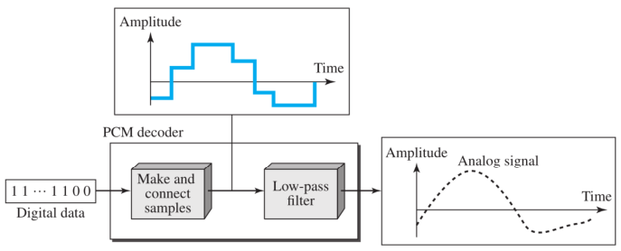

### 4.3 Transmission Modes

信号传输的过程，可以分为**并行**和**串行**。而串行又分为同步、异步、等时。

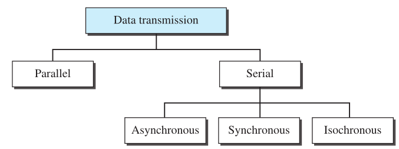

#### 4.3.1 Parallel Transmission

bit在计算机里虽然是最小的单位，但是我们几乎不研究它。我们考虑的一般都是字节和往上的单位。而传输的时候，通常也是按字节来传的。比如8个bit是1个byte，我们就把这8个一起传出去，那么自然就需要8根线了。

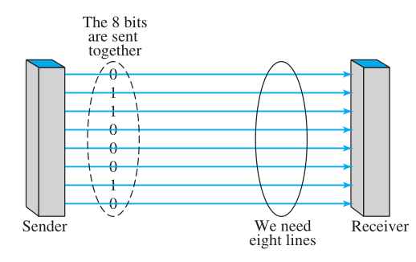

* n条线传n个bit

* 一起传，速度快(**吗？**)

  > 虽然看起来，一起传的话速度快。但是我们有很多东西是一眼看不到的。比如，如何让这8个bit同步到达？这个时候我们自然会想到在这8根线的基础上再加一根，用来做同步的时钟。而这8根线上的波形基本上一定是不一样的，而**经过傅里叶展开后它们的频率和速度都会有差异**，所以它们传输的速度都是不一样的。而我们又要保证同时到达，最终肯定是等着最慢的那一根到了之后才算搞定。同时，如果这些线之间离得太近，它们之间的信号也会有相互干扰，叫做**串扰**。介于以上原因，我们只有在芯片和板卡这种**传输距离很近**的线路中才会使用并行传输。**在考试的时候答快就完事儿了！**

* 缺点：成本高，线多

#### 4.3.2 Serial Transmission

也很简单，我们先把并着的一个字节拆开变成一个串，然后用一根线把这个串串发过去，在接收方把这个串串再合上就变回原来的一个字节了。


* 一个一个bit传

* 只要一根线

* 成本低

  > 我们再揭露一下一眼看不到的东西：串行实际上更快。我们之前介绍了很多带有**自同步**功能的编码，那么我们只要采用这种编码，这种传输方式就自带自同步功能了。并且因为只有一根线，所以不存在串扰问题，而且噪声对它的影响也更均衡和可控一些。我们可以在外面加一根屏蔽线就能解决。

##### 4.3.2.1 Asynchronous Transmission

在每个字节开始时发一个start bit，在每个字节结束后发一个或多个stop bit。所以这里的异步指的是**字节的异步(两个字节谁先到谁后到都行)**，里面的bit还是同步(必须按顺序一个一个到)的。

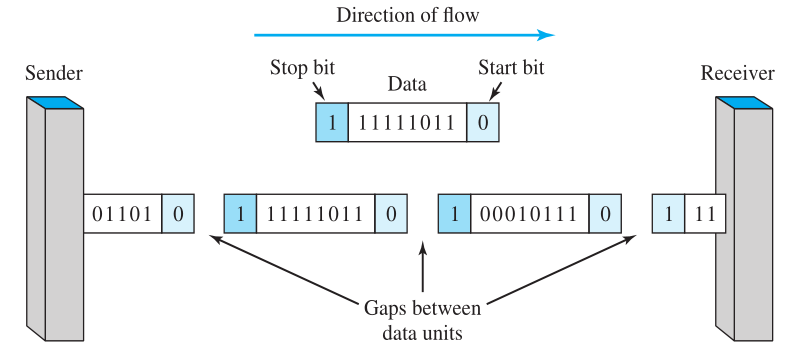

一般异步的编码都是NRZ-L。

##### 4.3.2.2 Synchronous Transmission

同步的传输就没有起始位和结束位了。那么我们咋知道哪8个bit是一个字节呢？交给接收方。它每数8bit就捆到一起。我们从这点就能看出来，**时钟在这种方式中很重要**。因为我们不能让接收方数错，所以传输的过程中一个bit是一个bit，必须得板正儿的。而时钟就是干这个活的，因此也叫做同步时钟。

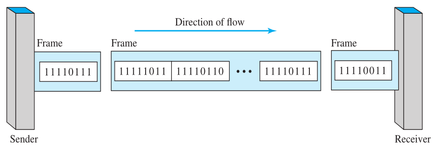

* 图中的frame并不存在，只是便于理解，本来就是一串01而已。

## 5. Analog Transmission

上一章我们在讲怎么用数字信号来传数据，下面就来讲怎么用模拟信号来传数据。

### 5.1 Digital-to-Analog Conversion

怎么用模拟信号来发送数字的数据呢？说这个之前先来说说为什么非得用模拟信号来传数字的数据。我们之前都是用数字信号来传，而数字信号有一个很明显的bug：**数字信号是一种基带信号**，也就是它最小频率一定是从0开始。而这种特性带来了一个问题。

我们在[[#1.5.2 Duplex|1.5.2]]中提到了Duplex，分为Half-Duplex(半双工)和Full-Duplex(全双工)。那么我们如果想要实现全双工的话，就要保证：**来和去的这两种信号的频率不能有交集**。这样才能保证两个方向互不干扰。但是由于数字信号的频率都是从0开始的，所以如果双方都用数字信号的话，必定产生交集。因此我们才会选择**用模拟(频带)信号来传输数字数据去实现全双工**。

然后再说怎么用模拟信号来发，使用的就是之前[[#3.3.4.2 Broadband Transmission|3.3.4.2]]中提到的**调制解调器**。 ^c21122

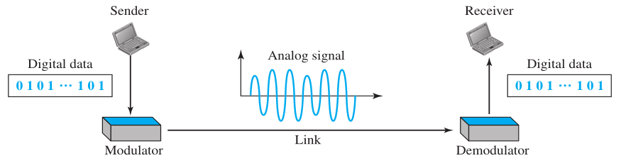

将数字数据转换成模拟信号有以下几种方法：

* **ASK** -> Amplitude shift keying
* **FSK** -> Frequency shift keying
* **PSK** -> Phase shift keying
* **QAM** -> ASK + PSK

其实对应的就是正弦波的三个参数：波峰，频率和相位。而我们将第一种和第三种结合起来就能够得到另一种方式：**QAM**(Quadrature amplitude modulation)。**这四种方式的用处其实就是为了控制我们公式中的r，也就是几个信号元素能携带几个数据元素。**比如我们区分出了8种不同的正弦波，这样就能够表示$2^3$种状态，也就是3bit数据。让状态1表示000，状态2表示001，……，状态8表示111。同时我们还可以将这3bit切成3段(也可以是4段，5段……)，这样在一个数据笼罩下能有3个位置来填信号，总共能填$3^8$ = 6561种组合，我们在里面挑8种去表示000-111就可以了，剩下的爱咋整咋整；另外，既然这么富裕，不如就不区分8中不同的了，我们只区分n种，那么$3^n$ = 8，能得到n = 2。所以只需要2种不同的正弦波即可，还能富裕1种情况。

> 以上解释是非常离谱(现实中不存在)但是正确的解释。

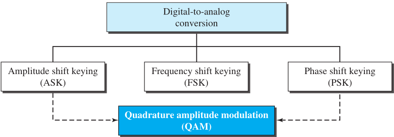

既然是数字数据和模拟信号的转换，肯定要涉及到数字信号和模拟信号之间的一些差异。我们在4.1.1中提到过数字传输的bit rate和信号传输的signal rate之间的关系：
$$
S=\frac{cN}{r}\ (baud)
$$
而我们紧接着就说，c的取值通常是$[\frac{1}{2},\ 1]$，上一章我们取的都是1/2，**这一章取的是1**。因此，该式可简化成：
$$
S=\frac{N}{r}
$$

> #example *An analog signal has a bit rate of 8000 bps and a baud rate of 1000 baud. How many data elements are carried by each signal element? How many signal elements do we need?*
>
> 根据$S=\frac{N}{r}$可以知道其中S = 1000，N = 8000，因此r = 8(bits / baud)
>
> 那么如果我们需要让一个信号元素携带8个bit，就要算出**8个bit能表示多少种状态**。很显然是$2^8 = 256$种。而**每一种状态都需要唯一对应的"电平"**才可以，所以需要256个电平。

在上面的例子中，**"电平"这种说法是错误的**。因为我们现在讨论的是模拟信号，并不是数字信号，而模拟信号中不存在电平这种概念。题中问的也是"signal elements"，所以我们这里指的是不同正弦波的类型，其实可以简单地理解为**波的不同状态有256种。**另外，4.1.2.3中我们也提到了使用电平的不同组合来表示bit的各种状态。而对应到本节中就是：**使用波的不同状态来表示bit的不同状态**。

另一个重点是：不同的状态到底是什么？其实就是刚刚提到的三个正弦波的参数：Amplitude, Frequency, Phase。只要找到波中这些不同的地方，就能够组合成各种能够**互相区分**的正弦波型，自然就可以和`使用不同的电平`一样去表示这些不同的bit组合了。

#### 5.1.1 Amplitude Shift Keying

**Binary ASK**

首先看这东西是怎么表示0和1的：


我们在3.2.6提到过，如果是非周期的复杂波形，将它分解后的正弦波的周期是连续的，这里正好对应了这个结论。

上图中最惹人注目的就是带宽中间的那个$f_c$。这个叫做**carrier frequency**，也就是**载波频率**。它实际上是带宽的中点，也就是最中间的频率。那么这个东西有什么用呢？其实它和我们的c的取值有关。为什么之前数字信号的时候c=1/2，而在模拟信号里就取1了呢？我们知道，数字信号的频率是从0开始的，那么**它会不会有负频率呢**？答案是有的，但是我们并不需要它，所以我们可以推测出来：**数字信号的$f_c$ = 0**。在$f_c$右边的叫做上边带；在$f_c$左边的叫做下边带。在实际应用中，只需要两者取其一就可以了。**因此，如果至少有上边带和下边带之一的话，c = 1/2**。

通常上边带和下边带是相等的，在数字信号的时候，因为只有一半，所以c=1/2，而在模拟信号中因为都是正的，所以c=1。 而如果我们要**再多选一些呢**？这部分因素来源于**调制解调器**和**滤波器**，**我们把这部分因素==增量==统称为d**。而整个的影响因素$\dfrac{1}{case\ factor}=\dfrac{1}{c}=1+d$，因为d的取值是\[0, 1\]所以c的取值就是$[\frac{1}{2},\ 1]$了。

解释了c的取值和d的含义，接下来看一下带宽的计算，因为c = 1，r = 1，所以$S=\frac{cN}{r}=N$，而这里的最小带宽也不再是信号速率了，还记得我们之前说要实现全双工吗？既然是两个方向，那肯定是要把带宽给拆开，所以各自的部分之间只算自己的信号速率，而整个的带宽是**这两个信号速率所需要的带宽的和**：
$$
B_{min}=(1+d)S
$$
上式也可以这么理解，之前我们在4.1.1之所以说最小的带宽就是信号速率，是因为当时d的取值就是0，而如今我们要将这个由于调制解调器和滤波器的**因素分子增量**也算进去，所以最小带宽会比数字信号的最小带宽多了dS。

然后我们再讨论一下$f_c$这个东西有什么用。其实它的作用是**携带信息**。因为它正处于中央，所以比较温和，最适合用来携带真正有用的信息。说白了，就是**用这个频率的一个正弦波去造出这整个的一个BASK复杂波**。那么怎么造呢？还记得我们之前[[#4.1.2.1 Unipolar Scheme|4.1.2.1]]中没人用的波吗？用的就是它。

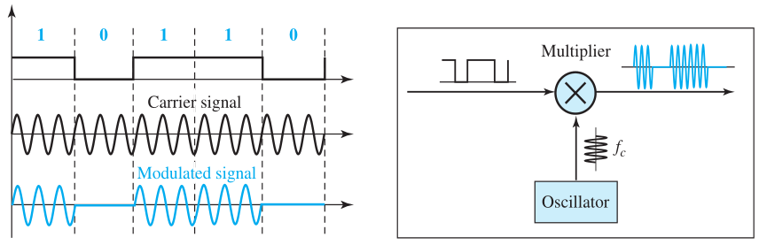

首先用Oscillator发射一个只含有$f_c$频率的正弦波，然后再和我们的那个Unipolar一乘就行了。我们能发现，这个方波其实就是一个开关的作用，**在1的时候就把频带信号显示出来；在0的时候就把频带信号完全消掉**。

#example *We have an available bandwidth of 100 kHz which spans from 200 to 300 kHz. What are the carrier frequency and the bit rate if we modulated our data by using ASK with d = 1?*

中点是250，也就是$f_c$ = 250 kHz。带宽是100 kHz，而根据B = (1 + d)S能算出来S = 50 kbaud

所以N = 50 kbps

d=1意味着误差最大，那么什么时候的误差最大呢？其实我们**选择的频率越多，需要解调的越多，误差就会越大**。因此d=1就代表我们选择了200-300所有的频率。也就是**上边带 + 下边带 = 双边带**。

这样操作的好处就是我们可以很好地利用这两边的带宽去实现**全双工**。

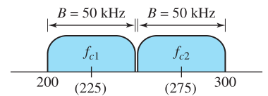

#### 5.1.2 Frequency Shift Keying

通过上面的类比我们就能推测出来：ASK是通过两个峰值不一样的波形来区分0和1，那么FSK就一定是通过两个频率不一样的波形来区分0和1。那么如果峰值一样的话，频率不一样时就会产生**相同时间段内的波是稠密还是稀疏**的情况。


这里我们不深入讨论，只看怎么做题：

#example *We need to send data 3 bits at a time at a bit rate of 3 Mbps. The carrier frequency is 10 MHz. Calculate the number of levels (different frequencies), the baud rate, and the bandwidth.* 

三个bit合起来表示一个状态，那么总共有$2^3$ = 8种不同的状态，因此level的个数就是8。

然后通过N = 3 Mbps和公式$S=\frac{cN}{r}$能算出来S = 1 Mbaud，因为这里的r = 3就代表一个信号元素携带3个bit一次发出去。

之前我们讨论的都是只有一个连续的带宽，而在FSK中经常会有多个，比如这里就有8个不同的带宽。对于一个大带宽里的小带宽，可以这样计算：
$$
B_x=(1+d)S
$$
而这里的S就是平均信号速率，而本题中d取0(因为上面的公式中c=1)，所以能算出来每一个小带宽都是1 MHz。所以从$f_c$ = 10 MHz出发可以大致画出分布：

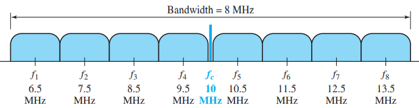

#### 5.1.3 Phase Shift Keying

**Binary PSK**

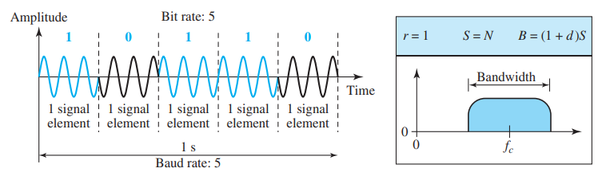

#### 5.1.5 Quadrature Amplitude Modulation

我们怎么把相位和幅度都不同的正弦波区分开呢？使用的是星座图(Constellation Diagram)。

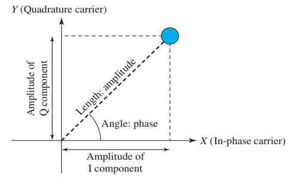

* 在星座图中，每一个点表示一个正弦波。
* 使用**极坐标**的方式来规定幅度和相位两个参数。
* 到原点的距离表示幅度，和x轴夹角表示相位。

那么我们就可以用星座图来画一下之前说过的ASK和PSK了：

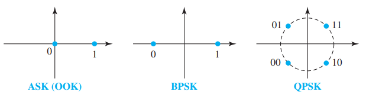

至于QAM的细分，就看图中有几个点，就是几-QAM。

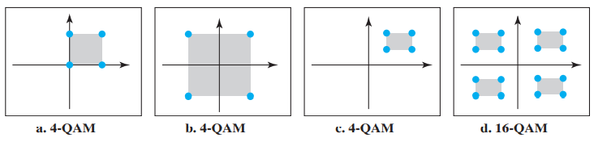

## 6. Bandwidth Utilization

有时候我们的网线之类的，带宽是很富裕的，所以我们要很好地利用它去在一段时间内传更多的信息。

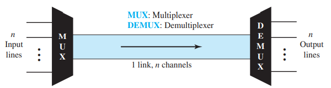

其实就是在之前介绍过的channel，而在本章我们要将一条channel拆成多条来实现并发传输。

如何更好地利用带宽？主要有以下的方式：


### 6.1 Frequency-Division Multiplexing

之前我们说过，使用模拟信号可以实现全双工，那么使用模拟信号也一定可以实现拆分宽带。

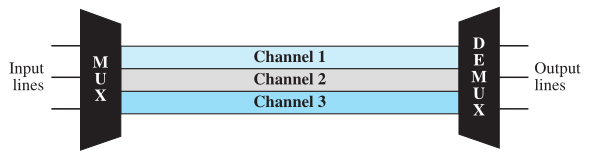

图中的3个channel分别位于不同的频段。比如f0-f1，f1-f2，f2-f3。那么使用ASK，FSK，PSK，QAM等技术就能够在这一个大channel里传输多个位于不同频断的信号，并且不会相互干扰了。

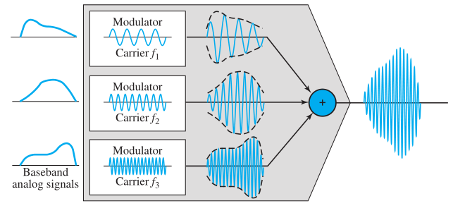

在混合的时候，就把这几种不同频段的波给加到一起去传输。

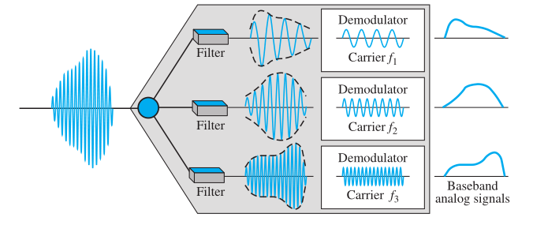

到达接收方的时候，使用滤波器把自己的那部分频段给过滤出来就好了。

另外有一个问题，就是这些不同频段的波的频率的交界处，因为非常相近，所以可能会产生串扰。那么我们为了更好地减小串扰，同时也为了滤波器能更精准地拆分它们，需要在相邻的两种波之间隔开一段频率。这部分频率叫做**防护频带**。

#example *Five channels, each with a 100-kHz bandwidth, are to be multiplexed together. What is the mini mum bandwidth of the link if there is a need for a **guard band** of 10 kHz between the channels to prevent interference?*

我们需要在每两个挨着的波之间加上10 kHz的带宽用来做隔断，那么很容易画出图示：

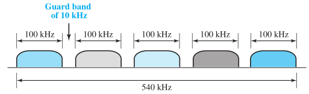

---

#example *Four data channels (digital), each transmitting at 1 Mbps, use a satellite channel of 1 MHz. Design an appropriate configuration, using FDM.*

现在总共只有1 MHz的带宽，而我们要求传的速率是 1 Mbps。我们现在需要规定的，其实是r。因为我们不知道应该用什么方式去传数据，而且怎么表示我们也不知道。现在假设一下，如果我们只让每种状态的波去表示1个bit的话，根据$S=\frac{cN}{r}$能算出来，B = (1+d)S = 1 MHz。而我们一共才只有1 MHz，却要分成4个不同的channel，那么肯定是要用**更小的带宽去传更多的数据**。那么一定是要提高r才行。

既然要分成4个channel，那么我们能得到每个小channel的带宽是250 kHz。还是带回到$S=\frac{cN}{r}$中，能算出r = 4。那么我们就是要让**每种不同的状态去携带4个bit**。之前我们说过，在模拟信号的传输中，不同的状态其实就是ASK，FSK，PSK，QAM这几种。那么我们只需要用这些方法去将信号进行拆分和编码，找出合适的方式就可以了。首要的问题是：有多少种状态呢？既然有4个bit，那么不同的状态就是$2^4$ = 16种。所以我们也要找一种能够区分16个不同状态的模拟信号编码方式(**16个不同的正弦波**)。其中一种就是16-QAM。

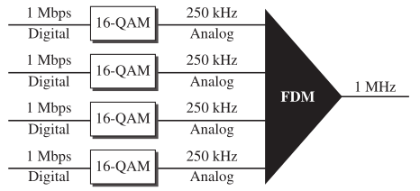

#question 这题的d是默认为0了吗？

另外FDM可以不只有1层，可以不断往上叠加，叫做**Analog hierarchy**。

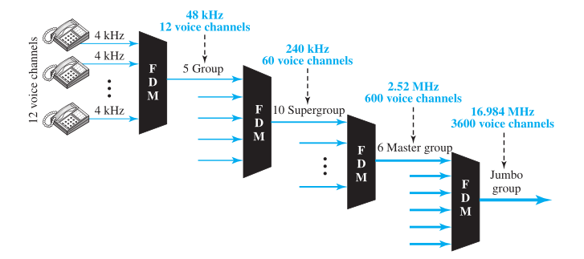

### 6.2 Wavelength-Division Multiplexing

WDM其实和FDM是一样的，只不过通常用在**光纤缆**中。因为光纤缆中信号的频率非常高，所以使用FDM会有很大的误差。我们转而使用另一个参数——波长来衡量不同的波。

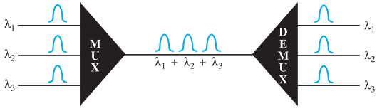

因为光波的参数不像电磁波，它非常难调。我们现在能做到的也只是使用不同的光而已。所以这些不同的光最大的区别其实就是波长。而波长不同的光又恰好不会互相干扰，所以我们将它们加在一起就可以了。


### 6.3 Time-Division Multiplexing

我们计算机其实特别擅长按时间来实现复用。想想我们的多线程，从外面看确实是多个任务同时在进行，但是实际上是CPU先干一小会儿这个，再干一小会儿那个，而切换得越快，就看起来越像是同时发生的。将这个过程类比到传输中就是：多个信号同时进入，那我先传一个你的，再传一个他的，再传一个你的……

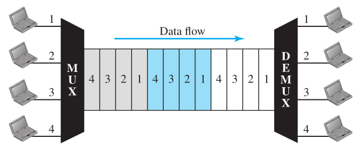

将这个过程再深入一下：

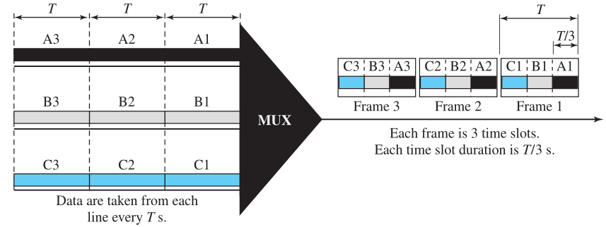

这里的A1A2A3之类的可以是一个bit、一个字符或者一个数据块等等，按着规定来即可。当所有人都轮完一遍之后形成的就是一个Frame，这种复用方式叫做**Synchronous time-division multiplexing**。如果我们设这个大channel的速度是x的话，就能发现，对于每一队单独的数据，它们只是平分这整个速度。所以真正传递某一条数据的速度还要除以队列的总数n。而对于每一个小的数据来讲，它的持续时间也平分了整个的T，变成了$\frac{T}{N}$。

那么这种方式是怎么实现的呢？看图

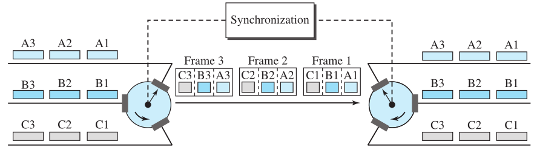

其中最重要的就是让这两个转的球球同步起来，这样才能正常发送和接收。

既然同步时钟那么重要，如果某个数据是空的该怎么办？TDM的解决思路就是：不管有没有数据，我都把你的那份时间给你。

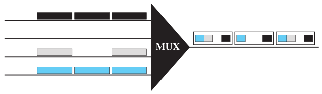

其他的知识点看图就理解了


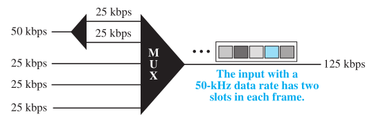


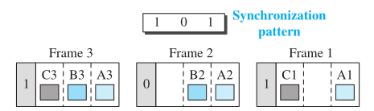

#example 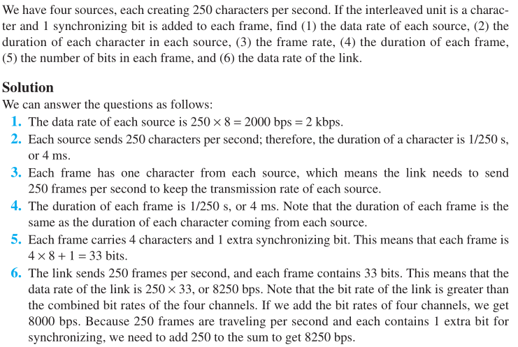

#poe 考试会考的是，这个分层级的TDM，就像FDM一样：


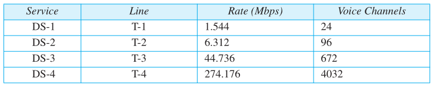

其中T-1这条channel的速度1.544 Mbps是怎么来的呢？我们用24 * 64 kbps得到的是1.536 Mbps，比实际的值要小。这又是为什么？其实就是因为上面提到的**Synchronization Pattern**。下面就来解释一下。

在这个标准中，每轮到一个人，这个人就发一个字节，也就是8bit。而24个人都轮到之后，就是24 * 8 = 192 bit。而在最后还要加一个标识符用来同步时钟，所以现在对于一个Frame，里面就会有193个bit。如果T-1总共能携带8000个frame的话，那么每个Frame都要多传1bit，因此如果我们还是要保证每个分支的速度是64 kbps的话，就要将T-1的速率再提升8000 bps = 8 kbps。因此再加上1.536 Mbps就是最终的结果了。

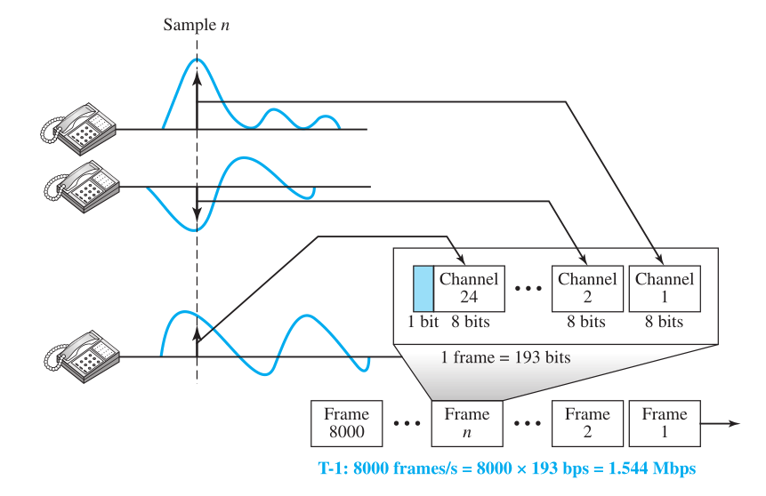

#question 为什么T-1能携带8000个Frame?

### 6.4 Spread Spectrum

扩频就是把带宽小的变大，这样数据率也就高了。

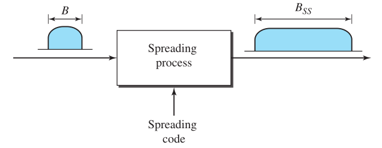

## 7. Transmission Media

之前提到过，在两个物理层之间还存在着一个Transmission Media，这才是真正传输物理意义上的信息的位置。

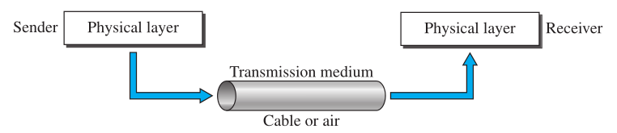

Transmission Media可以分为有线和无线的，其中又有更多分类。

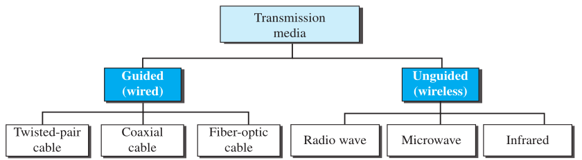

**双绞线(Twisted-Pair Cable)**

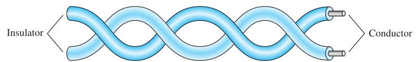

传的是**差分信号**，这样抗噪声能力强。就算有噪声，它对这两根线的影响也差不多，在接收方一减就能够把噪声减掉。

还可以在上面加上屏蔽罩：


---

**同轴电缆(Coaxial Cable)**

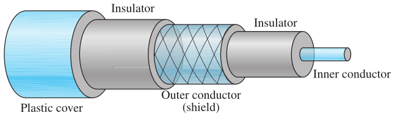

---

**光纤(Fiber-Optic Cable)**

光纤的原理其实就是**光的折射**：

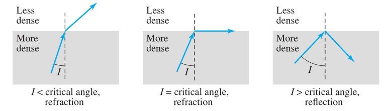

因此只要我们找到这个**Critical Angle**，就能够在光缆中实现很多次的全反射，实现传输光波的功能。

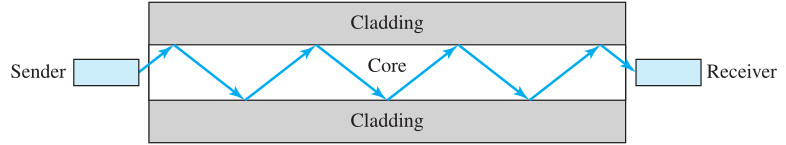

#poe **接下来是考点：光纤传播模式的分类**


只要我的入射角 > Critical Angle，就能够实现全反射。那么我们可以找多个这样的角，然后让它们同时传输。这种传输方式因为角度是离散的，所以叫做**阶跃折射率模式(Step index)**。

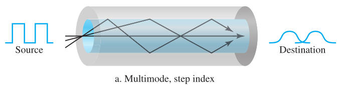

这种方式有个问题。如果入射角太大，光在中间里的那个空洞待着的时间太长还没碰到壁，就有可能会散出去，这样会有能量损失。

为了解决这种问题，人们想出了一个办法：把中间那个空当变成一个芯儿，是一个**多层**的芯儿。有多少层呢？**无数层**！其实是一种函数关系，比如半径和折射率成反比这种。这样光在中间传播的时候，**时时刻刻**都会发生折射，从而形成一条**平滑**的曲线。这样就解决了长时间不碰壁发生发散的问题。显然这样的光有无数个折射率，这种方式叫做**渐进折射率模式(Graded Index)**。

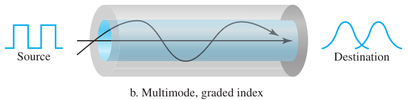

以上两种方式共同的问题是：多个光线在一起会互相干扰。因此我们不如从根本入手，让光更集中。把中间那个芯儿做得非常非常细，有多细呢？**和光子的直径一样细**！这样就只能有一束光通过，同时对光路的保护也最好，根本没有发散的可能。这就是**单模(Single Mode)**。


## 8. Switching

**本章中并不只是物理层的内容，还有数据链路层和网络层。**

在[[#1.9.2.2 Switched WAN|1.9.2.2]]中介绍过Switched WAN，现在可以回忆一下。


而这种类型的网络也可以继续细分，这章就是分别去介绍它们。

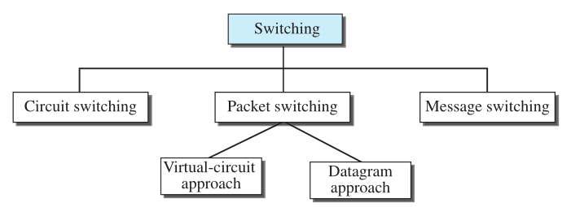

### 8.1 Circuit-Switched Networks

过去在使用电话的时候，通常是很多个电话连接到一个交换机，这样它们之间就能够通过交换机建立起连接。这东西可以看做一个网格，里面好多窟窿。如果第i个人要联系第j个人，那么就把第i行第j列通上，这样他俩就连上了。而如今的交换机必然都是电子的。

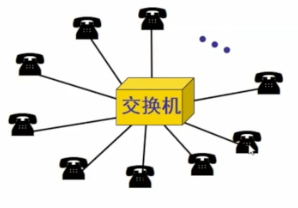

#poe 考点：如何实现这种交换呢？分为三个阶段：**Setup(建立连接)**, **Data-Transfer(通信)**和**Teardown(释放)**。在建立的阶段，需要预留资源(比如channel, switch buffer, processing time, switch ports)，这些资源在传输的时候随时都有可能会用到，所以一直得就绪，直到释放的时候。

这样的交换机在现在不可能只有一个。那么这样的一组交换机通过物理链路连接起来，就形成了**电路交换网络(Circuit-Switched Networks)。**而每条链路的带宽通常很宽，所以我们经常使用第6章**[[#6.1 Frequency-Division Multiplexing|FDM]]**和**[[#6.3 Time-Division Multiplexing|TDM]]**来进行复用。

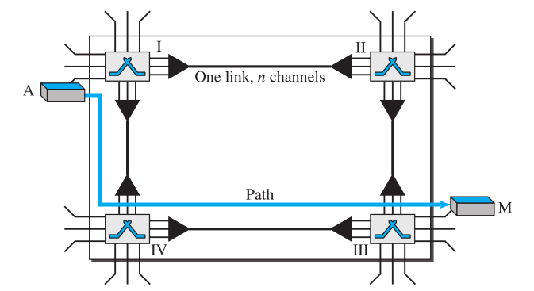

上图中中间的结点就可以是交换机，正如[[#1.9.2.2 Switched WAN|1.9.2.2]]中所介绍的。而交换机连出来的分支之间都是互通的，只要区分**你要去哪个方向**就行。比如数据从A传到B的话，就是从A先到1号，然后去到4号再到3号(这只是其中一条路，其实还有很多)。而为什么从1号到的是4号而不是2号？就是交换机决定的方向。另外，交换机和交换机之间只有一条线叫做干线，因为它们之间并不需要多根线。

以上的这种网络我们叫它**电路交换网络**，这种网络是构建在物理层的。比如下面就是一个电路交换的例子：

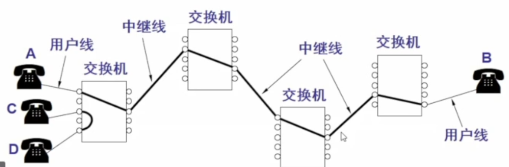

两边的叫做Local Switch；中间的叫做Backbone Switch。比如西电的电话`81891110`，其中的`8189`就是这个Local Switch的名字，后四位是这个有线电话的名字。另外，只有和电话连着的线(图中的细线)才是一直连着的，剩下的，比如图中**这些**根最长的粗线，只有在A和B通信的时候才会连上。

电路交换网络有个问题。比如你连上了但是你不说话，但是这个时候资源啥的都已经给你建好了，不说话是你的问题。所以这种网络都是按时间收费的。而计算机产生的数据通常都是：很短时间芜一下子给你整老大一坨，而又有时候很长时间都没有数据。所以这时候就不适合用电路交换网络来进行这样的通信。

### 8.2 Datagram Networks

在[[#2.2.3 Network Layer|2.2.3]]就说过，网络层传输的是datagram。而这就是我们给这一大坨信息打成的包。而接下来我们要介绍的这种网络，就是针对这种包来构建的。

在Datagram Network中，所有的datagram都是**独一无二**的，即使它们属于同一个Message。比如看下面的例子：

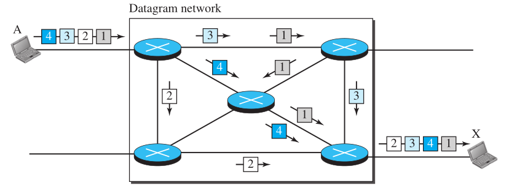 ^4370c8

1234一起组成了一个message，每一个都是一个datagram。而在传输的时候，你以为它们会排成一个小火车呜呜跑过去？不是的，看图就能看出来，这四个datagram就像不认识一样自己走自己的，而到了目的地之后又排成一队。这样做的原因主要是，可能有些带宽不满足能一次把这4个都灌进去，从而导致速度很慢(尤其是你这条路要是常用的话，很可能此时此刻还有别人的datagram)。

那么这些datagram传到目的地后重新组织是谁来做的呢？答案是网络层的更上面的层的protocol来完成，它们同时还能完成其他的功能，比如如果某些datagram在传输的时候丢失了，它能负责找发送方再发一份。

另外的小细节：这图里的结点和电路式的不一样，因为这里通常是router而不是switch；两边的结点也不是电话而是计算机，计算机比电话牛逼的多，所以它能做出**打包**这种操作，同时也只有计算机才有网络层上面的层，才有其中的protocol。

使用这种方式，这些中间结点就不用记那些电路式中预留的那些资源啥的。这样维护也更好维护，也更便宜。另外这种方式可以做到让资源**按需分配**，不用的时候就不分配。

**Routing Table**

在电路式交换网络中，建立资源的时候可以确定我要把东西发给谁，所以传的时候直接按规定传就行了。而在datagram network中并不会建立这些资源，那我咋知道传给谁呢？使用的就是routing table。假设我这个路由器收到一个datagram，在这个datagram的开头就是接收方的IP地址(在2.2.5介绍完应用层之后，紧接着就介绍了各个层的打包，其中就提到了网络层的头)。拿到了IP地址，紧接着路由器就会查这样一张表：

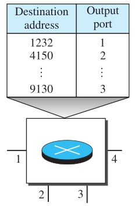

这样很显然就知道这个datagram接下来该走哪个端口了。这张表在路由器中时时刻刻都是在改变的。电路式网络中也有这么一张表，只不过是一直不变的。另外一个点是，开头的Destination address在一个datagram传输的过程中始终不变。

### 8.3 Virtual-Circuit Networks

举一个可能不太恰当的例子：我们打的电话使用的是电路交换式网络；而计算机通信通常使用的是数据报网络。而那些比如微信电话这种咋办？又有计算机，又要通信，显然这两种都不适合。所以我们把他俩揉成一团，就变成了**虚电路网络**。

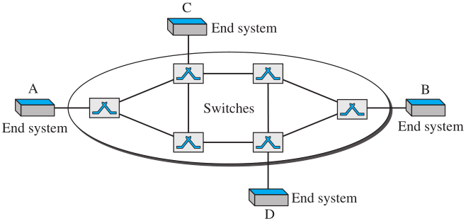

先来说说这种网络都揉了哪些东西进去：

1. setup、data transfer、teardown这些阶段在虚电路网络中也都存在
2. 我们之前说过，在电路式中，资源是在setup阶段分配；在数据报中，资源是按需分配。而在虚电路网络中，这两种方式都能做到，看实际情况来选择。
3. 虚电路网络中传输的数据也是打成包(**frame，为什么看第5条**)来传，而包的开头也会有地址。但和数据报不同的是，这里的地址并不是接收方end node的ip地址，而是一个很局限的地址(比如下一个switch的地址或者下一个channel的地址)。你可能会问这样的话我咋知道要传给谁？你先别急。
4. 和电路交换式一样，所有的包传输的路径都是按着setup阶段建立的连接来的。
5. 通常情况下，虚电路网络建立在data-link层，不是物理层也不是网络层。而这也只是暂时的。

**Virtual-Circuit Identifier**

VCI就是上面所说的局限的地址，又叫做label。这是一个很小的数字，因为它只在两个switch中间才起作用。这句话可能不太好懂，那先看看下面的一个例子： ^cb7eaf

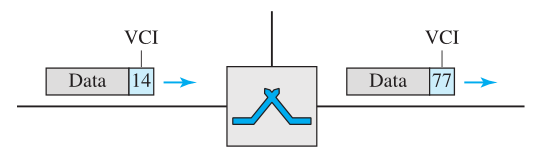

这个frame经过一个交换机之后，VCI也发生了改变。那为啥会发生改变呢？这和虚电路网络的setup阶段有关。

在建立连接的时候，发送方和接收方会做这么一件事：他俩肯定都有独一无二(在这个网络中)的地址。而它们就会使用这个地址来帮助这个网络中所有的switch建立一张表。而在teardown阶段，它们也会通知**在这个网络中**所有的switch来删除所有**和这个链接相关**的**表项**。

> **For the moment we assume that each switch has a table with entries for <u>all active</u> virtual circuits.**
>
> 一个交换机很可能和多个网络相关，这句话就是在强调这点。

而上面所说的表的最主要的成分就是VCI。在data-transfer阶段，传输的情况就会是这样的：

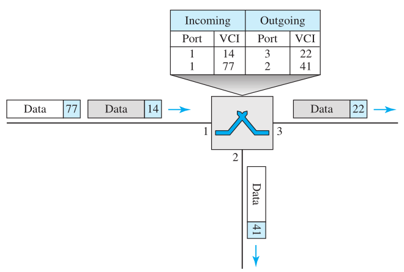

比如这个14号frame进入了这个switch就会查表：14号的从1号口进来的吗？是的！那我就继续查从哪里出呢？原来是从3号口出，并且下一个switch**对于这个链接**所认可的VCI是22。所以我就把它的VCI改成22，并把它从3号端口发出去。

再来看一个frame从发出到接收的整个流程，看完上面的解释在看就会很简单：

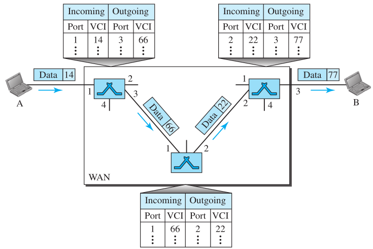

#question 这里的VCI和之后链路层的[[#14.2 Addressing|MAC地址]]有什么区别？MAC地址在hop-to-hop传输的时候不会改变，而这个VCI在hop-to-hop传输的时候也不会改变，VCI是不是MAC的一种呢？

## 9. Telephone Networks

这一章主要是讲过去我们干的事，那个时候的计算机没有互联网，那传数据用什么传呢？用的是我们打电话的线。传统的电话线能携带的频率通常是300-3300 Hz，带宽是3000 Hz。我们讲话的声波损失一点没有关系，但是如果用它来传数据的话，就很难受了。所以我们从中间噶出来一段用来传数据，一般是600-3000 Hz：

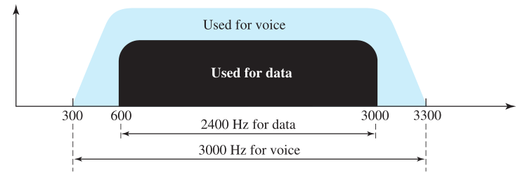

用什么传解决了，接下来是怎么传？我们的数据通常是数字信号，而这里却不是从0频率开始的，自然就能想到用第5章介绍的模拟信号来传。同时也会使用调制解调器。

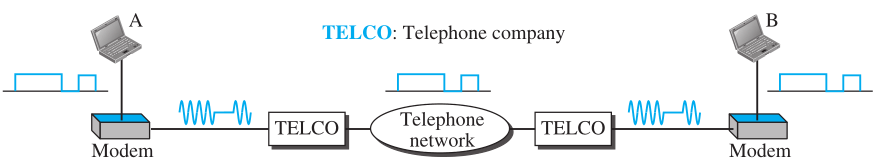

这里的调制解调器其实就是我们以前所说的“猫”。通过其中的，在第5章介绍过的ASK、FSK、PSK、QAM等算法就能**将数字信号使用模拟信号来编码**。传输到接收方之后再解调出来即可。另外，反方向传输也是可以的。再另外，在Telephone Network中传输的信号通常是[[#4.2.1 Pulse Code Modulation|4.2.1]]介绍的PCM信号。

> #question 这里我认为第5章说转换是不够严谨的，因为这只是一种用模拟信号来编码数字信号的方式，并不是真正的本质的转换。不过编码和转换，有时候还真可以认为是等价的。

# Part 3: Data-Link Layer

## 10. Introduction to Data-Link Layer

在[[#^0e6bed|2.2]]的Logical Connection中我们介绍过，物理层上所有的层都可以使用它们下面的层作为工具来传输对应的数据。而数据链路层就可以借助物理层为工具在**hop**之间传递frame。下面就是一个例子，Alice -> R2 -> R4 -> R5 -> R7 -> Bob：

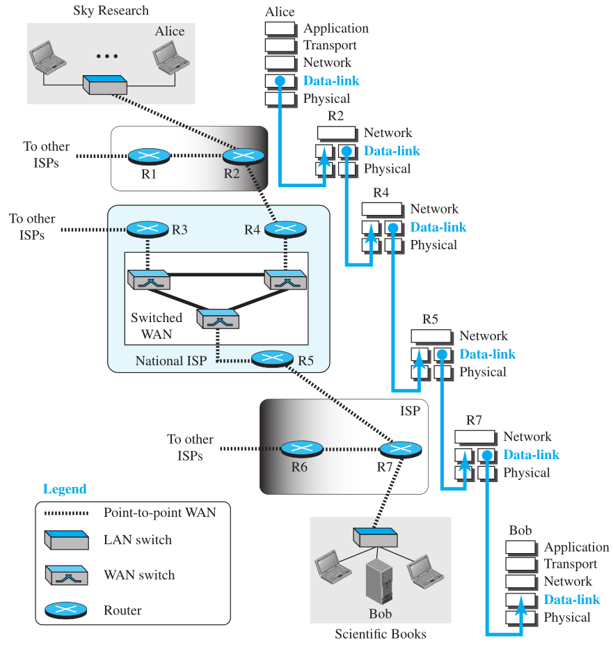

当然，在这个传输过程中我们只关心数据链路层。注意，只有Alice和Bob只包含一个数据链路层，而其中的路由器都包含2个或多个。其中的原因我们在2.2中也提过了。接下来我们注意介绍一些在数据链路层中的概念。

### 10.1 Nodes and Links

这两个概念其实早就不陌生了，所有的计算机都可以看做node，而其中的路由器也可以看做node，**它们的职责是用来连接多个LAN和WAN从而形成小型internet**，就像[[#1.9.2.3 Internetwork|1.9.2.3]]介绍的那样。而**路由器之间**，还有**LAN和WAN本身**都可以看做link，所以数据链路层的传递方式就是**note-to-node**：

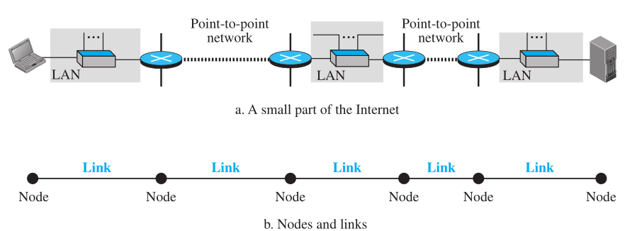

> The first node is the source host; the last node is the destination host. The other four nodes are four routers. The first, the third, and the fifth links represent the three LANs; the second and the fourth links represent the two WANs.

### 10.2 Services

数据链路层使用物理层提供的服务，并且给网络层提供服务。那么这些服务都有哪些呢？我们从最基础的打包和解包来讲起。

有人可能会有这样的疑问：为什么一个包传到了中间结点的数据链路层，要先解包再打包，不直接传呢？这其实还是2.2中介绍的事情，就是因为**两个网络使用的protocol可能不一样，并且这里面对于数据包的format也可能不一样**。另外即使protocol恰巧一样，那我们刚刚介绍过([[#^cb7eaf|8.3中的VCI]])，在包的最前面要加上一个标志传给下一个结点，那这个标志总得换吧，所以还是要解包再打包。以下是一个解包打包的例子：

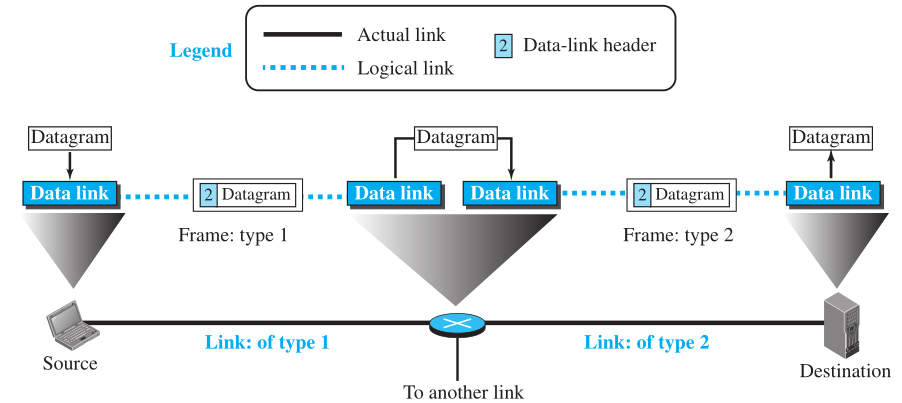

**Framing**

在数据链路层的首要服务就是打包和解包，而这个包就叫做frame。frame有时候又有header又有trailer，不同的数据链路层的打包方式也不同。

**Flow / Error / Congestion Control**

其实这些服务在[[#2.2.4 Transport Layer|2.2.4]]的传输层中也有，只不过是控制node和node之间而不是end和end之间。

### 10.3 DLC and MAC

将数据链路层拆开，其实是由两个不同的层组成的。在介绍这个之前，我们要先介绍一下数据链路层的连接方式。数据链路层通常有两种连接，一种就是p2p，另一种就是broadcast。根据名字就能看出，看这个层和其它多少个层连接就能区分。而对于这两种不同的连接，会有不同的控制方式。其中p2p只需要Data link control(DLC)；而broadcast需要Data link control和Media access control(MAC)。

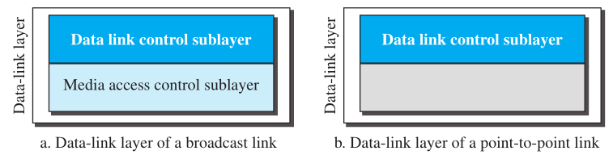

## 11. Error Detection and Correction

数据链路层其实就是包装一下的物理层，它肯定也能直接访问bit，所以我们从它提供的错误检测服务开始。

### 11.1 Types of  Errors

错误的类型下面图一看就懂：

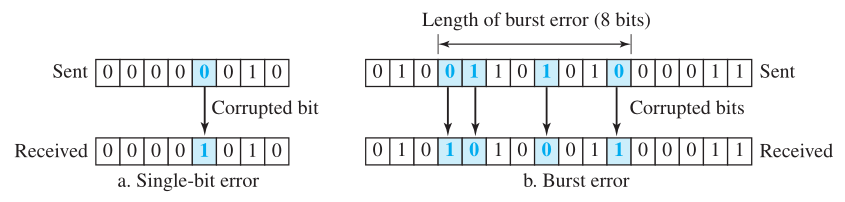

为了解决这些错误，我们需要发一些冗余(Redundant)位。比如奇偶校验、海明码。

### 11.2 Block Coding

我们主要介绍给一块编码上加冗余码的方式。首先我们先来看一下基础知识，比如**不进位的加**，也就是异或：

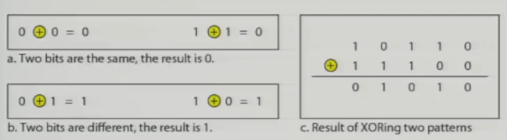

### 11.3 Error Detection

#### 11.3.1 Hamming Distance

#example Let us find the Hamming distance between two pairs of words.
1. The Hamming distance d(000, 011) is 2 because (000 ⊕ 011) is 011 (两个1).
2. The Hamming distance d(10101, 11110) is 3 because (10101 ⊕ 11110) is 01011 (三个1).

> Hamming Distance的本质其实就是看两个码不同的bit有多少个。

#### 11.3.2 Minimum Hamming Distance

在一个编码方案中所有的可能之间最小的Hamming Distance。比如，下面表中的最小海明距离：

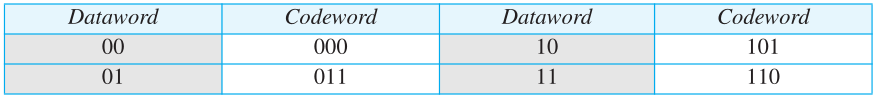

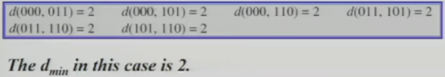

**结论：**

* **如果你想要<u>检测</u>s个错，那你编码的最小海明距离$d_{min}$ = s + 1。**
* **如果你想要<u>纠正</u>t个错，那你编码的最小海明距离$d_{min}$ = 2t + 1。**

因此，对于一种编码方式，我们只要知道它的最小海明距离，就能算出它能检测多少错，纠正多少错。比如奇偶校验码，它的$d_{min}$ = 2，所以s = 1，t = 0.5，也就是能检测1个bit错，纠正不了错。

### 11.4 Cyclic Redundancy Check

#poe 考点：CRC(循环冗余校验码)，这里贴出计组的笔记：

![[Networking/img/crc.png|300]]

![[Networking/img/crc2.png|300]]

> 这里笔记中有错误，模2除法的意思是使用模2减法，也就是**不借位的减法**，这里和异或操作正好是相对应的。

![[Networking/img/crc3.png|300]]

## 12. Data Link Control

无论是p2p还是broadcast，都需要用到DLC。所以我们首先讨论一下其中最重要的功能：Framing

### 12.1 Framing

#### 12.1.1 Character-oriented Framing

在计算机中的数据通常有两种形式：字符型(字节型)和二进制型。而它们传递的方式也不同。在数据链路层中，对于字符型的处理通常是将几个字符捆到一起形成一个Frame。而在前面和后面都会加上一些东西：

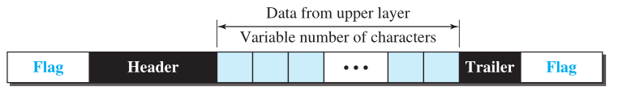

* **Header中通常是source / destination address和其他的控制信息**
* **Trailer中通常是校验码的冗余位**
* **Flag用来区分frame之间的区别，通常是8bit，<u>并且Flag并不是Frame的一部分！</u>**

这里有一个问题，如果Frame中间含有Flag怎么办？人们想出了一种策略——**byte stuffing**。简单来说，就是转义字符，在含有Flag的数据前面插入一个Escape Character(ESC)，当接收方扫描到ESC时，就不会认为Flag是边界而是数据了。另外，如果数据中甚至包含ESC的话，就在前面再插一个ESC。

如果我要打包成Frame的数据是这样的：

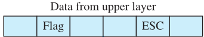

能看到，数据中有Flag，还有一个ESC。所以数据链路层会进行这样的打包：


这样，在接收方接到之后，就能正确地将数据取出来：


#### 12.1.2 Bit-oriented Framing

有了上面的解释，面向bit的打包方式就很简单了：

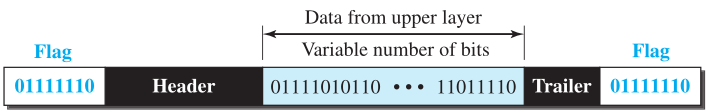

相同的问题。数据中含有Flag怎么办？解决方法叫做**bit stuffing**。我们的Flag是`0 111111 0`，因此我们只需要让数据中**满足不含有6个或以上连着的1**就可以了。解决方法就是，只要我发现了`0 11111`这种序列，就在它的后面插上0，不管它后面本来是不是0。在接收方将插入的这个0删除就可以了。

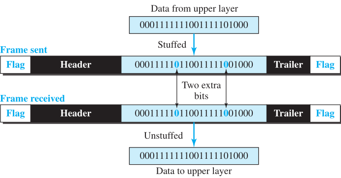

### 12.2 Flow / Error Control

在10.2中提到过这两个功能，我们不谈功能，只说人们用什么方式去实现了这些功能。

#### 12.2.1 Stop-and-Wait Protocol

这种协议在流速控制和错误控制中都用到了。比如我作为发送方，我怎么知道对面到底收没收到我发的消息呢？如果没收到的话我还一个劲儿地发，那就炸了；如果这个数据在中途出错了(**比如Flag被噪音打掉**)，对面本来要让我重发，但我不知道要重发。为了解决这些问题，我们引入了一个机制：让接收方在收到消息后回头通知一下发送方。返回的这个消息叫做**ACK**：

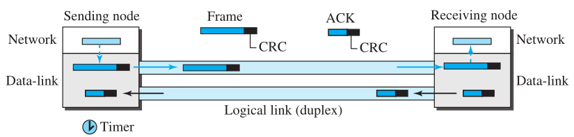

这样在发送方发Frame之后，需要等待一下。当发送方接收到接收方传回来的ACK时，证明本次发送完美成功，于是开始发下一个Frame。那么如果Frame在中途丢失该怎么办呢？甚至是传回来的ACK也有可能在中途丢失，这个时候又改怎么办呢？这里就要引入一个自动重传技术——**Automatic Repeat Request(ARQ)**。在发送方上挂一个时钟(**Timeout Timer**)，如果长时间没有收到接收方的ACK，就自动重新传这个Frame： ^3b1439

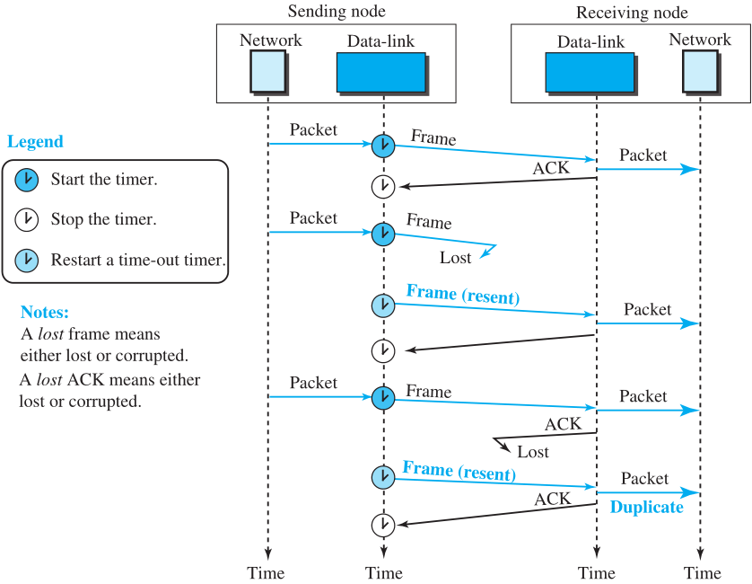

上图中有一个问题，就是最后一个Frame发了两次，接收方也接收了两次。为了避免总发这些和重复的帧，引入了两个编号，叫做**Sequence Number**和**Acknowledgement Number**。比如我在发第0个Frame，那么我就把这个Frame编号为0，当接收方收到之后，就这样说：我收到0了，你发1吧。因此接收方会将ACK编为1之后发送给发送方。当发送方接收到ACK后，知道了我接下来要发开头是1的Frame了，于是就这样一直下去……

需要注意的是，因为通常双方之间只有一个Frame在活动，所以我们不需要很大的Frame，因此SN和AN通常都是0101这样的交替序列。而在一些特殊情况(**Go-Back-N ARQ**)的时候，才会使用多个编号，但也一定是一个循环的序列。比如0101是模2的序列，那么012012这种就是模3的序列(**`next(n) = (n + 1) % 3`**)……当加入了SN和AN之后，就会是这样的： ^c4398d

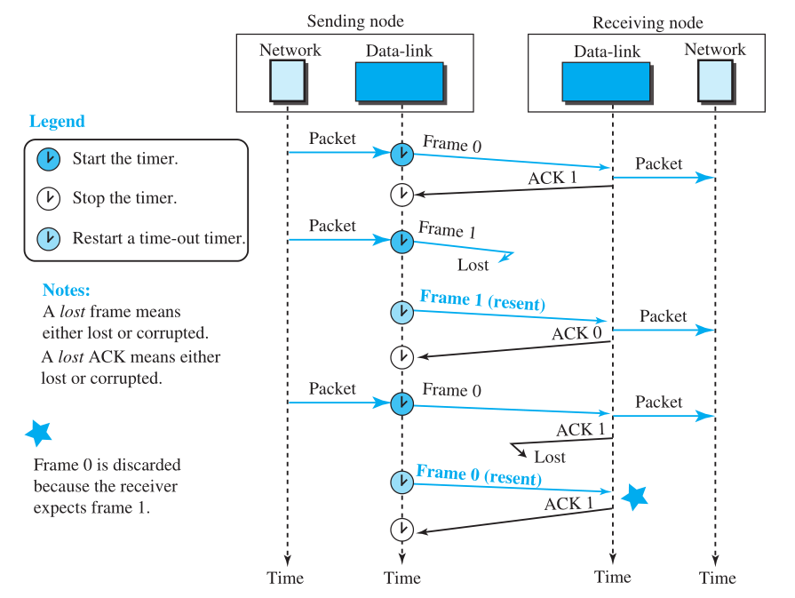

在3.6.3中讲过传输过程中的时延，现在来讨论一下ARQ系统中的时延。我们只讨论传播时间和发送时间，不讨论其他的。另外，由于ACK很小(通常只有1bit)，所以它的发送时间也不记。我们令**Frame的发送时间为$t_f$，Frame和ACK的传播时间都为$t_p$**，这样就能得到总体的利用率：
$$
U=\frac{t_f}{2t_p+t_f}
$$
结合着3.6.3，我们先来理解一下这个式子。首先，对于一个frame，它从起点发送到终点，要经过这两个时间：
$$
t_f+t_p
$$
而我们认为，其中的$t_p$是Propagation Time，也就是bit在介质中经过的时间。而$t_f$是这一串bit从开始发到完全进入介质的时间。我们认为：$t_f$在两者间的比重占得越大，利用率也就越高。因为$t_p$越小，就代表我这坨bit只要完全离开发送方，就能马上到达接收方，在空中停留的时间也就越久，这样**中间得管道肯定塞得更满**，利用率也就越高。因此如果没有ACK的话，我们的利用率本来是这样的：
$$
U^*=\frac{t_f}{t_f+t_p}
$$
但是在加入了ACK之后，它的Propagation Time和Transmission Time都是附加产物，都不是我们想要的，所以它们理应也放在分母上。但是由于Transmission Time只有一个bit，所以非常小。因此只加了一个$t_p$，最终就变成了这个样子。

为了让计算更简单一点，我们令**a =$t_p$ / $t_f$**，然后让分子分母同时除以$t_f$，就能得到：
$$
U=\frac{1}{2a+1}
$$

#example 一个停等ARQ系统，带宽是1Mbps，传播时间20ms，帧长度1000bit，则带宽时延积是多少？利用率又是多少？

在3.6.4中介绍的就是带宽时延积，因此我们要将带宽乘以总体的时延(本题忽略了$t_p$)：
$$
(1 \times 10^6) \times (20 \times 10^{-3})=20000\ bits
$$
然后这里计算利用率的话，就不能用$t_p$ / $t_f$了，因为根本都没给，所以我们从另一个角度讨论利用率：用帧的长度除以整个通道能容纳的总长度不就是利用率吗？只不过上面的是从时间的角度，本题是从容量的角度。因此利用率就是：
$$
1000 / 20000=5\%
$$

#### 12.2.2 Go-Back-N Protocol(GBN)

就像在前面提到的，每次都在双方的channel中只发一个frame，所以**Sequence Number**和**Acknowledgement Number**才通常都是01序列。但是，这样做未免有些太浪费了。这么长的管子居然只在里面跑一个帧！因此，为了填满中间的管道，我们需要多塞点东西，就像这样：

![[Pasted image 20221107195213.png]]

> 注意，这里的图片是书中传输层的东西，所以文字描述和这里不太一样。但是发送的东西的抽象都是这个。

让多个Frame和ACK同时都在发送，这样就提高了channel的利用率。但是这样的问题显而易见：如果中间出错了咋办？在Stop-and-Wait中我们是通过自动重传和0和1来解决这个问题的；但是在这种情况下，我连续发了好多帧，我也不知道到底哪一个在半路出了岔子，那么该怎么办呢？还记得我们[[#^c4398d|之前说过的话]]吗？**我们只要给每个发出去的帧都编一个号，这样当接收方出问题时，或者帧还有ACK在半路被干废时，我们总能按照编号定位到它**。大体的思想是这样，但是这里面的细节可不少。接下来就一步步探索前人伟大的思想罢！

**Send Window**

Go-back-N最重要的一个组成部分就是这个Send Window。它其实就是一个**位于发送方**的虚拟出来的框框，看起来像这样子：

![[Pasted image 20221107195928.png]]

我们能看到，这个Send Window把整个Frame序列分成了四部分：

* Sent packet：已经发送过，并且也已经接收到接收方的ACK了。**那么我就不再保留有这部分Frame的副本了**，因为没有必要。
* Outstanding packet：已经发送过，但还没接收到ACK的Frame。这部分Frame是我们要重点关注的对象，因为它们很有可能在中途出事故，所以**我们需要保留它们的副本**。
* Not sent yet packet：还没从上层拿到这个帧，等拿到了，我就可以准备发了。
* Cannot accepted packet：暂时还访问不到的Frame，**只有窗口滑动后才有可能访问到**。

比如我们有一大坨帧要发，那我就把它们按顺序编好号：`0, 1, 2, 3, 4, 5, 6, 7, 0, 1, ...`。为什么要回到0呢？因为我们的位数是有限的啊！所以我们需要好好利用，已经发送过的编号还可以重复利用。这也是为什么通常Sequence Number都是模n序列的原因。然后，把一个窗口罩在这个序列上，那么你可能会问：窗口的大小是多少？好问题，我们之后再说。这里先给答案，上图中从0-7编号，一共8个状态，而8个状态是$2^3$，并且窗口的大小是8-1=7。所以**如果Sequence Number的位数是m的话，窗口的大小就是$2^m - 1$**。然后，我们需要确定：第一个发的是哪个？所以**我们有个$S_f$(first)指针，它指向第一个Outstanding packet**。另外，如果已经发送了一段时间，我怎么知道下一个该发谁？比如像上图中的样子，我该发4号了。那么**我也要有个$S_n$(next)指针，指向下一个要发送的Frame**。

---

**Receive Window**

接下来谈谈接收方这边。接收方其实很简单，它只做两件事：接收Frame，发送ACK。那么我们主要还是谈接收Frame。首先就是：我到底要接收谁？在Stop-and-Wait中，我没得选，因为channel里跑着的只有一个。但是在当前情况下，有很多个帧不停地往我这儿来，我到底要不要，要哪个？为此，人们又设计出了一个Receive Window：

![[Pasted image 20221107202957.png]]

这个窗口看起来就简单多了。它只框柱了一个帧，而这个帧就是**我现在，此时此刻要的帧**！每一个发过来的Frame上都标了Sequence Number，而我只要5号，别的统统扔到一边。当我拿到了5号的时候，非常好！我可以滑了，接下来我要的就是6号。同时，我还要发出一个ACK，表明我真的已经接收到了5号。

> *我们能从这个设计中感受到设计者的强大。我当时就有个疑问：如果发送方发了3号，之后一直没接收到3号的ACK，那么随着时间的流逝，Send Window也在不断滑动。比如接到了5号的ACK，那么$S_f$指针立马指向5号，3号就变成了已经接到ACK的帧了，但是它没接到啊！我后来又一想，还真就和接到ACK是一样的：因为接收方这边的规则是定死的，只要我没接到帧，我死也不滑！我死也不发ACK！**所以每一个ACK的发出，都代表之前所有的帧都已经成功接收**。这样即使2号3号4号的ACK在半路都挂了，只要5号能够突出重围被发送方拿到，那234号就没白死。*

---

接下来看看发送方和接收方是如何配合的。其实，在我上面的感悟中就已经透露出一些了。首先，发送方会不断发出Frame，而这些Frame在Send Window中就被标记成了Outstanding Window：

![[Pasted image 20221107204105.png]]

比如这个图中，就是在说4,5,6,7号都已经发送过了，我接下来该发0号了。**但是这四位发出去的会不会出岔子我不知道，还得随时准备Go back**。

假设此时此刻接收方收到了4号，发了4号的ACK**(5)**，然后滑一下；又接到了5号，发了5号的ACK**(6)**，又滑了一下。**这里重点中的重点，是ACK里面的Acknowledge Number，不是4和5，而是5和6！因为Acknowledge Number表示的是——我接下来想要的Frame，所以如果我接到了一个ACK的编号是5，那代表：我已经收到了4号，你该给我发5号了！**

假设这里4号的ACK(ACKNO = 5)在半路挂掉了，而5号ACK(ACKNO = 6)成功到达了发送方。发送方一看接收方要6号，那么就会滑动它的Send Window：

![[Pasted image 20221107204652.png]]

---

另外，在这之间还有一些小问题。首先是Timer的问题，在ARQ协议中只要长时间没有收到ACK就会自动重传，而在GBN中我们自然也需要这个机制。问题是，Send Window中有很多个Frame，我们如果给每个Frame都搞一个定时器，那会有点乱，所以我们发送方只有一个定时器。**当时间到的时候，自动重传所有的Outstanding packet**。

另一个就是这个Send Window的大小为什么是$2^m -1$。这里给张图：

![[Pasted image 20221107205326.png]]

如果m=2的话，那么Send Window的大小就应该是3而不是4。因为如果是4的话，当一些极限情况，比如所有的ACK都丢了，那么某些帧本来该被扔掉的，却被正确接收了。

### 12.3 High-level Data Link Control

12.2.1中所介绍的[[#^3b1439|ARQ]]协议在国际中是有标准的，其中一种就是HDLC。这种协议属于上世纪60年代的产物，现在已经有些过时了。HDLC是一个面向bit的协议，也就是[[#12.1.2 Bit-oriented Framing|12.1.2]]中的内容。

HDLC定义了两种传输模式，分别是**Normal Response Mode(NRM)**和**Asynchronous Balanced Mode(ABM)**，其中前者是我们很久以前使用计算机的方式，后者是我们如今使用计算机的方式。

#### 12.3.1 Normal Response Mode

在NRM中，分为Primary Station(主站)和Secondary Station(从站)。它们之间的关系，在[[os#8.3 Hardwares|操作系统的笔记中8.3]]介绍Terminal的时候提到过。以前因为计算机很昂贵，都是多人使用一个。这个计算机建在机房中，而每个用户只有一个键盘鼠标显示器，并没有CPU之类的。这些东西组成一个终端，通过远程去访问那个昂贵的计算机。这个计算机就是主站，而用户的键鼠就是从站。

主站所发出的Frame叫做Command，而从站发出的Frame叫做Response。因此它们之间的通信可以是p2p，也可以是Multipoint Links：

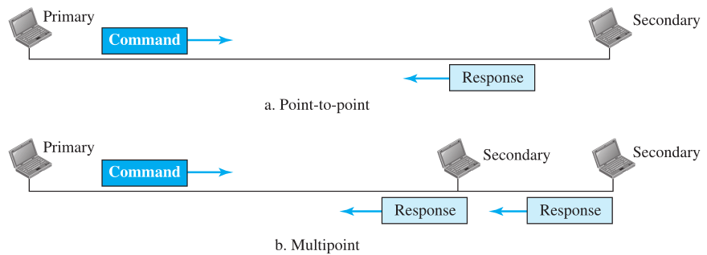

#### 12.3.2 Asynchronous Balanced Mode

如今的计算机全部都有CPU，所以它们之间如果不人为规定的话，很难有主从的区分。所以我们如今的通信基本上全部是在peer上的。对于双方，它们随时都能发送命令，也能发送相应。所以这种方式是异步的：

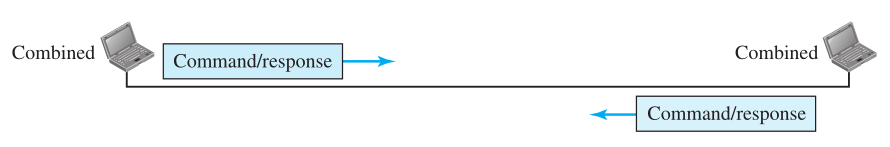

#### 12.3.3 HDLC Frames

接下来我们看一看，在HDLC中发送的这些Frame都是怎么编排的。它们其实和[[#12.1.2 Bit-oriented Framing|12.1.2]]中的结构如出一辙。

* Information Frame

  I-frame就是用户发送的带有数据的Frame，比如从网上下载的数据包。

  

  FCS是Frame Check Sequence，也就是纠错码。

* Supervisory Frame

  S-frame不传数据传应答，比如之前介绍的ACK。

  

以上的两种都是有编号的帧，也就是12.2.1中的模2序列。这些编号就存储在Control段中；而接下来介绍的U-frame就没有这种编号。

* Unnumbered Frame

  这种帧主要是在建立连接、拆除连接的时候发送，其中是一些管理类型的数据。

  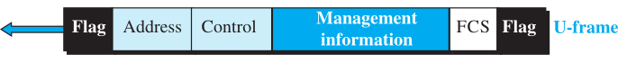

如何区分这三种Frame呢？根据**Control段**的前两个bit就可以：

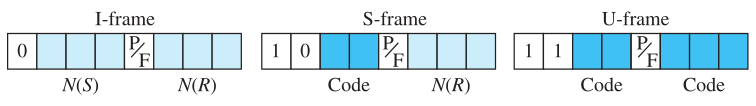

### 12.4 Point-to-Point Protocol

相比于HDLC，这是一种面向byte的方式，同时也是我们正在用的方式。PPP协议实际上是HDLC的子集，它将HDLC中的细节进行了简化。另外，PPP协议并不止在数据链路层，在很多层都有它的影子。

需要注意的是，PPP并没有提供Flow Control，并且它的Error Control也非常简单，就是一个CRC，如果数据出错了，那就不管了，由更上层的协议来管。

#### 12.4.1 PPP Framing

首先看一下PPP是怎么打包Frame的：

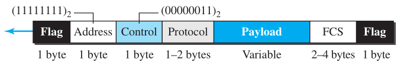

我们能看到，在两个Flag中间，多了许多新面孔：

* Address，常量`11111111`，用作广播的地址。
* Control，常量`11000000`。
* Protocol，大小默认2个字节，规定了数据段要传什么，双方一人用一个字节。
* Payload field，这就是数据段。最大容量1500字节，但是有时候也能再扩一扩。通常要留一些空。
* FCS，2个字节或者4个字节的CRC。

**需要注意的是，在12.1.1中提到过的转义的事情，这里也有。而PPP中的ESC是`01111101`**。

## 13. Media Access Control

这个其实就是Multiple-access Control，它的协议分为三组：

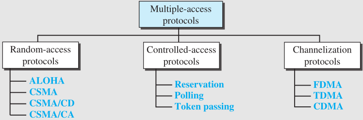

### 13.1 ALOHA

#### 13.1.1 Pure ALOHA

在这种协议中，只要想传Frame就传。但是，如果是多个人的话，会产生一些问题。

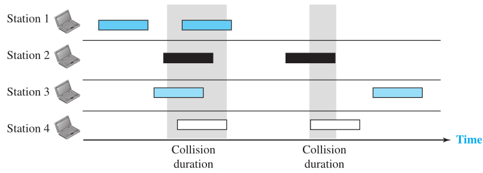

当多个人同时传的之后，就可能产生撞车的情况。所以我们需要一些手段来避免它。之前我们说，当发送方有一段时间没收到ACK的时候，会自动重传。但是这里有个问题，如果两个人同时发送，并在中途撞车，那么他们肯定都收不到ACK，那么如果这个时候俩人又都同时重传，结果肯定还是撞车。所以我们需要一种算法来**让它们随机地进行重传**。

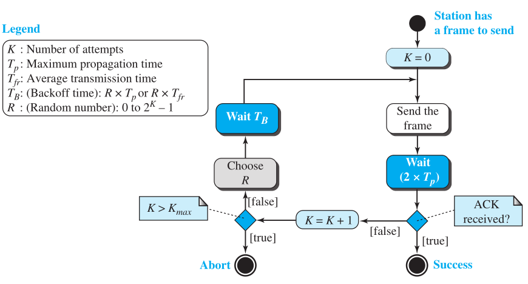

我们能看出来，K越大，代表撞车的次数越多，那么在选择R的时候，能选择的范围也就越大。那么等待的时间也就会**越随机**；而如果没碰撞几次，那么等待的时间相对来说也就**越固定**。而撞车次数大于$K_{max}$之后，就开摆！

这种算法有一个很致命的问题——LIFO。因为比如有一个帧最先进去，在里面撞车了。撞完车之后又来了好多好多其它的帧，于是不停地撞车，同时等待的时间也很可能越来越长，以至于最后一个才被送到。

现在我们假设一个结点要开始发帧。对于在同一个ALOHA协议中的每个站点，它们发送帧的平均Transmission time都是$T_{fr}$。那么这样的话，如果这个站点在t时刻发帧，t的$T_{fr}$秒前和$T_{fr}$秒后中间的这段时间，很有可能会发生碰撞：

![[Pasted image 20221109170727.png]]

因此$2T_{fr}$这段时间就是一个结点的脆弱时间(Vulnerable time)。

**对于纯ALOHA，我们只记结论：**

> **The throughput for pure ALOHA is $S=G \times e^{-2G}$.**
> **The maximum throughput(3.6.2) $S_{max}=\frac{1}{2e}=0.184$ when $G=\frac{1}{2}$.**
> 
> 其中，G是在$T_{fr}$时间内由**一个ALOHA中所有结点**产生的Frame的平均个数。另外，根据作业答案，$T_{fr}$的计算应该是这样的：
>  $$
> T_{fr}=\frac{Frame\ length}{Bit\ rate}
> $$
> 但是，这里的数据率指的并不是每个站点的速率，而是总体的速率。因为总体的带宽(数据率)才是真实的传输情况，只不过这个情况平均到每个站点上会变小。**每个帧在被拉出来的时候都是从那个共用的大管子拉出来的，并不是真正分成了几个小管子**。

#### 13.1.2 Slotted ALOHA

不随机，分时隙：

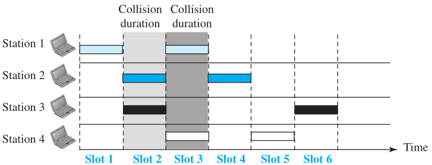

### 13.2 Carrier Sense Multiple Access

ALOHA多数是建在空气中的，所以我们并不能探测传输的过程中是否有其它帧。而CSMA是建立在电缆上的。通过监听电缆，我们就能发现在其中传播的数据，然后等一会儿再发，这样就能有效减少碰撞。

但是，这样做却不能根治。因为每个结点都只能探测到自己这一小段电缆。尽管数据在电缆中以接近光速在传播，但是还是有极小的可能，就是这个bit还没到达我这里，我就开始探测。这个时候我这一小段肯定是安静的。所以此时就会发生碰撞。以下是一个书上的例子：

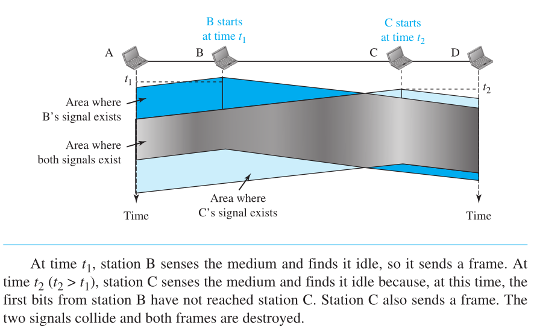

所以，对于一个CSMA的网络，它有一个Vulnerable Time，也就是会发生碰撞的时间。这个时间自然就是propagation time了。在这段时间内如果有的结点要发frame，就有可能产生碰撞。

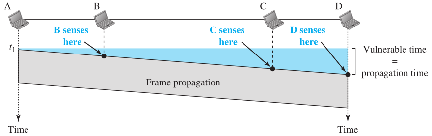

#question 这个监听到底是什么机制？是隔一段时间监听一下；还是一直在监听，只是听一段时间发现没人就说话？按着这个脆弱时间的解释，我觉得应该是后者。

然后就是，当我监听完了，我该做什么？是发送帧还是等一会？对于策略的采取有三种方式：1-persistent、nonpersistent、p-persistent。

**1-Persistent**

这里的1指的是概率，我们先看一下图：

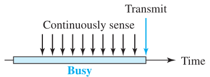

这里一直在监听一直在监听，一旦发现channel空闲了，立刻毫不犹豫发送我的帧。因此遇到空闲状态时发送的概率为1。这种情况也是最有可能产生碰撞的，因为俩人同时遇到了空闲就立刻同时发。

---

**Nonpersistent**

这个就不是一直监听了。我冷不丁先听一下，如果发现channel空闲，我还是立刻发；但是如果我发现channel是busy的，那我要先等等，而等的这个时间就是随机的了，等完之后再继续监听。

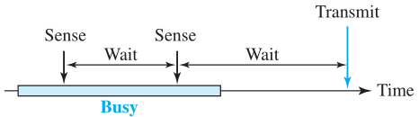

这种方式碰撞概率比1-p少一点，但是有时候会降低效率。比如我正在等，但是这个时候整个channel都没有东西，所以我就白等了。

---

**p-Persistent**

和1-p相对，这里的p也是概率。不过这种方法结合了上面两种的方式，优点大大滴有，不过就是复杂了一点。前提条件是，这种方法对channel有要求：**必须是有time slot的信道，并且时隙要$\geq$最大的propagation time**。首先我们规定好一个概率p，然后开始连续监听channel，如果是busy，那就继续监听，当发现是空闲的时候，就开始了：

* 首先产生一个\[0, 1\]的随机数R，看$R \leqslant p$是否成立。
* 如果成立，那么就发送这个帧(概率是p)。
* 如果不成立，那么就等一个time slot，然后再看channel忙不忙。
* 如果是忙的话，就代表我之前探测的那个信道闲很可能是表象，我当时要是发了必定碰撞，因此在极度愤怒的情况下，直接使用backoff process将数据重新排队等待发送。这种方法和碰撞发生了的处理方法是一样的。 ^9213f3
* 如果是闲的话，那我就再回到开头那步生成新的随机数R。

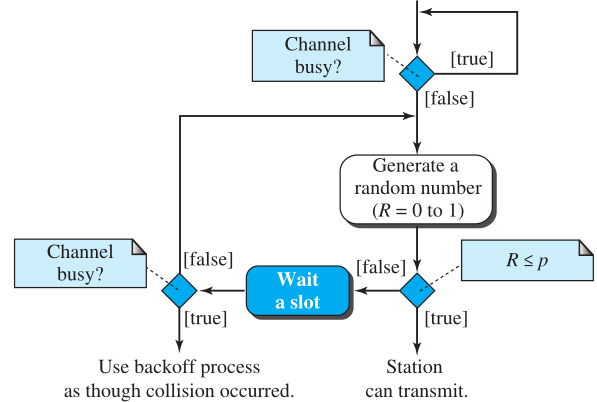

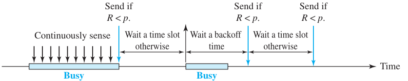

#### 13.2.1 CSMA/CD

在CSMA中，一个结点发送了帧之后就不管了。尽管我们已经用p-p这种看起来很聪明的协议去尽可能减小碰撞，但是依然无法完全避免碰撞。所以我们还要给CSMA加上一个小耳朵，这就变成了**Carrier sense multiple access with collision detection**。在这个协议中，每个结点发送完Frame之后，还要负责到底，去检测它是否在传播过程中发生了碰撞。下面就是CSMA/CD的工作原理：

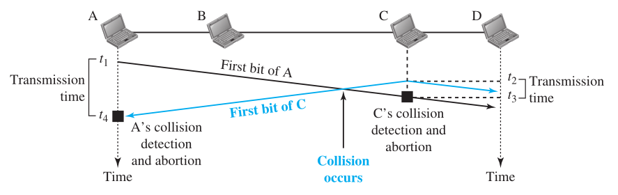

在$t_1$时刻，A发送了一个Frame($\longrightarrow$)，然后在$t_2$时刻，C也要发一个($\longleftarrow$)。这个时候它先探测channel是否忙，结果是空闲，所以C也发了一个(概率是p)。但是没过多久，也就是到了$t_3$的时候，双方Frame产生了碰撞，而C检测到了这个碰撞，立刻废弃掉这个Frame准备重传。而当C这个废帧的第一个bit到达A那里，也就是$t_4$的时候，A才明白它之前发的那个Frame撞废了，所以A也准备重传。在这个过程中，A花费了$t_4 - t_1$时间，而C花费了$t_3 - t_2$时间。

那么如何才能实现这个功能呢？因为我在发送的时候要检测到我发的有没有问题，那我必须要满足：**无论何时发生碰撞，这个时间我必定仍然在传输这个帧**(一个很那个的比喻，必须还没完全拉出来~)。因为当我完全把这个帧拉出来之后，我就不会再有这个Frame的副本了。就像钓鱼的线一样，我发现我手里的杆子有异动从而能判断水下发生了异常，但是如果鱼竿脱手了我怎么摸也摸不到了。因此为了满足这个条件，帧的长度必须有一个最小值，保证无论何时发生碰撞都要能探测到。

接下来的问题就是这个最小值是多少。我们直接从最坏的情况讨论：比如双方位于channel的两端，而且一方发送之后，直到在到达对方，也就是channel的尽头的时候才发生碰撞(这意味着此时另一方刚开始发送)，然后要等到另一方的废帧传回来之后才能收到。这整个的时间是$2T_p$，所以我需要满足**在我发送后的$2T_p$时间里都要正在传这个帧**。也就是，，，我拉的时间$T_{fr}$要$\geq\ 2T_p$。

接下来看一下CSMA/CD的整个流程图，还是挺复杂的。


* 当有帧要发送的时候，首先应用之前提到了三个策略：1p、np、pp来发送帧。
* 当开始发送的时候，**一边发一边收**，体现在图中就是Transmit and receive。
* 如果一直都没有检测到碰撞，那就最终Success
* 如果检测到了碰撞，那我一定是要废弃掉这个**正在发送**的帧并准备重传。
* 首先发送一个Jamming Signal，警告所有的结点，这里出事故了！
* 然后还是ALOHA那一套，等待随机的时间后重传。

#### 13.2.2 CSMA/CA

**本节内容建议看16章的时候配合着看。**

对于只能无线传播的网络，我们怎么应用上面那一套规则呢？于是人们发明了Carrier sense multiple access with collision avoidance。首先，我让K=0，然后一直检测channel。如果发现是空闲，那么首先我要先等一段时间(IFS)，等完之后我又要等一段时间(CW)，然后我还是不能发帧，要先发一个请求(RTS)，然后我设置一段时间。在这段时间内如果收到了接收方的允许发送信息(CTS)，那么我还要再等一个IFS，然后才能发帧，然后再去接收ACK。

![[Pasted image 20221029113404.png]]

先来看看IFS的作用。在[[#^4a5f64|后面]]我们会看到隐蔽站问题和暴露站问题，这些问题的根本原因是无线设备去探测的时候即使感知到自己这边没问题，也不代表真的没问题。所以需要先等一段IFS，**在这段IFS时间内，所有的外来信息的第一个bit一定到达了自己的球面**，所以这样就保证了不会产生这些问题。另外，IFS也有规定优先级的作用，通常IFS越短的设备优先级越高。

然后是Contention Window。这其实就是一大段时间，只不过被切成了一个个time slot。而在等待的时候，就要随机抽一些time slot去等待，而这个时间每次都是以2的指数在增长。在等待的过程中，每经过一个time slot，都要探测一下channel，如果发现是忙，它不会重启，只会暂停计时器；如果发现是空闲的，**那么不代表没问题，代表我要重启这个过程重新等**！听起来好像不太符合正常人的思想，但是我们需要考虑一下为什么会这么做。对比一下之前的[[#^9213f3|p-persistent]]，就能清楚为什么这样做。总体来说，这样可以优先考虑等待时间最长的结点，因为它都好久没发东西了。

接下来是发帧的过程，这里我就直接贴书了，很好看懂：

![[Pasted image 20221029122158.png]]

![[Pasted image 20221029122221.png|500]]

![[Pasted image 20221029122210.png]]

## 14. Wired LANs: Ethernet

对于不同范围内的网络，我们有不同的实现方式去应对：

* Wide Area Network
* Metropolitan Area Network(城域网)
  * Wimax(802.16)
* Local Area Network
  * **Ethernet(802.3)**
  * **Wifi(802.11)**
* Personal Area Network
  * Bluetooth(802.15)

IEEE公司的802团队制定了802标准，以便不同的设备之间能用相同的协议来互相通信。下面是一些标准：

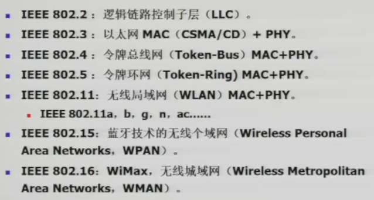

而它们也将Data-link layer分成了两层，就像[[#10.3 DLC and MAC|10.3]]中提到的一样：

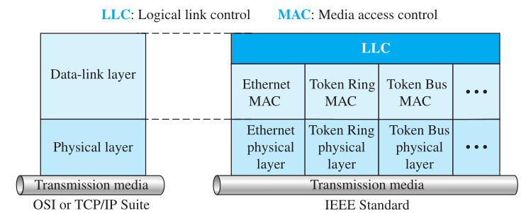

> 如今的以太网通常已经不装备LLC，只装备MAC，并且使用[[#12.4 Point-to-Point Protocol|12.4]]中的PPP协议来替代LLC。

^14182a

### 14.1 802.3 Frame

首先来看看这里的MAC协议是怎么规定Frame的：

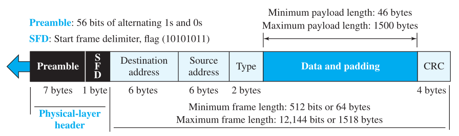

* Preamble: 在物理层加的，严格上讲并不是frame的一部分。这里是56bit的0和1，用来同步时钟。另外我们在操作系统中也提过[[os#^c31505|类似的概念]]。
* Start Frame Delimiter(SFD): 标识着frame的开始。同时也预示着这是最后的同步时钟的机会。最后两位`11`标识下一个区域是destination address。因为这种协议的Frame是一个变长的Frame。SFD也是在物理层加的。
* Destination Address(DA): 接收方的链路层地址。可以是一对一，也可以是像MAC一样的“这个地址是我所在的组的”，还可以是一个[[#^bf222a|广播地址]]。一旦我认可，那我就从Frame里把数据拆出来交给上层。
* Source Address(SA): 发送方的链路层地址。
* Type: 这里是上层打的包，比如IP，ARP或者OSPF。
* CRC: CRC-32纠错码。

802.3采用的是[[#13.2.1 CSMA/CD|13.2.1]]中的CSMA/CD协议，所以肯定要规定最小的Frame长度，同时也得有个最大长度。这里只给结论：

> **Minimum frame length: 64 bytes			  
> Maximum frame length: 1518 bytes**
> ---
>
> **Minimum data length: 46 bytes				
> Maximum data length: 1500 bytes**
>
> 这里特指10M的以太网。

### 14.2 Addressing

接下来看一下以太网中的设备的地址是怎么确定的。这个地址在Network Interface Card(NIC)中，是一个链路层的地址。其实就是我们所说的**Ethernet MAC**地址： ^b66b20

> 4A:30:10:21:10:1A

这就是一个例子。我们能看到，以16进制来写，一共是48bit，也就是6byte。每个冒号区分的就是一个字节。

#### 14.2.1 Unicast, Multicast and Broadcast Address

那么这些地址都有什么类型呢？我们接着往下看。首先是Unicast Address，这表示Frame只来自一个结点。所以所有的Source Address都是UA。而对于Destination Address，就可以是UA，Multicast和Broadcast。那么怎么区分是Unicast和Multicast呢？看下图：


我们能发现，**第一个字节的最后一位**规定了是单播还是多播。因此如果写成16进制的话，就是**第一个冒号之前的最后一位**。

另外，Broadcast是Multicast的特殊情况，**如果Destination Address是48个1的话**，表示我这个帧要发给当前LAN中所有的结点，因此这就是一个Broadcast Address。

#example Define the type of the following destination addresses:

a. 4A:30:10:21:10:1A
b. 47:20:1B:2E:08:EE
c. FF:FF:FF:FF:FF:FF

由以上判断，我们只需要看第一个冒号之前的最后一位。

a: A -> 1010，0是Unicast

b: 7 -> 0111，1是Multicast

c：因为全是F，所以肯定是48个1，也就是Broadcast

接下来，还有一点比较重要，就是这个Address在Frame中的传播方向。我们如果有下面的地址：

> 47:20:1B:2E:08:EE

那么假设我们的传播方向是$\longleftarrow$，应该怎么塞这个地址呢？首先要明确的一点是，**字节一定是连续的**。也就是接收方肯定是先收到第一个字节，再收到第二个字节……因此我们发送的顺序也一定是第1个字节在第二个字节前面，第二个字节在第三个字节前面……接下来比较重要的是字节内部的编排。比如第一个`47`。为了我们的接收方号接收，我们可以想象一个栈。如果将47写成二进制的话就是`0100 0111`。而如果我们从前往后将它压入栈中，然后从栈顶依次向下取的话，结果就会是`1110 0010`。**而你可以把接收方也想象成一个栈**，因为它接收的话如果还要每接一个bit就要排序的话，那可太费事了。所以这串`1110 0010`发送过去后又冲进接收方的栈中，这样只要挨个拿出来，结果就会是`0100 0111`，正是原来的结果。所以我们整个发送的顺序就是：**字节是从左到右、字节内部从右到左**。就像下图一样：

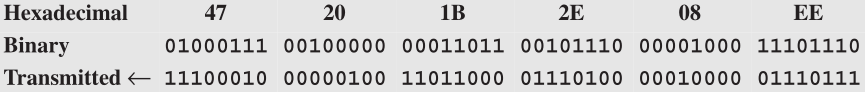

**因此接收方只需要准备一个栈，然后每接收一个字节，就提取出来。这样就能接收完整个帧了。**

### 14.3 Our Effort

以太网的发展经历了非常长的时间。这个过程中人们也付出了很多努力。我们现在来看一看**交换机**是怎么在这个过程中出现的。以前在一个LAN中，计算机通常被分成了很多个组，每一组一起通信，而这些组合在一起共享这10M的带宽：

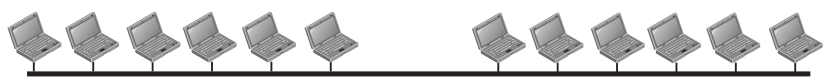

而所有的计算机都要通过CSMA技术去抢占带宽，这样的速度简直苦不堪言。因此人们想了个办法，干脆把中间这个线剪断，这样这两个组就能分别都享有10M的带宽了。但是剪断之后这两个组之间怎么通信呢？于是人们在中间造了一个桥：

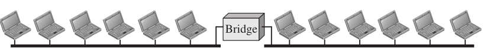

接下来，人们开始不断地**减少每个组中计算机的数量**。这样10M带宽使用它的人越少，冲突就越少，网速就越高：

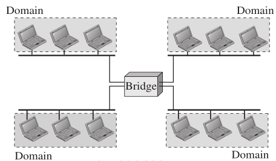

当发展到一定阶段的时候，已经可以让每个组中只有一个计算机了。这个时候中间的这个桥已经长出了密密麻麻的触手。因此再叫它桥已经不合适了。因此Switch——交换机就诞生了：

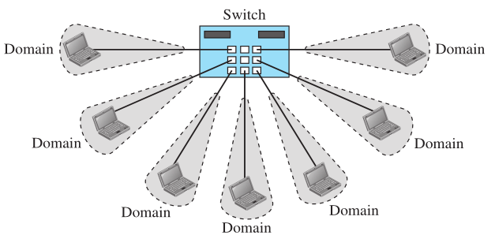

这个时候的网络已经可以叫做Switched Ethernet了，因为即使使用了CSMA技术，也不会产生冲突，因为每个域中只有一台计算机，根本没有人会和它抢。但是这种线仍然是Half Duplex的，因此我们需要再加上一根线，让它变成Full Duplex：

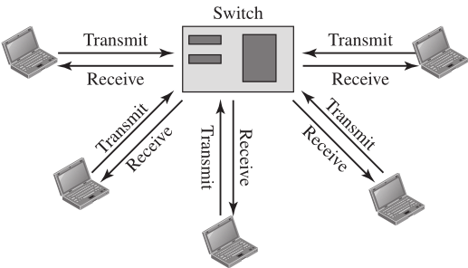

## 15. Connecting Devices and Virtual LANs

### 15.1 Connecting Devices

对于网络中的每一层，其实都是有其固定的连接设备。我们之前讨论过的交换机、路由器之类的其实都是连接设备：

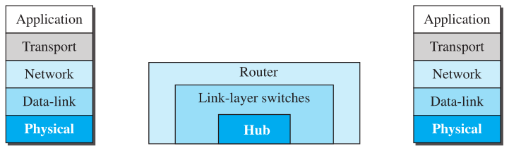

这所有的Hub, Switch, Router之类的都可以叫做网关(Gateway)。而在传输层和应用层也是有网关的，比如我们最常听到的**防火墙**。

#### 15.1.1 Hubs

从前，因为在物理层传播的信号会有损失，所以人们在中间布了一种能再生信号的设备——**Repeater**。这种设备能让受损的信号恢复成原来的样子：

![[Pasted image 20221014195317.png]]

而如今的网络通常是好多个结点互相传播，因此在这些结点中间布了一个中间结点，它也有Repeater的作用，同时也能够给所有结点建立连接，这就是**Hub**：

![[Pasted image 20221014195549.png]]

Hub的内部结构是这样的：

![[Pasted image 20221014195814.png]]

需要注意的是，Hub并没有过滤作用。也就是它不知道这个数据是从哪个端口来的，它只要接到数据，就把它从所有端口都发出去，收不收由结点来决定；**Hub的所有端口构成1个域，这个域即是广播域也是冲突域**。

* **广播域表示网络中能接收任何一个设备发出的帧的所有设备的集合。**
* **在一个冲突域中每一个结点都能收到所有被发送的帧，比如点对点之间。**

#### 15.1.2 Link-Layer Switches

交换机(老师的PPT中是**网桥**)在物理层和数据链路层都工作。在物理层的工作就和Repeater一样，而在数据链路层它就会检查Frame当中的MAC地址。并且，交换机是有过滤功能的。它能检查Frame中的Destination Address并且决定从哪个端口发出去。

比如下图中的例子中，如果有一个帧来了，它的DA是`71:2B:13:45:61:42`，并且是从端口1来的，那么交换机一查这个表，就知道从端口2发出去。

![[Pasted image 20221014201116.png]]

#poe 从这个例子中我们也能看出来，**链路层的交换机并不会改变帧中的MAC地址**。另外，**交换机(网桥)的所有端口构成了一个广播域，而其中每一个端口都是一个冲突域。**

---

**Learning Switches**

其中的Switching Table如果都是人为规定的话，那也太麻烦了！所以人们搞出来了一个学习型的网桥，它能通过实际发送的过程来增加或者删除表项：

![[Pasted image 20221014202442.png]]

现在假设A要给D去发数据。这个时候交换机的表是空的，所以它也不知道该往哪儿发，索性就把所有端口都给发一个。虽然这给ABC造成了不小的麻烦，但是交换机也学到了点东西：你这个帧是从1端口进来的，源地址是`71:2B:13:45:61:41`。也就是说，**我下次如果收到一个DA是你这个值的帧，我从1端口发出去就得了呗**！所以这个时候这个交换机就自动给自己的表里添加了一项：

Address | Port
--- | ---
71:2B:13:45:61:41 | 1

之后，D给B又发了个帧。这个时候交换机依然不明白。所以又像刚才一样来了一遍，之后表就变成了这样：

Address | Port
--- | ---
71:2B:13:45:61:41 | 1
64:2B:13:45:61:13 | 4

这么一直犯错，一直学下去。终究会有一天不会犯错的。只不过会有这种例外：如果某一个结点永远也不发帧，那么它也就永远也不会被注册到交换机的表里。这意味着他要想接收帧只能靠交换机在那儿蒙才可以。

另一个问题是：LAN中通常不只有一个交换机。那么我们来看一看如果有多个交换机的话，会出现什么情况。**下图是两个Switch连接了两个LAN，每个LAN是一个Hub连三个结点**。

![[Pasted image 20221028124525.png|600]]

* 还是A要给D发一个Frame，那么首先到达LAN1的Hub，它会把这个Frame从所有的端口都传出去一遍。当然，ABC会主动废弃掉它，那么另外的两个就到达了左右两边的交换机。
* 这两个交换机都需要这个Frame来进行学习，那么学习完之后他俩都会更新自己的表，也就是1端口连接的是A。
* 但是就像之前说的一样，这俩交换机此时并不知道该往哪儿发，所以它们还是会把数据从所有端口都传一遍。
* 比如从左边交换机的2号端口发出的帧，经过LAN2的Hub又会被扩散。D确实能收到，但是还有一个分身从LAN2的Hub居然到了右边的交换机中。
* 这个时候右边的交换机就傻眼了：不是刚刚才把A和1连上吗，咋2号也来了一个A的帧？难道A这个玩意儿突然换地方了？不管了，更新表再说。
* 与此同时，左边的交换机也正和右边的交换机有着相同的经历。于是他俩不约而同把自己的表都改了一遍。
* 这俩交换机懵逼完，更新完表，还是不知道到底要传给谁，因为中间有个Hub在作怪。所以还是只好又把这个帧从所有端口发一遍。
* 这两个帧到达LAN1的Hub后，又会经历同样的事情。于是这俩交换机的表变来变去，帧也发来发去，永远也发不完。

其实，这种问题就是数据结构中图的环路问题。要消除环路，自然是把图变成一个树。所有的树都是不可能产生环路的，因此只要我们**从逻辑上切断某些链路**，就能够杜绝这种绕圈圈的问题。

下面还是通过一个例子来看如何生成一个树。

![[Pasted image 20221028131150.png]]

* 所有的交换机都是有独一无二的序列号(Serial Number)的，这表示它的生产日期。那么我们首先让所有的交换机都广播一下自己的序列号，看谁最小。序列号最小的那个就是年龄最大的那个。我们公认它为老大，也就是这棵树的根节点。
* 接下来，我们需要学习一下任何能实现最小生成树的算法。这里我找了一个b站上不错的视频：[最小生成树(Kruskal(克鲁斯卡尔)和Prim(普里姆))算法动画演示_哔哩哔哩_bilibili](https://www.bilibili.com/video/BV1Eb41177d1/?spm_id_from=333.337.search-card.all.click&vd_source=64798edb37a6df5a2f8713039c334afb)
* 然后，有了算法，最关键的边的权值是啥？反正书中说的是：**通常情况下，从Switch->LAN的权值是1；从LAN->Switch是0**。因此我们能画出下图：

![[Pasted image 20221028132358.png|600]]

* 之后，运用你学习的算法，就能够生成一颗最小的树了：

![[Pasted image 20221028132656.png|600]]

在这棵树上进行通信，就不会发生之前的绕圈圈的情况。但是，注意一开始说的：**从逻辑上切断。**其实，这根线是没有切断的，只不过我们用软件将帧的传输给阻塞了：

![[Pasted image 20221028132957.png]]

以上我们介绍的学习型网桥在实际应用中叫做Spanning Tree Protocol(802.1d)，这里也找了一个介绍它的网站：[CS402: The Spanning Tree Protocol (802.1d) | Saylor Academy](https://learn.saylor.org/mod/page/view.php?id=27567&forceview=1)

接下来给一下老师ppt中说明的网桥和交换机的区别(其实他俩就是一个东西)：

* 网桥：少量端口，连接局域网
* 二层交换机：更多端口，连接站点

#### 15.1.3 Router

**==路由器的每一个端口都即是广播域，也是冲突域。==**

#poe 广播域和冲突域

如果有n个端口的话，那么下面这些设备的广播域和冲突域如下：

设备 | 广播域 | 冲突域
--- | --- | ---
中继器 | 1 | 1
集线器 | 1 | 1
网桥 | 1 | n
交换机(二层) | 1 | n
路由器 | n | n
交换机(三层) | n | n

前两行是物理层；中间两行是链路层；最后两行是网络层。另外，仔细想一想之前提到过的这些设备的功能，就能明白为什么会是表格中的结果了。实在不行，模拟发个数据走一走也好！

### 15.2 Virtual LANs

实际上，即使是完全处在内网环境的设备，也很有可能已经和外网建立了**物理上**的连接。但是为什么我却访问不到外面的世界呢？靠的就是虚拟局域网。因为我们不可能随便去更改物理上的连接，但是我们可以比较轻松地通过编程去实现将团体和团体之间隔绝开来。这就是Virtual LANs的作用。

传统的物理网络，只要你连上了交换机，那么你理论上就能和其它连上这个交换机的所有设备通信。但是我不！我要给你们分个组。你们只能进行组内通信，不允许组间进行通信。那么这个时候，设备和交换机的连接就是这样的：

![[Pasted image 20221028135753.png]]

甚至我还可以让交换机也分工，这样的系统就更加庞大了：

![[Pasted image 20221028135845.png]]

下面来想一想这个VLAN的作用：我们之前说过，链路层交换机的所有端口合起来是一个广播域，也就是这里所有的设备之间都能互相通信。但是我们加上了VLAN，使得它们之间的连接被拆成一组一组的，这也就是**将这个广播域给切开**了。

> **VLAN创建广播域**

那么我们如何区分这些组呢？通常有三种方式。一种是通过交换机的端口，比如1,2,3,4号端口是一组；5,6,7,8号是一组等等……这样对于从6号进来的帧，只允许从5678发，不允许其他端口传这个帧。这样就能实现逻辑上的隔绝；另一种方式是通过mac地址。我提前把所有的mac地址分成一组一组，这样无论插到哪个端口，都只能和规定好的组员进行通信了；和mac地址类似的，还可以使用IP地址。VLAN建立在链路层，理论上是看不到网络层的IP地址的。但是设计者就给了VLAN这个特权，所以咱也么得办法。

## 16. Wireless LANs

这一章是和14章相对的，也就是无线局域网。[[#13.1 ALOHA|13.1]]中介绍的ALOHA其实就是世界上最早的无线网络，只不过那个时候还没有成型的无线网络标准。

![[Pasted image 20221028141159.png]]

有线和无线到底有什么区别？下面给出几种：

* 首先是传播介质。有线的传播通常是靠电缆或者光缆；而无线传播自然是靠空气。
* 有线局域网中，设备的链路层地址是不会变的(网络层的IP地址会变)，它的[[#^b66b20|NIC]]是什么，那地址就永远是什么。并且必须先物理地连上网络，才能使用网络服务；但是在无线局域网中，不需要物理地连上网络，想用就用，想走就走。
* 夏威夷大学的那种孤岛型的网络也分为有线和无线。它们的区别可以用下图来表示：
![[Pasted image 20221029102620.png]]
可以看到，无线局域网中并没有链路层的交换机，这也是我们现在很少看到它的原因。
* 有线网和无线网都是靠路由器去和其他的网络连接。但是也是有区别的：
![[Pasted image 20221029103038.png]]
注意右边的**Access Point**，这和链路层交换机是完全不同的两个概念。交换机所有的连接都是有线的；而Access Point和自己这边的主机是无线，和外界网络的连接是有线。这其实好像就是我们宿舍窗户顶上的那个小东西，或者是网络公司给你家装网络时在柜子上摆着的那个带天线的小盒子。

### 16.1 Atchitecture

#### 16.1.1 Basic Service Set

无线网络也分为带AP和不带AP的，就像这样：

![[Pasted image 20221029105252.png]]

这两种都可以叫做**BSS**。不带AP的BSS不能和其它局域网沟通；而带AP的可以。

#### 16.1.2 Extended Service Set

把多个BSS绑到一起，再加个路由器，就变成了ESS。这个时候，BSS们通过分布式系统去连接。在这种模式下，**所有的电脑手机啥的统称为mobile；而AP叫做station**。

![[Pasted image 20221029105935.png]]

### 16.2 MAC Sublayer

还是回到[[#10.3 DLC and MAC|10.3]]中的这个MAC，在IEEE的802.11标准中，将这个层又给拆开了：

![[Pasted image 20221029110527.png]]

*注：LLC层的介绍在[[#^14182a|这里]]有提到过。*

我们可以看到，MAC被拆成了两个功能：PCF和DCF。这里的Contention是抢占、竞争的意思，那么一旦涉及到抢占，就一定会用到处理抢占的协议，比如[[#13.2 Carrier Sense Multiple Access|13.2]]中介绍的这些协议。但是要注意，这里是无线的方式，所以会有这些问题。

* CSMA/CD协议要求一个站点在发送本站数据的同时，还必须不间断地检测信道，但在无线局域网的设备中要实现这种功能就花费过大。 ^4a5f64
* 即使我们能够实现碰撞检测的功能，并且当我们在发送数据时检测到信道是空闲的，在接收端仍然有可能发生碰撞。

![[Pasted image 20221029111559.png|300]] ![[Pasted image 20221029111638.png|300]]

# Part 4: Network Layer

## 17. Addresses

数据在网络层传输的情况是这样的：

![[Pasted image 20221029143245.png]]

在[[#15.1.2 Link-Layer Switches|15.1.2]]我们介绍过，链路层的交换机不会改变MAC地址，这在上图中体现为每一个点到点的mac帧不改变；但是在整个的传递过程中，mac地址是会发生改变的！而不变的是网络层的IP地址。

从网络层开始，我们的目的逐渐清晰了起来：之前的物理层和数据链路层，它们其实都是在为网络层提供接口；而网络层的功能也是为了给上层的用户应用程序去提供接口。因此网络层在这中间充当了桥梁的作用——**Everyting over IP**！

![[Pasted image 20221029143714.png]]

### 17.1 IPv4 Address

这个咱实在是太熟了！一共32bit：

![[Pasted image 20221029144722.png]]

IP地址被拆成了两半：前一半是网络段，后一半是主机段。网络段用于路由器去定位目标的路由器；而主机段用于接收方去寻找自己管的那个计算机。这样分很好理解，但是究竟多少是网络段，多少是主机段呢？具体的分法有5种，**也就是常听到的ABCDE 5类地址**：

![[Pasted image 20221029145409.png]]

另外，在IP地址空间中，保留了几个用于**私有网络**的地址。私有网络地址通常应用与公司、组织和个人网络，它们没有置于因特网。

![[Pasted image 20221029150106.png]]

#poe 我们比较常用的是A类和C类，而考试有可能会考B类。另外介绍一些其他的IP地址：

* IP地址的编码规定**全“0”**地址表示**本地地址**，即本地网络或本地主机。全“0”的IP地址用在使用动态主机配置服务器的网络上（如Windows NT中的动态主机配置协议DHCP) 。
* **全“1”**地址表示**广播地址**，即网络上的主机可以使用广播地址向某个网络上的所有主机发送报文，任何网站都能接收。
* **网络号为127的A类地址**用于网络软件测试以及本地进程间的通信，这叫做回送地址(loopbackaddress) 。

---

即使这样还不行！我们在玩电脑的时候或多或少都见过**子网掩码**这个东西，接下来就说一下它到底是干嘛的。

比如说我有一个B类地址：`145.13.0.0`，它的前两个字节是网络段，也就是`145.13`，当有数据来的时候，就先到达这个大总管路由器。但是这个时候，如果这个路由器直接连上所有的设备，那可毁了！B类地址中每个网络能连接$2^{16}=65536$个计算机。这么多计算机如果不分个类的话，实在是太乱了。因此我们才有了**子网**的概念。子网其实就是把IP地址的主机段再切一刀，变成子网段和主机段。而B类地址中第三个字节就是子网段，最后一个字节是主机段。因此我可以先确定这个消息的子网是哪个，然后再去详细到每一个设备。 ^ad42ee

![[Pasted image 20221029152305.png]]

因此，子网掩码的作用，就是**把最后的主机段置零，把前面的网络段和子网段保留下来**。这也是我们看到的子网掩码为什么通常都是`255.255.255.0`的原因了。另外，像我[[1. hadoop#^3af7e7|作业中提到的]]这种写法叫做**变长子网掩码(Variable Length Subnetwork Mask, VLSM)**。这种方式通常是为了给子网更加细分，比如子网的子网就比子网多一位掩码。

---

C类地址不够用了，怎么办？于是CIDR诞生了！全称叫做**Classless InterDomain Routing**。在这种地址中，只有两段：网络段和主机段。而最后也有那种斜线的写法，最后跟上一个n，这个n就是网络段的bit位数。**同时，它也能胜任变长掩码的任务**。

![[Pasted image 20221030121321.png]]

因此，如果我们有这样一个地址：

```txt
128.14.32.0/20
```

这代表前20位是网络段。那么对于每个网络段来说，主机的个数就是$2^{32-20}=2^{12}$个。 ^21b459

#example 给一个ISP分配了起始地址为`190.100.0.0/16`的地址块，ISP需要按如下要求给3组客户分法这些地址：

* 第一组有64个客户，每个需要256个地址；
* 第二组有128个客户，每个需要128个地址；
* 第三组有128个客户，每个需要64个地址。

设计这些字块，并求出分配后还有多少可用的地址？

首先，这是要用CIDR去分，所以斜线后面的数字是可以变的。首先从第一组开始，因为每个人要256个地址，也就是`00000000 -> 11111111` 。因此我们只需要让最后一个byte不断循环64次就可以了。那么从`190.100.0.0/24`开始一直到`190.100.63.255/24`就是第一组的所有地址。

从第二组开始，起始地址就变成了`190.100.64.0`，但是我们还是首先要确定子网掩码是多少位。因为这里的客户只需要128个地址，也就是`0000000 -> 1111111`，因此我们只需要让最后7位是主机段，那么子网掩码就是25位。而一共有128个客户，从`190.100.64.0/25`开始，先让最后一个字节的最高位是0，循环128次；再让最后一个字节的最高位是1，循环128次。那么每两个客户才会让第三个字节+1，因此最后的地址范围就是`190.100.64.0/25 -> 190.100.127.255/25`。

到了第三组，起始地址变成了`190.100.128.0`，每个用户只要64个地址，也就是`000000 -> 111111`，只要最后6位主机段，子网掩码是26位。一共还是128个客户，从`190.100.128.0/26`开始，最后一个字节的高位经历`00, 01, 10, 11`之后才会让第三个字节+1，因此每4个客户才会消耗一个第三字节的东西。那么最后的地址范围就是`190.100.128.0/26 -> 190.100.159.255/26`。

最后可用的地址就更好求了。首先求出总共的地址是$2^{16}$个，那么用$2^{16}-64 \times 256 - 128 \times 128 - 128 \times 64 = 24576$个。

如果题里给的需要的地址数不是2的次幂怎么办？这么办：

![[Pasted image 20221109194641.png]]

---

接下来的一个问题是，在每一个LAN中，ip地址都是那么些，而肯定不能用这些ip地址去访问公网，因为必定会重复。所以我们需要一种技术，将私有地址和公共地址进行映射转换。这种技术就叫做**Network Address Translation(NAT)**：

![[Pasted image 20221109194955.png]]

这个工作就交给路由器来处理了，而这个路由器肯定也不能这么傻乎乎地把所有地址都变成一个公共地址。它的内部设计是这样的：

![[Pasted image 20221109195058.png]]

![[Pasted image 20221109195128.png]]

![[Pasted image 20221109195136.png]]

在路由器的内部有一个Translation table，这张表的工作就是将私有地址和公有地址进行映射。

### 17.2 IPv6 Address

这个地址比IPv4大了4倍。128bit，16byte。

![[Pasted image 20221109195630.png]]

每16bit中间打一个冒号，也就是两个字节。这种写法的缺点我们一眼丁真：**太长了**。另外，由于128bit给的空间实在是太大了,导致许许多多的ipv6地址中间都有好多好多个0。所以我们可以用两个冒号来压缩中间的0：

$$
FDEC:0:0:0:0:BBFF:0:FFFF \longrightarrow FDEC::BBFF:0:FFFF
$$

这里`:0:`其实就是`:0000:`，四个连着的0被压缩成1个，而有多个4连0还可以进一步压缩成`::`。

**特殊的ipv6**

![[Pasted image 20221109200206.png]]

## 18. Internet Protocol

终于开始最终要的协议之一了：IP协议！在网络层中，传输的是数据报(datagram)，我们首先从数据报的结构说起。

### 18.1 Datagram

![[Pasted image 20221109201051.png]]

数据报看起来好像很简单啊，只有一个头和一个尾巴。其中尾巴里装的就是要实际发的数据，而头部主要存一些信息。但是这个头的内部构造可不简单：

![[Pasted image 20221109201214.png]]

我们能看到，固定的部分有5行，而每行是32bit，4byte。那么也就意味着，header的最小大小就是20byte。而可选部分最多有40byte，所以header的最大长度就是60byte。

#poe 虽然我们看着是一行行的，但是实际存储结构还是线性的。现在我们就一个一个开始介绍它们：

* VER, Version Number：在ipv4中，就是`0100`，也就是4的二进制。
* HLEN, Header Length：如果可选长度是0，那么header的长度就是20个字节。这个时候你就会问了：20你咋存到4个bit里？很显然，存不了。所以这里定义了**每4个字节是一个word**(这和传统的两个字节是一个word不一样，**这样的定义是为了方便表示每个word正好占一行**)，而HLEN里存的就是word对应的值。因此上面的例子中这里存的就应该是`0101(5)`。这样的设计，`1111`表示15，乘以4后就是60，正好是header的最大长度。 ^d40096
* Service Type：被废弃了，现在被换成了**Differentiated Services(DiffServ)**，之后再说。
* Total length：就是header+data的总长度。这里和HLEN不一样，有16bit，地方大得很，所以直接是存的有多少字节。有了这个，我们就能够算出data段到底有多长了：
  $$
  data\ length = total\ length - (HLEN) \times 4
 $$
* 第二行的信息和Fragmentation有关，这些我们之后再说。
* Time-to-live：有些datagram因为迷失自我，会在网络里不停转圈。那如果不干掉它的话，它就会非常影响交通。因此定义了这个数据报存活的最长时间，也就是这个数据报最多能到达多少次路由器。
* Protocol：数据报中的数据打包的方式有非常多种，这取决于我们用什么协议。我们可以用上层提供的TCP，UDP等协议，也可以用网络层自带的协议。那么这些协议都有一个独一无二的编号，这个编号就写在这段区域里：

  ![[Pasted image 20221110130805.png]]
  
* Header checksum：上面提到的所有header里的东西，出错了咋办？这个时候就需要一个校验和。这个和只用来校验header，而不是payload。

### 18.2 Fragmentation

IP层传的是数据报，但是这只是逻辑上的，实际传递还是需要经过下层继续打包再传。那么这个时候就会涉及到协议的问题。比如一个路由器连了一个LAN和一个WAN，那么这个路由器就要接收来自LAN的frame并且发送WAN的frame。

#### 18.2.1 MTU

由于网络层联通的是数据链路层，那么我们就从链路层开始说起。当数据报已经打好包了之后，就要传到链路层进行进一步打包。但是由于这两层的协议不同，所以我们需要探讨一些问题。首先，每一个数据链路层的协议中，都对Frame的大小做出了限制，就是Maximum Transfer Unit(MTU)：

![[Pasted image 20221110142650.png]]

一个datagram传过来，如果我这个frame装不下，那咋办？datagram的total length字段已经规定了，一个数据报的最大长度就是65535个字节。但是某些链路层的frame的数据段根本不允许有这么大(比如[[#12.4.1 PPP Framing|ppp协议中的Frame]])，那么这个时候就需要对datagram切上几刀，分散到若干个frame中。一旦开始切了，我们就需要考虑很多问题。

* 切完之后还是装不下，就需要再切。一个datagram在到达目的地之前，可能已经被切了许多刀。
* 切的工作由谁来做？根据第一条，我们能大概推测出来：应该是发送方和路径上的路由器；而有切就要有合。那么合的工作自然就是要由接收方来做了，因为datagram被切成好多段，而这些段被装进frame中，会走许多[[#^4370c8|不同的路径]]。所以只能等全到达接收方之后，由它来合。
* 我们切的主要还是datagram的payload字段，**而header可不能切**！这玩意儿保存了许多重要的信息，所以切出来的每个fragment都要存一份**几乎完整**的header，只有一些可选的部分可以不要。并且，这里也用到了数据报中的这些信息：Flags、Fragmentation offset、Total length。这些部分在每个fragment中也不同。与此同时，checksum也一定会跟着变。

#### 18.2.2 Fields Related to Fragmentation

现在就来介绍之前没说的那些部分：Identification、Flags和Fragmentation offset。**注意，上面的MTU是在链路层中，而接下来的东西都是在网路层中！**

**Identification**：将datagram的源地址和Identification拼起来，就能唯一确定一个datagram。ip协议一开始会将这里初始化成一个正数，每发送一个datagram，就在里面写一个新值(+1)。这样只要是来自一个ip协议，那么就能确定唯一性。并且在datagram被切成fragment的时候，这个值也被复制了，这样所有的fragment就有一样的id。使用这种特性，就能在合fragment的时候非常方便。

---

**Flags**：三个bit，最左边的是保留位；中间的是D位，也就是Do not fragment。如果这位是1，那么谁都不能切我这个datagram。那这样的话，如果中间的路由器发现不切不行，那就直接不要了，给发送方发一个ICMP error消息，告诉它你这玩意儿即不让切也运不了，我不干了！如果D位是0，那该切时就切；最后一个叫M位，也就是More fragment bit。如果这位是1，那就表示当前的datagram后面还有更多fragment。换句话说，就是这个datagram不是最后一个fragment。如果是0，那就表示这个是最后一个fragment，或者就是个独立的datagram。

---

**Fragmentation offset**：如果我这个datagram不是最一开始的fragment，如何确定你的偏移量是多少？靠的就是这个。比如我们有一个4000个字节的datagram：

![[Pasted image 20221110155659.png]]

从0号到3999号。现在我要把它切成三段，每段是个fragment，那么我们很容易就能写出这三段的编号：

![[Pasted image 20221110155755.png]]

那么现在的问题就是，在实际的datagram中，第一个数据的下标必定是0，也就是这个1400也必须是0。那么我们该如何记住偏移量呢？答案就在Fragmentation offset中。很显然，我们只要让第二个datagram的FO是1400，那么从0-1399就变成了1400-2799了。而第三个datagram的FO就应该是2800，第一个datagram的FO就是0。

接下来还有个问题，FO只有13位。这表示它最多能表示$2^{13}=8192$个字节。而IP的datagram最多可以有65536个字节。那么我要想表示这么多该咋办？类比我们[[#^d40096|之前用过的方法]]，$\frac{2^{16}}{2^{13}}=8$。所以我们只需要让这里面的数字每个表示8byte就可以了：

![[Pasted image 20221110160422.png]]

好了，关于Fragment的知识都介绍完了，下面给出一个详细的例子：

![[Pasted image 20221110160810.png]]

## 19. Address Mapping, Error Reporting and Multicast

本章主要是讲一些在网络层用到的其他协议，其中很多协议在别的层里也有。

### 19.1 Address Resolution Protocol

在网络层传东西的时候，通常是这样：source知道第一个router的IP地址，然后第一个router知道第二个router的IP地址(**靠的是forwarding table**)……最后一个router知道destination的IP地址。这样一层层传下去就能够传递datagram。但是问题是：真正的传递并不是在网络层，网络层中的传递只是逻辑上的传递。真正传还是要打包传到数据链路层才行。那这个时候链路层拿到一个IP地址，它也不知道要传给谁。因此我们需要一种机制，**将IP地址映射成链路层的MAC地址再打包传给链路层**，ARP就是其中的一种协议：

![[Networking/resources/Pasted image 20221127114030.png]]

> #poe ARP: Resolving IP address to physical address.

ARP如何工作的呢？假设一个LAN中有N1，N2，N3，N4这几个主机(或者系统或者路由器)，当N1想要知道N2的IP地址对应的MAC地址是多少时，就先发送一个广播的包(因为在知道链路层地址之前它也不知道N2在哪里)，这个包里面包括下面的信息：

* 发送方N1的MAC地址和IP地址
* 接收方N2的IP地址

发送的过程如下：

![[Networking/resources/Pasted image 20221127114441.png]]

显然，只有N2认可这个ARP请求包，然后把自己的MAC地址一填，返回给N1。返回的时候就不再是广播的了，而是unicast单播：

![[Networking/resources/Pasted image 20221127114535.png]]

下面是书上一个介绍ARP作用的介绍，我觉得还是挺有意义的：

> A question that is often asked is this: If system A can broadcast a frame to find the link- layer address of system B, why can’t system A send the datagram for system B using a broadcast frame? In other words, instead of sending one broadcast frame (ARP request), one unicast frame (ARP response), and another unicast frame (for sending the datagram), system A can encapsulate the datagram and send it to the network. System B receives it and keep it; other systems discard it.
> 
> To answer the question, we need to think about the efficiency. It is probable that system A has more than one datagram to send to system B in a short period of time. For example, if system B is supposed to receive a long e-mail or a long file, the data do not fit in one datagram.
> 
> Let us assume that there are 20 systems connected to the network (link): system A, system B, and 18 other systems. We also assume that system A has 10 datagrams to send to system B in one second.
> 
> a. Without using ARP, system A needs to send 10 broadcast frames. Each of the 18 other systems need to receive the frames, decapsulate the frames, remove the datagram and pass it to their network-layer to find out the datagrams do not belong to them.This means processing and discarding 180 broadcast
> frames.
> 
> b. Using ARP, system A needs to send only one broadcast frame. Each of the 18 other systems need to receive the frames, decapsulate the frames, remove the ARP message and pass the message to their ARP protocol to find that the frame must be discarded. This means processing and discarding only 18 (instead of 180) broadcast frames. After system B responds with its own data-link address, system A can store the link-layer address in its cache memory. The rest of the nine frames are only unicast. Since processing broadcast frames is expensive (time consuming), the first method is preferable.

接下来看看ARP的包裹长什么样子：

![[Networking/resources/Pasted image 20221127115435.png]]

* Hardware Type：链路层的协议，Ethernet等等
* Protocol Type：网络层的协议，IPv4或者IPv6
* Hardware length：发送方和接收方链路层地址的长度(因为协议一样，所以接收方和发送方相等，下面同理)

  > #idea 协议为什么一样？因为[[#1.4 Five components of data communication|这里]]呀！

* Protocol length：发送方和接收方的网络层地址的长度
* Operation：是Request还是Reply
* 再下面就是四个地址了。注意在发送方发送的时候，接收方的链路层地址为空，等着接收方填；另外注意hardware address和protocol address的区别。**当协议是IPv4，使用Ethernet的时候，hardware address是6 byte而protocol address是4 byte**。

有了这个包，我们将他作为**Data**，添加到[[Networking/img/8f.png|链路层的Frame]]中，就可以发送了。注意在请求的时候，因为是广播地址，所以Destination address字段是全1。 ^bf222a

#poe ARP的请求是广播；而应答是单播。

### 19.2 Dynamic Host Configuration Protocol

有些人连IP地址都不会配，那怎么办？只能动态给他分配一个。而MAC地址是自带的，所以由链路层地址去找到IP地址的协议，DHCP(Dynamic Host Configuration Protocol)就是其中之一。

最一开始没有DHCP，有的是RARP协议，即Reverse-ARP。这个协议也是放在网络层中，和ARP一起干活。但是后来它被BOOTP协议代替，而BOOTP协议是放在应用层中的。再后来，BOOTP协议也被替代，替代他的就是DHCP，**DHCP也是应用层的协议**。

### 19.3 Internet Control Message Protocol

之前说过，IP没有纠错功能，它的错误处理功能全部放在了ICMP中。我们现在使用的ICMP是第四版，也就是ICMPv4。ICMP协议中传的包裹有这两种：

* error-reporting message：当中间节点或者接收方发现IP传过来的datagram出错时，就会发送这样的包裹。
* query message：这种消息都是成对出现，计算机或者路由器可以用它来获取其他节点的信息。比如某个路由器就可以通过这个知道它连的电脑是谁；它身边的路由器邻居们都是谁。

然后是这两个message的结构，看看就行：

![[Networking/resources/Pasted image 20221127123336.png]]

总结几个ICMP消息的重点：

* 如果一个携带ICMP的datagram本身就出错了，那出错的地方不会再产生一个ICMP；
* 如果datagram被切了，那只有第一个fragment才会产生ICMP。如果是后面的fragment出错了，在接收方收的时候就能发现，直接全部重传；
* 如果这个datagram的地址是multicast，那不会产生ICMP。因为这样有可能会影响其他节点，多播的理念本来就是蒙，你少蒙一种情况没啥问题。
* 私有地址不会产生ICMP，比如127.0.0.0或者0.0.0.0

ICMP也会打包成datagram传给source：

![[Networking/resources/Pasted image 20221127123944.png]]

> 这里从上往下看，首先是收到的datagram，这个是出错的datagram；之后将这个datagram的IP header和后面的8byte的东西扒出来塞到ICMP的包裹里形成一个ICMP的包；最后将这个ICMP的包整个再作为另一个datagram的data字段发送出去。
> 
> #poe 另外补充一点，我们用的`ping`命令其实就是ICMP中的query message。

除了ICMP，还有一种按组来管理差错的协议，叫Internet Group Management Protocol(IGMP)。它和ICMP的形式几乎一模一样。

### 19.4 Forwarding

现在终于开始讲路由器中的Forwarding Table了！当一个datagram传过来时，我要解析出其中的Destination Address，然后按着这个地址去查表。先强调一点，这个地址其实是有问题的：[[#^ad42ee|我们说过]]，通常传递datagram的时候是先传到对面的网络段总管路由器，然后再下发。因此这里的Destination Address其实并不需要是真正接收的那个计算机的IP，只需要知道它的网络段的IP就行了。因此我们通常要用mask把这个地址给掩一下然后再和表中的项对比。下面来看看Forwarding Table的结构：

![[Networking/resources/Pasted image 20221127131855.png]]

比如来一个地址是`180.70.65.200`，那我在第一行就要把这个地址和`n0`来一次与运算，看得到的结果是不是`x0.y0.z0.t0`。如果是，那就对了。比如`n0`是26，那掩过之后就是`180.70.65.192`。；表中的第二列是下一跳的IP，也就是路由器或者接收方的IP；第三列是接口号，就是下一条的这个东西连在了我的哪个接口上。

#example #poe 生成Forwarding Table是必考点。

给下图中的R1路由器生成一个Forwarding Table：

![[Networking/resources/Pasted image 20221127132314.png]]

我们能看到这四个网段的IP地址，也就是蓝色的：

* 180.70.65.192/26
* 180.70.65.128/25
* 201.4.22.0/24
* 201.4.16.0/22

在[[#^21b459|介绍CIDR的时候]]说过，掩码越小，代表主机的个数越多，网络段也就越大。我们通常是按照网络从小到大，也就是掩码从大到小的顺序排列的。上面的四个地址正好对应了表格中的第一列，也就是发给谁这一列；另外注意这四个地址，由于直接连的就是网段，不是路由器，所以发到这里就已经结束了。所以根本就没有Next Hop。因此可以写出这个Forwarding Table：

![[Networking/resources/Pasted image 20221127134132.png]]

但是，这张表中通常包含一个默认选项，也就是当收到的datagram和所有的表项都不匹配时，该往哪里发？这里能看出，只有可能是下面这个路由器，也就是180.70.65.200/26。因此写出完整的表格：

![[Networking/resources/Pasted image 20221127134251.png]]

现在假设有个包，地址是180.70.65.140。那就首先和第一行与，结果是180.70.65.128，和180.70.65.192不相等，所以和第二行与；第二行判断相等，那就从m0口发出去，而且不用给IP了，因为到终点了。

### 19.5 Algorithms in RIP and OSPF

#### 19.5.1 Bellman-Ford

Distance-Vector(DV) Routing就是基于Bellman-Ford算法。这个算法用来求节点之间花费最小的路径。比如在图中有两个节点x和y，我们需要知道，从x到y哪条路径是花费最小的呢？那这个最小路径可以表示成$D_{xy}$。那么Bellman-Ford算法服从下面的思想：

* 一开始，我随便找一条路径，认为这个路径就是最短的，那它就是$D_{xy}$；
* 如果我又找到一条路径，这条路径经过一个中间节点z，那么我要先知道z这个节点到达y的最小路径是多少，记为$D_{zy}$；
* 之后，我通过从x到z的花费$c_{xz}$和$D_{zy}$的和构建一个新的路径；
* 最终最小的路径，就是原来的和新的路径的最小值，即$D_{xy} = min\{D_{xy},\ (c_{xz} + D_{zy})\}$。

上面的过程可以用下图表示：

![[Networking/resources/Pasted image 20221127161148.png]]

> #idea 我感觉这种方法其实就是Dijkstra算法倒过来，从终点向起点扩散；而Dijkstra算法是从起点向终点扩散。

接下来介绍两个概念：least-cost tree和distance vector。least-cost tree其实就是，在网络中的每个节点，到达其他节点的树，每一条路径的花费都是最小的。这点我们在前面已经介绍过了；另一个是distance vector。这其实就是一个数组，每一项都是一个结点，而根节点就是对应树的根，每一个元素的值是根节点到达这个节点的花费：

![[Networking/resources/Pasted image 20221127162010.png]]

问题来了：当整个网络刚启动的时候，我怎么一下子整出这么一个表来？不太可能。我只能知道和我直接相连的邻居的信息，因为我们中间只有这一条路径，所以它一定是最短路径。比如上图中，刚启动的时候，A不知道到C的最小花费是多少，因为路径都不确定；但是A可以确定到B的最短路径一定是2。那么，我们给一个这样的例子：

![[Networking/resources/Pasted image 20221127162759.png]]

那么怎么让这些表更新成上面给的样子？答案就是互相帮助+Bellman-Ford。每个结点都会**不断**将自己的vector发给隔壁邻居，知道所有表都不再更新为止。而接收到别人发来的vector之后，就使用Bellman-Ford算法来更新自己的vector。**注意这个过程是异步的**，因为每个结点都是独立的。

我们拿上面图中的A和B举个例子。假设A先把自己的这个vector发给了B，B在收到之后，就使用Bellman算法来更新自己的vector：

* ABC都是已知的最短路径，就不管了；
* 对于D来说，现在我认为到达D的最短距离是$D_{BD} = \infty$。而我又找到了一个新路径，就是从B -> A -> D。这个路径插入了一个新结点，也就是说，我已经知道了新节点到D的最短路径$D_{AD} = 3$，而从当前结点B到达新结点A的花费$c_{BA} = 2$。因此根据Bellman的思想，$D_{BD} = min\{\infty,\ 2 + D_{AD}\} = 5$；
* 接下来继续按照这个思想来更新其他结点，但是好像更新不了什么了。

将上面的过程画成图：

![[Networking/resources/Pasted image 20221127164130.png]]

> 简单来说，就是把2，也就是当前路径的花费加到A的**每一项(即使是A和B也要加)**中，看得到的结果和B的老值哪一个大，取小的作为新的B值。

另外我们还可以写一下B和E的交互，即E把自己的vector发给B后B是怎么更新自己的vector的：

![[Networking/resources/Pasted image 20221127164502.png]]

这种方式看起来非常精巧，但是也会有隐含的问题。其中一个比较典型的就是**Count to Infinity**问题。当网络中的某个link突然断掉时，理论上这里的花费应该变成$\infty$。但是，我们已经知道了这种distance-vector是靠结点之间不断发送消息来构建的，所以不可能所有的结点立刻都知道这段链接断了。下面我们通过一个例子来看一看这个过程。

![[Networking/resources/Pasted image 20230107151305.png]]

> 三个节点X, A, B。X和A之间的花费是1，A和B之间的花费也是1。因此A到X的花费是1，而B到X的花费是2。除了图上的链路之外再无别的链路。

此时，网络在正常地工作着。而如果某个时刻，A和X的之间的链路突然断了。此时B能知道吗？当然不知道！但是A可以知道。因此A立刻将自己到X的花费改成无穷大：

![[Networking/resources/Pasted image 20230107151852.png]]

此时，我们看看，如果A将自己的vector发给B会发生什么。B接到了A发来的vector，一看，欸？我通过A到达X不是只需要2吗？为啥现在你A到X就变成正无穷了？那我这个2不就不成立了吗？噢！只有一种可能，那就是你A和X的链接断了！因此我要更改自己到X的花费，也是正无穷。

其实，这样的话，问题就解决了，也不会出现Count to Infinity的问题。但是，就怕是相反的情况，也就是B先把自己的vector发给了A。如果是这种情况的话，A就会想了：欸？我这儿和X已经断掉了，但是你B为啥还能和X连上呢(这就体现出异步的缺点，A不知道B是啥时候知道的，**只要它收到了消息，都会以为是最新的消息**)？那肯定你和X中间有个我不知道啥时候建起来的链路吧！就像这样：

![[Networking/resources/Pasted image 20230107152530.png]]

而且A也会傻傻地以为，这条链路的花费就是2。因此它会将这个数字加到AB之间的花费上，和无穷比较大小。显然，A会稀里糊涂地将自己到X的花费改成了3：

![[Networking/resources/Pasted image 20230107152743.png]]

再之后，A又会将自己的vector发给B。B接受到这个，它也蒙了：B一直以为到达X的唯一途径就是通过A，那条红色虚线只是A自己的幻想而已。那么，现在B就会认为，A到达X的路径没有断，只不过花费从1变成了3(仔细思考为啥是从1变成3)。因此B会将自己到达X的花费修改成1+3=4：

![[Networking/resources/Pasted image 20230107153154.png]]

再往后，它们不断发送vector，也不断重复着上述过程，直到他俩最终都意识到，这花费是无穷啊！

![[Networking/resources/Pasted image 20230107153235.png]]

#poe RIP协议是应用层的协议(如今)

#### 19.5.2 Dijkstra

本节参考自b站的视频：

[Dijkstra](https://www.bilibili.com/video/BV1q4411M7r9/?spm_id_from=333.337.search-card.all.click)

> **注意：Dijkstra算法必须是我已经知道了整个网络长什么样子，所有的权都清楚的情况下，才能使用。否则使用的就是之前的Bellman-Ford算法。**

![[Networking/resources/Pasted image 20230108174107.png]]

假设我们要求出从节点0到其他所有节点的最短路径。那么我们要统计一下这些信息：

* 我已经知道的节点的最短路径(这个节点是否被访问过)
* 从初始起点到这个节点的最短路径是多少
* **这个节点的父亲节点是谁(为什么要统计它？之后再说)**

因此，我们要准备三类信息，对应这些节点：

![[Networking/resources/Pasted image 20230108174419.png]]

一开始我能知道什么？当然是，节点0到它自己的最短距离，那就是0！因此，我们将节点0标记为以访问，**这也意味着我已经知道从初始节点到节点0的最短距离是多少了**。然后将节点0的花费改成0：

![[Networking/resources/Pasted image 20230108174604.png]]

然后呢？我们要清楚，**Dijkstra算法是基于贪婪算法的思想。因此我们要由近及远求出0到所有节点的最短路径**。那么，下一步就是看0节点紧挨着的是谁！因此我们要开始统计节点1和节点7了。我们发现，从0到1的花费是4，从0到7的花费是8。**它们都小于inf**，所以我们将这两个信息更新到表中：

![[Networking/resources/Pasted image 20230108174930.png]]

并且，由于我们能知道，4和8这两个花费都出自节点0，因此我们将节点1和节点7的父节点都写上是节点0。到目前为止，我们知道从0到1的最短路径是谁了吗？我们知道从0到7的最短路径是谁了吗？~~**不好意思，都不知道**！你可能会问为什么，答案就是，我并没有扫描完所有路径，所以很有可能之后会出现其他的路径使得花费更小。但是，虽然我不知道最短的是谁，**我却知道最有可能最短的是谁**！就是这条花费是4的。为啥？因为4小于8，就这么简单。你又会问了：4是0到1的路径，而8是0到7的路径，他俩为啥能比较大小呢？答案就是，从0到7的路径目前最短的是8而已，后续可能会出现新的路径，因此这个8在之后很有可能会变小；而4虽然之后也有可能变小，**但是这个最小的(4 < 8)再变小的可能性是最小的**。因此我们将~~

上面这段写的很烂，并且有错误。我重新表述，从0到1的最短路径已经能确定是这个4(**因为4是4和8中最小的那个**)；而从0到7的最短路径还不确定，只不过目前看来是8而已。我们每次比较的时候都选最短的那个，就能保证从0到当前的节点的总花费一定是最少的。

因此，我们认为从0到4的最短路径已经确定，将节点1标记为以访问。

![[Networking/resources/Pasted image 20230108175937.png]]

接下来，我们就要从节点1出发，找到从1开始到其相邻节点的路径。显然这里是7和2。从1到7的花费是3，这代表着从0到7的花费就是4+3=7<8。因此节点7的信息就该改了，将花费改成7，将父亲节点改成当前节点1(因为这条路径是1给的，之前是0给的)；接下来是2，从1到2的花费是8，这代表从0到2的花费就是4+8=12。因此这里的信息也要改：

![[Networking/resources/Pasted image 20230108180329.png]]

然后，依然是选(未被访问的)最小的那条，显然就是7。因此，我们认为从0到7的最短路径就是0-1-7。将节点7标记为已访问。

![[Networking/resources/Pasted image 20230108180514.png]]

经过不断循环，最终我们就能够将表格填完：

![[Networking/resources/Pasted image 20230108180717.png]]

现在回头看看Parent是干嘛的。比如我要知道从0到3的最短路径，只需要看3的Parent是2，2的Parent是8，8的Parent是7，7的Parent是1，1的Parent是0。因此将这些Parent串在一起就必定是最后的最短路径0-1-7-8-2-3。

#poe Dijkstra

![[Networking/resources/Pasted image 20230307123927.png]]

仍然是先画出表格：

Nodes | A | B | C | D | E | F | G | H
-- | -- | -- | -- | -- | -- | -- | -- | --
Visited | F | F | F | F | F | F | F | F
Distance| $\infty$ | $\infty$ | $\infty$ | $\infty$ | $\infty$ | $\infty$ | $\infty$ | $\infty$
Parent| -1 | -1 | -1 | -1 | -1 | -1 | -1 | -1

首先，将起点A加入已选结点，距离为0，更新它的父亲为不存在：

Nodes | A | B | C | D | E | F | G | H
-- | -- | -- | -- | -- | -- | -- | -- | --
Visited | ==T== | F | F | F | F | F | F | F
Distance| ==0== | $\infty$ | $\infty$ | $\infty$ | $\infty$ | $\infty$ | $\infty$ | $\infty$
Parent| ==null== | -1 | -1 | -1 | -1 | -1 | -1 | -1

然后从起点A出发，它连接的是B和C，所以更新B和C的距离。**与此同时，我们要更新这些顶点的父亲，如果只是在选最小距离的时候再更新，你到时候都不知道爹是谁了**！！！

Nodes | A | B | C | D | E | F | G | H
-- | -- | -- | -- | -- | -- | -- | -- | --
Visited | T | F | F | F | F | F | F | F
Distance| 0 | ==3== | ==2== | $\infty$ | $\infty$ | $\infty$ | $\infty$ | $\infty$
Parent| null | ==A== | ==A== | -1 | -1 | -1 | -1 | -1

此时，我们要在表格中**所有未选顶点里**找到最小的那个距离，当然就是C。因此，我们把C加入到已选集合：

Nodes | A | B | C | D | E | F | G | H
-- | -- | -- | -- | -- | -- | -- | -- | --
Visited | T | F | ==T== | F | F | F | F | F
Distance| 0 | 3 | 2 | $\infty$ | $\infty$ | $\infty$ | $\infty$ | $\infty$
Parent| null | A | A | -1 | -1 | -1 | -1 | -1

然后，我们从刚加入的这个C出发，看C连A接的有D，G和H。所以我们先更新这三个。首先是D，从C到D的距离是3，因此D的新距离是C目前的距离2再加上3，结果是5；然后是G，G当然也是5；最后是H，距离是2+5=7。并且更新它们的父亲：

Nodes | A | B | C | D | E | F | G | H
-- | -- | -- | -- | -- | -- | -- | -- | --
Visited | T | F | T | F | F | F | F | F
Distance| 0 | 3 | 2 | ==5== | $\infty$ | $\infty$ | ==5== | ==7==
Parent| null | A | A | ==C== | -1 | -1 | ==C== | ==C==

然后，我们依然只选这里最小的。问题就出在这里，**我之前一直以为是从DGH里选，所以随便选了个5；然而，真正的Djkstra是从所有未选顶点里选**，因此这次我们选择的是B！将B加入已选顶点集合：

Nodes | A | B | C | D | E | F | G | H
-- | -- | -- | -- | -- | -- | -- | -- | --
Visited | T | ==T== | T | F | F | F | F | F
Distance| 0 | 3 | 2 | 5 | $\infty$ | $\infty$ | 5 | 7
Parent| null | A | A | C | -1 | -1 | C | C

然后，我们从B出发，看B连接的有D和E。因此我们要更新它们的距离。D的新距离为$min\{3 + 1, 5\} = 4$，而E的距离为3+2=5。同时更新它们的父亲为B：

Nodes | A | B | C | D | E | F | G | H
-- | -- | -- | -- | -- | -- | -- | -- | --
Visited | T | T | T | F | F | F | F | F
Distance| 0 | 3 | 2 | ==4== | ==5== | $\infty$ | 5 | 7
Parent| null | A | A | ==B== | ==B== | -1 | C | C

之后，在里面选最小的距离，那就是D。所以将D加入已选集合：

Nodes | A | B | C | D | E | F | G | H
-- | -- | -- | -- | -- | -- | -- | -- | --
Visited | T | T | T | ==T== | F | F | F | F
Distance| 0 | 3 | 2 | 4 | 5 | $\infty$ | 5 | 7
Parent| null | A | A | B | B | -1 | C | C

从D出发，连接的有EF，更新E的距离是5(新的是6，老的是5，老的近所以等于没更新)，F的距离是5。**这回只更新F的父亲，因为E的那个还是老东西行**：

Nodes | A | B | C | D | E | F | G | H
-- | -- | -- | -- | -- | -- | -- | -- | --
Visited | T | T | T | T | F | F | F | F
Distance| 0 | 3 | 2 | 4 | 5 | ==5== | 5 | 7
Parent| null | A | A | B | B | ==D== | C | C

然后选最短距离，这里有三个5，选哪个都行，我就选E了。最后，就是很平常的走下来，能得到最后的表格：

Nodes | A | B | C | D | E | F | G | H
-- | -- | -- | -- | -- | -- | -- | -- | --
Visited | T | T | T | T | T | T | T | T
Distance| 0 | 3 | 2 | 4 | 5 | 5 | 5 | 6
Parent| null | A | A | B | B | D | C | G

贴出我当时做的卷子：

![[Networking/resources/Pasted image 20230307131947.png]]

**另外，考试中要求我们把这东西整合到一张表格里。下面我们就来画一下这张表格**。第一列是迭代过程，就是上面的7(起点不考虑)部；然后是已选集合，再之后就是每个结点(除了起点)和到这个结点的路径。

| Iter | T   | L(B) | Path B | L(C) | Path C | L(D) | Path D | L(E) | Path E | L(F) | Path F | L(G) | Path G | L(H) | Path H |
| ---- | --- | ---- | ------ | ---- | ------ | ---- | ------ | ---- | ------ | ---- | ------ | ---- | ------ | ---- |

之后，我们从第二步开始画。从第一次能看出，只有B和C确定了，因此更新B和C的位置：

| Iter | T   | L(B) | Path B | L(C) | Path C | L(D) | Path D | L(E) | Path E | L(F) | Path F | L(G) | Path G | L(H) | Path H |
| ---- | --- | ---- | ------ | ---- | ------ | ---- | ------ | ---- | ------ | ---- | ------ | ---- | ------ | ---- | ------ |
| 1    | {A} | 3    | A-B    | 2    | A-C    | 999  | -      | 999  | -      | 999  | -      | 999  | -      | 999  | -      |

然后，我们将C加入了已选集合，所以写进去，然后从C开始更新DGH：

| Iter | T      | L(B) | Path B | L(C) | Path C | L(D) | Path D | L(E) | Path E | L(F) | Path F | L(G) | Path G | L(H) | Path H |
| ---- | ------ | ---- | ------ | ---- | ------ | ---- | ------ | ---- | ------ | ---- | ------ | ---- | ------ | ---- | ------ |
| 1    | {A}    | 3    | A-B    | 2    | A-C    | 999  | -      | 999  | -      | 999  | -      | 999  | -      | 999  | -      |
| 2    | {A, C} | 3    | A-B    | 2    | A-C    | 5    | A-C-D  | 999  | -      | 999  | -      | 5    | A-C-G  | 7    | A-C-H  | 

剩下的就不画了，和上面的过程一模一样。

# Part 5: Transport Layer

## 20. Introduction

传输层属于进程到进程的传递。在网络层中，数据是end-to-end，这意味着我们要区分每一个end，所以我们使用了ip地址；而在传输层，我们也要区分同一对计算机中的进程和进程。因此我们使用**端口号(port number)**来区分。

![[Networking/resources/Pasted image 20230108183244.png]]

一般来说，小的端口号更加出名和常用，一般是服务器上的进程；而个人用户的进程的端口号会更大。端口号一共有16bit，所以范围是0-65535：

![[Networking/resources/Pasted image 20230108183344.png]]

下面是我们常常听到的**socket地址**。下面就是一个例子：

![[Networking/resources/Pasted image 20230108183727.png]]

可以看到，socket没啥特别的，**ip地址+端口号**就能够确定。我们再思考一下，这样的一个地址，就能确定**某一台主机的某一个进程**。比如我们的web服务器，就可以使用socket来进行通信。客户端只需要知道哪台电脑是服务器(通过ip地址)，这台服务器上的哪个进程是我要连接的(通过端口号)，就能够实现CS架构了。

## 21. User Datagram Protocol

在[[#2.2.4 Transport Layer|2.2.4]]的时候，我们就提到过UDP和TCP。下面，我们直接看User Datagram是个什么东西：

![[Networking/resources/Pasted image 20230108184505.png]]

很简单，头加上数据就是了。下面我们看看这个头里都有什么：

![[Networking/resources/Pasted image 20230109120939.png]]

![[Networking/resources/Pasted image 20230109121248.png]]

> UDP中checksum的计算要算上ip地址。

## 22. Transmission Control Protocol

和UDP相反，TCP是一种可靠的传输协议。进程和进程之间搭了一个管子，而TCP就通过这根管子来传输字节流：

![[Networking/resources/Pasted image 20230109121502.png]]

既然是这种方式的话，就要注意了。发送方和接收方的速率不一样，所以我们不能像UDP一样啥也不管一股脑塞过去。因此我们可以使用buffer来传递。下面是一个例子，发送方和接收方都有一个buffer，使用循环队列来实现，都是20byte：

![[Networking/resources/Pasted image 20230109122001.png]]

对发送方来讲，白色是空的，进程可以往里面填数据；黑色是已经被进程写上，但是还没开始发送的部分；蓝色是已经发送，但是对面还没确认接收的部分。

接收方就简单了，只需要确定我这个buffer的字节读没读。没读的是蓝色；读过的清空变成白色。

这样就行了？还不行。我们说过，数据在网络层是按着datagram的方式传递的。而我们这样塞字节流肯定是不合适的。因此我们也要把若干个字节打成包才行。这个包就是**segment**。将若干个字节绑在一起，然后在前面加一个Header，就形成了一个segment。然后把这个segment提交给网络层，在网络层继续打包成datagram即可。

![[Networking/resources/Pasted image 20230109150418.png]]

> 注意，segment的大小不一定非要是一样的。

#poe 接下来我们看一看TCP的segment到底是什么格式。它和UDP的user datagram是对应的。

![[Networking/resources/Pasted image 20230109150817.png]]

还是很简单！但是，这个头却很复杂：

![[Networking/resources/Pasted image 20230109150839.png]]

首先来介绍一下Sequence Number。字面上看，它就是segment的编号。每个Sequence Number对应唯一的一个segment。假设有5000byte的东西需要传，每个segment携带1000byte。那么就能算出一共需要5个segment。那这5个segment的Sequence Number又都是多少呢？**我们选用第一个字节作为Sequence Number**。假设这5000个字节里，第一个的编号是10001的话，那么第一个segment的SN就是10001；第二个segment的SN显然就是11001了： ^c7b399

![[Networking/resources/Pasted image 20230109152001.png]]

在TCP连接建立的时候，会使用时间种子随机生成一个**Initial Sequence Number(ISN)**，之后的sequence的SN都是在这基础上累加的。

这里的HLEN和[[#^d40096|IP那一章]]介绍的一样，都是以4byte为单位。

这里还有6个bit，它们相当于6个开关。具体的功能之后再聊。

![[Networking/resources/Pasted image 20230109153417.png]]

其实，TCP的传输过程非常像我们讨论过的[[#12.2.2 Go-Back-N Protocol(GBN)|Go Back N]]协议，之后我们就会看到。

TCP传输有三个部分：建立连接、传输、终止连接。我们从建立连接开始，这也是我们经常听到的**三次握手**。

![[Networking/resources/Pasted image 20230109175735.png]]

* 服务器开机之后，它的TCP就一直在就绪了。但是，它不能主动建立连接，要等客户端发来申请才可以。因此我们认为客户端是Active open，而服务端是Passive open。
* 客户端首先发送一个Segment，它的SN是8000(随机生成)，并且将SYN位置1。这表示这个segment是用来发起同步请求的。也就是客户端想要和服务端进行数据同步。**这个segment消耗一个SN，不能携带数据**。
* 服务端收到了这个请求，也回了客户端一个segment，表示：我收到你的同步请求了，你继续吧！注意，这句话包含两个要素。一个是服务端也要进行数据同步，另一个是客户端确认收到了刚才的segment。因此需要将SYN和ACK这两位都置为1。接下来，服务端还要确定它要的下一个segment是谁，那显然就是8000+1=8001了。然后，由于使用了GBN协议，所以需要定义receive window的大小来供客户端使用。**这个segment消耗一个SN，不携带数据**。
* 客户端收到服务端的ACK之后，其实已经可以真正开始传数据了。但是，由于刚才发来的是个SYN+ACK，还有SYN的那部分，所以我也要对这部分再发一个ACK，表示：OK，那我说了哦，(我要说的是……)。所以在这个ACK中，我想要的是服务端的15000+1=15001号。那么客户端现在要真正开始传数据吗？可以传也可以不传。**如果传的话，那当前segment既是ACK，也是携带数据的segment，因此要消耗SN，消耗的个数取决于携带了多少字节的数据；如果不传，仅作为ACK使用的话，那么就不消耗SN(在本例中，第三个segment的SN就应该是8000而不是8001)**。

> 我们可以将SYN的segment理解为开启TCP连接的步骤。SYN的segment一定不会携带数据，并且它的SN是单独使用，不算在TCP传输时的SN里。

接下来是数据传输的过程了。这个过程其实还是挺简单的：

![[Networking/resources/Pasted image 20230109182409.png]]

开始传的时候，第一个字节是8001号，一直到9000号。等它开始传第二个segment的时候，就是从9001号开始了。它咋知道的呢？就是用[[#^c7b399|之前我们介绍的方法]]。用第一个字节的编号加上data部分的长度，就能得到下一个segment应该从多少号开始。如果看到这里你发现了问题，那么你的思考还是比较细致的：**data的长度从哪儿来啊**？回看之前的segment的结构，并没有找到哪个部分是data长度或者总体的长度，只能找到HLEN。那么我们咋得到？实际上，这部分长度是和网络层合作算出来的。虽然segment不知道自己有多长，但是将它打包成datagram的时候，[[Pasted image 20221109201214.png|datagram]]可知道自己有多长！datagram中有一个Total Length的字段，用这个长度减去datagram的头部，就能得到整个segment的长度；再用segment的长度剪掉segment的头部就可以了！

上图中前两个设置了PSH(push)位，表示从客户端向服务端推送数据。而第三个是服务端向客户端传输的数据，没有要求返回。另外，我们也能发现，**数据和ACK是在一起(同一个segment中)传的。这样既能发送ACK，也能同时传输数据，比较节约通道**。最后一个segment老师认为有错误，这个SN应该是10000而不是10001。因为它没有携带数据，只是单纯的ACK，不应该消耗SN。

进程有时候会突然有急事，就会发一些比较重要的数据。这些重要的数据叫做**Urgent Data**。之前那张图里，segment的header里就有一个urgent pointer。**比如某个segment的SN是15000，它的urgent pointer是200，那么Urgent Data的范围就是15000-15200**。

最后我们来说说TCP连接的关闭。关闭有三次握手和四次握手。我们通常用的是四次握手，而不是三次。为什么呢？因为三次握手一下就全关了，**而大多数的TCP连接都是不能一下子全部关掉的**。我们先来看看正常三次关闭TCP连接是如何做到的，这和TCP连接的建立几乎一模一样：

![[Networking/resources/Pasted image 20230109215403.png]]

* 数据一直在传来传去，传来传去(传的过程大概都是ACK和数据绑在一个segment里传)……突然客户端这边发现数据都传完了，那么就会发送一个FIN的segment(这里既是ACK也是FIN，是因为这个ACK可能是之前服务端给客户端传数据时，客户端传回去的，顺便就在它身上加FIN了)。和SYN类似，这是一个申请关闭连接的segment。**这个segment会消耗一个SN，如果不携带数据的话**。
* 当服务端收到之后，自然要回一个ACK，同时也要加上FIN，表示：我同意你关了，你关吧。**这个segment会消耗一个SN，如果不携带数据的话**。

  > 以上两个segment都可以是带数据的，只不过图中是空的而已。

* 最后客户端再发一个ACK，表示所有都结束了。**这个segment不携带数据，所以不消耗SN**。老师认为这里的SN也是错误的，因为不消耗SN，所以应该是x而不是x+1。

就像刚才说的，TCP连接通常不能一下全关掉，都要留一半。下面我们来举一个例子：客户端将一堆数据发送给服务端，然后服务端将这些数据进行排序，然后再返回给客户端。在这个过程中，**客户端必须发送完所有的数据，服务端收到了所有的数据之后，才能开始排序**。那么是不是，客户端在发送完所有的数据之后，client-to-server的连接就可以关闭了呢？是的！但是此时server-to-client的连接还不能关。原因很简单，就是因为排好序的数据还没返回呢！因此，我们需要一种手段让TCP连接只关一半。具体的手段就是，将刚刚三次握手的中间那个拆开：

![[Networking/resources/Pasted image 20230110122126.png]]

当服务端收到客户端的FIN segment的时候，不发ACK + FIN了，只发ACK。这表示：我同意你关闭了，但是我不关。因此，client-to-server通道被关闭，而server-to-client通带还开着。那么此时服务端还可以将排好序的数据传送给客户端。这里你可能会发现一个问题：那传的时候，必然也要接收ACK。既然c-to-s的通道已经关了，那ACK咋传？答案是可以的，只是不能传数据，纯纯的ACK还是可以传的。注意上图中灰色框里写的，就是这个问题。

当排好序的数据也传完之后，服务端也发了一个FIN segment，表示server-to-client的通道也要关闭了，最后客户端发一个ACK表示同意，就真的全都关了。

> **总结：SYN和FIN的segment都至少消耗一个SN，这取决于它们是否携带数据。SYN一定不携带数据，而FIN可能会携带数据。而纯纯的ACK是不消耗SN的，只有携带数据的ACK才会消耗SN**。