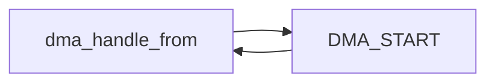

使用edu设备的dma功能。首先是edu设备对于dma的接口：

```txt
0x80 (RW) : DMA source address
Where to perform the DMA from.

0x88 (RW) : DMA destination address
Where to perform the DMA to.

0x90 (RW) : DMA transfer count
The size of the area to perform the DMA on.

0x98 (RW) : DMA command register, bitwise OR
0x01 -- start transfer
0x02 -- direction (0: from RAM to EDU, 1: from EDU to RAM)
0x04 -- raise interrupt 0x100 after finishing the DMA IRQ controller
```

我们能发现，0x80里的值是我们DMA的源地址，也就是DMA真正所在的地方。因此我们要将申请回来的DMA空间写到0x80中。首先的问题是怎么申请？用的就是[[Projects/qemu/1. edu/0. ref_from_teacher#^96e50a|这篇文章]]中的这个函数：

```c
void * dma_alloc_coherent(struct device *dev, size_t size, dma_addr_t *dma_handle, gfp_t flag)
```

我们能看到，它的第一个参数是：我要给哪个设备申请DMA空间？那这里毫无疑问就是edu设备，而probe的函数正好有一个`pci_dev`结构体，其中一个`dev`成员正适合做这个参数；第二个参数是要申请的空间大小，这里我们就传4个字节，**同时这个空间大小也是我们要向edu设备的0x90中写的值**。另外补充一点，这个空间叫做**Consistent Memory**，具体的描述可以到文章中去看；第三个参数是一个指针，这个指针中的值在当前函数中就会被设置成DMA空间的基地址。另外，这个类型`dma_addr_t`在文章中的描述是这样的：

> A `dma_addr_t` can hold any valid DMA address for the platform.  It can be given to a device to use as a DMA source or target.  **A CPU cannot reference a `dma_addr_t` directly because there may be translation between its physical address space and the DMA address space**.

最后一个参数是一个标志，这个标志和`kmalloc`函数的标志相同，具体的参考在这个网站：

[(29条消息) Kmalloc参数详解_Haomione的博客-CSDN博客_kmalloc头文件](https://blog.csdn.net/Haomione/article/details/123337976)

这个函数的返回值也是一个地址，而这个地址和`dma_handle`的不同之处在于：后者是给DMA使用的，CPU不能直接访问；**而前者是CPU能识别的虚拟内存的地址**。

所以，接下来的操作就很明了了。首先，我们定义一个DMA的专属空间起始地址：

```c
dma_addr_t dma_handle_from;
```

然后再按照`dma_alloc_coherent`的要求，定义一个CPU能识别的DMA在内存空间的虚拟的内存起始地址：

```c
void *vaddr_from;
```

然后将这两个变量按规拼到函数中：

```c
vaddr_from = dma_alloc_coherent(&(dev->dev), 4, &dma_handle_from, GFP_ATOMIC);
```

这里我们最后一个参数表示：**从中断处理和进程上下文之外的其他代码中分配内存，从不睡眠**。

接下来，就是将这个值写进DMA的0x80中了。这样的话，我们操作这个地址，就等于在操作CPU中相应的虚拟地址`vaddr_from`：

```c
iowrite32((u32)dma_handle_from, mmio + 0x80);
```

注意再注意！！！我们得到的地址，无论是`vaddr_from`还是`dma_handle_from`，全部都是和edu绑定的，和计算机本身没有任何关系！所以**我们还需要确定linux给edu提供的一段可以供它读写的内存**。

在[[Projects/qemu/1. edu/0. ref_from_teacher#3. edu.txt|edu.txt]]中可以看到，这段地址的起始地址就是`0x40000`，而这在[[Projects/qemu/1. edu/0. ref_from_teacher#2. edu.c|edu.c]]中也被定义为了宏`DMA_START`(这个值还是虚拟内存在edu中的映射)。因此我们需要在这两者之间进行数据传送：



那么根据edu.txt中给的例子：

```txt
数据从内存 -> edu
-------------------------------------------
addr -> DMA source address
0x40000 -> DMA destination address
100 -> DMA transfer count
1 -> DMA command register
while (DMA command register & 1);


数据从edu -> 内存
-------------------------------------------
0x40000 -> DMA source address
addr+100 -> DMA destination address
100 -> DMA transfer count
3 -> DMA command register
while (DMA command register & 1);
```

我们就可以一一对应写出如下代码：

```c
iowrite32((u32)dma_handle_from, mmio + 0x80); // source address
iowrite32(0x40000, mmio + 0x88);  // destination address
iowrite32(4, mmio + 0x90);  // transfer size
iowrite32(0x1, mmio + 0x98);  // edu -> mem
```

