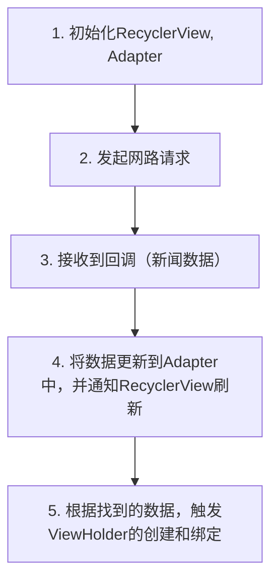

# 异步inflate-AsyncLayoutInflater使用

AsyncLayoutInflater本身的源码不多，但是使用的场景比较局限。下面我们开发一个简单的新闻界面，来尝试将它应用上去。

首先，我们需要模拟一个假的网络请求：

```kotlin
// 生成10条假新闻，不用关注。
private fun generateNews(): List<News> {
	val count = 10
	val res = mutableListOf<News>()
	repeat(count) {
		val index = Random.nextInt(0, fakeNews.size)
		res.add(fakeNews[index])
	}
	return res
}

// 模拟的网络请求
suspend fun getNewsList(): List<News> = withContext(Dispatchers.IO) {
	delay(3000)
	generateNews()
}
```

这个假的网络请求这样使用：

```kotlin
CoroutineScope(Dispatchers.Main).launch {
	val newsList = FakeNetwork.getNewsList()
	// 使用newsList
}
```

现在，我们来想想正常的流程：我们进入的程序，在初始化的时候，需要发起网络请求，等待网络请求返回时，将数据绑定到RecyclerView上。这就是大部分应用的首刷流程。

然而，从发起请求，到返回数据，中间是有一段时间的。尤其是网络不好的情况。这个时候，如果我们完全进行串行，就是这样的操作：



我们可以看到，这样的流程，ViewHolder（包括内部的View）是在网络数据回来，更新到Adapter中之后才进行创建的。那么问题来了：有必要吗？

我们知道，对于我们的RecyclerView，如果数据类型很单一的话，那么承接它们的View都是一样的（通常都是一个layout中的xml文件而已）。所以，我们在发送网络请求的时候，其实就已经能够知道，**我们要的数据是什么样的，该用什么View来承接它了**。

因此，我们完全可以在**等待数据返回**的这段时间将我们需要的View给加载出来了。


