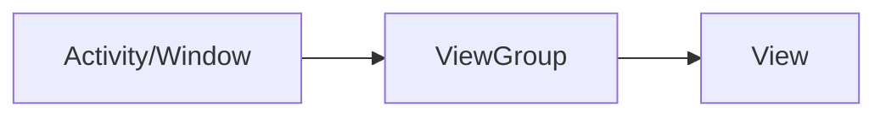

[(45条消息) 彻底带你搞懂安卓View的事件分发机制_android view的事件分发机制_Pingred_hjh的博客-CSDN博客](https://blog.csdn.net/qq_39867049/article/details/131233616?spm=1001.2014.3001.5502)

[【带着问题学】android事件分发8连问 - 掘金 (juejin.cn)](https://juejin.cn/post/6965484155660402702)

# 1 触摸事件

触摸事件，就是代码中常见的MotionEvent。通常分为以下几种：

- MotionEvent.ACTION_DOWN：按下
- MotionEvent.ACTION_MOVE：滑动
- MotionEvent.ACTION_CANCEL：非人为原因结束本次事件
- MotionEvent.ACTION_UP：抬起

一般来说，一个事件会经过：按下 -> 滑动 -> 抬起，这三个阶段，并在这个过程中会有非人为原因结束本次触摸流程。这些事件会在代码里会封装成一个MotionEvent。那么，当MotionEvent产生后，系统就会将其传递给View树，MotionEvent在View的层级传递，并最终得到处理的过程，就是触摸事件分发流程。一个流程的传递顺序是：



![[Study Log/android_study/resources/Pasted image 20230713112930.png]]

![[Study Log/android_study/resources/Pasted image 20230713113314.png]]

其中，View就是各种控件，如Button、TextView等。而ViewGroup是View的子类，因此本质上也是一个View，只不过ViewGroup可以包含多个子View和定义布局参数。

# 2 三个方法

其中有三个方法是我们需要掌握的：

- dispatchTouchEvent(MotionEvent ev)：进行事件的分发，在View和ViewGroup类都有该方法，下文会对该方法的源码进行分析，需要区分清楚；
- onInterceptTouchEvent(MotionEvent ev)：进行事件拦截，在dispatchTouchEvent()中调用，在分发的过程中判断是否需要进行拦截，需要注意的是只有ViewGroup有该方法，View是没有提供该方法的。如果返回true代表拦截，返回false代表不拦截；
- onTouchEvent(MotionEvent ev)：触摸事件处理，同样在dispatchTouchEvent()方法中进行调用，如果返回true代表已处理事件，返回false代表不处理事件，事件继续传递。

在安卓中，当一个触摸事件发生时，涉及到触摸事件分发的三个方法的执行顺序如下：

1.  `dispatchTouchEvent(MotionEvent event)`：
    -   这是`View`和`ViewGroup`类中的方法。
    -   当一个触摸事件发生时，首先会调用根布局的`dispatchTouchEvent`方法。
    -   该方法用于分发触摸事件给`ViewGroup`的子View，从父View向子View递归分发，直到找到最终的触摸事件目标View。
    -   在`dispatchTouchEvent`方法中，会依次调用`onInterceptTouchEvent`方法和`onTouchEvent`方法来决定是否拦截和处理触摸事件。
2.  `onInterceptTouchEvent(MotionEvent event)`：
    -   这是`ViewGroup`类中的方法。
    -   当`dispatchTouchEvent`方法调用到某个`ViewGroup`时，会触发该`ViewGroup`的`onInterceptTouchEvent`方法。
    -   该方法用于决定是否拦截子View的触摸事件，如果返回`true`，则拦截触摸事件，不会再将事件传递给子View的`onTouchEvent`方法；如果返回`false`，则不拦截触摸事件，继续将事件传递给子View。
3.  `onTouchEvent(MotionEvent event)`：
    -   这是`View`和`ViewGroup`类中的方法。
    -   如果在`dispatchTouchEvent`过程中没有发生事件拦截，或者被拦截的子View的`onTouchEvent`方法返回了`false`，那么触摸事件会传递给最终的触摸事件目标View。
    -   在目标View的`onTouchEvent`方法中，你可以处理触摸事件的具体操作，例如点击、滑动等。

所以，**触摸事件的处理顺序是**：`dispatchTouchEvent` -> `onInterceptTouchEvent` -> `onTouchEvent`。

需要注意的是，触摸事件的处理顺序可以在`ViewGroup`的子类中进行修改，通过重写这些方法并添加自定义的逻辑来实现特定的触摸事件处理需求。但在大多数情况下，不需要修改默认的事件处理顺序。

**我们从ViewGroup的dispatchTouchEvent开始看起**：

```java
@Override
public boolean dispatchTouchEvent(MotionEvent ev) {
	... ...
	// 1. 检查是否需要拦截Event，调用onInterceptTouchEvent
	final boolean intercepted;
	if (actionMasked == MotionEvent.ACTION_DOWN
			|| mFirstTouchTarget != null) {
		final boolean disallowIntercept = (mGroupFlags & FLAG_DISALLOW_INTERCEPT) != 0;
		if (!disallowIntercept) {
			intercepted = onInterceptTouchEvent(ev);
			ev.setAction(action); // restore action in case it was changed
		} else {
			intercepted = false;
		}
	} else {
		// There are no touch targets and this action is not an initial down
		// so this view group continues to intercept touches.
		intercepted = true;
	}
	// 2. 遍历子View，对每个字View执行dispatchTransformedTouchEvent
	for (int i = childrenCount - 1; i >= 0; i--) {
		final int childIndex = getAndVerifyPreorderedIndex(
				childrenCount, i, customOrder);
		final View child = getAndVerifyPreorderedView(
				preorderedList, children, childIndex);
		... ...
		if (dispatchTransformedTouchEvent(ev, false, child, idBitsToAssign)) {
			// Child wants to receive touch within its bounds.
			mLastTouchDownTime = ev.getDownTime();
			if (preorderedList != null) {
				// childIndex points into presorted list, find original index
				...
			} else {
				mLastTouchDownIndex = childIndex;
			}
			...
		}

		// The accessibility focus didn't handle the event, so clear
		// the flag and do a normal dispatch to all children.
		ev.setTargetAccessibilityFocus(false);
	}
	... ...
	return handled;
}
```

比较重要的流程就是上面注释的两个方法。而后面的那个dispatchTransformedTouchEvent，其实就是判断这些子View是ViewGroup还是View，而分别再调用它们的dispatchTouchEvent方法：

```java
/**
 * Transforms a motion event into the coordinate space of a particular child view,
 * filters out irrelevant pointer ids, and overrides its action if necessary.
 * If child is null, assumes the MotionEvent will be sent to this ViewGroup instead.
 */
private boolean dispatchTransformedTouchEvent(MotionEvent event, boolean cancel,
		View child, int desiredPointerIdBits) {

	... ...
		
	final boolean handled;

	// Perform any necessary transformations and dispatch.
	if (child == null) {
		handled = super.dispatchTouchEvent(transformedEvent);
	} else {
		final float offsetX = mScrollX - child.mLeft;
		final float offsetY = mScrollY - child.mTop;
		transformedEvent.offsetLocation(offsetX, offsetY);
		if (! child.hasIdentityMatrix()) {
			transformedEvent.transform(child.getInverseMatrix());
		}

		handled = child.dispatchTouchEvent(transformedEvent);
	}

	// Done.
	transformedEvent.recycle();
	return handled;
}
```

这个方法中还有很多类似的段落，不过看起来都是为了性能优化而写的，大体的思想和上面展示的是一样的。也就是，如果`child == null`，意味着该ViewGroup没有子节点。那么直接将这个事件传递给当前ViewGroup，调用super.dipatchTouchEvent。但是要注意，ViewGroup本身也继承自View，所以调用的还是View的dispatchTouchEvent；而如果有子节点，那么就直接调用child.dispatchTouchEvent。而子节点是可以重写这个方法来执行自己的逻辑的，这也是作为安卓开发者要操作的东西。

下面看看View的dispatchTouchEvent：

```java
/**
 * Pass the touch screen motion event down to the target view, or this
 * view if it is the target.
 *
 * @param event The motion event to be dispatched.
 * @return True if the event was handled by the view, false otherwise.
 */
public boolean dispatchTouchEvent(MotionEvent event) {
	... ...
	ListenerInfo li = mListenerInfo;
	if (li != null && li.mOnTouchListener != null
			&& (mViewFlags & ENABLED_MASK) == ENABLED
			&& li.mOnTouchListener.onTouch(this, event)) {
		result = true;
	}

	if (!result && onTouchEvent(event)) {
		result = true;
	}
	... ...
	return result;
}
```

我们能看到，这里就是调用onTouchEvent的起点。

```java
/**
 * Implement this method to handle touch screen motion events.
 * <p>
 * If this method is used to detect click actions, it is recommended that
 * the actions be performed by implementing and calling
 * {@link #performClick()}. This will ensure consistent system behavior,
 * including:
 * <ul>
 * <li>obeying click sound preferences
 * <li>dispatching OnClickListener calls
 * <li>handling {@link AccessibilityNodeInfo#ACTION_CLICK ACTION_CLICK} when
 * accessibility features are enabled
 * </ul>
 *
 * @param event The motion event.
 * @return True if the event was handled, false otherwise.
 */
public boolean onTouchEvent(MotionEvent event) {
	... ...
	if (clickable || (viewFlags & TOOLTIP) == TOOLTIP) {
		switch (action) {
			case MotionEvent.ACTION_UP:
				... ...
				break;

			case MotionEvent.ACTION_DOWN:
				... ...
				break;
			case MotionEvent.ACTION_CANCEL:
				... ...
				break;
			case MotionEvent.ACTION_MOVE:
				... ...
				break;
		}
		return true;
	}
	return false;
}
```

执行顺序：

onTouch -> onTouchEvent -> onClick

<center>总结</center>

![[Study Log/android_study/resources/Pasted image 20230713111334.png]]

# 3 问题

![[Study Log/android_study/resources/Pasted image 20230713113930.png]]


