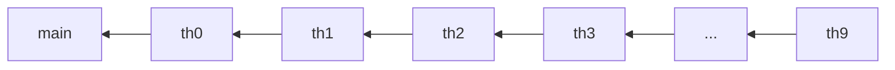

### 4.3.4 Thread.join

join的使用非常简单。**当前线程等待调用join的线程终止后，当前线程才能从join返回**。

```kotlin
class Domino(private val previous: Thread) : Runnable {
	override fun run() {
		try {
			previous.join()
		} catch (_: InterruptedException) {}
		println("${Thread.currentThread().name} terminate.")
	}
}
```

在当前例子中，构建一个线程需要传入一个前驱线程。当前线程等待前驱线程结束之后，当前线程才能返回。我们制作这样一个等待链：



图中的箭头表示等待关系。th0会等待main结束，th1会等待th0结束，以此类推。

因此，只有main结束之后，其它线程才有可能继续进行下去。所以，我们在main线程结束之前休眠5s，那么所有的线程也必须等到5s之后才能依次推出。

```kotlin
fun main() {
    var previous = Thread.currentThread()
    repeat(10) {
        val th = Thread(Join.Domino(previous), "$it")
        th.start()
        previous = th
    }
    TimeUnit.SECONDS.sleep(5)
    println("${Thread.currentThread().name} terminate.")
}
```

输出如下：

```shell
main terminate.
0 terminate.
1 terminate.
2 terminate.
3 terminate.
4 terminate.
5 terminate.
6 terminate.
7 terminate.
8 terminate.
9 terminate.
```


---

```dataviewjs
const pages = dv.pages('"Study Log/java_kotlin_study/concurrency_art"')
let nextChapterHead = undefined
let res = undefined
const current = dv.current()
for (let page of pages) {
	if (page.chapter_root == true && page.order == Number(current.chapter) + 1) {
		console.log("found next head: " + page.name)
		nextChapterHead = page
		continue
	}
	if (page.chapter == undefined || page.chapter != current.chapter) {
		console.log("not current chapter: " + page.file.name)
		continue
	}
	if (page.order == Number(current.order) + 1) {
		res = page
	}
}
console.log("res: " + res)
console.log("next: " + nextChapterHead)
if (res == undefined) {
	res = nextChapterHead
}
let text = ""
if (res != undefined) {
	const path = res.file.path
	const title = res.title
	const decoLink = "[[" + path + "|" + title + "]]"
	text = "Next Article: " + decoLink
} else {
	text = "旅途的终点！"
}
dv.el("p", text, { attr: { align: "right" } })
```