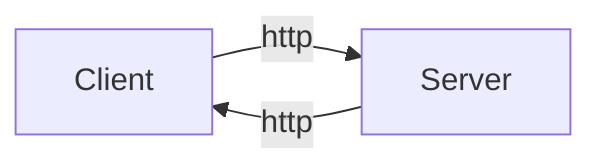

# 1. 概述

首先介绍一下用户和客户端访问的总体情况：

客户端和服务端都使用http(https)协议来交互数据。客户端给服务端发送请求(Request)，而服务端返回给客户端相应的数据(Response)。

那么客户端的架构非常简单，比如我之前做过的一个安卓程序的架构，就可以是这样的：

![[Projects/android/spreadshop/resources/Drawing 2022-10-27 21.28.04.excalidraw.png]]

**重点是服务端的数据库设计**。因为要考虑小说的类别、用户注册支付信息、图片数据和视频数据，同时还要满足并发性。所以这里使用了**MySQL + Redis**来实现高并发，让MySQL存所有的数据，而Redis用来存经常被访问的数据(比如热榜的小说，某个用户经常读的小说，广告推荐信息等等)。

# 2. 数据模型设计

既然是设计数据库，那么最重要的首先就是”**存什么**“。我们从用户的角度来逐个分析，首先是登陆系统。一个崭新的用户来到了我们的平台，首先就是要注册一个账号(这里就不考虑第三方登陆了)。当注册成功后，我们就要保存好这个用户的用户名和密码。而对于重复登陆的用户，我们也可以给一个一段时间内生效，并且利于查询的key-token对，通过这个键值对也能实现快速的登陆，并且不需要用户名和密码，这就是我们退出qq后再打开能直接登陆的原因。

当注册成功之后，用户需要登陆，那么此时我们也要记录用户的登陆状态。只有当用户是在线状态时，才能继续进行操作。

对于书籍分类这种做法，沿用我之前的项目，是单独生成一张表。这张表里存的就是所有的种类，因为书籍分类相对固定，通常不会发生增减，所以我们直接单独给一张表。这样在其他表中引用当前书籍的信息时，就能够作为外键约束来限制值域了。并且，如果某些类别有子类，那么也可以在这张表中分别体现，比如这样：

id | 种类 | 子类
-- | -- | --
1 | 小说 | 武侠小说
2 | 小说 | 职场小说
3 | 武侠小说 | 古典武侠
4 | 武侠小说 | 现代武侠
5 | ... | ...

这种做法的好处是，它类似于一个**树形结构**，每一个tuple就是一个父子关系。在树形结构中，**没有哪两个爹有相同的儿子**。所以我们通过`子类`这个属性也能区分每一个tuple。

然后就是小说本体了，这里其实可以直接给出小说的总体Schema：

id | 书名 | 作者 | 发行时间 | 种类 | 图片视频信息 |  ... | 正文
-- | -- | -- | -- | -- | -- | -- | --

另外，一些常用的信息，比如热门书的宣传信息可以单独拉一张表来存放，用来加载到Redis中去迎接高并发操作。

然后用户就可以通过各种方式，种类也好，搜索也好，去寻找自己想要的书。之后如果涉及到购买，那依然是在用户表中做文章。比如记录账户余额(其实真实开发场景都是关联上支付软件，比如微信和支付宝，然后拿到返回的信息而已)等等。当购买成功后，数据库要记录订单，并且要让这本书对用户是可读的(这个标记位可以放在用户表中，也可以根本没有，就是订单本身，当用户要读买过的书时，需要先查找订单)。

# 3. 数据库架构

首先介绍Redis和MySQL是怎么协同工作的。它们配合的方式非常像[[Lecture Notes/Computer Structure/cs#1.9.3 How Cache Works?|CPU的Cache和Memory的配合]]，所有的数据都要从Redis来，而Redis中没有的数据要通过Redis去向MySQL要，服务端不能直接访问MySQL：

![[Homework/Data Management/resources/Drawing 2022-11-05 18.49.48.excalidraw.png]]

这种方式最大的问题就是：**数据一致性**，我们需要保证用户访问到的Redis和MySQL中的数据永远是一致的，那么这个时候如何来实现呢？主要靠的就是消息队列。下面给出数据库的架构图：

![[Homework/Data Management/resources/Drawing 2022-11-05 18.12.32.excalidraw.png]]

无论是进行写操作还是读操作，都需要通过Redis去控制MySQL。而一些热门数据，在加载的时候就会通过消息队列的方式传递给Jedis进程，当进程收到一条条更新命令之后，再对自己更新数据。只有最新的数据(最新的实现可以有很多种，比如通过时间戳进行一次比较，比较时不能对数据库进行修改)才能被用户读取到。