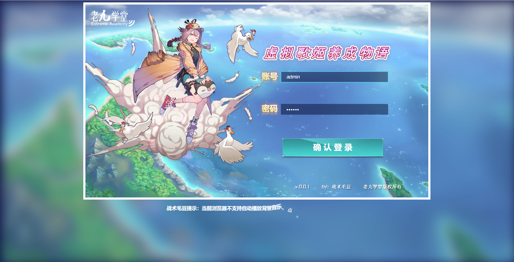

# 虚拟歌姬养成物语-登录页面

## 1 登录页面布局



### 1.1 通用样式`_common.scss`

```scss
/**
 * 功能：通用样式
 * 作者：战术毛豆
 * 地点：老九学堂
 */

//自定义字体
@font-face {
  font-family: maodou;
  src: url("../fonts/maodou.ttf");
}

.fm-md {
  font-family: maodou,sans-serif;
}

body {
  overflow: hidden;
  cursor: url("../imgs/cursor.png"),auto;
}

* {
  user-select: none;
  font-size: 16px;
}

.blur-bg {
  display: block;
  position: absolute;
  width: 100vw;
  height: 100vh;
  opacity: .8;
  -webkit-filter: blur(20px); /* Chrome, Opera */
  -moz-filter: blur(20px);
  -ms-filter: blur(20px);
  filter: blur(20px);
  z-index: 1;
}

.canvas {
  width: 1280px;
  height: 720px;
  border: 8px solid #fff;
  margin: 0 auto;
  position: relative;
  overflow: hidden;
  z-index: 2;
  //图层
  > .coverage {
    width: 100%;
    height: 100%;
    position: absolute;
    pointer-events:none;
    &.bg {
      z-index: 1;
    }
    &.ui {
      z-index: 3;
      .btn {
        pointer-events:auto;
      }
    }
    &.box {
      z-index: 4;
      //通用框1
      .common-box1 {
        pointer-events:auto;
        width: 100%;
        height: 100%;
        padding-top: 200px;
        background-color: rgba(0,0,0,.5);
        .dialog {
          background-color: #fff;
          width: 400px;
          margin: 0 auto;
          box-sizing: border-box;
          padding: 20px;
          box-shadow: 0 0 5px rgba(0,0,0,.5),0 -5px 5px rgba(0,0,0,.15) inset;
          border-radius: 10px;
          .content {
            letter-spacing: .2em;
            color: #6a260f;
            line-height: 1.8em;
          }
          .operation {
            margin-top: 10px;
            text-align: right;
            .btn-ok {
              display: inline-block;
              background-image: url("../imgs/ui/BtnCmn1.png");
              width: 95px;
              height: 42px;
              text-align: center;
              line-height: 36px;
              color: #fff;
              text-shadow: 2px 0 0 #167cb1,0 2px 0 #167cb1,-2px 0 0 #167cb1,0 -2px 0 #167cb1;
            }
          }
        }
      }
    }
  }
  + .tip {
    position: relative;
    z-index: 2;
    color: #fff;
    text-align: center;
  }
}
```

### 1.2 登录页面样式`login.scss`

```scss
/**
 * 功能：登录页面样式
 * 作者：战术毛豆
 * 地点：老九学堂
 */
@import "common";

.canvas {
  > .coverage {
    &.ui {
      .i {
        position: absolute;
      }
      //logo图标
      .logo {
        left: 20px;
        top: 20px;
      }
      //角色原画
      .role {
        top: 30px;
        left: -50px;
      }
      //游戏logo
      .game-logo {
        top: 140px;
        right: 130px;
      }
      //输入框
      .ipt-box {
        right: 150px;
        display: flex;
        align-items: center;
        input {
          pointer-events:auto;
          width: 400px;
          height: 40px;
          box-sizing: border-box;
          border: none;
          outline: none;
          color: #fff;
          background-color: rgba(6, 15, 51, 0.5);
          text-indent: 1em;
          font-size: 18px;
          cursor: url("../imgs/cursor.png"),auto;
          &:focus {
            border: 1px solid #4ad5ff;
            box-shadow: 0 0 3px 1px rgba(74, 213, 255, 0.8);
          }
        }
        &.account {
          top: 240px;
        }
        &.pwd {
          top: 360px;
        }
      }
      //登录按钮
      .login-btn {
        top: 500px;
        right: 165px;
        background-image: url("../imgs/ui/login-btn-1.png");
        width: 383px;
        height: 75px;
        &:hover {
          background-image: url("../imgs/ui/login-btn-2.png");
        }
      }
      //版权著作
      .copyright {
        bottom: 30px;
        right: 100px;
        color: #fff;
        font-size: 18px;
        span {
          text-shadow: 2px 2px 2px rgba(0,0,0,.5);
        }
        span + span {
          margin-left: 40px;
        }
      }
    }
  }
}
```

### 1.3 登录页面`login.html`

```html
<!DOCTYPE html>
<html lang="zh-CN">
<head>
    <meta charset="UTF-8">
    <title>虚拟歌姬养成物语-登录页面</title>
    <link rel="stylesheet" type="text/css" href="css/login.min.css" />
</head>
<body>
<div id="app">
    
    <div class="canvas">
        <!-- 背景层 -->
        <div class="coverage bg">
            
        </div>
        <!-- UI层 -->
        <div class="coverage ui">
            <!-- 老九学堂LOGO -->
            
            <!-- 角色原画 -->
            
            <!-- 游戏logo -->
            
            <!-- 账号输入框 -->
            <div class="i ipt-box account">
                
                <input class="fm-md" type="text" v-model="account" />
            </div>
            <!-- 密码输入框 -->
            <div class="i ipt-box pwd">
                
                <input class="fm-md" type="password" v-model="pwd" />
            </div>
            <!-- 登录按钮 -->
            <i class="i btn login-btn" @click="onLoginBtnClick"></i>
            <!-- 版权著作信息 -->
            <div class="i fm-md copyright">
                <span>{{ver}}</span>
                <span>by：战术毛豆</span>
                <span>老九学堂版权所有</span>
            </div>
        </div>
        <!-- 弹框层 -->
        <div class="coverage box"></div>
    </div>
</div>
<!-- 引入vue.js 2.x -->
<script type="text/javascript" src="lib/vue/vue.min.js"></script>
<script type="text/javascript" src="js/login.js"></script>
</body>
</html>
```

### 1.4 JS逻辑`login.js`

```js
let ver = 'v.0.0.1';
new Vue({
    el: '#app',
    data: {
        account: '',        //账号
        pwd: '',            //密码
        ver
    },
    methods: {
        /**
         * 登录按钮点击事件
         */
        onLoginBtnClick: function () {

        },
        /**
         * 提示文字点击事件
         */
        onTipClick: function () {

        }
    }
});
```

## 2 使用animate添加过渡动画


### 2.1 登录页面调整`login.html`

```html
...
<head>
    ...
    <!-- 引入animate动画库 -->
    <link rel="stylesheet" type="text/css" href="lib/animate/animate.min.css" />
    ...
</head>
<body>
<div id="app">
    ...
    <div class="canvas">
        ...
        <!-- UI层 -->
        <div class="coverage ui">
            <!-- 老九学堂LOGO -->
            
            ...
            <!-- 游戏logo -->
            
            <!-- 账号输入框 -->
            <div class="i ipt-box account">
                
                <input class="fm-md animate__animated animate__fadeInRight" type="text" v-model="account" />
            </div>
            <!-- 密码输入框 -->
            <div class="i ipt-box pwd">
                
                <input class="fm-md animate__animated animate__fadeInRight" type="password" v-model="pwd" />
            </div>
            <!-- 登录按钮 -->
            <i class="i btn login-btn animate__animated animate__fadeInUp" @click="onLoginBtnClick"></i>
            <!-- 版权著作信息 -->
            <div class="i fm-md copyright animate__animated animate__fadeInRight">
                ...
            </div>
        </div>
        ...
    </div>
    ...
</div>
...
</body>
</html>
```

### 2.2 登录页面样式`login.scss`

```scss
...
/* 角色原画动画 */
@keyframes role-animate {
  0% {
    transform: translateY(0);
  }
  25% {
    transform: translateY(20px);
  }
  50% {
    transform: translateY(0);
  }
  75% {
    transform: translateY(-20px);
  }
  100% {
    transform: translateY(0);
  }
}

.canvas {
  > .coverage {
    &.ui {
      ...
      //角色原画
      .role {
        ...
        animation: fadeInLeft .8s linear both .2s, role-animate 6s linear infinite 1s;
      }
      //游戏logo
      .game-logo {
        ...
        animation-delay: .6s;
      }
      ...
        &.account {
          ...
          img {
            animation-delay: .8s;
          }
          input {
            animation-delay: .8s;
          }
        }
        &.pwd {
          ...
          img {
            animation-delay: 1s;
          }
          input {
            animation-delay: 1s;
          }
        }
      }
      //登录按钮
      .login-btn {
        ...
        animation-delay: 1.2s;
        ...
      }
      //版权著作
      .copyright {
        ...
        animation-delay: 1.4s;
        ...
      }
    }
  }
  ...
}
```

## 3 添加背景音乐

### 3.1 登录页面添加`login.html`

```html
...
<body>
<div id="app">
    ...
    <div class="canvas">
        <!-- 背景音乐 -->
        <audio ref="musicBg" loop>
            <source src="./musics/bg/0.mp3">
            <source src="./musics/bg/0.ogg">
        </audio>
        ...
    </div>
    <h3 class="tip" ref="autoplayTxt" v-show="autoplayTxtShow" @click="onTipClick">战术毛豆提示：当前浏览器不支持自动播放背景音乐，点击本文字，可以播放音乐</h3>
</div>
...
<!-- 引入文本裁切插件 -->
<script type="text/javascript" src="./lib/gsap/SplitText.min.js"></script>
<!-- 引入GSAP-TweenMax插件 -->
<script type="text/javascript" src="./lib/gsap/TweenMax.min.js"></script>
...
</body>
</html>
```

### 3.2 js逻辑`login.js`

```js
...
new Vue({
    ...
    data: {
        autoplayTxtShow: false,     //是否显示自动播放文字
        ...
    },
    mounted() {
        this.playBgm();
    },
    methods: {
        ...
        /**
         * 提示文字点击事件
         */
        onTipClick: function () {
            this.$refs.musicBg.play();
        },
        //播放背景音乐
        playBgm: function () {
            this.$refs.musicBg.volume = 0.3;  //设置音量
            let playPromise = this.$refs.musicBg.play();
            //谷歌浏览器禁止自动播放处理
            if(playPromise !== undefined) {
                playPromise
                    .then(_ => {})
                    .catch(error => {
                        //播放额外提示文字动画
                        this.autoplayTxtShow = true;
                        let t = new TimelineLite({onComplete: ()=> {
                                t.restart();    //重复播放
                            }}).staggerFrom(new SplitText(this.$refs.autoplayTxt).chars, 0.3, {opacity:0, rotation:90, scale:0, x:20, y:60, ease:Back.easeOut}, 0.05)
                            .to(this.$refs.autoplayTxt, 1, {delay: 1});
                        console.error('战术毛豆提示：当前浏览器不支持自动播放背景音乐，点击本文字，可以播放音乐');
                    });
            }
        }
    }
});
```

## 4. 按钮音效添加

### 4.1 通用函数common.js`

```js
/**
 * 播放音效
 * @param type 音效文件夹类型名
 * @param name 音效名称
 * @param endCallback 音效播放完毕回调函数
 */
const playEffect = (type,name,endCallback) => {
    //创建音效DOM对象
    let audio = document.createElement('audio');
    audio.autoplay = true;

    /* 资源对象 */
    let s_mp3 = document.createElement('source');
    s_mp3.setAttribute("src",`musics/${type}/${name}.mp3`);
    let s_ogg = document.createElement('source');
    s_ogg.setAttribute("src",`musics/${type}/${name}.ogg`);

    audio.appendChild(s_mp3);
    audio.appendChild(s_ogg);
    //添加音效
    document.querySelector('.canvas').appendChild(audio);
    //添加事件
    audio.addEventListener('ended', () => {
        //音效播放完毕后，移除自身
        audio.parentElement.removeChild(audio);
        //执行回调函数
        if(endCallback) endCallback();
    });
}

/**
 * 绑定按钮移入播放音效事件
 * @param dom
 */
const addEventBtnEffect = dom => {
    //鼠标移入音效
    dom.addEventListener('mouseenter',function (e) {
        playEffect('effect','button-hover');
    });
    //鼠标点击音效
    dom.addEventListener('click',function (e) {
        playEffect('effect','button-click');
    });
}

/**
 * 绑定数组按钮移入播放音效事件
 * @param list
 */
const addEventArrayBtnEffect = list => {
    list.forEach(value => {
        addEventBtnEffect(value);
    });
}
```

### 4.2 `login.js`文件引入调整

```html
...
<script type="text/javascript" src="./js/common.js"></script>
...
```

### 4.3 js逻辑`login.js`

```js
...
new Vue({
    ...
    mounted() {
        ...
        //添加按钮音效
        this.$nextTick(() => {
            addEventArrayBtnEffect(document.querySelectorAll('.btn'));
        });
    },
    ...
});
```

## 5. 登录逻辑完善

### 5.1 定义一个基本面板组件(具有关闭按钮)`BasePanel.js`

```js
/**
 * 功能：定义一个基本面板组件(具有关闭按钮）
 * 作者：战术毛豆
 * 地点：老九学堂
 */

let BasePanel = {
    props: ['visible'],
    data() {
        return {
            isFirstShow: true, //是否为首次渲染
            isClose: false,     //背景选择面板是否关闭(用于播放关闭动画)
        }
    },
    watch: {
        //监听visible变化（将首次渲染设定为false）
        visible: function (newVal,oldVal) {
            //首次打开
            if(this.isFirstShow) {
                this.firstShow();
                this.isFirstShow = false;
            }
            //面板显示与隐藏
            if(newVal) {
                this.panelShow();
            }else {
                this.panelClose();
            }
        }
    },
    methods: {
        //面板首次打开时要做的逻辑
        firstShow: function () {

        },
        //面板打开时要做的逻辑
        panelShow: function () {

        },
        //面板关闭时要做的逻辑
        panelClose: function () {

        },
        //关闭按钮点击事件
        onCloseBtnClick: function() {
            //设置动画状态为正在播放(关闭动画）
            this.isClose = true;
            //动画播放完毕后，重置数据
            setTimeout(() => {
                this.isClose = false;
                this.$emit('update:visible',false);
            },400);
        },
    }
}
```

### 5.2 警告框组件`AlertBoxPanel.js`

```js
/**
 * 功能：警告框（仅做提示作用，只有一个确定按钮）
 * 作者：战术毛豆
 * 地点：老九学堂
 */

let AlertBoxPanel = {
    template: `
        <div class="shade alert-box-panel" v-if="!isFirstShow" v-show="visible">
            <div :class="['dialog animate__animated animate__faster',isClose ? 'animate__zoomOut' : 'animate__zoomIn']">
                <div class="content fm-md">{{txt}}</div>
                <!-- 操作栏 -->
                <div class="operation">
                    <span class="btn btn-ok" @click="onCloseBtnClick">确定</span>
                </div>
            </div>
        </div>
    `,
    mixins: [BasePanel],
    props: ['txt'],
    methods: {
        //面板首次打开时要做的逻辑
        firstShow: function () {
            //给确定按钮绑定音效
            this.$nextTick(() => {
                addEventBtnEffect(document.querySelector('.alert-box-panel .btn-ok'));
            });
        },
    }
}
```

### 5.3 主页中引入对应的组件`login.html`

```html
...
<!-- 弹框层 -->
<div class="coverage box">
    <!-- 警告框 -->
    <alert-box-panel :visible.sync="alertBoxPanel" :txt="alertTxt"></alert-box-panel>
</div>
...
<script type="text/javascript" src="./components/BasePanel.js"></script>
<script type="text/javascript" src="./components/AlertBoxPanel.js"></script>
...
```

### 5.4 js逻辑`login.js`

```js
...
new Vue({
    data: {
        ...
        alertBoxPanel: false,       //通用弹框显示状态
        alertTxt: '',               //通用弹框显示文本
        ...
    },
    components: {
        AlertBoxPanel
    },
    ...
    methods: {
        /**
         * 登录按钮点击事件
         */
        onLoginBtnClick: function () {
            if(this.account === '' || this.pwd === '') {
                this.alert("请先完善账号和密码!");
            }else {
                if(this.account === 'admin' && this.pwd === '123456') {
                    window.location.href = 'index.html';
                }else {
                    this.alert("账号密码输入错误!");
                }
            }
        },
        ...
        /**
         * 弹框
         * @param txt
         */
        alert: function (txt) {
            this.alertTxt = txt;
            this.alertBoxPanel = true;
        }
    }
});
```

### 5.5 警告框组件样式`_AlertBoxPanel.scss`

```scss
.alert-box-panel {
  pointer-events:auto;
  padding-top: 200px;
  z-index: 9999;
  .dialog {
    background-color: #fff;
    width: 400px;
    margin: 0 auto;
    box-sizing: border-box;
    padding: 20px;
    box-shadow: 0 0 5px rgba(0,0,0,.5),0 -5px 5px rgba(0,0,0,.15) inset;
    border-radius: 10px;
    .content {
      letter-spacing: .2em;
      color: #6a260f;
      line-height: 1.8em;
    }
    .operation {
      margin-top: 10px;
      text-align: right;
      .btn-ok {
        display: inline-block;
        background-image: url("../imgs/ui/BtnCmn1.png");
        width: 95px;
        height: 42px;
        text-align: center;
        line-height: 36px;
        color: #fff;
        text-shadow: 2px 0 0 #167cb1,0 2px 0 #167cb1,-2px 0 0 #167cb1,0 -2px 0 #167cb1;
      }
    }
  }
}
```

### 5.6 通用样式添加`_common.scss`

```scss
...
.shade {
  width: 100%;
  height: 100%;
  background-color: rgba(0,0,0,.5);
  position: absolute;
  top: 0;
}
...
@import "../components/AlertBoxPanel";
```

## 6. 项目打包测试

> 调整gulp中js编译逻辑

```js
...
// 压缩 js 文件
// 在命令行使用 gulp script 启动此任务
gulp.task('script', async()=> {
    // 1\. 找到文件
    gulp.src(['js/*.js','components/*.js'],{base: '.'})
        // 2\. 转换语法
        .pipe(babel())
        // 3\. 压缩文件
        .pipe(uglify())
        // 4\. 另存压缩后的文件
        .pipe(gulp.dest('build'))
});
...
```

> 输入以下命令，执行打包

```sh
gulp build
```