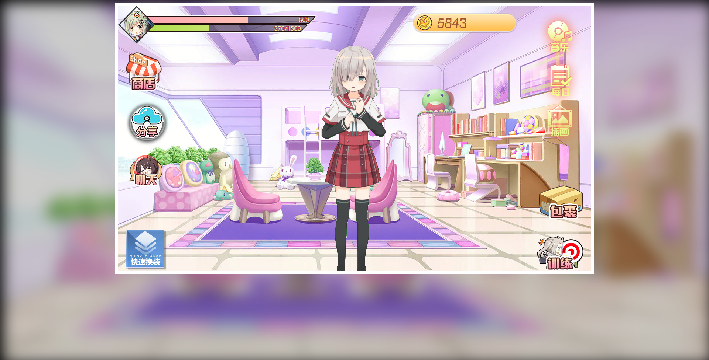
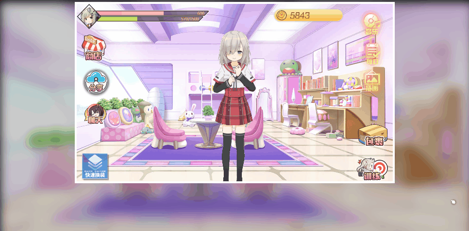

# 虚拟歌姬养成物语-主页面布局

## 1 页面布局



### 1.1 通用样式`_common.scss`

```scss
...
@mixin flex-center {
  display: flex;
  align-items: center;
  justify-content: center;
}
...
```

### 1.2 主页面样式`index.scss`

```scss
/**
 * 功能：主页面样式
 * 作者：战术毛豆
 * 地点：老九学堂
 */
@import "common";
body {
  background-color: #000;
}

.canvas {
  > .coverage {
    &.role {
      z-index: 2;
      display: flex;
      align-items: flex-end;
      justify-content: center;
      > .role-box {
        position: relative;
        > img {
          margin-bottom: -20px;
        }
      }
    }
    &.ui {
      //左上角数据
      > .info {
        position: absolute;
        > .head {
          position: relative;
          z-index: 2;
        }
        //等级
        > .level {
          position: absolute;
          z-index: 3;
          left: 40px;
          top: 10px;
          color: #fff;
          display: inline-block;
          padding: 2px 5px;
          font-size: 18px;
          font-weight: 700;
          text-shadow: 2px 0 0 #000,0 2px 0 #000,-2px 0 0 #000,0 -2px 0 #000;
        }
        //进度条混合器
        @mixin progress($name,$width,$height,$top,$left) {
          > .#{$name} {
            position: absolute;
            z-index: 1;
            display: flex;
            align-items: center;
            > span {
              margin-right: 20px;
              color: #fbeab7;
              text-shadow: 1px 0 0 #9e2c1c,0 1px 0 #9e2c1c,-1px 0 0 #9e2c1c,0 -1px 0 #9e2c1c;
              position: absolute;
              right: 0;
            }
            background-image: url("../imgs/ui/#{$name}-bg.png");
            width: $width;
            height: $height;
            top: $top;
            left: $left;
            > .#{$name}-line {
              position: absolute;
              width: 100%;
              height: 100%;
              @include flex-center;
              transition: width .5s ease-out;
              background-image: url("../imgs/ui/#{$name}.png");
            }
          }
        }
        //好感度进度条
        @include progress(love-progress,462px,25px,25px,75px);
        //经验进度条
        @include progress(exp-progress,435px,25px,48px,80px);
        //商店图标
        > .shop-icon {
          padding-left: 20px;
          margin-top: 20px;
        }
        //分享图标
        > .share {
          padding-left: 20px;
          margin-top: 20px;
        }
        //聊天图标
        > .chat {
          padding-left: 30px;
          margin-top: 20px;
        }
      }
      //换装
      > .fashion {
        position: absolute;
        left: 20px;
        bottom: 0;
      }
      //货币
      > .currency {
        position: absolute;
        background-image: url("../imgs/ui/currency-bg.png");
        width: 282px;
        height: 54px;
        top: 20px;
        right: 200px;
        line-height: 54px;
        font-size: 36px;
        color: #9f542b;
        text-indent: 1.8em;
      }
      //右侧菜单
      > .right-menu {
        position: absolute;
        height: 100%;
        right: 20px;
        img {
          position: absolute;
          right: 0;
          top: 10px;
          &:nth-child(2) {
            top: 130px;
          }
          &:nth-child(3) {
            top: 240px;
          }
          &.parcel {
            top: auto;
            bottom: 140px;
          }
          &.train {
            top: auto;
            bottom: 0;
          }
        }
      }
    }
  }
}
```

### 1.3 主页面`index.html`

```html
<!DOCTYPE html>
<html lang="zh-CN">
<head>
    <meta charset="UTF-8">
    <title>虚拟歌姬养成物语-主页面</title>
    <link rel="stylesheet" type="text/css" href="./css/index.min.css" />
</head>
<body>
<div id="app">
    
    <div class="canvas">
        <!-- 背景层 -->
        <div class="coverage bg">
            
        </div>
        <!-- 角色层 -->
        <div class="coverage role">
            <div class="role-box">
                
            </div>
        </div>
        <!-- UI层 -->
        <div class="coverage ui">
            <!-- 左上角信息 -->
            <div class="info">
                <!-- 头像 -->
                
                <!-- 等级 -->
                <span class="level">{{level}}</span>
                <!-- 好感度进度 -->
                <div class="love-progress">
                    <div class="love-progress-line" :style="{width: `${(loveCurrVal / loveMaxVal * 100)}%`}"></div>
                    <span>{{loveCurrVal}}</span>
                </div>
                <!-- 经验进度 -->
                <div class="exp-progress">
                    <div class="exp-progress-line" :style="{width: `${(expCurrVal / expMaxVal * 100)}%`}"></div>
                    <span>{{expCurrVal}}/{{expMaxVal}}</span>
                </div>
                <!-- 商店图标 -->
                <div class="shop-icon">
                    
                </div>
                <!-- 分享按钮 -->
                <div class="share">
                    
                </div>
                <!-- 聊天按钮 -->
                <div class="chat" @click="onChatBtnClick">
                    
                </div>
            </div>
            <!-- 换装 -->
            
            <!-- 右上UI -->
            <div class="currency fm-md">{{currency}}</div>
            <!-- 右侧UI -->
            <div class="right-menu">
                
                
                
                
                
            </div>
        </div>
        <!-- 弹框层 -->
        <div class="coverage box">

        </div>
    </div>
</div>
<!-- 引入vue.js 2.x -->
<script type="text/javascript" src="lib/vue/vue.min.js"></script>
<script type="text/javascript" src="./js/index.js"></script>
</body>
</html>
```

### 1.4 JS逻辑`index.js`

```js
new Vue({
    el: '#app',
    data: {
        currSelectBgId: 201,        //当前选择的背景
        loveCurrVal: 0,     //当前好感度值
        loveMaxVal: 0,      //好感度总值
        expCurrVal: 0,      //当前经验值
        expMaxVal: 0,       //当前等级升级所需经验总值
        level: 6,           //当前等级
        currency: 0,           //当前拥有的金币数量
        skin: 1,            //当前时装编号
        actionType: 'zhanli',   //角色行为类型
        ver,     //版本
    },
    mounted: function() {
        /****** 基本数据获取以及初始化-起始 ******/
        this.loveCurrVal = 600;
        this.loveMaxVal = 1000;
        this.expCurrVal = 570;
        this.expMaxVal = 1500;
        this.currency = 5843;
        /****** 基本数据获取以及初始化-结束 ******/
    },
    computed: {
        //背景图片路径
        bgUrl: function() {
            return `imgs/bg/star_level_bg_${this.currSelectBgId}.png`;
        },
        role: function () {
            return `imgs/role/${this.skin}/${this.actionType}.gif`
        }
    },
    methods: {
        //音乐按钮点击事件
        onMusicBtnClick: function () {

        },
        //每日签到按钮点击事件
        onSignBtnClick: function() {

        },
        //插画按钮点击事件
        onBgBtnClick: function() {

        },
        //包裹按钮点击事件
        onPackageBtnClick: function() {

        },
        //商店按钮点击事件
        onShopBtnClick: function() {

        },
        //时装按钮点击事件
        onSkinBtnClick: function() {

        },
        //聊天按钮点击事件
        onChatBtnClick: function() {

        },
        //分享按钮点击事件
        onShareBtnClick: function () {

        },
        //训练按钮点击事件
        onTrainBtnClick: function () {

        },
    }
});
```

## 2 使用animate添加过渡动画



### 2.1 主页面调整`index.html`

```html
...
<head>
    ...
    <!-- 引入animate动画库 -->
    <link rel="stylesheet" type="text/css" href="./lib/animate/animate.min.css" />
    ...
</head>
<body>
<div id="app">
    ...
    <div class="canvas">
        ...
        <div class="coverage role">
            <div class="role-box">
                
            </div>
        </div>
        <!-- UI层 -->
        <div class="coverage ui">
            <!-- 左上角信息 -->
            <div class="info">
                <!-- 头像 -->
                
                <!-- 等级 -->
                <span class="level animate__animated animate__jackInTheBox">{{level}}</span>
                <!-- 好感度进度 -->
                <div class="love-progress animate__animated animate__fadeInLeft">
                    ...
                </div>
                <!-- 经验进度 -->
                <div class="exp-progress animate__animated animate__fadeInLeft">
                    ...
                </div>
                ...
                <!-- 分享按钮 -->
                <div class="share animate__animated animate__fadeInLeft animate__faster">
                    
                </div>
                <!-- 聊天按钮 -->
                <div class="chat animate__animated animate__fadeInLeft animate__faster" @click="onChatBtnClick">
                    
                </div>
            </div>
            <!-- 换装 -->
            
            <!-- 右上UI -->
            <div class="currency fm-md animate__animated animate__fadeInDown">{{currency}}</div>
            <!-- 右侧UI -->
            <div class="right-menu">
                
                
                
                
                
            </div>
        </div>
        ...
    </div>
    ...
</div>
...
</body>
</html>
```

### 2.2 主页面样式`index.scss`

```scss
...
/* 商店按钮动画 */
@keyframes shop-icon-animate {
  0% {
    transform: scale(1);
  }
  3% {
    transform: scale(1.2) rotate(-10deg);
  }
  6% {
    transform: scale(1) rotate(0deg);
  }
  9% {
    transform: scale(1.2) rotate(10deg);
  }
  12% {
    transform: scale(1) rotate(0deg);
  }
  100% {
    transform: scale(1);
  }
}

.canvas {
  > .coverage {
    &.role {
      ...
      > .role-box {
        ...
        > img {
          ...
          animation-delay:.6s;
        }
        ...
      }
    }
    &.ui {
      //左上角数据
      > .info {
        ...
        //等级
        > .level {
          ...
          animation-delay:.5s;
        }
        //进度条混合器
        @mixin progress($name,$width,$height,$top,$left,$delay) {
          > .#{$name} {
            ...
            animation-delay: $delay;
            ...
          }
        }
        //好感度进度条
        @include progress(love-progress,462px,25px,25px,75px,.2s);
        //经验进度条
        @include progress(exp-progress,435px,25px,48px,80px,.4s);
        //商店图标
        > .shop-icon {
          ...
          animation: fadeInLeft .5s linear both .6s, shop-icon-animate 3s linear infinite 1.6s;
        }
        //分享图标
        > .share {
          ...
          animation-delay:.8s;
        }
        //聊天图标
        > .chat {
          ...
          animation-delay: 1s;
        }
      }
      //换装
      > .fashion {
        ...
        animation-delay:.6s;
      }
      ...
      //右侧菜单
      > .right-menu {
        ...
        img {
          ...
          &:nth-child(2) {
            ...
            animation-delay:.2s;
          }
          &:nth-child(3) {
            ...
            animation-delay:.4s;
          }
          &.parcel {
            ...
            animation-delay:.6s;
          }
          &.train {
            ...
            animation-delay:.6s;
          }
        }
      }
    }
  }
}
```

## 3 添加背景音乐以及按钮音效

### 3.1 主页页面添加`index.html`

```html
...
<body>
<div id="app">
    ...
    <div class="canvas">
        <!-- 背景音乐 -->
        <audio ref="musicBg">
            <source :src="bgMusicUrl('mp3')">
            <source :src="bgMusicUrl('ogg')">
        </audio>
        ...
    </div>
    <h3 class="tip" ref="autoplayTxt" v-show="autoplayTxtShow">战术毛豆提示：当前浏览器不支持自动播放背景音乐，请手动点击右侧音乐按钮，播放音乐</h3>
</div>
...
<!-- 引入文本裁切插件 -->
<script type="text/javascript" src="./lib/gsap/SplitText.min.js"></script>
<!-- 引入GSAP-TweenMax插件 -->
<script type="text/javascript" src="./lib/gsap/TweenMax.min.js"></script>
...
</body>
</html>
```

### 3.2 通用逻辑添加`common.js`

```js
/**
 * 获取指定范围的数值
 * @param minNum 最小值
 * @param maxNum 最大值
 * @returns number 整型数值
 */
const getRandomNum = (minNum, maxNum) => {
    return Math.floor(Math.random() * (maxNum - minNum + 1) + minNum);
}
```


### 3.2 js逻辑`index.js`

```js
...
new Vue({
    ...
    data: {
        bgMusicId: 2,   //背景音乐编号
        ...
        autoplayTxtShow: false,     //是否显示自动播放文字
        ...
    },
    mounted() {
        ...
        this.playBgm();
        //添加按钮音效
        this.$nextTick(() => {
            addEventArrayBtnEffect(document.querySelectorAll('.btn'));
        });
    },
    methods: {
        ...
        /**
         * 提示文字点击事件
         */
        onTipClick: function () {
            this.$refs.musicBg.play();
        },
        //播放背景音乐
        playBgm: function () {
            this.$refs.musicBg.volume = 0.3;  //设置音量
            let playPromise = this.$refs.musicBg.play();
            //谷歌浏览器禁止自动播放处理
            if(playPromise !== undefined) {
                playPromise
                    .then(_ => {})
                    .catch(error => {
                        //播放额外提示文字动画
                        this.autoplayTxtShow = true;
                        let t = new TimelineLite({onComplete: ()=> {
                                t.restart();    //重复播放
                            }}).staggerFrom(new SplitText(this.$refs.autoplayTxt).chars, 0.3, {opacity:0, rotation:90, scale:0, x:20, y:60, ease:Back.easeOut}, 0.05)
                            .to(this.$refs.autoplayTxt, 1, {delay: 1});
                        console.error('战术毛豆提示：当前浏览器不支持自动播放背景音乐，点击本文字，可以播放音乐');
                    });
            }
        },
        //音乐按钮点击事件
        onMusicBtnClick: function () {
            this.bgMusicId = getRandomNum(1,9);     //设置新的背景音乐
            this.$refs.musicBg.load();     //加载新的音乐
            this.$refs.musicBg.play();     //播放音乐
        },
        /**
         * 背景音乐
         * @param type 文件格式
         * @returns {string}
         */
        bgMusicUrl: function (type) {
            return `./musics/bg/${this.bgMusicId}.${type}`;
        },
    }
});
```

## 4. 项目打包测试

> 输入以下命令，执行打包

```sh
gulp build
```