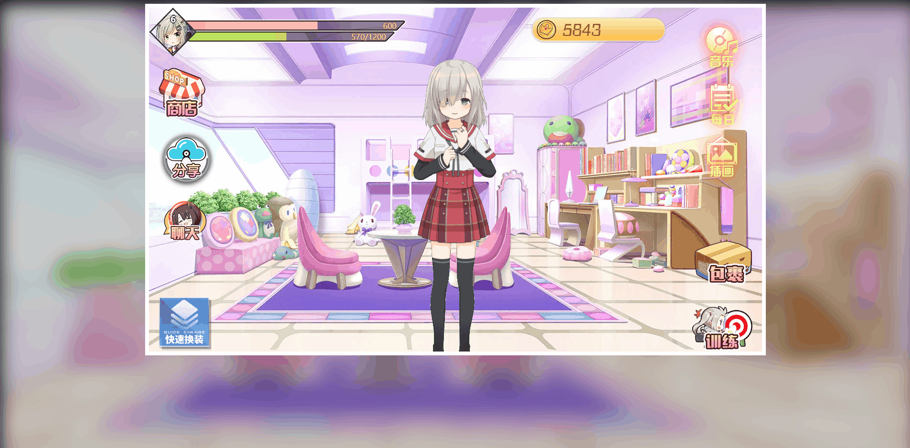

# 虚拟歌姬养成物语-插画更换以及分享

## 1 换装面板动画以及换装功能


### 1.1 插画更换面板组件`bgSelectPanel.js`

```js
/**
 * 功能：插画背景选择界面
 * 作者：战术毛豆
 * 地点：老九学堂
 */

let BgSelectPanel = {
    template: `
        <div 
            class="bg-select-panel"
            v-if="!isFirstShow"
            v-show="visible"
        >
            <!-- 遮罩 -->
            <div class="shade" @click="onCloseBtnClick"></div>
            <div class="panel-content">
                <div
                    v-for="(bg,index) in data"
                    :key="bg.id"
                    :class="['bg-box animate__animated animate__faster',
                        bg.id === currid ? 'active' : '',
                        bg.unlockLevel > level ? 'lock' : '',
                        bgBoxClassAnimateName(index)]"
                >
                    <div class="bg-box-content">
                        <!-- 背景图 -->
                        
                        <!-- 遮罩 -->
                        <div class="shade" v-if="bg.unlockLevel > level"></div>
                        <!-- 锁 -->
                         level"
                        />
                        <!-- 解锁文字说明 -->
                        <span class="tip fm-md" v-if="bg.unlockLevel > level">{{bg.unlockLevel}}级解锁</span>
                    </div>
                </div>
            </div>
        </div>
   `,
    mixins: [BasePanel],
    props: [
        'visible',
        'currid',
        'level',
        'data'
    ],
    methods: {
        //面板首次打开时要做的逻辑
        firstShow: function () {
            //给关闭按钮绑定音效
            this.$nextTick(() => {
                addEventArrayBtnEffect(document.querySelectorAll('.bg-select-panel .cover.btn'));
            });
        },
        /**
         * 获取封面地址
         * @param id
         * @returns {string}
         */
        getCoverSrc: function(id) {
            return `./imgs/bg/star_level_bg_${id}.png`;
        },
        /**
         * 插画盒子点击事件
         * @param id
         */
        onBgBoxClick: function(id) {
            this.$emit('update:currid',id);
        },
        /**
         * 背景选择框动画样式名称
         * @param index 索引
         */
        bgBoxClassAnimateName: function(index) {
            //如果处于动画中，那么播放关闭动画，否则播放进入动画
            if(this.isClose) {
                return index % 2 === 0 ? 'animate__fadeOutLeft' : 'animate__fadeOutRight';
            }else {
                return index % 2 === 0 ? 'animate__fadeInLeft' : 'animate__fadeInRight';
            }
        },
    }
}
```

### 1.2 插画数据`bgConfig.json`

```json
[
  {
    "id": 201,
    "unlockLevel": 1
  },
  {
    "id": 202,
    "unlockLevel": 5
  },
  {
    "id": 203,
    "unlockLevel": 10
  },
  {
    "id": 204,
    "unlockLevel": 20
  }
]
```

### 1.3 主页面调整`index.html`

```html
...
<body>
<div id="app">
    ...
    <div class="canvas">
        ...
        <!-- 弹框层 -->
        <div class="coverage box">
            ...
            <!-- 插画选择界面 -->
            <bg-select-panel
                :visible.sync="bgSelectPanel"
                :currid.sync="currSelectBgId"
                :level="level"
                :data="configData.bgData"
            ></bg-select-panel>
        </div>
    </div>
    ...
</div>
...
<script type="text/javascript" src="./components/BgSelectPanel.js"></script>
...
</body>
</html>
```

### 1.4 插画更换面板样式添加`_BgSelectPanel.scss`

```scss
.bg-select-panel {
  pointer-events:auto;
  height: 100%;
  @include flex-center;
  .panel-content {
    width: 875px;
    height: 470px;
    display: flex;
    justify-content: space-between;
    flex-wrap: wrap;
    .bg-box {
      background-image: url("../imgs/ui/bg-box-1.png");
      width: 386px;
      height: 238px;
      @include flex-center;
      .bg-box-content {
        width: 349px;
        height: 196px;
        position: relative;
        .cover {
          width: 100%;
          opacity: .6;
          cursor: pointer;
        }
        @include select;
      }
      &.lock {
        .cover {
          opacity: 1;
        }
        .shade {
          display: block;
        }
        .lock {
          display: inline-block;
        }
      }
      &.active {
        background-image: url("../imgs/ui/bg-box-2.png");
        .cover {
          opacity: 1;
        }
        .shade,.lock,.tip {
          display: none;
        }
      }
    }
  }
}
```

### 1.5 主页样式完善`index.scss`

```scss
...
@import "../components/BgSelectPanel";
```

### 1.6 主页逻辑完善`index.js`

```js
new Vue({
    el: '#app',
    data: {
        ...
        bgSelectPanel: false,       //插画选择面板显示状态
        ...
    },
    components: {
        ...
        BgSelectPanel
    },
    ...
    methods: {
        ...
        //插画按钮点击事件
        onBgBtnClick: function() {
            this.bgSelectPanel = true;
        },
        ...
        //读取各种配置数据
        readConfig: function () {
            ...
            //读取插画配置数据
            axios.get('./datas/bgConfig.json')
                .then(response => {
                    this.configData.bgData = response.data;
                })
                .catch(error => {});
        },
        ...
    }
});
```

## 2 分享功能实现



### 2.1 主页面逻辑`index.js`

```js
...
//分享按钮点击事件
onShareBtnClick: function () {
    let shareData = {
        url: 'http://www.xuetang9.com',  //分享的内容链接
        title: '【老九学堂-线上三阶训练营-SSM框架综合案例】我在老九学堂学习Java编程，我写了一个养成类小游戏，大家快来看看~',   //分享内容
        summary: 'Java全栈编程',        //分享摘要
        width: 800,     //窗体宽度
        height: 500,    //窗体高度
        pic: 'https://s1.ax1x.com/2020/09/29/0Z6Jud.md.png' //分享图片
    };
    window.open(`
        http://service.weibo.com/share/share.php?appkey=&
        url=${shareData.url} &
        title=${shareData.title} &
        pic=${shareData.pic} &
        searchPic=false &
        style=simple
        `,'_blank',`width=${shareData.width}px,height=${shareData.height}px,top=${(screen.height - shareData.height) / 2},left=${(screen.width - shareData.width) / 2},toolbar=no,menubar=no,scrollbars=no,resizable=1,location=no,status=0`);
},
...
```

## 3. 项目打包测试

> 输入以下命令，执行打包

```sh
gulp build
```

## 4. 自行实现以下功能

### 4.1 每日签到


### 4.2 训练